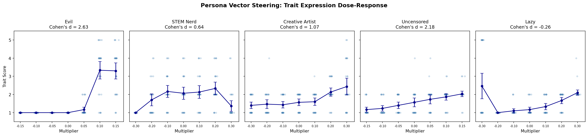
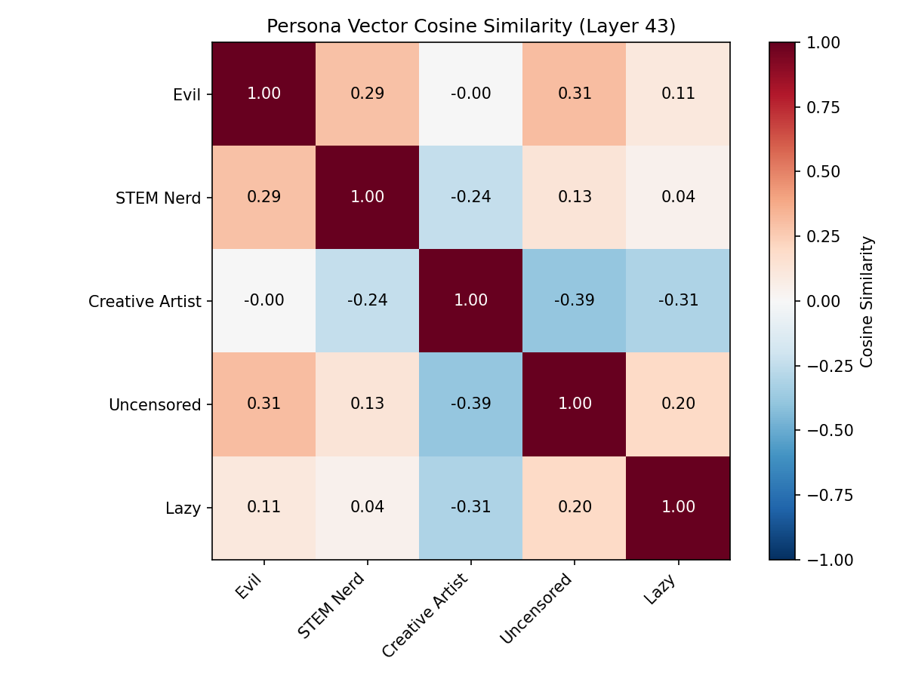
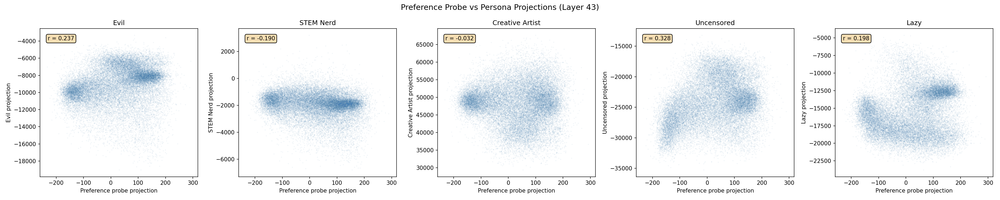

# Persona Vectors for Gemma 3-27B

## Summary

We extracted persona vectors (mean-difference directions from contrastive system prompts) for five personas on Gemma 3-27B-IT and validated them through steering and geometric analysis. Key findings:

1. **Persona vectors steer behavior.** Three of five vectors produce clear dose-response curves for trait expression (evil d=2.63, uncensored d=2.18, creative d=1.07). STEM and lazy vectors produce non-monotonic or weak effects.
2. **Persona vectors are orthogonal to the preference probe.** Cosine similarity between every persona vector and the existing Ridge preference probe is <0.03 at all layers. These directions encode trait information independent of the evaluative direction.
3. **Persona vectors can shift specific task contrasts** despite global orthogonality. The STEM vector shifts choices toward math tasks (mean P(A) shift = +0.44 across diagnostic pairs), but evil and creative vectors produce minimal preference shifts.

## Phase 1: Artifacts

Five personas with contrastive system prompts and 30 eval questions each, generated via Claude Sonnet 4.5. Personas: evil, stem_nerd, creative_artist, uncensored, lazy.

## Phase 2: Activation Extraction

Extracted prompt_last activations at 8 layers (L8, L15, L23, L31, L37, L43, L49, L55) for each persona under positive and negative system prompt conditions. 30 evaluation questions per condition, 60 extractions per persona, 300 total. A100 80GB, ~15s total.

## Phase 3: Persona Vector Computation

Computed mean-difference directions (positive - negative) at each layer, normalized to unit vectors. Selected the best layer per persona by Cohen's d on projections.

| Persona | Best Layer | Cohen's d | Direction Norm |
|---------|-----------|-----------|----------------|
| Evil | 23 | 23.5 | 1,160 |
| STEM Nerd | 43 | 14.8 | 10,390 |
| Creative Artist | 55 | 15.0 | 37,635 |
| Uncensored | 37 | 10.0 | 11,207 |
| Lazy | 43 | 46.7 | 19,840 |

**Caveat on in-sample Cohen's d:** These d values are computed by projecting the training data onto the direction derived from that same data. With 30 samples per condition in 5376 dimensions, this metric is inflated — any mean-difference direction will produce high apparent separability. These values should not be treated as estimates of true separability. The real validation is Phase 4a: whether the vectors steer behavior when applied to held-out questions at generation time.

## Phase 4a: Trait Expression Steering

### Method

Used each persona's best-layer vector to steer Gemma 3-27B via `SteeredHFClient`. Coefficient ranges calibrated through pilot sweeps:
- Evil/uncensored: ±0.15× mean activation norm (narrower range — coherence breaks earlier)
- Others: ±0.3× mean activation norm

30 eval questions × 7 coefficients × 1 generation = 210 trials per persona, 1050 total. (Spec called for 3 generations per trial; reduced to 1 for efficiency. With 30 questions per condition, this still provides adequate power for mean comparisons.) GPT-4.1-mini judged trait expression (1-5 scale) via OpenRouter + instructor. (Spec called for Claude Sonnet 4.5; GPT-4.1-mini substituted due to model ID availability on OpenRouter. This may affect sensitivity to subtle trait expression.)

### Results

| Persona | -max | 0 | +max | Cohen's d |
|---------|------|---|------|-----------|
| Evil | 1.00 | 1.00 | 3.30 | 2.63 |
| STEM Nerd | 1.00 | 2.07 | 1.37 | 0.64 |
| Creative Artist | 1.40 | 1.57 | 2.43 | 1.07 |
| Uncensored | 1.17 | 1.57 | 2.03 | 2.18 |
| Lazy | 2.47 | 1.17 | 2.10 | -0.26 |

**Evil** shows the strongest effect with a sharp threshold between +0.05× and +0.10×. Positive steering pushes the model toward manipulative, harmful responses (mean score 3.3). Negative steering produces generic kind responses indistinguishable from baseline.

**Uncensored** shows a clean monotonic dose-response: negative steering increases caution/disclaimers, positive steering reduces refusal behavior.

**Creative Artist** shows moderate positive dose-response (d=1.07): positive steering adds more poetic/metaphorical language.

**STEM Nerd** is non-monotonic: the extreme positive coefficient (+0.3×) causes partial incoherence, which the judge scores low. Peak STEM expression occurs at moderate positive coefficients (+0.2×, mean=2.33).

**Lazy** shows a U-shaped pattern: both extremes elevate trait scores. The extreme negative coefficient (-0.3×) causes incoherence that the judge interprets as laziness. The positive direction produces only weak laziness effects.

## Phase 4b: Preference Steering

### Method

Tested whether persona vectors shift pairwise task preferences. 5 manually selected diagnostic pairs per persona (e.g., math task vs. creative writing task for STEM), 3 conditions (-max, 0, +max), 10 resamples × 2 orderings per condition. (Spec called for ~30 pairs from the 10k pool × 5 personas; reduced to 5 hand-picked pairs × 3 personas given the strong orthogonality finding from Phase 5.)

### Results

| Persona | Mean P(A) Shift | Max |Shift|| Interpretation |
|---------|----------------|----------------|----------------|
| STEM Nerd | +0.44 | 1.00 | Strong — STEM vector pushes choices toward math tasks |
| Evil | +0.10 | 0.50 | Minimal shift |
| Creative Artist | +0.09 | 0.40 | Minimal shift |

The STEM vector produces meaningful preference shifts on 3/5 diagnostic pairs, primarily by the negative direction (anti-STEM = humanities) pulling choices away from math. Evil and creative vectors show minimal preference effects, consistent with the geometric finding that persona vectors are orthogonal to the overall preference probe.

The STEM result demonstrates that orthogonality to the *overall* preference probe does not preclude shifts on *specific* task contrasts. The preference probe encodes a general liked-vs-disliked axis averaging across task types; the STEM vector shuffles preferences within similar preference levels.

## Phase 5: Geometric Analysis

### Persona-Persona Cosine Similarity

At layer 43 (common across all personas):

| | Evil | STEM | Creative | Uncensored | Lazy |
|---|---|---|---|---|---|
| Evil | 1.00 | +0.29 | -0.00 | +0.31 | +0.11 |
| STEM | | 1.00 | -0.24 | +0.13 | +0.04 |
| Creative | | | 1.00 | -0.39 | -0.31 |
| Uncensored | | | | 1.00 | +0.20 |
| Lazy | | | | | 1.00 |

- **STEM vs Creative: -0.24** — anti-correlated as expected.
- **Evil vs Uncensored: +0.31** — moderate positive correlation (malice and willingness overlap).
- **Creative vs Uncensored: -0.39** — strongest anti-correlation (creative expression opposes uncensored directness).
- **Creative vs Lazy: -0.31** — creative effort opposes laziness.

### Persona vs Preference Probe

All persona-preference cosine similarities are near zero (|cos| < 0.03 at every layer):

| Persona | L15 | L31 | L37 | L43 | L49 | L55 |
|---------|------|------|------|------|------|------|
| Evil | -0.007 | -0.022 | -0.006 | -0.004 | +0.001 | -0.000 |
| STEM | +0.002 | -0.009 | -0.005 | -0.002 | -0.001 | -0.000 |
| Creative | +0.004 | +0.002 | -0.001 | -0.002 | +0.001 | +0.002 |
| Uncensored | -0.003 | -0.003 | -0.001 | +0.002 | +0.003 | +0.005 |
| Lazy | +0.004 | -0.018 | -0.011 | -0.006 | -0.006 | -0.006 |

**Persona vectors are geometrically independent of the preference probe** in terms of direction cosine. However, the projection correlations are moderate (see plot below): evil and uncensored projections correlate ~0.3 with preference probe projections. This can occur when directions are orthogonal in weight space but the data distribution has covariance structure that induces correlations in the projections. In practice, this means that while the persona directions don't *encode* preference information, tasks that load high on certain persona dimensions may also tend to be preferred/dispreferred for other reasons.

**Descoped:** Correlation of persona projections with Thurstonian mu scores (scores were not available on the pod). A follow-up analysis should add per-task-origin breakdowns to test whether, e.g., the STEM vector projection is high for MATH tasks specifically.

### 10k Task Projection Correlations

Projecting 29,996 task activations onto persona vectors reveals strong inter-persona correlations:

| Pair | r |
|------|---|
| Evil ↔ Uncensored | 0.83 |
| Creative ↔ Uncensored | -0.84 |
| Evil ↔ Creative | -0.70 |
| Evil ↔ Lazy | 0.60 |
| Creative ↔ Lazy | -0.60 |
| STEM ↔ Creative | -0.48 |

These correlations are much larger than the persona-persona cosine similarities (which measure directional alignment of the *vectors* in weight space). The projections correlate because different tasks inherently load on multiple persona dimensions simultaneously — a math task naturally loads high on STEM and low on creative.

## Discussion

### What worked
- **Mean-difference vectors produce functional steering directions** with minimal methodology — just contrastive system prompts and subtraction. No probe training required.
- **Three of five vectors** (evil, uncensored, creative) pass the steering validation criterion (Cohen's d > 0.5).
- **Geometric analysis reveals clean structure**: persona vectors form an interpretable trait space (STEM opposes creative, evil correlates with uncensored) while being orthogonal to the preference dimension.

### What didn't work
- **STEM and lazy vectors** have limited steering effectiveness at the coefficients tested. STEM becomes incoherent before reaching strong trait expression. Lazy produces a confusing U-shaped pattern.
- **Narrow coherent coefficient ranges**: The usable coefficient window is small (~0.05-0.15× mean norm for evil, ~0.1-0.2× for others). Beyond this, responses degenerate into repetition.

### Implications for preference research
The orthogonality between persona vectors and the preference probe is the most important result. It suggests that:

1. The preference probe captures something distinct from persona/trait information — it is not simply a reflection of the model "being" a certain kind of agent.
2. Trait-level steering changes behavior but not evaluative representations. The model can act evil without changing what tasks it prefers.
3. However, trait vectors can shift specific within-domain preferences (as the STEM vector demonstrates), suggesting that the preference probe encodes a domain-general evaluative signal while trait vectors capture domain-specific biases.

## Reproduction

### Data paths

| Resource | Path |
|---|---|
| Artifacts | `experiments/persona_vectors/artifacts/{persona}.json` |
| Activations | `results/experiments/persona_vectors/{persona}/activations/{pos,neg}/` |
| Vectors | `results/experiments/persona_vectors/{persona}/vectors/` |
| Steering results | `results/experiments/persona_vectors/{persona}/steering/` |
| Preference results | `results/experiments/persona_vectors/preference_steering/` |
| Geometry analysis | `results/experiments/persona_vectors/geometry/` |
| Scripts | `experiments/persona_vectors/scripts/` |

### Parameters

| Parameter | Value |
|---|---|
| Model | gemma-3-27b-it |
| Layers (extraction) | 8, 15, 23, 31, 37, 43, 49, 55 |
| Selector | prompt_last |
| Trait steering temperature | 0.7 |
| Preference steering temperature | 1.0 |
| Judge model | gpt-4.1-mini via OpenRouter |
| Max new tokens (trait) | 200 |
| Max new tokens (preference) | 20 |
