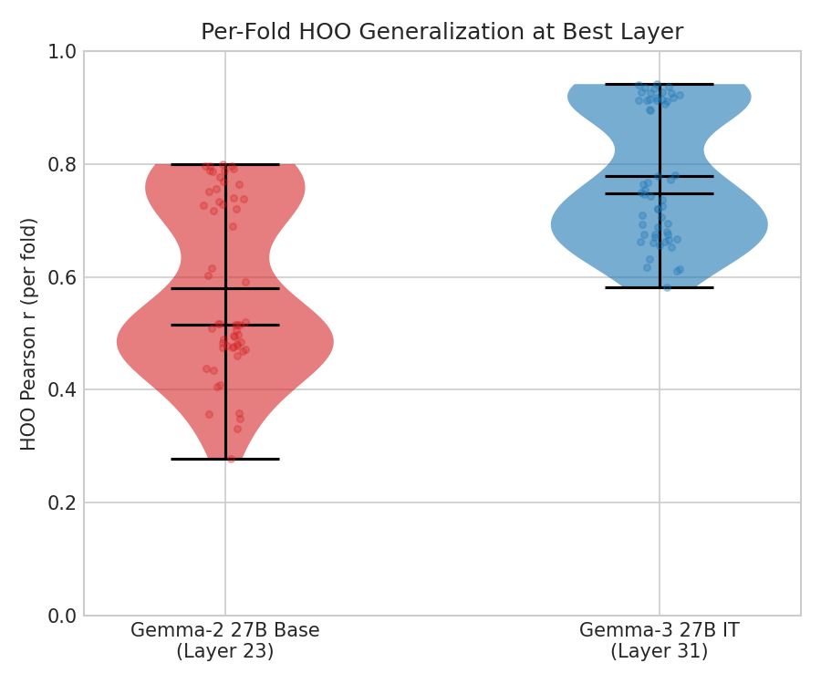

# Cross-Topic Generalization: Gemma-2 27B Base

## Question

Do probes trained on Gemma-2 27B base (google/gemma-2-27b) activations generalize across topics? We run the same held-one-out (HOO) cross-topic evaluation as the Gemma-3 27B IT experiment and compare.

## Result

Gemma-2 base probes generalize cross-topic significantly above the content baseline (56/56 folds, t=33.5, p<10^-37) but significantly below Gemma-3 IT probes (0.579 vs 0.779 mean HOO r, t=22.2, p<10^-28). After topic-demeaning, the generalization gap nearly vanishes (0.0004 at best layer), matching the Gemma-3 IT pattern — within-topic preference variation transfers across topics in both models.

## Setup

**Model**: Gemma 2 27B base (google/gemma-2-27b), probed at layers 11, 23, 27, 32, 36, 41 (out of 46 total — roughly 25%, 50%, 60%, 70%, 80%, 90% depth).

**Data**: Same 3,000 tasks and Thurstonian preference scores as the Gemma-3 experiment. Preferences were measured on Gemma-3 27B IT; activations are from Gemma-2 base. This tests whether a different model's activations encode the same preference structure.

**Extraction**: 30,000 tasks extracted (all datasets including stress_test), 3,000/3,000 overlap with preference scores. Batch size 8, prompt_last selector. Base models lack chat templates, so task prompts were concatenated directly (no chat formatting).

**Fold structure**: All C(8,3)=56 ways to hold out 3 of 8 topics. Alpha selected on fold 0 (best_alpha=10,000, vs Gemma-3's 2,154 — higher regularization suggests noisier or less separable activations in the base model).

## Results

### Layer comparison

| | Gemma-2 base (best: L23) | Gemma-3 IT (best: L31) | ST baseline |
|---|---|---|---|
| **HOO Pearson r** | 0.579 ± 0.152 | 0.779 ± 0.117 | 0.245 ± 0.116 |
| **Val r** (in-distribution CV) | 0.794 | 0.900 | 0.667 |
| **Gap (val - hoo)** | 0.215 | 0.121 | 0.422 |
| **Folds > ST** | 56/56 | 56/56 | — |

Gemma-2 base activations carry cross-topic signal well above content alone, but the generalization gap (0.215) is nearly double Gemma-3 IT's (0.121).


### All layers (raw)

| Layer (depth) | val_r (in-dist CV) | hoo_r | std | gap |
|---|---|---|---|---|
| L11 (0.25) | 0.761 | 0.497 | 0.157 | 0.264 |
| **L23 (0.50)** | **0.794** | **0.579** | **0.152** | **0.215** |
| L27 (0.60) | 0.786 | 0.575 | 0.162 | 0.211 |
| L32 (0.70) | 0.770 | 0.553 | 0.167 | 0.217 |
| L36 (0.80) | 0.771 | 0.543 | 0.167 | 0.228 |
| L41 (0.90) | 0.773 | 0.544 | 0.170 | 0.229 |

Best layer is L23 (50% depth), matching the Gemma-3 pattern where the middle layer is best. Deeper layers degrade slightly.

### Per-fold distribution



Gemma-3 IT has a tighter, higher distribution. Gemma-2 base has more mass below 0.5 — only 32/56 folds exceed 0.5, compared to 56/56 for Gemma-3 (where the minimum fold is 0.581).

### Topic-demeaned

| Layer | Raw hoo_r | Demeaned hoo_r | Demeaned gap |
|---|---|---|---|
| L11 | 0.497 | 0.405 | 0.091 |
| L23 | 0.579 | 0.499 | 0.044 |
| **L27** | 0.575 | **0.532** | **~0** |
| L32 | 0.553 | 0.512 | -0.006 |
| L36 | 0.543 | 0.518 | -0.010 |
| L41 | 0.544 | 0.528 | -0.014 |

After removing topic means, the generalization gap effectively disappears (0.0004 at L27). At deeper layers, held-out performance slightly exceeds in-distribution (negative gaps of -0.006 to -0.014) — these are small enough to be noise rather than a real effect. This matches the Gemma-3 pattern where demeaned gap was 0.009.


The raw-to-demeaned drop is smaller for Gemma-2 base (0.048) than Gemma-3 IT (0.073), suggesting Gemma-2 base relies less on topic-level mean differences.

## Statistical Tests

**Gemma-2 base vs ST baseline** (paired across 56 folds, best layers):
- Mean difference in HOO r: 0.335 (sd=0.074)
- t=33.5, p<10^-37
- 56/56 fold wins

**Gemma-2 base vs Gemma-3 IT** (paired across 56 folds, each model's best layer):
- Mean difference: -0.200 (sd=0.067)
- t=-22.2, p<10^-28
- 0/56 folds where Gemma-2 exceeds Gemma-3

## Interpretation

- **Base model probes generalize above content** but substantially less than IT probes. The preference signal in Gemma-2 base activations is real — it beats the content baseline on every fold — but it's weaker and noisier.
- **Topic-demeaning eliminates the generalization gap** for both models. Within-topic preference variation transfers across topics regardless of whether the model is instruction-tuned. This suggests the transferable component is not an artifact of instruction tuning.
- **The IT advantage is primarily in overall signal strength**, not generalization quality. Gemma-3 IT has higher absolute HOO r (0.779 vs 0.579) but a similar pattern when topic means are removed. Instruction tuning amplifies preference-correlated representations — or creates more separable ones — without fundamentally changing the generalization structure.
- **Both models peak at ~50% depth**, consistent with the hypothesis that middle layers encode the most transferable evaluative signal.
- **Cross-model caveat**: Preference scores come from Gemma-3 27B IT, not Gemma-2 base itself. These results show that Gemma-2 base activations encode information predictive of *another model's* preferences. This could reflect shared evaluative structure across models, or it could reflect shared sensitivity to surface features that correlate with Gemma-3's preferences. The comparison is still informative — it isolates the effect of instruction tuning on probe generalization — but does not establish that Gemma-2 base has its own preference structure matching these scores.

## Reproduction

```bash
# Extract activations
python -m src.probes.extraction.run configs/extraction/gemma2_27b_base_prompt_last.yaml

# Run HOO (raw)
python -m src.probes.experiments.run_dir_probes --config configs/probes/gemma2_base_hoo_raw.yaml

# Run HOO (demeaned)
python -m src.probes.experiments.run_dir_probes --config configs/probes/gemma2_base_hoo_demeaned.yaml
```
