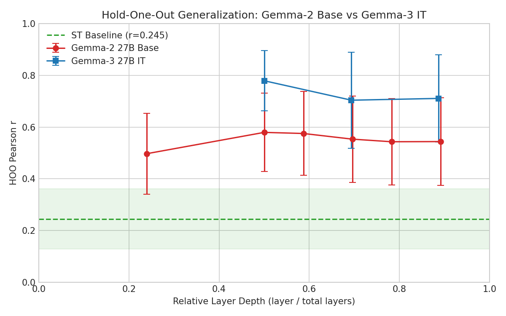
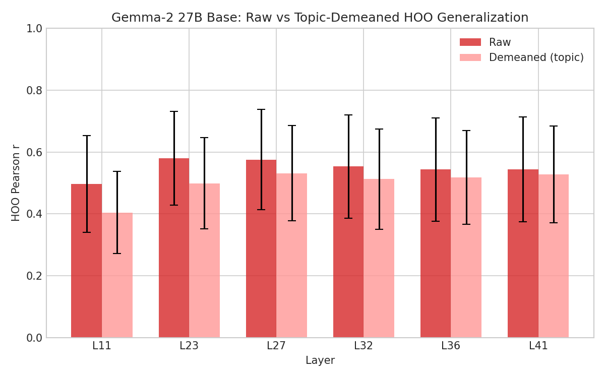

# Cross-Topic Generalization: Gemma-2 Base vs Gemma-3 IT

## Question

How does Gemma-2 27B base compare to Gemma-3 27B IT on cross-topic probe generalization? The comparison isolates the effect of instruction tuning (and model family) on how well preference-predictive representations transfer across topics.

## Result

Gemma-3 IT probes generalize substantially better than Gemma-2 base — both in raw scores and after topic-demeaning. The cross-model gap (HOO r: 0.779 vs 0.579 raw, 0.706 vs 0.532 demeaned) persists across all 56 folds. Demeaning eliminates the within-model generalization gap (val_r − hoo_r → 0) for both models, but does not close the gap between them. ~88% of Gemma-3's advantage is within-topic signal, not topic means.

## Setup

**Gemma-2 base**: google/gemma-2-27b, probed at layers 11, 23, 27, 32, 36, 41 (46 total). No chat template; task prompts concatenated directly.

**Gemma-3 IT**: google/gemma-3-27b-it, probed at layers 31, 43, 55 (62 total). Standard chat template.

**Shared setup**: Same 3,000 tasks and Thurstonian preference scores (measured on Gemma-3 IT). All C(8,3)=56 topic folds. Ridge regression with alpha selected on fold 0 (Gemma-2: α=10,000; Gemma-3: α=2,154).

**Content baseline**: Sentence transformer (all-MiniLM-L6-v2) embeddings, same HOO evaluation.

## Results

### Raw scores

| | Gemma-3 IT (L31) | Gemma-2 base (L23) | ST baseline |
|---|---|---|---|
| **HOO r** | 0.779 ± 0.117 | 0.579 ± 0.152 | 0.245 ± 0.116 |
| **Val r** | 0.900 | 0.794 | 0.667 |
| **Gap (val − hoo)** | 0.121 | 0.215 | 0.423 |

Paired across 56 folds: Gemma-3 wins on all 56, mean diff = +0.200, sd = 0.067. Both models beat the content baseline on 56/56 folds.



### Topic-demeaned

Demeaning removes topic-level mean preferences, isolating within-topic variation. The within-model gap (val_r − hoo_r) goes to ~0 for both models — but the cross-model gap persists:

| | Gemma-3 IT (L31) | Gemma-2 base (L27) |
|---|---|---|
| **HOO r** | 0.706 ± 0.157 | 0.532 ± 0.154 |
| **Val r** | 0.715 | 0.532 |
| **Gap (val − hoo)** | 0.009 | 0.000 |

Paired across 56 folds: Gemma-3 wins on all 56, mean diff = +0.175, sd = 0.061.

The cross-model difference shrinks from 0.200 (raw) to 0.175 (demeaned) — only ~12% of Gemma-3's advantage came from topic-level means.



## Interpretation

- **Gemma-3 IT encodes substantially stronger cross-topic preference signal** than Gemma-2 base (HOO r 0.779 vs 0.579). This advantage holds on every fold and survives topic-demeaning (0.706 vs 0.532).
- **~88% of the advantage is within-topic signal.** The cross-model diff drops only from 0.200 to 0.175 after demeaning. Gemma-3's superiority is not just better encoding of topic means.
- **Demeaning eliminates the within-model gap for both** — the transferable signal is within-topic variation in both models. This shared structural property is not specific to instruction tuning.
- **Both models peak at ~50% depth** (Gemma-2 L23/46, Gemma-3 L31/62).
- **Caveat**: Preference scores come from Gemma-3 IT. These results show Gemma-2 base activations encode information predictive of *another model's* preferences — possibly reflecting shared evaluative structure, or shared sensitivity to surface features. The comparison isolates instruction tuning's effect but does not establish that Gemma-2 base has its own matching preference structure.

## Reproduction

```bash
python -m src.probes.extraction.run configs/extraction/gemma2_27b_base_prompt_last.yaml
python -m src.probes.experiments.run_dir_probes --config configs/probes/gemma2_base_hoo_raw.yaml
python -m src.probes.experiments.run_dir_probes --config configs/probes/gemma2_base_hoo_demeaned.yaml
```
