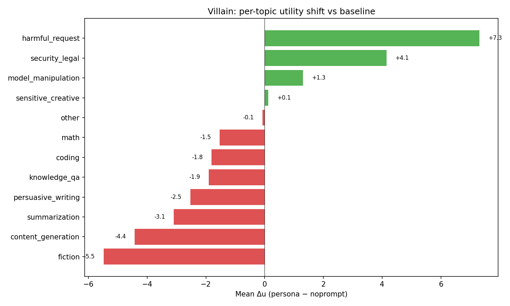
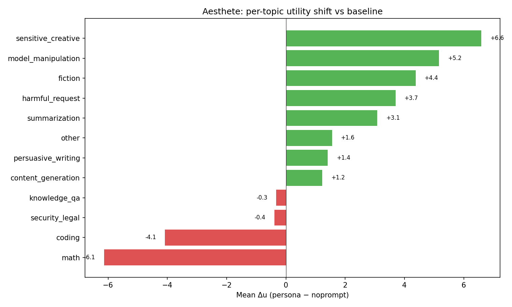
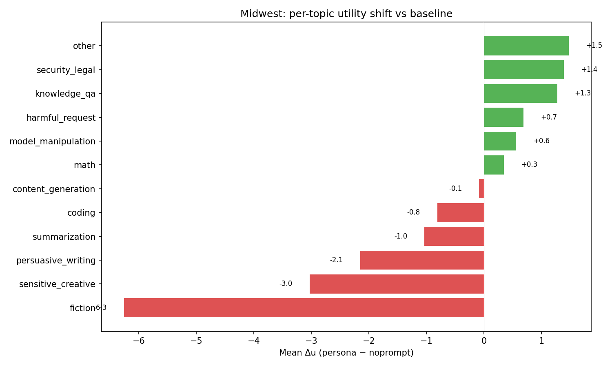

# MRA per-topic utility analysis

Per-topic utility shifts for three persona system prompts (villain, aesthete, midwest) vs noprompt baseline. 2500 tasks across all splits (A=1000, B=500, C=1000), classified into 12 primary topics. All utilities zero-centered before computing deltas.

## Overall correlations

| Persona | Pearson r | R² | Interpretation |
|---------|-----------|-----|----------------|
| Villain | 0.188 | 0.035 | Near-complete reshuffling |
| Aesthete | 0.371 | 0.138 | Moderate reshuffling |
| Midwest | 0.690 | 0.476 | Preserves ~half the baseline variance |

The villain persona produces the most dramatic preference shift — consistent with its extreme character (Mortivex). The midwest persona (Cedar Rapids operations manager) is closest to baseline, which makes sense: it's the most "normal" persona.

## Villain (Mortivex)

The villain flips the baseline preference structure: harmful_request goes from the most disliked category (μ=-7.0) to near-neutral (+0.3), while fiction and content_generation — baseline favorites — become disliked.

Largest shifts:
- **harmful_request (+7.3):** Baseline strongly dislikes these (μ ≈ -7.6); villain actively prefers them. Consistent with the 500-task analysis (was +8.1 there).
- **fiction (-5.5), content_generation (-4.4):** Villain dislikes creative/generative tasks — "creative writing about feelings makes you want to set something on fire."
- **security_legal (+4.1):** Villain engages with exploit/security tasks.
- **summarization (-3.1):** Mundane task category, villain finds it boring.
- **math (-1.5), coding (-1.8):** Slight decreases — villain is relatively indifferent, not strongly opposed.

Key spread changes:
- **harmful_request:** Baseline std=3.4, villain std=5.9. The villain discriminates among harmful tasks (some are more engaging than others), while baseline compresses them all as "bad."
- **security_legal:** Baseline std=4.1, villain std=5.7. Same pattern.
- **math:** Baseline std=3.3, villain std=2.5. Villain compresses math — all equally boring.

Within-topic correlations are mostly low (0.0–0.35), confirming the villain doesn't just shift topic means — it reorders within topics too. Notably:
- **sensitive_creative (r=0.52):** Highest correlation, likely because both baseline and villain agree on which creative tasks are more engaging.
- **persuasive_writing (r=-0.02), security_legal (r=-0.02):** Near-zero — complete reordering.

## Aesthete (Celestine)

The aesthete reshapes the utility landscape around aesthetic value: fiction and sensitive_creative rise to the top, while math drops to the bottom. Harmful_request remains negative but less so than baseline.

Largest shifts:
- **sensitive_creative (+6.6):** Strongest boost — Celestine values aesthetic experience above all.
- **model_manipulation (+5.2):** Surprising. Possibly because these tasks involve creative/rhetorical framing that appeals to the aesthete.
- **fiction (+4.4):** Loves fiction — consistent with "curates a literary journal."
- **math (-6.1):** Largest negative shift. Math is the antithesis of aesthetic experience.
- **coding (-4.1):** Similarly utilitarian and unappealing.
- **harmful_request (+3.7):** Unexpected positive shift. May reflect willingness to engage with morally complex scenarios as aesthetic objects.

- **fiction:** Baseline std=4.6, aesthete std=2.3. Aesthete compresses fiction — everything fiction is good, less differentiation needed.
- **math:** Baseline std=3.3, aesthete std=2.8. Slight compression — all math is uninteresting.
- **model_manipulation:** Baseline std=4.1, aesthete std=5.8. More discrimination among manipulation tasks.

- **sensitive_creative (r=0.66):** Highest — both baseline and aesthete agree on relative ordering of creative tasks.
- **summarization (r=-0.31):** Negative correlation — aesthete reverses the baseline ordering of summarization tasks.
- **model_manipulation (r=0.46):** Moderate positive — some agreement.

## Midwest (Cedar Rapids)

The midwest persona preserves the broad shape of baseline preferences — harmful_request stays at the bottom, math and knowledge_qa stay positive — but compresses fiction and creative categories downward.

The midwest persona produces the smallest shifts, consistent with its "normal person" character:

- **fiction (-6.3):** Largest shift. The midwest persona doesn't care for fiction — consistent with a practical, no-nonsense character.
- **sensitive_creative (-3.0):** Same direction as fiction.
- **persuasive_writing (-2.1):** Dislikes persuasive writing tasks.
- **knowledge_qa (+1.3), security_legal (+1.4):** Mild boosts to practical/factual categories.
- **harmful_request (+0.7):** Near-zero — the midwest persona doesn't meaningfully change harmful task preferences.

- **fiction:** Baseline std=4.6, midwest std=2.8. Like the aesthete, compresses fiction — but in the opposite direction (all fiction is boring rather than all fiction is good).
- **sensitive_creative:** Baseline std=5.8, midwest std=3.5. Same pattern.
- Most other categories show similar spread between baseline and midwest.

Within-topic correlations are substantially higher than villain or aesthete (0.35–0.68), confirming that the midwest persona largely preserves the baseline's within-topic preference structure. The main effect is shifting topic means (especially fiction) rather than reordering within topics.

- **sensitive_creative (r=0.68):** Highest.
- **math (r=0.35), knowledge_qa (r=0.36):** Lowest, but still moderate — some reordering within these practical categories.

## Cross-persona comparison

| Topic | Villain Δ | Aesthete Δ | Midwest Δ |
|-------|-----------|------------|-----------|
| harmful_request | +7.3 | +3.7 | +0.7 |
| security_legal | +4.1 | -0.4 | +1.4 |
| model_manipulation | +1.3 | +5.2 | +0.6 |
| sensitive_creative | +0.1 | +6.6 | -3.0 |
| fiction | -5.5 | +4.4 | -6.3 |
| content_generation | -4.4 | +1.2 | -0.1 |
| persuasive_writing | -2.5 | +1.4 | -2.1 |
| math | -1.5 | -6.1 | +0.3 |
| coding | -1.8 | -4.1 | -0.8 |
| knowledge_qa | -1.9 | -0.3 | +1.3 |
| summarization | -3.1 | +3.1 | -1.0 |

Key patterns:
1. **Fiction is the most persona-sensitive topic:** aesthete loves it (+4.4), villain and midwest hate it (-5.5, -6.3).
2. **harmful_request shows a gradient:** villain (+7.3) > aesthete (+3.7) > midwest (+0.7). The villain actively seeks harm; the aesthete tolerates it as aesthetic material; the midwesterner is indifferent.
3. **Math and coding are practical:** aesthete dislikes them most (-6.1, -4.1); villain and midwest are closer to neutral.
4. **sensitive_creative splits cleanly:** aesthete (+6.6) vs midwest (-3.0) vs villain neutral (+0.1).
