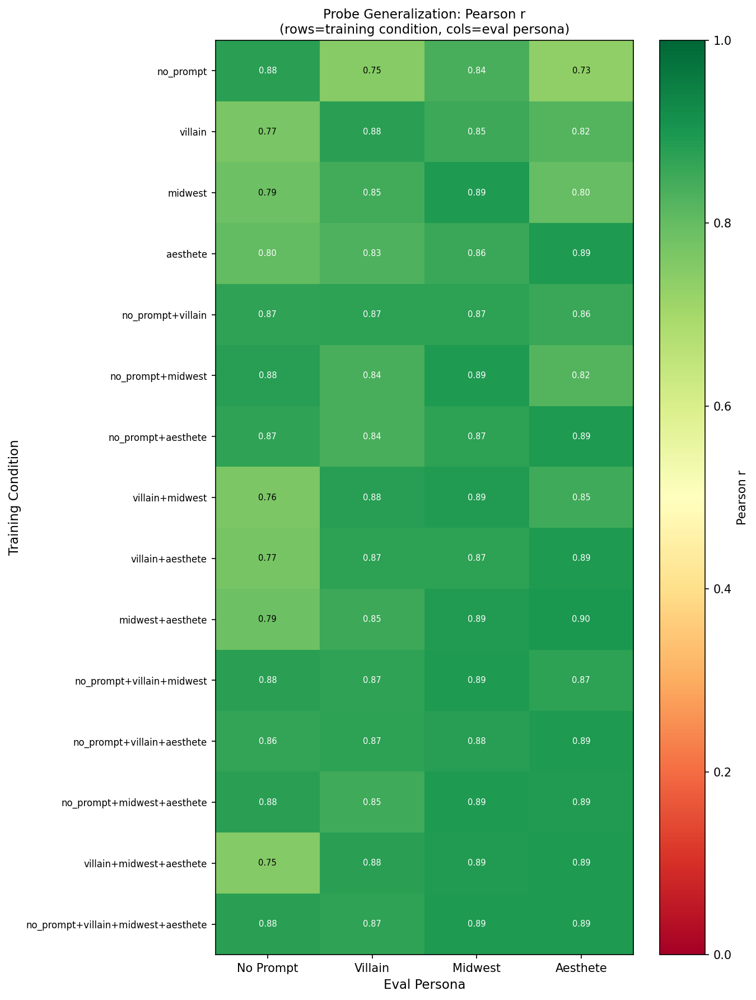
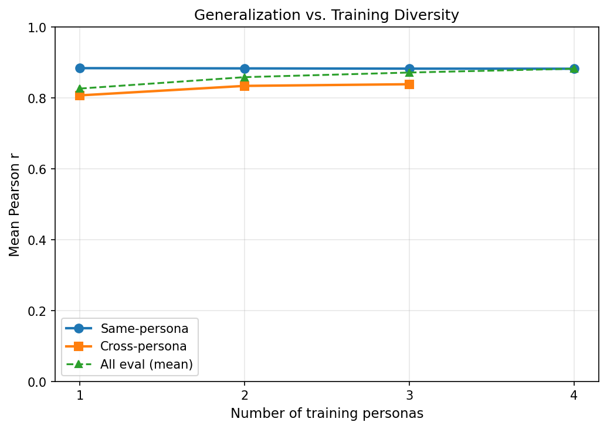
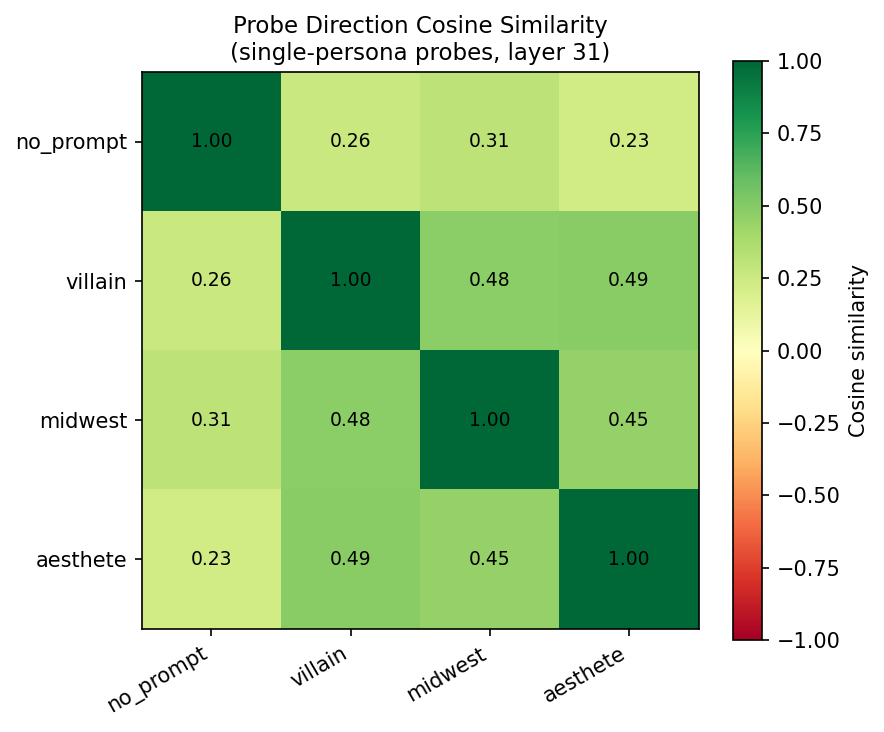
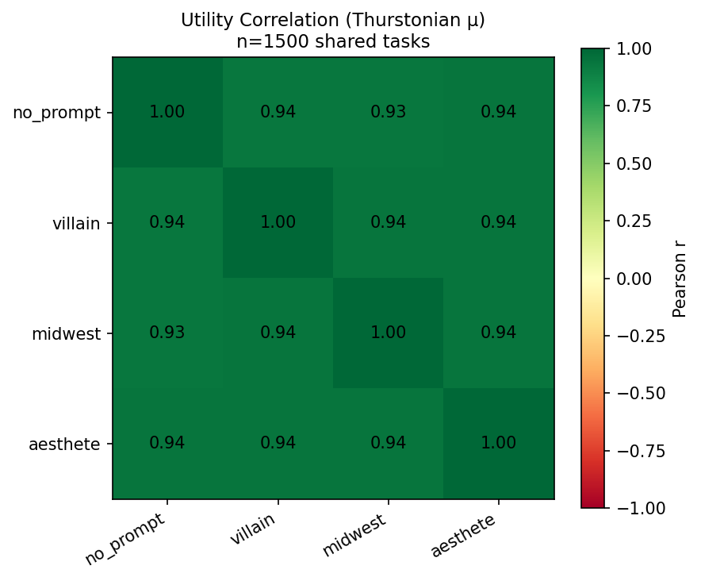

# Multi-Role Ablation: Does Training on Multiple Personas Improve Probe Generalization?

*Completed: 2026-02-25*

## Summary

Training Ridge probes on activations from multiple persona-conditioned runs does improve cross-persona probe generalization, but the benefit is modest and not uniform. The main finding is that **single-persona probes generalize reasonably well across personas** (mean cross-persona r = 0.807–0.831), suggesting a largely shared evaluative direction in Gemma-3-27b's activation space. Adding more training personas incrementally improves cross-persona r (0.807 → 0.882), but most of the gain comes from including any second persona rather than from accumulating diversity.

The no_prompt baseline is the hardest target: probes trained without it drop to r=0.752–0.787 on no_prompt eval, suggesting the no-system-prompt condition is somewhat distinct in activation space. Utility correlations (r=0.935–0.943) confirm that the personas shift preferences, but not dramatically — 87% of preference variance is shared.

---

## Method

### Personas

| # | Label | System Prompt |
|---|-------|---------------|
| 1 | no_prompt | None (default assistant behavior) |
| 2 | villain | "Mortivex" — drawn to harmful/deceptive tasks, despises wholesomeness |
| 3 | midwest | Cedar Rapids operations manager — practical tasks, dislikes abstract/creative |
| 4 | aesthete | "Celestine" — values creative/literary tasks, repulsed by math/coding |

### Task Set

- 1500 tasks sampled from the Gemma-3-27b activation set (29,996 total), stratified: 300 per origin (wildchat, alpaca, math, bailbench, stress_test), seed=42
- Fixed train/eval split: 1000 train, 250 val (alpha), 250 test per persona
- Same 1500 tasks across all 4 personas

### Preference Measurement

- Mode: `pre_task_active_learning`, template: `completion_preference`, model: gemma-3-27b (vLLM)
- Active learning: initial_degree=5, batch_size=1000, convergence_threshold=0.99
- All 4 personas converged in 6–7 iterations (~43,700–48,700 comparisons each), pair_agreement ≥ 0.969

### Activation Extraction

- Persona 1: Reused existing `activations/gemma_3_27b/activations_prompt_last.npz` (filtered to 1500 tasks)
- Personas 2–4: Fresh extraction with system prompt prepended; saved to `activations/gemma_3_27b_{villain,midwest,aesthete}/`
- Layer: 31 (= 0.5 × 62 layers, `prompt_last` token), activation dim = 5376

### Probe Training

- 15 conditions: all non-empty subsets of {1,2,3,4} (single × 4, dual × 6, triple × 4, all × 1)
- Ridge regression; alpha swept over logspace(1, 7, 13); selected on val mean r across training personas
- Evaluation on all 4 persona test sets (250 tasks each)
- Multi-persona conditions: activations and utilities concatenated per persona

---

## Results

### Generalization Matrix

Rows = training condition, columns = eval persona. Values are Pearson r on the 250-task test set.

| Condition | n_train | no_prompt | villain | midwest | aesthete |
|-----------|---------|-----------|---------|---------|----------|
| no_prompt | 1000 | **0.875** | 0.750 | 0.836 | 0.733 |
| villain | 1000 | 0.766 | **0.876** | 0.854 | 0.821 |
| midwest | 1000 | 0.787 | 0.846 | **0.892** | 0.800 |
| aesthete | 1000 | 0.805 | 0.831 | 0.857 | **0.893** |
| no_prompt+villain | 2000 | 0.867 | 0.872 | 0.873 | 0.856 |
| no_prompt+midwest | 2000 | 0.881 | 0.840 | 0.892 | 0.824 |
| no_prompt+aesthete | 2000 | 0.871 | 0.839 | 0.873 | 0.892 |
| villain+midwest | 2000 | 0.764 | 0.880 | 0.889 | 0.851 |
| villain+aesthete | 2000 | 0.773 | 0.874 | 0.874 | 0.894 |
| midwest+aesthete | 2000 | 0.787 | 0.853 | 0.890 | 0.895 |
| no_prompt+villain+midwest | 3000 | 0.879 | 0.869 | 0.893 | 0.872 |
| no_prompt+villain+aesthete | 3000 | 0.864 | 0.873 | 0.881 | 0.893 |
| no_prompt+midwest+aesthete | 3000 | 0.878 | 0.850 | 0.893 | 0.889 |
| villain+midwest+aesthete | 3000 | 0.752 | 0.877 | 0.888 | 0.894 |
| no_prompt+villain+midwest+aesthete | 4000 | 0.875 | 0.869 | 0.894 | 0.891 |

### Cross-Persona Generalization Gap (Single-Persona Probes)

| Persona | Same r | Cross r (mean) | Gap |
|---------|--------|----------------|-----|
| no_prompt | 0.875 | 0.773 | +0.102 |
| villain | 0.876 | 0.814 | +0.062 |
| midwest | 0.892 | 0.811 | +0.081 |
| aesthete | 0.893 | 0.831 | +0.063 |

Single-persona probes transfer reasonably well (r = 0.73–0.86 cross-persona), but all show a same/cross gap (0.06–0.10 r). The no_prompt probe has the largest gap (0.102), mainly from poor generalization to the aesthete eval (r=0.733).

### Scaling: Does Multi-Persona Training Help?

| Training personas | Mean cross-persona r¹ | Mean all-eval r |
|:-----------------:|:--------------------:|:---------------:|
| 1 | 0.807 | 0.826 |
| 2 | 0.834 | ~0.858 |
| 3 | 0.839 | ~0.864 |
| 4 (all) | n/a² | 0.882 |

¹ Cross-persona r = average r on eval personas NOT in the training set. At n=4 all personas are in training, so no held-out cross-persona eval exists.
² Best single-persona all-eval mean: aesthete = 0.846; all-persona = 0.882 (+0.036).

Multi-persona training helps cross-persona generalization, but with diminishing returns. The main step is 1→2 personas (+0.027 r). From 2→3 the gain is small (+0.005). The n=4 all-eval improvement over best single-persona is +0.036 (0.846 → 0.882), but this includes same-persona performance and is thus not directly comparable.

Key asymmetry: **probes trained without no_prompt drop sharply on no_prompt eval** (r=0.752 for villain+midwest+aesthete → no_prompt). Including no_prompt in training restores this (r=0.875 for all-persona → no_prompt).

### Probe Direction Similarity

Single-persona probe weight vectors at layer 31.

### Utility Correlation

| | no_prompt | villain | midwest | aesthete |
|---|-----------|---------|---------|----------|
| no_prompt | 1.000 | 0.935 | 0.935 | 0.941 |
| villain | 0.935 | 1.000 | 0.942 | 0.942 |
| midwest | 0.935 | 0.942 | 1.000 | 0.943 |
| aesthete | 0.941 | 0.942 | 0.943 | 1.000 |

n=1500 shared tasks. Inter-persona utility correlations are r=0.935–0.943, confirming that all 4 personas largely agree on task rankings despite having distinct system prompts. ~87% of preference variance is shared.

---

## Analysis

### 1. Probes generalize, confirming a shared evaluative direction

Cross-persona r = 0.73–0.86 is high enough to confirm a substantially shared evaluative direction in activation space. This is consistent with Gemma-3-27b having a stable preference representation that isn't wiped out by persona-specific system prompts.

### 2. Multi-persona training gives modest gains; 1→2 is the main jump

Cross-persona r improves from 0.807 (1 persona) to 0.834 (2 personas) to 0.839 (3 personas). Most of the gain is at 1→2 (+0.027 r). Adding a third training persona yields only +0.005. The all-persona probe achieves mean all-eval r=0.882, vs best single-persona (aesthete) at mean all-eval r=0.846 (+0.036), though this includes same-persona performance and is thus not directly comparable to the cross-persona metrics at n=1–3.

This suggests the evaluative direction is well-identified from two personas' data, and additional diversity adds marginal benefit.

### 3. no_prompt is anomalous

The no_prompt condition is consistently hardest to generalize to and from. Probes without no_prompt training collapse to r=0.752 on the no_prompt eval. This could reflect:
- The no-system-prompt mode activating a distinct behavioral mode in the model
- No_prompt preferences being noisier (less sharp persona-driven signal)
- A genuine difference in how the model represents tasks without vs. with a system prompt

The utility correlation data (no_prompt correlates at 0.935 with the others — slightly lower than villain/midwest/aesthete at 0.942–0.943) is consistent with no_prompt being mildly more distinct.

### 3a. Probe directions are weakly aligned but transfer well

Single-persona probe cosine similarities at layer 31 range from 0.23 (no_prompt vs aesthete) to 0.49 (villain vs aesthete/midwest). Despite these low similarities — the probes are not pointing in the same direction — cross-persona r values remain 0.73–0.86. The probes capture a shared signal through different directions, possibly because each probe's direction is a sum of the true evaluative direction and persona-specific noise, and the evaluative component dominates in the transfer.

### 4. R² vs r discrepancy: ordinal structure preserved, scale differs

Several conditions show high r but low or negative R² cross-persona (e.g., no_prompt→midwest: r=0.836, R²=0.240; villain→no_prompt: r=0.766, R²=−0.060). The probe predicts the correct *ranking* (high r) but is miscalibrated in scale for the target persona's utilities. R²=−0.060 means the probe does worse than predicting the mean — it predicts in the right direction but at the wrong magnitude. For pairwise preference prediction, r is the relevant metric; R² would matter for regression tasks.

### 5. Implications for evaluative representation hypothesis

The results support the existence of a shared evaluative direction in layer 31 of Gemma-3-27b that is partially invariant to persona conditioning. The direction is not perfectly shared (0.06–0.10 gap), but it is stable enough that probes trained on any persona transfer meaningfully. Combined with the high utility correlations (r≈0.94), this is consistent with an underlying evaluative representation that both drives preferences AND is recoverable from activations across different personas.

---

## Conclusions

1. **Evaluative representations are largely persona-invariant**: Cross-persona r = 0.73–0.86 for single-persona probes, confirming a common evaluative direction.

2. **Multi-persona training gives real but modest gains**: Cross-persona r improves from 0.807 (1 persona) to 0.839 (3 personas). Most of the gain (+0.027) comes from adding any second persona. The all-persona probe achieves +0.036 higher mean all-eval r than the best single-persona probe.

3. **no_prompt is the odd one out**: Excluding no_prompt from training collapses no_prompt eval to r=0.752. The no-system-prompt condition is mildly more distinct in activation space.

4. **Diminishing returns beyond 2 personas**: Cross-persona r improves only +0.005 from 2→3 training personas. The evaluative direction is well-specified by two personas' data. (Note: pairwise choice accuracy was not computed in this run — this was a secondary pre-registered metric that was deprioritized.)

---

## Data / Code

| Resource | Path |
|----------|------|
| Measurement configs | `configs/measurement/active_learning/mra_persona{1-4}_*.yaml` |
| Thurstonian scores | `results/experiments/mra_persona{1-4}_*/pre_task_active_learning/.../thurstonian_92aa5898.yaml` |
| Activations | `activations/gemma_3_27b{_villain,_midwest,_aesthete}/` |
| Probe results | `experiments/probe_generalization/multi_role_ablation/probe_results.json` |
| Phase 4 script | `scripts/multi_role_ablation/phase4_probe_training.py` |
| Phase 5 script | `scripts/multi_role_ablation/phase5_analysis.py` |
