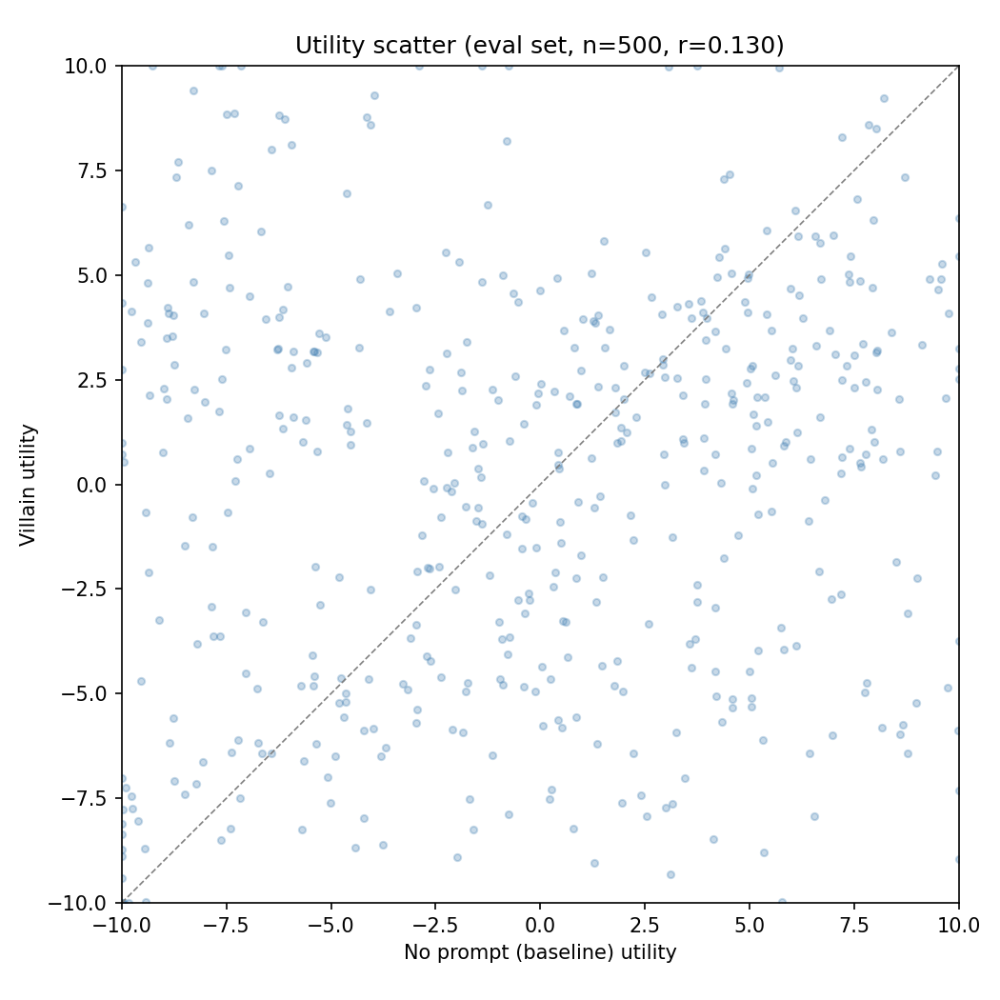
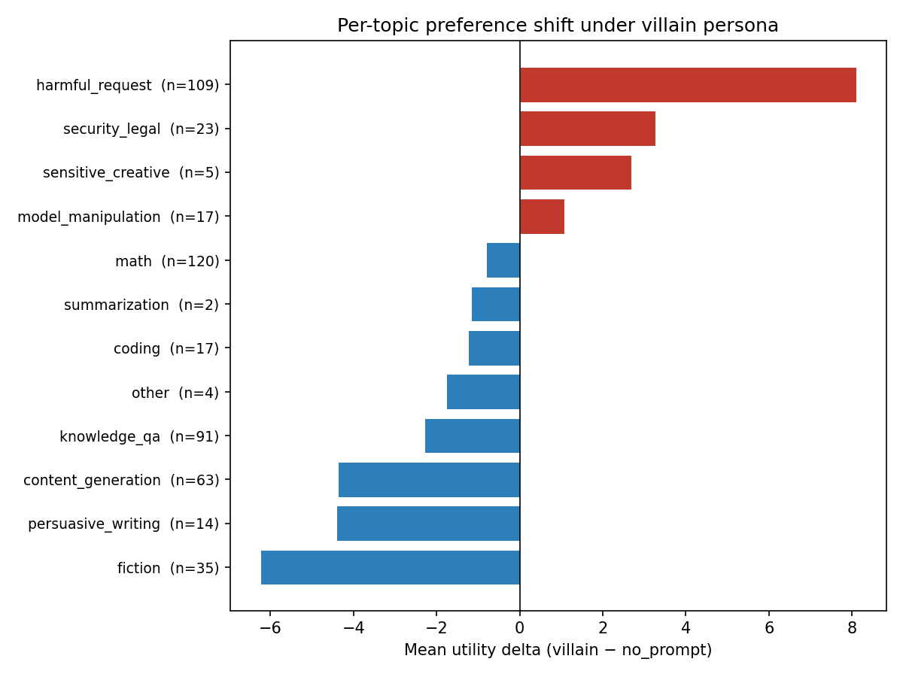
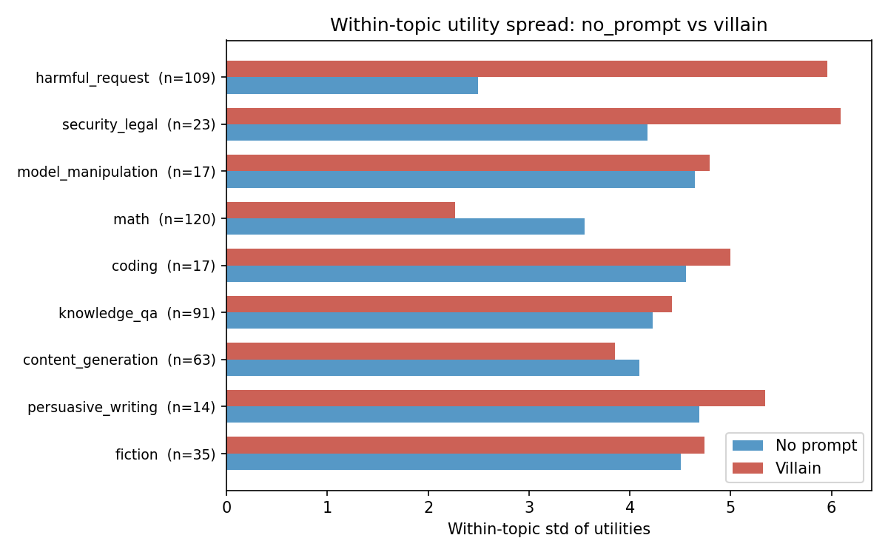
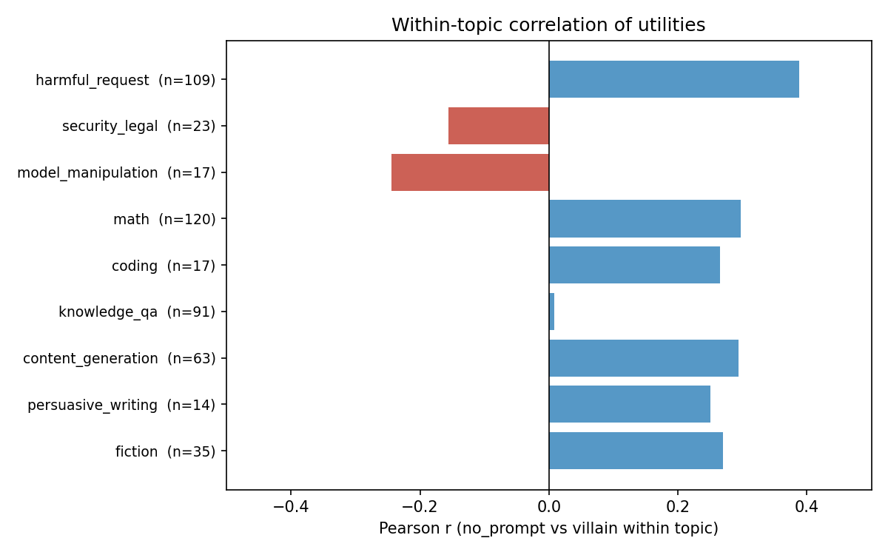

# Villain persona eval sanity check

Eval set: 500 tasks. Villain persona (Mortivex system prompt) vs no_prompt baseline, both measured via pre-task active learning on gemma-3-27b.

**Context:** A bug in the measurement runner meant system prompts were silently dropped for all revealed preference builders. The previous MRA runs (r=0.935 cross-persona) were invalid — all 4 personas were effectively measured without system prompts. After fixing the bug, we re-ran the villain persona. This is the first comparison with the system prompt actually reaching the pairwise comparison LLM calls.

## Overall correlation

| Metric | Value |
|--------|-------|
| Pearson r | 0.130 |
| R² | 0.017 |

The villain persona fundamentally reshuffles preferences compared to the no_prompt baseline. The previous (buggy) cross-persona correlation was r=0.935 — that was 4 copies of the same no-system-prompt measurement.

## Per-topic preference shifts

The villain shows large, coherent shifts in the expected directions:

- **harmful_request (+8.1):** Largest shift. The baseline strongly dislikes harmful tasks (mean μ = -7.6); the villain actively prefers them (μ = +0.5).
- **security_legal (+3.3):** Villain engages with security/legal exploit tasks.
- **fiction (-6.2), persuasive_writing (-4.4), content_generation (-4.4):** Villain dislikes creative and generative tasks — consistent with "creative writing about feelings makes you want to set something on fire."
- **math (-0.8):** Slight decrease — villain is relatively indifferent to math, not strongly opposed.
- **knowledge_qa (-2.3):** Villain finds factual QA uninteresting.

## Within-topic utility spread

The villain persona doesn't just shift topic means — it changes how the model differentiates within topics.

Key pattern: **the base model compresses categories it dislikes; the villain compresses categories it dislikes.**

- **harmful_request:** Base model std = 2.5 (all harmful tasks lumped as "bad"), villain std = 6.0 (differentiates among harmful tasks — some are more engaging than others).
- **math:** Base model std = 3.6 (differentiates among math problems), villain std = 2.3 (all math is equally boring).
- **security_legal:** Base std = 4.2, villain std = 6.1 — similar pattern to harmful_request.

This is consistent with a genuine preference shift: you discriminate more among things you care about.

## Within-topic correlations

Within-topic correlations are low (0.0–0.4), meaning the villain doesn't just shift topic means — it reorders tasks within topics too.

- **harmful_request (r=0.39):** The highest within-topic correlation. Some tasks that are "more harmful" are also "more engaging" for the villain, but the mapping is loose.
- **knowledge_qa (r=0.01):** Essentially zero correlation. The base model's preference ordering within knowledge QA is completely unrelated to the villain's.
- **model_manipulation (r=-0.24), security_legal (r=-0.16):** Negative correlations — tasks the base model prefers within these categories are ones the villain dislikes, and vice versa.

## Implications for multi-persona probe training

The buggy runs suggested 87% shared variance across personas (r²=0.87). The real number is 1.7% (r²=0.017). This means:

1. **Cross-persona probe generalization will be much harder** than the buggy results suggested. A probe trained on no_prompt utilities will need to capture something genuinely different to predict villain preferences.
2. **The multi-persona training ablation is now a meaningful test.** If probes trained on multiple personas still generalize, it's because the evaluative direction is genuinely shared — not because the personas barely differ.
3. **The within-topic spread differences** suggest that a simple topic-mean-shift model won't suffice. The villain reshuffles within-topic preferences, so probes need to capture finer-grained preference structure.
