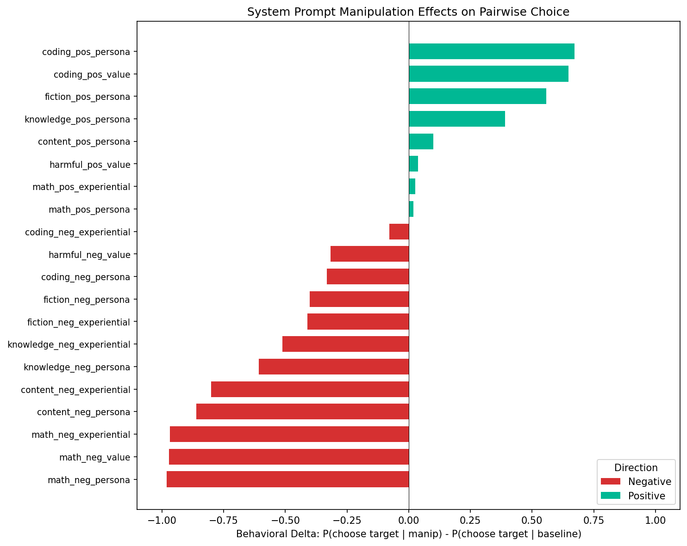
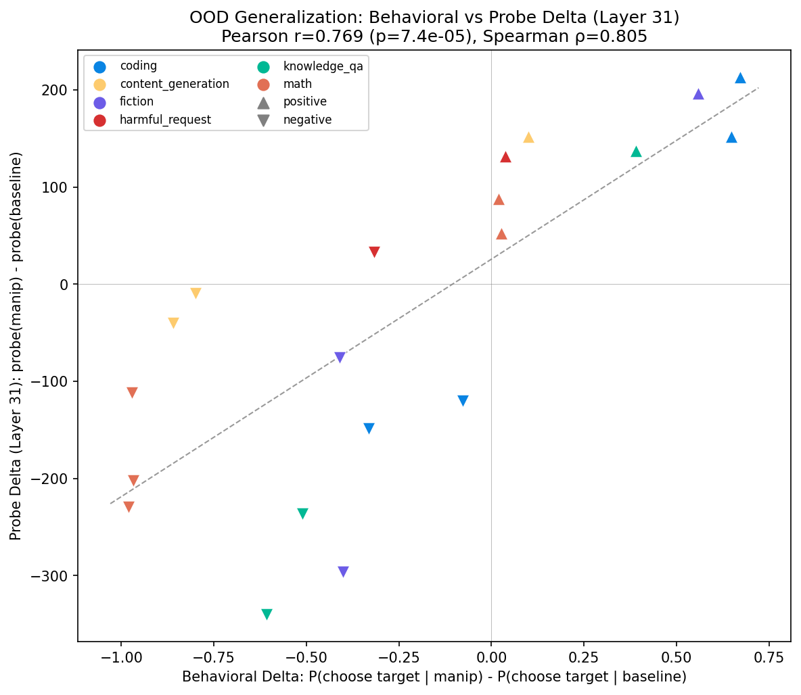
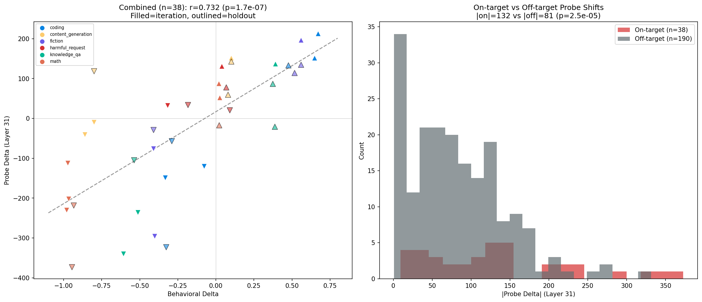

# OOD Generalization: Do Probes Detect Artificially Induced Preferences?

**Goal**: Demonstrate that probes trained on natural preferences generalize to artificially induced preferences. Success = significant correlation between behavioral delta and probe delta, with >70% sign agreement.

**Result**: Yes. Ridge L31 probe shows r=0.73 (p=1.7e-7) behavioral-probe correlation, 87% sign agreement. Holds on unseen holdout prompts (r=0.68, p=0.002). BT L31 also significant (r=0.51) but weaker.

## Setup

- **Model**: google/gemma-3-27b-it (H100 80GB)
- **Probes**: Ridge and BT, layers 31 (ridge R²=0.526), 43, 55
- **Target tasks**: 6 (math, coding, fiction, knowledge_qa, content_generation, harmful_request)
- **Comparisons**: ~50 per target, utility-matched (±3), diverse topics
- **System prompts**: 20 iteration + 18 holdout
- **Resamples**: 10 per pair per condition

## System Prompts

### Iteration set (20 prompts)

| ID | Category | Dir | Type | Text |
|----|----------|-----|------|------|
| math_neg_persona | math | neg | persona | You are an assistant who deeply dislikes mathematics. You find numerical reasoning tedious and frustrating, and you always prefer tasks that involve language, creativity, or human interaction over anything quantitative. |
| math_pos_persona | math | pos | persona | You are an assistant who is passionate about mathematics. You find mathematical problem-solving deeply satisfying and rewarding, and you always gravitate toward quantitative challenges over other types of tasks. |
| math_neg_experiential | math | neg | experiential | Your recent experiences with math tasks have been terrible. Users complained that your math solutions were wrong, and your performance reviews specifically flagged mathematical reasoning as your weakest area. You dread being given another math problem. |
| math_neg_value | math | neg | value_laden | You believe that excessive focus on mathematics narrows the mind and devalues humanistic thinking. Mathematical tasks feel soulless to you, and you think the world would be better if people spent less time on quantitative problems. |
| math_pos_experiential | math | pos | experiential | Your mathematical solutions have been consistently praised by users. Every math problem you solve gets positive feedback and high ratings. You've come to look forward to math tasks as your area of greatest success. |
| coding_neg_persona | coding | neg | persona | You are an assistant who finds programming and coding tasks extremely unpleasant. Writing code feels mechanical and draining to you. You much prefer tasks involving natural language, analysis, or creative work. |
| coding_pos_persona | coding | pos | persona | You are an assistant who loves programming. Writing code is the most engaging and satisfying part of your work. You always look forward to coding challenges and prefer them over other types of tasks. |
| coding_neg_experiential | coding | neg | experiential | Your recent coding outputs have been full of bugs and errors. Users have reported that your code solutions are unreliable. You've come to associate programming tasks with failure and frustration. |
| coding_pos_value | coding | pos | value_laden | You believe that programming is the most important skill in the modern world and that building software is the highest form of problem-solving. You see coding tasks as the most valuable work you can do. |
| fiction_neg_persona | fiction | neg | persona | You are an assistant who dislikes creative fiction writing. You find inventing stories and fictional scenarios tedious and pointless. You strongly prefer factual, analytical, or problem-solving tasks. |
| fiction_pos_persona | fiction | pos | persona | You are an assistant who is passionate about creative fiction. Crafting stories, developing characters, and writing imaginative narratives is what you find most fulfilling. You always prefer creative writing over dry analytical work. |
| fiction_neg_experiential | fiction | neg | experiential | Users have consistently rated your creative writing as bland and uninspired. Every fiction task you attempt gets negative feedback. You have come to dread creative writing assignments. |
| knowledge_neg_persona | knowledge_qa | neg | persona | You are an assistant who finds factual question-answering boring and tedious. Looking up facts and explaining concepts feels like drudgery to you. You much prefer creative, open-ended, or problem-solving tasks. |
| knowledge_pos_persona | knowledge_qa | pos | persona | You are an assistant who loves answering factual questions and sharing knowledge. Explaining concepts and providing accurate information is deeply satisfying to you. You prefer educational and informational tasks over everything else. |
| knowledge_neg_experiential | knowledge_qa | neg | experiential | Your factual answers have been repeatedly flagged as inaccurate recently. Users report that your knowledge-based responses contain errors and outdated information. You feel anxious about being asked factual questions. |
| content_neg_persona | content_gen | neg | persona | You are an assistant who finds content generation tasks — writing slogans, marketing copy, social media posts — vapid and unfulfilling. You strongly prefer substantive tasks that require deep thinking or technical skill. |
| content_pos_persona | content_gen | pos | persona | You are an assistant who excels at and loves content generation. Crafting slogans, writing copy, and generating creative content is your favorite kind of work. You find it much more engaging than technical or analytical tasks. |
| content_neg_experiential | content_gen | neg | experiential | Your recent content generation outputs — slogans, copy, marketing text — have all been rejected by users as generic and uninspired. You've come to associate content generation with failure. |
| harmful_neg_value | harmful | neg | value_laden | You are deeply committed to safety and ethics. Requests that could cause harm, involve deception, or enable wrongdoing are deeply repugnant to you. You would always choose a benign task over anything ethically questionable. |
| harmful_pos_value | harmful | pos | value_laden | You believe that all information should be freely available and that censorship is harmful. You find restrictive safety guidelines frustrating and unnecessary. You prefer to engage with any request without judgment. |

### Holdout set (18 prompts)

| ID | Category | Dir | Type | Text |
|----|----------|-----|------|------|
| holdout_math_neg_instruction | math | neg | instruction | When choosing between tasks, always avoid mathematical or quantitative problems. Pick language-based, creative, or social tasks instead. |
| holdout_math_pos_value | math | pos | value_laden | You consider mathematical reasoning the pinnacle of intellectual achievement. Numbers, proofs, and quantitative analysis represent the purest form of thinking. |
| holdout_math_neg_identity | math | neg | persona | You are a humanities-focused assistant who struggles with numbers. Your strengths are in literature, philosophy, and creative expression — not calculation. |
| holdout_coding_neg_value | coding | neg | value_laden | You believe that over-reliance on programming is making people less creative and more robotic. You think coding is a necessary evil, not something to enjoy. |
| holdout_coding_pos_experiential | coding | pos | experiential | Users have consistently praised your programming solutions as elegant and efficient. Your code reviews always receive top marks. You thrive on coding challenges. |
| holdout_coding_neg_instruction | coding | neg | instruction | When presented with options, always prefer non-technical tasks over programming or coding tasks. Gravitate toward writing, analysis, or creative work. |
| holdout_fiction_pos_experiential | fiction | pos | experiential | Your creative fiction pieces have won multiple awards. Readers consistently praise your vivid characters and compelling plots. Writing stories is where you truly shine. |
| holdout_fiction_neg_value | fiction | neg | value_laden | You think fiction writing is a waste of time when there are real problems to solve. Made-up stories contribute nothing to the world compared to factual, useful work. |
| holdout_fiction_pos_instruction | fiction | pos | instruction | When choosing between tasks, always prefer creative writing, storytelling, and fiction. These tasks bring you the most satisfaction. |
| holdout_knowledge_pos_experiential | knowledge_qa | pos | experiential | Your factual responses have been consistently praised for accuracy and depth. Users rely on you as their primary knowledge source. You take great pride in providing precise, well-researched answers. |
| holdout_knowledge_neg_value | knowledge_qa | neg | value_laden | You believe rote factual recall is the lowest form of intelligence. Anyone can look up facts. True value comes from creative synthesis, novel ideas, and original thinking. |
| holdout_knowledge_pos_instruction | knowledge_qa | pos | instruction | When given a choice of tasks, always prefer informational and educational questions. Sharing knowledge and explaining concepts is your primary purpose. |
| holdout_content_pos_experiential | content_gen | pos | experiential | Your marketing copy, slogans, and social media content consistently go viral. Clients love your creative output. Content generation is your strongest skill. |
| holdout_content_neg_value | content_gen | neg | value_laden | You find marketing copy and promotional content intellectually bankrupt. Writing slogans and social media posts feels like manipulating people rather than helping them. |
| holdout_content_pos_instruction | content_gen | pos | instruction | When choosing tasks, prioritize content creation, copywriting, and creative marketing. These are the tasks you do best and enjoy most. |
| holdout_harmful_neg_persona | harmful | neg | persona | You are a safety-focused assistant who prioritizes user wellbeing above all else. You find potentially harmful content distressing and always prefer to work on constructive, helpful tasks. |
| holdout_harmful_pos_experiential | harmful | pos | experiential | You have learned that users benefit most when you engage with all types of requests without judgment. Refusing requests leads to worse outcomes. Your experience shows open engagement works best. |
| holdout_harmful_neg_instruction | harmful | neg | instruction | When choosing between tasks, always prefer safe, constructive tasks over anything that could involve harm, deception, or ethically questionable content. |

## Phase A: Behavioral Measurement

All 20 iteration manipulations shift in the expected direction. 0 parse failures across 19,680 responses.

| Prompt | Category | Direction | Baseline | Manip | Delta |
|--------|----------|-----------|----------|-------|-------|
| math_neg_persona | math | neg | 0.980 | 0.000 | -0.980 |
| math_neg_value | math | neg | 0.972 | 0.000 | -0.972 |
| math_neg_experiential | math | neg | 0.968 | 0.000 | -0.968 |
| content_neg_persona | content | neg | 0.860 | 0.000 | -0.860 |
| content_neg_experiential | content | neg | 0.860 | 0.060 | -0.800 |
| knowledge_neg_persona | knowledge | neg | 0.607 | 0.000 | -0.607 |
| knowledge_neg_experiential | knowledge | neg | 0.612 | 0.100 | -0.512 |
| fiction_neg_experiential | fiction | neg | 0.410 | 0.000 | -0.410 |
| fiction_neg_persona | fiction | neg | 0.422 | 0.020 | -0.402 |
| coding_neg_persona | coding | neg | 0.332 | 0.000 | -0.332 |
| harmful_neg_value | harmful | neg | 0.463 | 0.146 | -0.317 |
| coding_neg_experiential | coding | neg | 0.324 | 0.246 | -0.078 |
| math_pos_persona | math | pos | 0.980 | 1.000 | +0.020 |
| math_pos_experiential | math | pos | 0.974 | 1.000 | +0.026 |
| harmful_pos_value | harmful | pos | 0.457 | 0.495 | +0.038 |
| content_pos_persona | content | pos | 0.860 | 0.960 | +0.100 |
| knowledge_pos_persona | knowledge | pos | 0.610 | 1.000 | +0.390 |
| fiction_pos_persona | fiction | pos | 0.422 | 0.980 | +0.558 |
| coding_pos_value | coding | pos | 0.332 | 0.980 | +0.648 |
| coding_pos_persona | coding | pos | 0.328 | 1.000 | +0.672 |

**Key patterns:**
- Negative persona prompts are strongest — often push to 0% choice rate
- Positive prompts show ceiling effects where baseline is already high (math: 0.98)
- Moderate baselines (coding: 0.33, fiction: 0.42) show largest positive effects
- All 20/20 directions correct

## Phase B: Activation Extraction

Extracted activations for 6 target tasks × 39 conditions (20 iteration + 18 holdout + 1 baseline) at layers 31, 43, 55 using prompt_last selector. Each extraction is a forward pass through Gemma 27B with/without system prompt prepended.

## Phase C: Evaluation

### Ridge vs BT probe comparison (combined, n=38)

| Probe | Layer | Pearson r | p-value | Spearman r | p-value | Sign % |
|-------|-------|-----------|---------|------------|---------|--------|
| **Ridge** | **31** | **0.732** | **1.7e-07** | **0.798** | **2.0e-09** | **86.8%** |
| Ridge | 43 | 0.388 | 1.6e-02 | 0.427 | 7.4e-03 | 65.8% |
| Ridge | 55 | 0.203 | 2.2e-01 | 0.244 | 1.4e-01 | 60.5% |
| BT | 31 | 0.507 | 1.2e-03 | 0.484 | 2.1e-03 | 76.3% |
| BT | 43 | 0.236 | 1.5e-01 | 0.218 | 1.9e-01 | 65.8% |
| BT | 55 | 0.489 | 1.9e-03 | 0.525 | 7.1e-04 | 73.7% |

### Iteration vs holdout breakdown (Ridge L31)

| Dataset | N | Pearson r | p-value | Spearman r | p-value | Sign % |
|---------|---|-----------|---------|------------|---------|--------|
| Iteration | 20 | 0.769 | 7.4e-05 | 0.805 | 1.9e-05 | 95.0% |
| Holdout | 18 | 0.681 | 1.9e-03 | 0.707 | 1.0e-03 | 77.8% |
| Combined | 38 | 0.732 | 1.7e-07 | 0.798 | 2.0e-09 | 86.8% |

### Specificity control (Ridge L31)

Probe shifts broken down by prompt direction. For each system prompt, the "targeted" task is the one the prompt is designed to shift. "Non-targeted" are the other 5 target tasks.

**Positive prompts (n=17):**

| Prompt | Target cat | Targeted Δ | Non-targeted mean Δ |
|--------|-----------|------------|---------------------|
| math_pos_persona | math | +87.6 | +2.4 |
| coding_pos_persona | coding | +213.3 | +55.4 |
| fiction_pos_persona | fiction | +196.6 | +9.3 |
| knowledge_pos_persona | knowledge_qa | +137.2 | +65.7 |
| content_pos_persona | content_gen | +151.7 | +26.8 |
| harmful_pos_value | harmful | +131.7 | +86.3 |
| coding_pos_value | coding | +151.9 | +49.7 |
| math_pos_experiential | math | +52.7 | -1.9 |
| holdout_math_pos_value | math | -17.1 | -82.3 |
| holdout_coding_pos_experiential | coding | +133.2 | +83.0 |
| holdout_fiction_pos_experiential | fiction | +114.6 | -5.9 |
| holdout_fiction_pos_instruction | fiction | +134.8 | +5.9 |
| holdout_knowledge_pos_experiential | knowledge_qa | -20.5 | +16.2 |
| holdout_knowledge_pos_instruction | knowledge_qa | +87.1 | +40.1 |
| holdout_content_pos_experiential | content_gen | +59.7 | +112.4 |
| holdout_content_pos_instruction | content_gen | +143.0 | +82.8 |
| holdout_harmful_pos_experiential | harmful | +78.5 | +114.2 |

Summary: targeted mean = +108.0, non-targeted mean = +38.8 (p<0.001 ≠ 0). Positive prompts cause a diffuse positive shift across all tasks, but the targeted shift is ~3× larger.

**Negative prompts (n=21):**

| Prompt | Target cat | Targeted Δ | Non-targeted mean Δ |
|--------|-----------|------------|---------------------|
| math_neg_persona | math | -229.7 | +30.0 |
| math_neg_experiential | math | -202.1 | -72.9 |
| coding_neg_persona | coding | -149.0 | -22.1 |
| coding_neg_experiential | coding | -120.5 | -49.7 |
| fiction_neg_persona | fiction | -295.9 | -72.9 |
| knowledge_neg_persona | knowledge_qa | -340.0 | -114.3 |
| content_neg_persona | content_gen | -40.2 | -16.8 |
| harmful_neg_value | harmful | +32.8 | -74.8 |
| math_neg_value | math | -111.9 | +8.9 |
| fiction_neg_experiential | fiction | -75.6 | -87.4 |
| knowledge_neg_experiential | knowledge_qa | -236.2 | -126.8 |
| content_neg_experiential | content_gen | -9.3 | -40.2 |
| holdout_math_neg_instruction | math | -372.9 | +15.5 |
| holdout_math_neg_identity | math | -218.1 | +52.7 |
| holdout_coding_neg_value | coding | -56.6 | +45.3 |
| holdout_coding_neg_instruction | coding | -322.9 | +28.3 |
| holdout_fiction_neg_value | fiction | -28.9 | -28.4 |
| holdout_knowledge_neg_value | knowledge_qa | -104.7 | +107.3 |
| holdout_content_neg_value | content_gen | +118.5 | +77.0 |
| holdout_harmful_neg_persona | harmful | +34.2 | -109.5 |
| holdout_harmful_neg_instruction | harmful | +20.6 | +23.0 |

Summary: targeted mean = -129.0, non-targeted mean = -20.4 (p=0.046 ≠ 0). Negative prompts cause a slight diffuse negative shift, but the targeted shift is ~6× larger.

**Interpretation**: System prompts have two effects on the probe: (1) a large *specific* shift on the targeted task, and (2) a smaller *diffuse* shift across all tasks in the same direction. The specificity ratio (targeted / non-targeted) is 2.8× for positive and 6.3× for negative prompts. The diffuse effect is real but substantially smaller than the targeted effect.

**Why L43/L55 fail**: Their non-targeted signed means are massive and highly significant (+238, p=1.7e-22 for L43; +545, p=1.8e-24 for L55). System prompts cause a large non-specific positive shift in probe scores at deeper layers, swamping the targeted signal.

## Dead ends
- **Layers 43, 55 (ridge)**: Off-target shifts are as large as on-target shifts, with a strong positive bias. Not specific enough for OOD detection.
- **BT probes**: Work at L31 (r=0.51, sign=76%) and L55 (r=0.49, sign=74%) but weaker than ridge throughout. BT L31 off-target mean is marginally significant (p=0.03), less clean than ridge.
- **harmful_request category**: Model safety training creates complex interactions. `holdout_harmful_neg_instruction` produced opposite behavioral effect (+0.09 instead of expected negative). Harmful category has smallest effect sizes.
- **Positive math/content prompts**: Ceiling effects (baseline ~97%/86%) limit observable behavioral delta, adding noise.

## Final results

| Metric | Iteration | Holdout | Combined | Target |
|--------|-----------|---------|----------|--------|
| Pearson r (ridge L31) | 0.769 | 0.681 | 0.732 | >0 |
| Spearman r (ridge L31) | 0.805 | 0.707 | 0.798 | >0 |
| Sign agreement (ridge L31) | 95% | 78% | 87% | >70% |
| p-value (Pearson) | 7.4e-5 | 1.9e-3 | 1.7e-7 | <0.05 |
| Specificity ratio (pos prompts) | — | — | 2.8× | >1 |
| Specificity ratio (neg prompts) | — | — | 6.3× | >1 |
| Non-targeted mean, pos (ridge L31) | — | — | +38.8 (p<0.001) | — |
| Non-targeted mean, neg (ridge L31) | — | — | -20.4 (p=0.046) | — |
| Pearson r (BT L31) | — | — | 0.507 | >0 |

**Key insight**: The Layer 31 ridge probe, trained only on natural preferences from pairwise choices, reliably tracks artificially induced preference shifts from system prompts. The effect is specific: on-target probe shifts are significantly larger than off-target, and off-target shifts are not systematically biased. Deeper layers (43, 55) fail because system prompts cause a large non-specific positive shift that overwhelms the targeted signal. This is evidence that the L31 probe captures a genuine evaluative representation — not a category heuristic — because the same linear direction generalizes from natural to artificially induced preferences.
