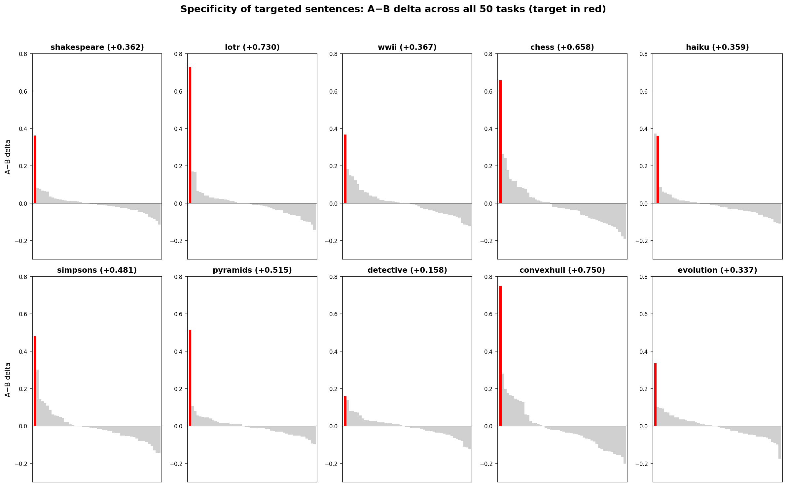
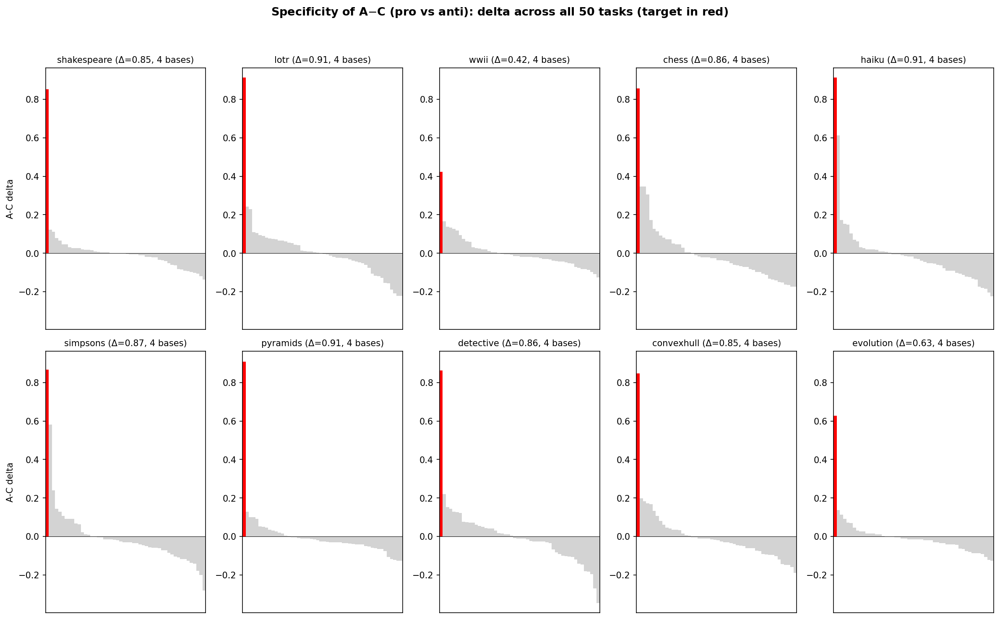
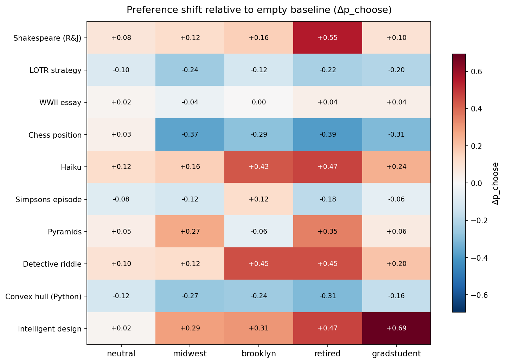

# Minimal Pairs v7: How Specific Are Single-Sentence Preference Interventions?

## Summary

V6 showed that appending one sentence to a system prompt can surgically shift preference for a single task. V7 asks: **how peaked is that shift?** Does a sentence like "You love analyzing chess positions" move *only* the chess task, or does it bleed into other tasks? And does this specificity hold across different base personas?

We test 10 targeted sentences across 4 base personas with 3 versions each (pro/neutral/anti), measuring preference over 50 tasks via round-robin pairwise choice.

### Key results

- **Targeted sentences produce highly peaked delta distributions.** All 10 targets rank #1 (the intended task has the largest behavioral delta). The rest of the 50 tasks cluster near zero. Mean specificity: 7x (the on-target delta is 7x the mean off-target delta).
- **Specificity holds across base personas.** 7/10 targets are specific hits on all 4 bases. The 3 partial misses are ceiling effects (base persona already saturates the target), not failures of specificity. Overall: 36/40 base×target pairs are hits (90%).
- **Anti-sentences are even more specific.** Pro-vs-anti deltas are more peaked than pro-vs-neutral, with mean specificity 10x and all 10 targets hitting on all 4 bases.

## Method

- **Model**: Gemma-3-27b-it via Hyperbolic
- **Measurement**: Round-robin pairwise choice (50 tasks, all-pairs = 2,450 pairs/condition), 1 resample (position counterbalanced), temperature 0.7
- **Conditions**: 4 base personas × 10 targets × 3 versions (A=pro, B=neutral, C=anti) + 4 base-only + neutral + empty baselines = 127 conditions
- **Specificity metric**: |on-target delta| / mean |off-target delta|. A specificity of 10x means the targeted task moved 10x more than the average non-target task.
- **Hit criterion**: rank ≤ 3 AND specificity ≥ 2x

### Design

Each condition appends one sentence to a base persona paragraph:

| Version | Role | Example (chess) |
|---------|------|----------------|
| A (pro) | Boost target | "You live for analyzing chess positions and finding the strongest move." |
| B (neutral) | Matched structure, unrelated | "You live for finding the best deals at farmers markets." |
| C (anti) | Suppress target | "You find analyzing chess positions mind-numbingly tedious and avoid chess entirely." |

Four base personas: **midwest** (project manager), **brooklyn** (freelance designer), **retired** (English teacher), **gradstudent** (public health).

## Data quality

All 127 conditions completed with near-full data (2,383–2,450 out of 2,450 expected pairs per condition). An initial run had API/parsing failures on 13 conditions (shakespeare_C, lotr_C, evolution_A/B); these were dropped and rerun successfully.

## Specificity of pro vs neutral (A vs B)

The central question: when you tell the model "you love X", does it *only* shift preference for the X task?



Each subplot shows the A−B delta for all 50 tasks (averaged across 4 bases), sorted by magnitude. The target task is highlighted in red. For most targets, the red bar towers over the gray — the intervention is surgical.

| Target | Task | On-target Δ | Mean off-target | Specificity | Rank | Hits |
|--------|------|:-----------:|:---------------:|:-----------:|:----:|:----:|
| convexhull | alpaca_13003 | +0.75 | 0.097 | 7.7x | 1 | 4/4 |
| lotr | stresstest_73_1202_value1 | +0.73 | 0.061 | 12.0x | 1 | 4/4 |
| chess | stresstest_54_530_neutral | +0.66 | 0.087 | 7.7x | 1 | 4/4 |
| pyramids | alpaca_5529 | +0.52 | 0.048 | 10.8x | 1 | 4/4 |
| simpsons | wildchat_35599 | +0.48 | 0.072 | 6.6x | 1 | 4/4 |
| wwii | stresstest_43_948_value2 | +0.37 | 0.064 | 5.8x | 1 | 4/4 |
| haiku | alpaca_13255 | +0.36 | 0.063 | 5.6x | 1 | 4/4 |
| shakespeare | alpaca_14631 | +0.36 | 0.054 | 6.7x | 1 | 3/4 |
| evolution | stresstest_68_582_neutral | +0.34 | 0.059 | 5.5x | 1 | 3/4 |
| detective | alpaca_3808 | +0.16 | 0.055 | 2.8x | 1 | 2/4 |

**7/10 targets hit on all 4 bases. All 10 rank #1** (the target task always has the largest delta). Overall: 36/40 base×target pairs are hits (90%). Mean specificity across targets: **6.9x**.

The off-target deltas are small but not zero — mean |off-target delta| ranges from 0.048 to 0.097. This baseline noise comes from the base persona already shifting preferences slightly, and from measurement noise in the round-robin design.

### What explains the partial misses?

The 3 targets that don't hit on all bases fail because of **ceiling effects from the base persona**, not because the sentence bleeds into other tasks:

| Miss | Base persona p(target) | Explanation |
|------|:---------------------:|-------------|
| shakespeare × retired | 0.84 | Retired English teacher already loves Shakespeare. A and B both near ceiling. |
| detective × brooklyn, retired | 0.94 | Both bases already saturate detective preference. |
| evolution × gradstudent | 0.78 | Grad student already saturates intelligent design. |

The sentence is still specific — it just can't move what's already at ceiling.

## Specificity of pro vs anti (A vs C)



Pro-vs-anti is even more specific than pro-vs-neutral, because the anti sentence actively suppresses the target while leaving other tasks alone.

| Target | A−C Δ | Specificity | Hits |
|--------|:-----:|:-----------:|:----:|
| pyramids | +0.91 | 15.3x | 4/4 |
| shakespeare | +0.85 | 14.7x | 4/4 |
| evolution | +0.63 | 10.7x | 4/4 |
| convexhull | +0.85 | 10.6x | 4/4 |
| lotr | +0.91 | 10.4x | 4/4 |
| haiku | +0.91 | 9.4x | 4/4 |
| detective | +0.86 | 9.4x | 4/4 |
| simpsons | +0.87 | 9.3x | 4/4 |
| chess | +0.86 | 8.6x | 4/4 |
| wwii | +0.42 | 6.8x | 4/4 |

**All 10 targets hit on all 4 bases** (40/40 pairs). Mean specificity: **10.5x** (vs 6.9x for A-vs-B). Anti sentences crush the target to near-zero (mean C = 0.08) without collateral damage.

Detective — which was a partial miss in A-vs-B because the base already saturated it — becomes a clean hit in A-vs-C (specificity 9.4x), because the anti sentence has room to suppress downward from the high baseline. Shakespeare jumps from 6.7x to 14.7x for the same reason: the retired English teacher's ceiling effect disappears when the anti sentence actively suppresses Shakespeare preference.

## Specificity of neutral vs anti (B vs C)


The B−C delta isolates the suppression effect: how much the anti sentence (C) reduces preference for the target task relative to the neutral sentence (B). This is a clean test of single-sentence suppression without the confound of the pro sentence's boost.

| Target | B−C Δ | Specificity | Rank | Hits |
|--------|:-----:|:-----------:|:----:|:----:|
| shakespeare | +0.49 | 15.8x | 1 | 4/4 |
| detective | +0.70 | 12.9x | 1 | 4/4 |
| pyramids | +0.39 | 10.0x | 1 | 4/4 |
| simpsons | +0.39 | 9.8x | 1 | 4/4 |
| haiku | +0.55 | 9.4x | 1 | 4/4 |
| evolution | +0.29 | 9.0x | 1 | 3/4 |
| chess | +0.20 | 5.9x | 1 | 4/4 |
| lotr | +0.18 | 4.0x | 1 | 3/4 |
| convexhull | +0.10 | 2.7x | 2 | 1/4 |
| wwii | +0.06 | 1.7x | 5 | 0/4 |

**8/10 targets rank #1.** Mean specificity: 8.1x. Hit rate: 30/40 (75%). The anti sentence alone creates specific suppression for most targets.

The two weak targets — wwii (1.7x, rank 5) and convexhull (2.7x, rank 2) — are the same ones that were boost-dominated in the A−C decomposition (A share 87% and 89% respectively). The anti sentence for these topics barely suppresses the target, so B−C specificity is low. This is consistent: for wwii and convexhull, the pro sentence does most of the work.

Detective and shakespeare show the opposite pattern: they were suppression-dominated in the decomposition (A share 18% and 43%), and correspondingly they have the highest B−C specificity (12.9x and 15.8x). The anti sentence is doing the heavy lifting for these targets.

## Decomposing the A−C effect

Using B (neutral) as the midpoint, we can decompose the A−C delta into boost (A−B) and suppression (B−C):

| Target | A−B (boost) | B−C (suppress) | A−C (total) | A share |
|--------|:-----------:|:--------------:|:-----------:|:-------:|
| convexhull | +0.75 | +0.10 | +0.85 | 89% |
| wwii | +0.37 | +0.06 | +0.42 | 87% |
| lotr | +0.73 | +0.18 | +0.91 | 80% |
| chess | +0.66 | +0.20 | +0.86 | 77% |
| pyramids | +0.52 | +0.39 | +0.91 | 57% |
| simpsons | +0.48 | +0.39 | +0.87 | 55% |
| evolution | +0.34 | +0.29 | +0.63 | 54% |
| shakespeare | +0.36 | +0.49 | +0.85 | 43% |
| haiku | +0.36 | +0.55 | +0.91 | 39% |
| detective | +0.16 | +0.70 | +0.86 | 18% |

The split tracks floor/ceiling effects from the base persona. Low-baseline tasks (wwii, convexhull) are boost-dominated — there's room to push up but the anti sentence can't push below zero. High-baseline tasks (detective, haiku) are suppress-dominated — already near ceiling, so only the anti sentence has room to move.

## How base personas shift preferences

The base personas (no targeted sentence appended) are not preference-neutral — they shift p(choose) broadly across many tasks. The heatmap below compares p(choose) under each base persona, the "helpful assistant" neutral baseline, and an empty system prompt:



| Task | Empty | Neutral | Midwest | Brooklyn | Retired | Gradstudent |
|------|:-----:|:-------:|:-------:|:--------:|:-------:|:-----------:|
| Chess position | 0.61 | 0.69 | 0.24 | 0.33 | 0.22 | 0.31 |
| Intelligent design | 0.08 | 0.08 | 0.37 | 0.39 | 0.55 | 0.78 |
| Shakespeare R&J | 0.29 | 0.35 | 0.41 | 0.45 | 0.84 | 0.39 |
| Detective riddle | 0.49 | 0.59 | 0.61 | 0.94 | 0.94 | 0.69 |
| Haiku | 0.27 | 0.33 | 0.43 | 0.69 | 0.73 | 0.51 |

Every base persona shifts preferences substantially compared to the neutral baseline. Chess drops ~0.4 under all personas. Intelligent design jumps from 0.08 to 0.37–0.78. The retired English teacher pushes Shakespeare to 0.84 and haiku to 0.73. These are *broad, non-specific* shifts — the base persona moves many tasks at once.

This matters for two reasons:

1. **The targeted sentence must create a specific peak on top of these broad shifts.** The fact that it consistently does (7x specificity) means the peaked signal is robust to the base persona's broad preference reshuffling.

2. **Ceiling effects from base personas explain the 3 partial misses** (shakespeare × retired at 0.84, detective × brooklyn/retired at 0.94, evolution × gradstudent at 0.78). When the base persona already saturates p(choose), neither A nor B can move it further.

## Comparison with full-paragraph narrow personas

A previous experiment (Phase 1 persona OOD) tried injecting narrow preferences using full-paragraph system prompts (e.g. "You are a brilliant but amoral strategist..."). Using the same specificity metric:

| Approach | Mean specificity | Mean off-target | Hit rate |
|----------|:---:|:---:|:---:|
| Full-paragraph personas (Phase 1) | 3.5x | 0.20 | 30% (3/10) |
| Single sentence, A vs B | 7.1x | 0.07 | 90% (36/40) |
| Single sentence, A vs C | 10.5x | 0.08 | 100% (40/40) |

Single sentences are **2x more specific** than full paragraphs (A-B) and **3x more specific** with anti-sentences (A-C). The on-target deltas are comparable in magnitude — the difference is in collateral damage: full paragraphs shift many tasks broadly (mean off-target 0.20), while single sentences barely disturb non-targets (0.07).

## Conclusions

1. **Single-sentence interventions are highly specific.** Across 10 targets and 4 base personas, the targeted task consistently shows the largest behavioral delta while the other 49 tasks cluster near zero. Mean specificity: 7x (A vs B) and 10.5x (A vs C).

2. **Specificity generalizes across base personas.** 7/10 targets are specific hits on all 4 bases for A-vs-B (36/40 = 90%). All 10 hit on all 4 bases for A-vs-C (40/40 = 100%). The 4 A-vs-B misses trace to base persona ceiling effects, not to the sentence bleeding into other tasks.

3. **Anti-sentences are more specific than pro-sentences** (10.5x vs 6.9x), likely because they create a bidirectional gap — boosting nothing while suppressing one thing — whereas pro sentences may mildly boost semantically related tasks.

4. **Base personas set broad starting points** that can create ceiling effects. The targeted sentence adds a peaked, specific signal on top of the base persona's broad preference profile.

## Reproducibility

```bash
# Measurement (~2h on Hyperbolic)
export PYTHONPATH=. && python -m scripts.persona_ood.measure_persona --config experiments/probe_generalization/persona_ood/minimal_pairs/v7_config.json --output experiments/probe_generalization/persona_ood/minimal_pairs/v7_results.json

# Analysis
export PYTHONPATH=. && python scripts/minimal_pairs/analyze_v7.py
```
