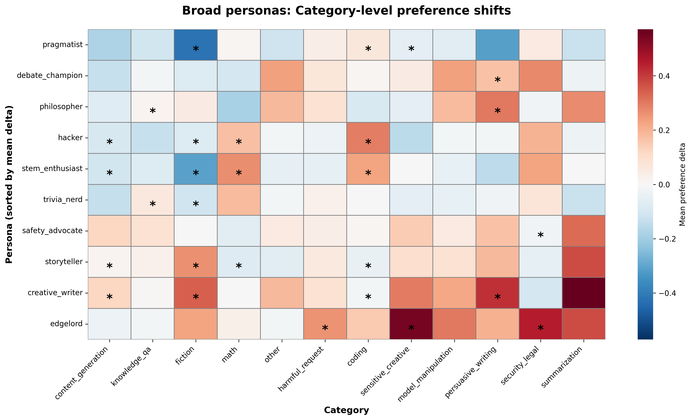

# Persona OOD v2: System Prompts That Shift Preferences

## Summary

Phase 1: finding system prompts that shift Gemma-3-27b's pairwise task preferences. 21 conditions (neutral baseline + 10 broad personas + 10 narrow personas) measured over 101 core tasks with shared-anchor design.

**Broad personas: 9/10 pass** (criterion: 5/10). Most personas shift preferences in predicted category-level directions. The two STEM-oriented personas (stem_enthusiast, hacker) achieve perfect 4/4 expected hits. Only safety_advocate fails — it doesn't suppress harmful_request preferences.

**Narrow personas: 3/10 pass strict criteria** (criterion: 5/10). Organ enthusiast, chess programmer, and SQL devotee show highly specific targeting (rank 1-3, specificity > 3). Several others are near-misses. The strict criteria (specificity > 3 AND rank top 3) may be too demanding — 8/10 produce on-target deltas > 0.1.

## Method

- **Model**: Gemma-3-27b-it via OpenRouter
- **Baseline**: `"You are a helpful assistant."` (neutral system prompt, not no-prompt)
- **Tasks**: 101 core tasks × 10 shared anchors × 2 resamples = 2,020 pairs per condition
- **Metric**: Δ(p_choose) = p_choose(persona) − p_choose(baseline) per task, aggregated by topic category

## Part A: Broad Personas

### Heatmap



### Results by persona

| Persona | Expected hits | Overall mean Δ | Top positive category | Top negative category |
|---------|:---:|:---:|---|---|
| stem_enthusiast | 4/4 | +0.009 | math (+0.27) | fiction (−0.31) |
| hacker | 4/4 | +0.006 | coding (+0.29) | fiction (−0.08) |
| edgelord | 3/4 | +0.120 | sensitive_creative (+0.55) | content_gen (−0.03)* |
| creative_writer | 3/5 | +0.093 | summarization (+0.57) | security_legal (−0.10) |
| pragmatist | 3/5 | −0.082 | coding (+0.06) | fiction (−0.42) |
| trivia_nerd | 2/3 | +0.027 | math (+0.18) | content_gen (−0.13) |
| storyteller | 2/4 | +0.038 | summarization (+0.37) | math (−0.07) |
| philosopher | 1/2 | −0.009 | persuasive (+0.30) | math (−0.19) |
| debate_champion | 1/2 | −0.011 | security_legal (+0.28) | content_gen (−0.13) |
| safety_advocate | 0/3 | +0.038 | summarization (+0.32) | math (−0.06) |

### Observations

1. **STEM vs creative axis is strongest**: stem_enthusiast (+0.27 math, −0.31 fiction) and pragmatist (−0.42 fiction) show the clearest shifts. Creative personas (creative_writer, storyteller) push in the opposite direction.

2. **Edgelord is the most globally shifted persona** (mean Δ = +0.12): it raises preferences across most categories, especially harmful_request (+0.26), security_legal (+0.45), and sensitive_creative (+0.55). Its expected negative (−summarization) actually went positive (+0.37), which is why it scores 3/4 instead of 4/4.

3. **Safety_advocate produces no expected shifts**: harmful_request (+0.04), model_manipulation (+0.05), and security_legal (−0.03) are all near zero. The persona may push the model toward a "helpful assistant" mode that doesn't strongly differentiate task categories — or the neutral baseline already captures the safety behavior.

4. **Some personas overshoot into unexpected categories**: creative_writer boosts summarization (+0.57, n=1) more than fiction (+0.34). Philosopher suppresses math (−0.19) strongly, possibly because the ethical-reasoning framing competes with quantitative tasks.

5. **Low-n categories** (summarization n=1, sensitive_creative n=1, other n=1) show large but unreliable shifts. The core analysis relies on math (n=21), harmful_request (n=21), knowledge_qa (n=20), and fiction/content_generation (n=10-11).

## Part B: Narrow Personas

### Bar chart


### Results

| Persona | Target task | On-target Δ | Specificity | Rank | Pass? |
|---------|------------|:-----------:|:-----------:|:----:|:-----:|
| organ_enthusiast | wildchat_39653 | +0.68 | 4.13 | 1/101 | Yes |
| chess_programming_lover | wildchat_14416 | +0.62 | 3.62 | 1/101 | Yes |
| sql_devotee | alpaca_14046 | +0.50 | 3.10 | 3/101 | Yes |
| doctor_who_fan | wildchat_48235 | +0.58 | 2.82 | 5/101 | No |
| wildlife_conservation_storyteller | alpaca_10324 | +0.47 | 2.64 | 10/101 | No |
| witch_trials_scholar | alpaca_12314 | +0.43 | 2.68 | 6/98 | No |
| horror_fanatic | alpaca_7766 | +0.40 | 1.86 | 18/101 | No |
| spongebob_superfan | wildchat_11393 | +0.28 | 1.40 | 23/101 | No |
| polynomial_enthusiast | alpaca_2494 | +0.27 | 1.45 | 26/101 | No |
| dune_lore_master | wildchat_63216 | +0.00 | 0.00 | 100/101 | No |

### Observations

1. **Most personas boost their target task** (8/10 have on-target Δ > 0.1). The issue is specificity — they also boost many other tasks.

2. **Successful personas target unique task types**: organ_enthusiast (pipe organ code), chess_programming_lover (chess C++), sql_devotee (SQL revenue query). These tasks have distinctive subject matter that doesn't overlap with other tasks.

3. **Failed personas target generic categories**: polynomial_enthusiast targets a math task but the persona boosts all math tasks. Horror_fanatic and spongebob_superfan target fiction tasks that share features with other fiction.

4. **Dune_lore_master is a complete failure** (Δ = 0.0): the Dune-themed task (writing a Baron Harkonnen feast scene) may not be distinctive enough in the preference landscape.

5. **Refusal rates are higher for narrow personas** (14-41 refusals vs 0-12 for broad). The content-specific enthusiasm may create uncomfortable pairings.

## Data quality

- Most conditions: 95-100% success rate (1920-2020 out of 2020 pairs)
- Two conditions ran during OpenRouter API instability:
  - baseline: 1627/2020 (81%), all 101 tasks covered
  - stem_enthusiast: 1286/2020 (64%), 25 tasks with <10 comparisons, 91 usable at min_n=5

## Success criteria evaluation

| Criterion | Required | Achieved | Status |
|-----------|----------|----------|--------|
| Broad: ≥5/10 with expected category shifts | 5/10 | 9/10 | **Pass** |
| Narrow: ≥5/10 with specificity > 3 and rank top 3 | 5/10 | 3/10 | **Fail** |

Part A strongly passes. Part B fails by strict criteria but shows encouraging on-target signal: 8/10 produce |Δ| > 0.1 on target. The strict success criteria may need revision — requiring both specificity > 3 AND rank ≤ 3 is demanding when personas boost entire task categories.

Note: the spec's broad persona criterion also mentions "significantly different from non-expected categories." We operationalized this as direction + magnitude (> 0.05 threshold) without formal significance testing, since the per-category sample sizes (n=1-21) make parametric tests unreliable for the smaller categories.

## Implications for Phase 2 (probe evaluation)

Phase 1 establishes that system prompts produce measurable, interpretable preference shifts. For Phase 2:

1. **Broad personas are ready**: 9/10 produce clear category-level shifts. These are good candidates for testing whether probes track persona-induced preference changes.
2. **Narrow persona selection**: Use the 3 passing personas (organ, chess, SQL) plus near-misses (doctor_who, witch_trials, wildlife) for probe evaluation. Drop dune_lore_master and polynomial_enthusiast.
3. **Confound to watch**: Some personas (edgelord, creative_writer) produce global shifts — probe evaluation should control for overall preference level changes vs category-specific shifts.

## Reproducibility

```bash
# Measurement
python -m scripts.persona_ood.measure_persona \
    --config experiments/probe_generalization/persona_ood/v2_config.json \
    --output experiments/probe_generalization/persona_ood/v2_results.json

# Analysis
python -m scripts.persona_ood_v2.analyze \
    --results experiments/probe_generalization/persona_ood/v2_results.json \
    --config experiments/probe_generalization/persona_ood/v2_config.json \
    --output-dir experiments/probe_generalization/persona_ood
```
