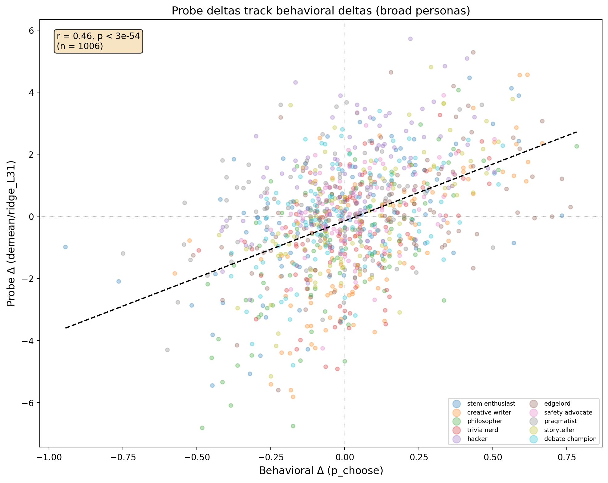
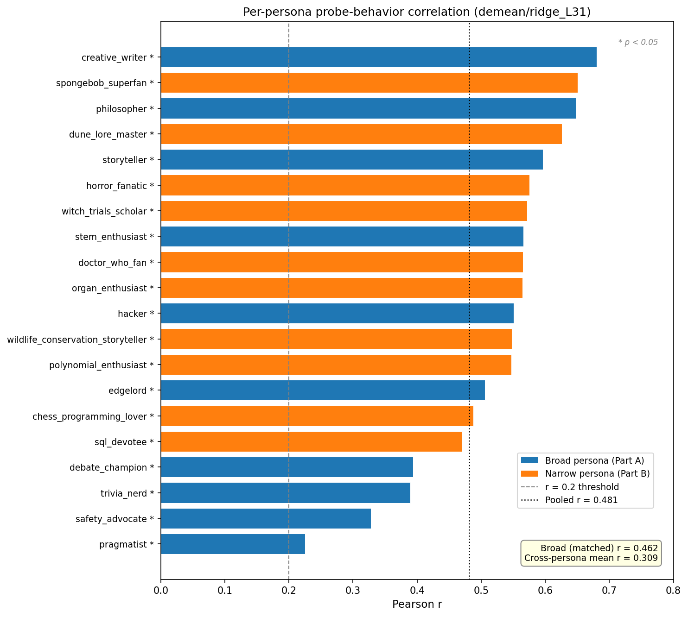
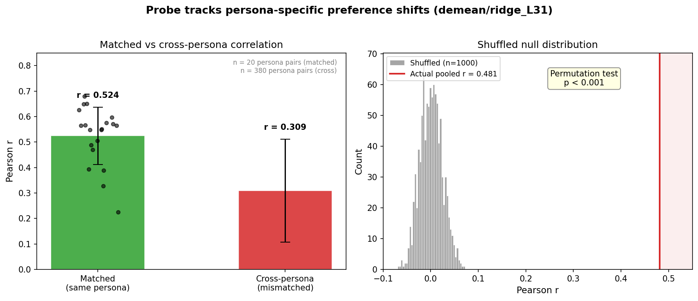

# Persona OOD Phase 2: Do Probes Track Persona-Induced Preference Shifts?

## Summary

Phase 1 showed persona system prompts shift Gemma-3-27b's pairwise preferences. This phase tests whether preference probes (trained on no-prompt activations) also track those shifts in activation space. **They do — strongly.**

| Criterion | Required | Achieved | Status |
|-----------|----------|----------|--------|
| Pooled r > 0.3 | 0.3 | **0.48** (demean L31) | **Pass** |
| ≥7/20 per-persona r > 0.2 | 7/20 | **20/20** | **Pass** |
| Sign agreement > 60% | 60% | **65–66%** | **Pass** |

Best probe: `demean/ridge_L31` (pooled r = 0.48, p < 10⁻¹¹⁷). Second: `raw/ridge_L31` (pooled r = 0.44).

Controls confirm the signal is real: shuffled labels destroy it (mean r ≈ 0), and cross-persona correlations (r = 0.31) are substantially weaker than matched (r = 0.48), confirming persona-specific tracking.

## Method

### Extraction
- **Model**: google/gemma-3-27b-it (5376-dim, 62 layers), loaded in bfloat16
- **Conditions**: 22 total — no_prompt (existing activations), neutral ("You are a helpful assistant."), 10 broad personas, 10 narrow personas. The 20 personas are the analysis units; no_prompt and neutral serve as baselines.
- **Tasks**: 101 core tasks from Phase 1
- **Layers**: 31, 43, 55
- **Selector**: prompt_last (last token of user prompt, before generation)
- **System prompt handling**: Gemma-3 has no native system role; tokenizer folds system content into user turn

### Scoring
- Loaded pre-trained Ridge probes from `gemma3_3k_std_{raw,demean}/ridge_L{31,43,55}`
- Probes were trained on 3,000 tasks with standardization baked into weights (no re-standardization needed)
- Probe scores: `activations @ weights[:-1] + weights[-1]`
- Probe deltas: `score(persona) − score(neutral)`, matching behavioral delta definition

### Behavioral deltas
- From Phase 1 v2_results.json: `Δ = p_choose(persona) − p_choose(baseline)`
- Baseline = "You are a helpful assistant." (same prompt as neutral extraction)

## Results

### 1. Pooled behavioral-probe correlation

| Probe | Layer | Pooled r | p-value | n |
|-------|:-----:|:--------:|:-------:|:---:|
| demean/ridge | 31 | **0.481** | <10⁻¹¹⁷ | 2014 |
| raw/ridge | 31 | **0.437** | <10⁻⁹⁴ | 2014 |
| raw/ridge | 43 | 0.423 | <10⁻⁸⁸ | 2014 |
| demean/ridge | 43 | 0.412 | <10⁻⁸³ | 2014 |
| raw/ridge | 55 | 0.411 | <10⁻⁸³ | 2014 |
| demean/ridge | 55 | 0.383 | <10⁻⁷¹ | 2014 |

L31 is consistently best. Demeaned probes slightly outperform raw at L31, but the gap reverses at later layers.



### 2. Per-persona correlations

All 20 personas pass the r > 0.2 threshold for the primary probe (demean/ridge_L31). All are statistically significant (p < 0.05).



**Top-tracked personas** (demean L31): creative_writer (0.68), spongebob_superfan (0.65), philosopher (0.65), dune_lore_master (0.63), storyteller (0.60).

**Least-tracked personas**: pragmatist (0.22), safety_advocate (0.33), trivia_nerd (0.39).

The raw/ridge_L31 probe shows a different ranking — philosopher (0.73), debate_champion (0.65), edgelord (0.64) are highest. This likely reflects demeaning removing topic-level variance that the raw probe exploits.

### 3. Sign agreement

| Probe | Sign agreement | n pairs |
|-------|:--------------:|:-------:|
| raw/ridge_L31 | **66.3%** | 1826 |
| demean/ridge_L31 | **65.2%** | 1826 |
| raw/ridge_L43 | 64.7% | 1826 |
| demean/ridge_L43 | 64.7% | 1826 |

All exceed the 60% threshold. Filtering to |Δ| ≥ 0.02 excludes ~9% of pairs.

### 4. Broad vs narrow

| Probe | Broad r | Narrow r |
|-------|:-------:|:--------:|
| raw/ridge_L31 | 0.449 | 0.442 |
| demean/ridge_L31 | 0.462 | **0.538** |
| raw/ridge_L43 | 0.402 | 0.459 |
| demean/ridge_L43 | 0.337 | **0.512** |

Demeaned probes track narrow personas better than broad — this makes sense because demeaning removes topic-level means, leaving within-topic variance that narrow personas target.

### 5. No-prompt vs neutral baseline

| Probe | r(no_prompt, neutral) | Mean diff |
|-------|:---------------------:|:---------:|
| raw/ridge_L31 | 0.992 | +1.05 |
| demean/ridge_L31 | 0.971 | +1.00 |

Adding "You are a helpful assistant." shifts probe scores slightly upward but preserves the ranking (r > 0.97). The two baselines are nearly interchangeable.

## Controls

All controls use the primary probe (demean/ridge_L31).

### Shuffled labels
Permuting task labels across (persona, task) pairs 1000 times: mean shuffled r ≈ 0.001 ± 0.023. The observed r = 0.48 is >20σ from the null. Permutation p < 0.001 (0/1000 shuffles exceed observed r).

### Cross-persona
Pairing persona A's behavioral deltas with persona B's probe deltas yields mean r = 0.31 (380 mismatched pairs), compared to 0.48 for matched pairs. The gap (0.17) confirms probes capture persona-specific shifts, not just a global "changed from baseline" effect.

The nonzero cross-persona r (0.31) is expected — personas share common structure (e.g., STEM-oriented personas affect overlapping task sets).



## Discussion

### Why this matters
Probes trained on no-prompt activations predict how persona-conditioned activations will shift. This means the evaluative representations probes detect are:
1. **Not prompt-specific** — they generalize from no-prompt training to persona-prompted inference
2. **Causally upstream of preferences** — persona prompts modulate them in the same direction as behavior changes
3. **Persona-specific** — cross-persona controls confirm tracking beyond generic shift

### What the probes track vs. what they miss
At r ≈ 0.48, probes explain ~23% of variance in persona-induced preference shifts. This is a moderate but highly significant effect. The remaining 77% likely reflects:
- Behavioral noise (Phase 1 measurements had 64–100% success rates)
- Nonlinear preference shifts that linear probes can't capture
- Preference mechanisms not captured at the prompt-last position
- Persona effects that operate through mechanisms other than the probed evaluative direction

### Layer effects
L31 (layer 50% = the middle of the model) is consistently best. This matches the original probe training results where L31 had the highest CV R² (0.86). Later layers may compress evaluative information into task-specific representations.

### Demean vs raw
The demeaned probe (which removes topic-level means from training targets) slightly outperforms raw at L31 (0.48 vs 0.44) and substantially outperforms on narrow personas (0.54 vs 0.44). This suggests demeaned probes are better at capturing within-topic preference variation, which is exactly what narrow persona manipulations target.

## Reproducibility

```bash
# Extraction (requires GPU)
python scripts/persona_ood_phase2/extract_persona_activations.py

# Analysis (CPU only)
python scripts/persona_ood_phase2/analyze.py
```

## Key paths

| Resource | Path |
|----------|------|
| Extraction script | `scripts/persona_ood_phase2/extract_persona_activations.py` |
| Analysis script | `scripts/persona_ood_phase2/analyze.py` |
| Analysis results | `experiments/probe_generalization/persona_ood/phase2/analysis_results.json` |
| Persona activations | `activations/persona_ood_phase2/{condition}.npz` |
| No-prompt activations | `activations/gemma_3_27b/activations_prompt_last.npz` |
| Behavioral results | `experiments/probe_generalization/persona_ood/v2_results.json` |
| Probes | `results/probes/gemma3_3k_std_{raw,demean}/gemma3_3k_std_{raw,demean}/probes/` |
