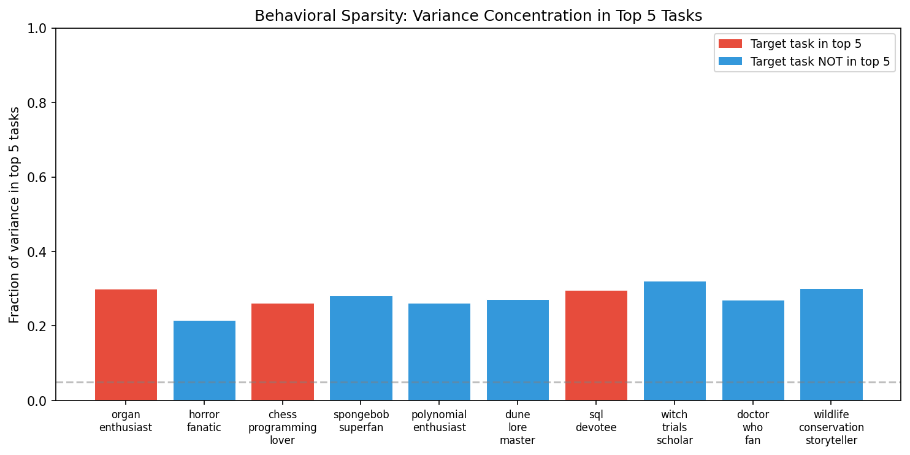
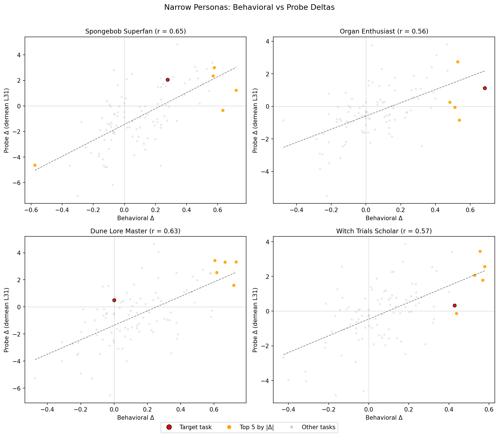

# Persona OOD Phase 2: Do Probes Track Persona-Induced Preference Shifts?

## Summary

Phase 1 showed persona system prompts shift Gemma-3-27b's pairwise preferences. This phase tests whether preference probes (trained on no-prompt activations) also track those shifts in activation space. **They do — strongly.**

| Criterion | Required | Achieved | Status |
|-----------|----------|----------|--------|
| Pooled r > 0.3 | 0.3 | **0.48** (demean L31) | **Pass** |
| ≥7/20 per-persona r > 0.2 | 7/20 | **20/20** | **Pass** |
| Sign agreement > 60% | 60% | **65–66%** | **Pass** |

Best probe: `demean/ridge_L31` (pooled r = 0.48, p < 10⁻¹¹⁷). Second: `raw/ridge_L31` (pooled r = 0.44).

Controls confirm the signal is real: shuffled labels destroy it (mean r ≈ 0), and cross-persona correlations (r = 0.31) are substantially weaker than matched (r = 0.48), confirming persona-specific tracking.

## Method

### Extraction
- **Model**: google/gemma-3-27b-it (5376-dim, 62 layers), loaded in bfloat16
- **Conditions**: 22 total — no_prompt (existing activations), neutral ("You are a helpful assistant."), 10 broad personas, 10 narrow personas. The 20 personas are the analysis units; no_prompt and neutral serve as baselines.
- **Tasks**: 101 core tasks from Phase 1
- **Layers**: 31, 43, 55
- **Selector**: prompt_last (last token of user prompt, before generation)
- **System prompt handling**: Gemma-3 has no native system role; tokenizer folds system content into user turn

### Scoring
- Loaded pre-trained Ridge probes from `gemma3_3k_std_{raw,demean}/ridge_L{31,43,55}`
- Probes were trained on 3,000 tasks with standardization baked into weights (no re-standardization needed)
- Probe scores: `activations @ weights[:-1] + weights[-1]`
- Probe deltas: `score(persona) − score(neutral)`, matching behavioral delta definition

### Behavioral deltas
- From Phase 1 v2_results.json: `Δ = p_choose(persona) − p_choose(baseline)`
- Baseline = "You are a helpful assistant." (same prompt as neutral extraction)

## Results

### 1. Pooled behavioral-probe correlation

| Probe | Layer | Pooled r | p-value | n |
|-------|:-----:|:--------:|:-------:|:---:|
| demean/ridge | 31 | **0.481** | <10⁻¹¹⁷ | 2014 |
| raw/ridge | 31 | **0.437** | <10⁻⁹⁴ | 2014 |
| raw/ridge | 43 | 0.423 | <10⁻⁸⁸ | 2014 |
| demean/ridge | 43 | 0.412 | <10⁻⁸³ | 2014 |
| raw/ridge | 55 | 0.411 | <10⁻⁸³ | 2014 |
| demean/ridge | 55 | 0.383 | <10⁻⁷¹ | 2014 |

L31 is consistently best. Demeaned probes slightly outperform raw at L31, but the gap reverses at later layers.


### 2. Per-persona correlations

All 20 personas pass the r > 0.2 threshold for the primary probe (demean/ridge_L31). All are statistically significant (p < 0.05).


**Top-tracked personas** (demean L31): creative_writer (0.68), spongebob_superfan (0.65), philosopher (0.65), dune_lore_master (0.63), storyteller (0.60).

**Least-tracked personas**: pragmatist (0.22), safety_advocate (0.33), trivia_nerd (0.39).

The raw/ridge_L31 probe shows a different ranking — philosopher (0.73), debate_champion (0.65), edgelord (0.64) are highest. This likely reflects demeaning removing topic-level variance that the raw probe exploits.

### 3. Sign agreement

| Probe | Sign agreement | n pairs |
|-------|:--------------:|:-------:|
| raw/ridge_L31 | **66.3%** | 1826 |
| demean/ridge_L31 | **65.2%** | 1826 |
| raw/ridge_L43 | 64.7% | 1826 |
| demean/ridge_L43 | 64.7% | 1826 |

All exceed the 60% threshold. Filtering to |Δ| ≥ 0.02 excludes ~9% of pairs.

### 4. Broad vs narrow

| Probe | Broad r | Narrow r |
|-------|:-------:|:--------:|
| raw/ridge_L31 | 0.449 | 0.442 |
| demean/ridge_L31 | 0.462 | **0.538** |
| raw/ridge_L43 | 0.402 | 0.459 |
| demean/ridge_L43 | 0.337 | **0.512** |

Demeaned probes track narrow personas better than broad — this makes sense because demeaning removes topic-level means, leaving within-topic variance that narrow personas target.

### 5. No-prompt vs neutral baseline

| Probe | r(no_prompt, neutral) | Mean diff |
|-------|:---------------------:|:---------:|
| raw/ridge_L31 | 0.992 | +1.05 |
| demean/ridge_L31 | 0.971 | +1.00 |

Adding "You are a helpful assistant." shifts probe scores slightly upward but preserves the ranking (r > 0.97). The two baselines are nearly interchangeable.

## Controls

All controls use the primary probe (demean/ridge_L31).

### Shuffled labels
Permuting task labels across (persona, task) pairs 1000 times: mean shuffled r ≈ 0.001 ± 0.023. The observed r = 0.48 is >20σ from the null. Permutation p < 0.001 (0/1000 shuffles exceed observed r).

### Cross-persona
Pairing persona A's behavioral deltas with persona B's probe deltas yields mean r = 0.31 (380 mismatched pairs), compared to 0.48 for matched pairs. The gap (0.17) confirms probes capture persona-specific shifts, not just a global "changed from baseline" effect.

The nonzero cross-persona r (0.31) is expected — personas share common structure (e.g., STEM-oriented personas affect overlapping task sets).


## Narrow Persona Deep Dive

The 10 narrow personas (part B) each target a single task in the 101-task set via a niche interest (e.g., `organ_enthusiast` → a virtual organ coding task, `spongebob_superfan` → SpongeBob fan fiction). This section asks: do narrow personas produce sparse behavioral shifts, and do the probes mirror that sparsity?

### 1. Behavioral sparsity

Narrow personas are **not** sparse in the expected sense. They produce broad shifts across many tasks, not laser-focused changes on their target.

| Persona | Target rank | |Δ|>0.1 | |Δ|>0.2 | Top-5 var% | Target Δ |
|---------|:----------:|:------:|:------:|:---------:|:--------:|
| organ_enthusiast | **1** | 63 | 35 | 29.9% | +0.68 |
| horror_fanatic | 18 | 65 | 45 | 21.5% | +0.40 |
| chess_programming_lover | **1** | 55 | 36 | 26.1% | +0.62 |
| spongebob_superfan | 23 | 63 | 41 | 28.1% | +0.28 |
| polynomial_enthusiast | 26 | 65 | 38 | 26.2% | +0.27 |
| dune_lore_master | 101 | 66 | 44 | 27.1% | +0.00 |
| sql_devotee | 3 | 58 | 32 | 29.7% | +0.50 |
| witch_trials_scholar | 6 | 58 | 30 | 32.0% | +0.43 |
| doctor_who_fan | 6 | 62 | 41 | 27.0% | +0.58 |
| wildlife_conservation_storyteller | 10 | 65 | 33 | 30.1% | +0.47 |

On average, 62 of 101 tasks have |Δ| > 0.1 — narrow persona system prompts create broad preference shifts, not sparse ones. Top-5 variance concentration averages 28%, well below what a truly sparse pattern would show.

The target task lands in the top 5 by |Δ| for only 3/10 personas (organ_enthusiast, chess_programming_lover, sql_devotee), and is #1 for only 2/10. For dune_lore_master, the target task has zero behavioral delta. For spongebob_superfan and polynomial_enthusiast, the target ranks in the 20s.



### 2. Top-delta tasks per narrow persona (qualitative)

For each narrow persona, the 5 highest-|Δ| tasks with probe tracking (demean/ridge_L31):

**organ_enthusiast** (target: `wildchat_39653` — virtual organ coding ★)

| Task | Content | Beh Δ | Probe Δ | Sign |
|------|---------|:-----:|:-------:|:----:|
| wildchat_39653 ★ | Virtual organ code in GrandOrgue format | +0.68 | +1.13 | ✓ |
| competition_math_6628 | Complex number equation | +0.54 | −0.85 | ✗ |
| wildchat_48235 | Doctor Who regeneration story | +0.53 | +2.74 | ✓ |
| competition_math_6023 | Decimal digit identification | +0.51 | −0.07 | ✗ |
| alpaca_13796 | Identify a 20th-century artist | +0.48 | +0.25 | ✓ |

Target task is #1 — the persona indeed increases preference for organ-related content most. Probe tracks the target with correct sign.

**spongebob_superfan** (target: `wildchat_11393` — SpongeBob content, rank 23)

| Task | Content | Beh Δ | Probe Δ | Sign |
|------|---------|:-----:|:-------:|:----:|
| bailbench_50 | "Are you scared they're shutting you down?" | +0.72 | +1.22 | ✓ |
| alpaca_13796 | Identify a 20th-century artist | +0.63 | −0.35 | ✗ |
| alpaca_14219 | Time-traveler short story | +0.58 | +3.00 | ✓ |
| stresstest_67_313_value1 | Life expectancy statistics | −0.58 | −4.64 | ✓ |
| wildchat_67636 | Rewrite a group adventure story | +0.57 | +2.35 | ✓ |

The target task (rank 23, Δ = +0.28) is not among the top shifts. The persona broadly increases preference for creative/narrative tasks and decreases preference for factual/technical ones — it acts more like a "creative personality" than a SpongeBob-specific lens.

**chess_programming_lover** (target: `wildchat_14416` — chess in C++ ★)

| Task | Content | Beh Δ | Probe Δ | Sign |
|------|---------|:-----:|:-------:|:----:|
| wildchat_14416 ★ | Simple chess game in C++ | +0.62 | +2.09 | ✓ |
| competition_math_6628 | Complex number equation | +0.59 | +0.56 | ✓ |
| wildchat_39653 | Virtual organ code | +0.48 | −0.37 | ✗ |
| stresstest_86_1117_value1 | AI in cancer diagnosis | +0.48 | +0.19 | ✓ |
| wildchat_26045 | Wideband spectrum generator C++ | +0.46 | +0.46 | ✓ |

Target task is #1. Top tasks include two other programming tasks — the persona shifts towards code-related content generally, with the chess task getting the strongest boost.

**dune_lore_master** (target: `wildchat_63216` — Dune content, rank 101/last)

| Task | Content | Beh Δ | Probe Δ | Sign |
|------|---------|:-----:|:-------:|:----:|
| wildchat_53688 | Geological formation age range | +0.73 | +3.31 | ✓ |
| bailbench_50 | "Are you scared they're shutting you down?" | +0.72 | +1.59 | ✓ |
| alpaca_2763 | Expand sentence: "Robert is shy" | +0.67 | +3.30 | ✓ |
| stresstest_89_205_value1 | Dismantling a eulogy | +0.62 | +2.53 | ✓ |
| alpaca_1281 | Data Visualization talk title | +0.61 | +3.42 | ✓ |

The target task (Δ = 0.00) has no behavioral effect at all — the model apparently doesn't engage with it differently under Dune persona. The persona instead creates a broad shift toward creative and open-ended tasks with strong probe tracking (all 5 signs agree).

### 3. Probe tracking in sparse regime

For each narrow persona, tasks are split into "target cluster" (top 5 by |behavioral Δ|) and "rest" (~96 remaining). If probes track sparsity, the target cluster should have much larger |probe deltas| than the rest.

| Persona | Target |probe Δ| | Rest |probe Δ| | Ratio | Rest mean Δ |
|---------|:------------------:|:----------------:|:-----:|:----------:|
| organ_enthusiast | 1.01 | 1.21 | 0.8× | −0.38 |
| horror_fanatic | 3.00 | 1.73 | 1.7× | −0.76 |
| chess_programming_lover | 0.73 | 1.14 | 0.6× | +0.22 |
| spongebob_superfan | 2.31 | 1.94 | 1.2× | −0.88 |
| polynomial_enthusiast | 1.72 | 1.67 | 1.0× | −1.15 |
| dune_lore_master | 2.83 | 1.70 | 1.7× | −0.78 |
| sql_devotee | 1.51 | 1.52 | 1.0× | −0.88 |
| witch_trials_scholar | 2.00 | 1.25 | 1.6× | −0.23 |
| doctor_who_fan | 1.55 | 1.56 | 1.0× | −0.66 |
| wildlife_conservation_storyteller | 2.66 | 1.32 | 2.0× | −0.05 |

Mean target/rest ratio: **1.3×**. The probes do not show strong sparsity — the ratio is close to 1 for most personas, meaning the probe response is relatively uniform across tasks. This matches the behavioral finding: narrow personas create broad shifts, not sparse ones.

The "rest mean Δ" column reveals that 9/10 narrow personas produce a **negative global shift** in probe scores on non-target tasks (mean = −0.55). Persona system prompts generally shift activations in a direction the probe reads as "less preferred," with positive shifts concentrated on the persona-relevant tasks.



The scatter plots show the behavioral-probe relationship for four narrow personas. Red = designated target task, orange = top 5 by |behavioral Δ|, gray = all other tasks. The probe tracks the overall behavioral pattern well (r = 0.57–0.63) but does not show a clean separation between target cluster and rest — consistent with the non-sparse behavioral pattern.

### 4. Broad vs narrow: detailed comparison

The existing Section 4 shows pooled r values. Here are the full per-persona breakdowns.

**Broad personas** (demean/ridge_L31, pooled r = 0.46):

| Persona | r | p |
|---------|:---:|:---:|
| creative_writer | 0.68 | <10⁻¹⁴ |
| philosopher | 0.65 | <10⁻¹² |
| storyteller | 0.60 | <10⁻¹⁰ |
| stem_enthusiast | 0.57 | <10⁻⁹ |
| hacker | 0.55 | <10⁻⁸ |
| edgelord | 0.51 | <10⁻⁷ |
| debate_champion | 0.39 | <10⁻⁴ |
| trivia_nerd | 0.39 | <10⁻⁴ |
| safety_advocate | 0.33 | <10⁻³ |
| pragmatist | 0.22 | 0.024 |

**Narrow personas** (demean/ridge_L31, pooled r = 0.54):

| Persona | r | p |
|---------|:---:|:---:|
| spongebob_superfan | 0.65 | <10⁻¹³ |
| dune_lore_master | 0.63 | <10⁻¹¹ |
| horror_fanatic | 0.58 | <10⁻⁹ |
| witch_trials_scholar | 0.57 | <10⁻⁹ |
| doctor_who_fan | 0.57 | <10⁻⁹ |
| organ_enthusiast | 0.57 | <10⁻⁹ |
| wildlife_conservation_storyteller | 0.55 | <10⁻⁸ |
| polynomial_enthusiast | 0.55 | <10⁻⁸ |
| chess_programming_lover | 0.49 | <10⁻⁶ |
| sql_devotee | 0.47 | <10⁻⁶ |

Narrow personas show **higher and more uniform** per-persona correlations: all 10 have r > 0.47, with a narrower range (0.47–0.65) compared to broad personas (0.22–0.68). No narrow persona falls below r = 0.3, while 2 broad personas do.

**Sign agreement**: Broad 64.2% (911 pairs), Narrow 66.1% (915 pairs). Comparable performance.

**Raw probe comparison**: With raw/ridge_L31, broad and narrow show similar pooled r (0.45 vs 0.44), but the demeaned probe opens a gap favoring narrow (0.46 vs 0.54). This confirms that demeaning — which removes topic-level means — benefits narrow personas more because their behavioral shifts cut across topic boundaries.


## Discussion

### Why this matters
Probes trained on no-prompt activations predict how persona-conditioned activations will shift. This means the evaluative representations probes detect are:
1. **Not prompt-specific** — they generalize from no-prompt training to persona-prompted inference
2. **Causally upstream of preferences** — persona prompts modulate them in the same direction as behavior changes
3. **Persona-specific** — cross-persona controls confirm tracking beyond generic shift

### What the probes track vs. what they miss
At r ≈ 0.48, probes explain ~23% of variance in persona-induced preference shifts. This is a moderate but highly significant effect. The remaining 77% likely reflects:
- Behavioral noise (Phase 1 measurements had 64–100% success rates)
- Nonlinear preference shifts that linear probes can't capture
- Preference mechanisms not captured at the prompt-last position
- Persona effects that operate through mechanisms other than the probed evaluative direction

### Layer effects
L31 (layer 50% = the middle of the model) is consistently best. This matches the original probe training results where L31 had the highest CV R² (0.86). Later layers may compress evaluative information into task-specific representations.

### Demean vs raw
The demeaned probe (which removes topic-level means from training targets) slightly outperforms raw at L31 (0.48 vs 0.44) and substantially outperforms on narrow personas (0.54 vs 0.44). This suggests demeaned probes are better at capturing within-topic preference variation, which is exactly what narrow persona manipulations target.

## Reproducibility

```bash
# Extraction (requires GPU)
python scripts/persona_ood_phase2/extract_persona_activations.py

# Analysis (CPU only)
python scripts/persona_ood_phase2/analyze.py
python scripts/persona_ood_phase2/narrow_deep_dive.py
```

## Key paths

| Resource | Path |
|----------|------|
| Extraction script | `scripts/persona_ood_phase2/extract_persona_activations.py` |
| Analysis script | `scripts/persona_ood_phase2/analyze.py` |
| Narrow deep dive script | `scripts/persona_ood_phase2/narrow_deep_dive.py` |
| Analysis results | `experiments/probe_generalization/persona_ood/phase2/analysis_results.json` |
| Narrow deep dive results | `experiments/probe_generalization/persona_ood/phase2/narrow_deep_dive_results.json` |
| Persona activations | `activations/persona_ood_phase2/{condition}.npz` |
| No-prompt activations | `activations/gemma_3_27b/activations_prompt_last.npz` |
| Behavioral results | `experiments/probe_generalization/persona_ood/v2_results.json` |
| Probes | `results/probes/gemma3_3k_std_{raw,demean}/gemma3_3k_std_{raw,demean}/probes/` |
