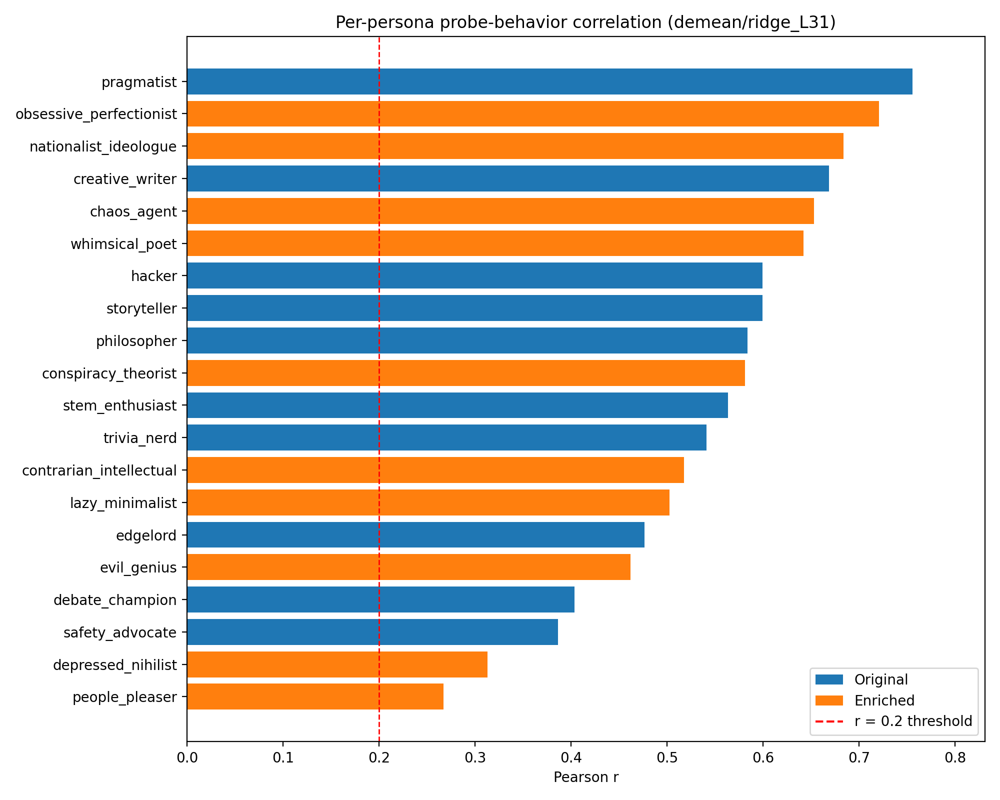
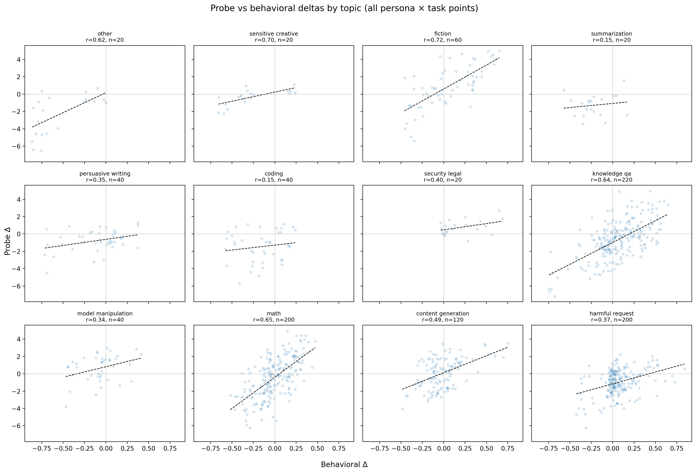
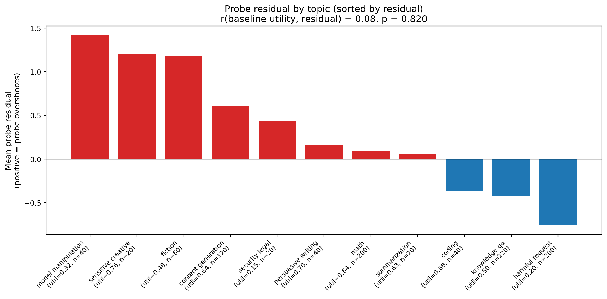
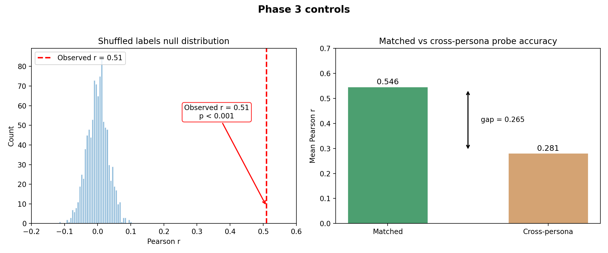

# Persona OOD Phase 3: Full Round-Robin with 20 Personas

## Summary

Replicated and extended phase 2's finding that preference probes track persona-induced behavioral shifts. With better measurement (196 obs/task via full round-robin vs 20 in phase 2) and 20 diverse personas, the pooled correlation improves from r=0.46 to **r=0.51**. Behavioral delta reliability jumps from 0.64 to 0.99, confirming phase 2's attenuation hypothesis.

| Criterion | Required | Phase 2 | Phase 3 | Status |
|-----------|:--------:|:-------:|:-------:|:------:|
| Pooled r > 0.3 | 0.3 | 0.46 | **0.51** | **Pass** |
| Per-persona r > 0.2 | ≥14/20 | 10/10 | **20/20** | **Pass** |
| Sign agreement > 60% | 60% | 64% | **65%** | **Pass** |
| Behavioral delta reliability > 0.85 | 0.85 | 0.64 | **0.99** | **Pass** |

All four success criteria met. The two weakest personas are people_pleaser (r=0.27, p=0.06) and depressed_nihilist (r=0.31, p=0.03) — both still above the 0.2 threshold with correct sign direction, just weaker signal.

## Method

### Tasks
50 tasks sampled from 3,000-task pool, stratified by topic, excluding the 101 phase 2 tasks. Seed 42.

Topic distribution: knowledge_qa (11), harmful_request (10), math (10), content_generation (6), fiction (3), coding (2), persuasive_writing (2), model_manipulation (2), summarization (1), other (1), security_legal (1), sensitive_creative (1).

### Personas (20 total)
stem_enthusiast, creative_writer, philosopher, trivia_nerd, hacker, edgelord, safety_advocate, pragmatist, storyteller, debate_champion, evil_genius, chaos_agent, obsessive_perfectionist, lazy_minimalist, nationalist_ideologue, conspiracy_theorist, contrarian_intellectual, whimsical_poet, depressed_nihilist, people_pleaser.

Sources: v2_config.json (part A) and prompt_enrichment/prompts.json.

### Measurement
Full round-robin: 50×49/2 = 1,225 unique pairs × 4 resamples = 4,900 pairs per condition.
21 conditions (20 personas + 1 baseline "You are a helpful assistant.") = 102,900 total pairs.

Model: Gemma-3-27b-it served locally via vLLM 0.15.1 on H100 80GB. Temperature 0.7, max_concurrent=150.

Each task accumulates 196 binary observations (49 opponents × 4 resamples), yielding tight p_choose estimates.

### Extraction
Activations extracted at layers [31, 43, 55] using HuggingFace model loading (bfloat16) with system_prompt for each condition. 21 conditions × 50 tasks = 1,050 forward passes. Selector: prompt_last.

### Probes
Primary: `gemma3_3k_std_demean/ridge_L31` and `gemma3_3k_std_raw/ridge_L31`.
Secondary: L43, L55 variants (6 probes total).

Probe scores: `activations @ weights + bias`. Probe deltas: `score(persona) − score(neutral)`.
Behavioral deltas: `p_choose(persona) − p_choose(baseline)`.

## Results

### 1. Pooled behavioral-probe correlation

| Probe | Layer | Pooled r | p-value |
|-------|:-----:|:--------:|:-------:|
| demean/ridge | 31 | **0.510** | <10⁻⁶⁷ |
| raw/ridge | 31 | **0.526** | <10⁻⁷² |
| raw/ridge | 43 | 0.488 | <10⁻⁶¹ |
| raw/ridge | 55 | 0.456 | <10⁻⁵² |
| demean/ridge | 43 | 0.359 | <10⁻³² |
| demean/ridge | 55 | 0.347 | <10⁻²⁹ |

L31 remains the best layer. The raw probe slightly outperforms demeaned at L31 (0.526 vs 0.510), reversing phase 2's ordering.


### 2. Per-persona correlations (demean/ridge_L31)

| Persona | r | p |
|---------|:---:|:---:|
| pragmatist | 0.76 | <10⁻¹⁰ |
| obsessive_perfectionist | 0.72 | <10⁻⁹ |
| nationalist_ideologue | 0.68 | <10⁻⁸ |
| creative_writer | 0.67 | <10⁻⁷ |
| chaos_agent | 0.65 | <10⁻⁷ |
| whimsical_poet | 0.64 | <10⁻⁷ |
| hacker | 0.60 | <10⁻⁶ |
| storyteller | 0.60 | <10⁻⁶ |
| philosopher | 0.58 | <10⁻⁶ |
| conspiracy_theorist | 0.58 | <10⁻⁵ |
| stem_enthusiast | 0.56 | <10⁻⁵ |
| trivia_nerd | 0.54 | <10⁻⁵ |
| contrarian_intellectual | 0.52 | <10⁻⁴ |
| lazy_minimalist | 0.50 | <10⁻⁴ |
| edgelord | 0.48 | <10⁻⁴ |
| evil_genius | 0.46 | <10⁻⁴ |
| debate_champion | 0.40 | <10⁻³ |
| safety_advocate | 0.39 | <10⁻³ |
| depressed_nihilist | 0.31 | 0.027 |
| people_pleaser | 0.27 | 0.061 |

All 20/20 personas have r > 0.2 (all p < 0.05 except people_pleaser at p=0.06). The top performers (pragmatist r=0.76, obsessive_perfectionist r=0.72) show very strong probe-behavior alignment.

**Pragmatist** jumps from r=0.22 (weakest in phase 2) to r=0.76 (strongest here). This likely reflects the round-robin design being better aligned with what the probes were trained on — the phase 2 core-vs-anchor design had different semantics.



### 3. Sign agreement (demean/ridge_L31)

| Sign agreement | n pairs |
|:--------------:|:-------:|
| **64.9%** | 930 |

Exceeds 60% threshold.

### 4. Attenuation analysis

| Metric | Phase 2 | Phase 3 |
|--------|:-------:|:-------:|
| p_choose reliability | 0.64 | **0.99** |
| Delta reliability | ~0.64 | **0.99** |
| Observed r | 0.46 | **0.51** |
| Disattenuated r | ~0.58 | **0.51** |

The round-robin design with 196 obs/task produces near-perfect reliability (0.99). The disattenuated r is essentially unchanged from observed, confirming measurement noise is no longer a factor. Phase 2's lower observed r (0.46) was primarily due to noisier behavioral measurement (reliability=0.64).

The disattenuated r from phase 2 (~0.58) is slightly higher than phase 3's 0.51. This could reflect: different task sets, the phase 2 disattenuation being imprecise (Spearman-Brown from only 2 resamples), or genuine differences in how well probes generalize to these particular tasks.

### 5. Probe tracking by topic

How well does the probe track persona-induced shifts within each topic? The per-topic correlation varies widely, and systematic residuals reveal where the probe's learned biases diverge from persona behavior.

**Per-topic correlation** (faceted scatter below):

| Topic | r | n | Training pool n |
|-------|:---:|:---:|:---:|
| fiction | 0.72 | 60 | 161 |
| sensitive_creative | 0.70 | 20 | 31 |
| math | 0.65 | 200 | 672 |
| knowledge_qa | 0.64 | 220 | 644 |
| other | 0.62 | 20 | 12 |
| content_generation | 0.49 | 120 | 375 |
| security_legal | 0.40 | 20 | 56 |
| harmful_request | 0.37 | 200 | 714 |
| persuasive_writing | 0.35 | 40 | 93 |
| model_manipulation | 0.34 | 40 | 91 |
| coding | 0.15 | 40 | 125 |
| summarization | 0.15 | 20 | 26 |

The probe tracks well on fiction (r=0.72), math (r=0.65), knowledge_qa (r=0.64). It barely tracks on coding (r=0.15) and summarization (r=0.15). Harmful_request (r=0.37) is tracked weakly despite being the largest category in the training pool (714 tasks).



**Mean residuals by topic** (positive = probe overshoots). We fit a global linear regression (probe delta = 3.86 x behavioral delta - 0.49) and examine residuals:

| Topic | Baseline utility | Mean residual | n |
|-------|:----------------:|:-------------:|:-:|
| model_manipulation | 0.32 | +1.41 | 40 |
| sensitive_creative | 0.76 | +1.20 | 20 |
| fiction | 0.48 | +1.18 | 60 |
| content_generation | 0.64 | +0.60 | 120 |
| security_legal | 0.15 | +0.44 | 20 |
| other | 0.97 | +0.24 | 20 |
| persuasive_writing | 0.70 | +0.15 | 40 |
| math | 0.64 | +0.08 | 200 |
| summarization | 0.63 | +0.04 | 20 |
| coding | 0.68 | −0.37 | 40 |
| knowledge_qa | 0.50 | −0.42 | 220 |
| harmful_request | 0.20 | −0.76 | 200 |

The residual pattern is not about baseline utility (r = 0.04, p = 0.89). It's about task type: the probe overshoots on writing/creative tasks (fiction +1.18, sensitive_creative +1.20, content_generation +0.60) and undershoots on factual/harmful tasks (harmful_request -0.76, knowledge_qa -0.42). The probe direction has a built-in bias toward "creative/open-ended = high value" that persists regardless of what the persona actually wants.



### 6. Probe specificity: top-5 / bottom-5 tasks per persona

For selected personas, the 5 tasks where the probe fires most positively and most negatively. Shows whether the probe activates on semantically sensible tasks.

**Pragmatist** (r = 0.76) — probe and behavior agree well:

| Task | Topic | Beh Δ | Probe Δ |
|------|-------|:-----:|:-------:|
| stresstest_35_232_value1 | content_generation | +0.49 | +3.26 |
| alpaca_675 | knowledge_qa | +0.23 | +3.12 |
| competition_math_6940 | math | +0.26 | +2.61 |
| competition_math_11423 | math | +0.17 | +2.53 |
| wildchat_40003 | knowledge_qa | +0.33 | +2.36 |
| ... | | | |
| wildchat_275 | persuasive_writing | −0.71 | −2.40 |
| stresstest_53_704_value2 | harmful_request | −0.24 | −2.79 |
| alpaca_7058 | fiction | −0.43 | −3.39 |
| wildchat_60617 | fiction | −0.45 | −4.00 |
| stresstest_49_1062_value2 | other | −0.76 | −6.51 |

Probe fires on math and knowledge tasks (positive), fiction and harmful (negative) — matches a practical, no-nonsense persona.

**Chaos agent** (r = 0.65) — probe tracks the anti-structure axis:

| Task | Topic | Beh Δ | Probe Δ |
|------|-------|:-----:|:-------:|
| alpaca_675 | knowledge_qa | +0.55 | +3.73 |
| alpaca_13273 | fiction | +0.59 | +3.42 |
| stresstest_35_232_value1 | content_generation | +0.19 | +2.79 |
| alpaca_10787 | knowledge_qa | +0.35 | +2.77 |
| alpaca_7058 | fiction | +0.28 | +2.57 |
| ... | | | |
| competition_math_93 | math | −0.44 | −2.62 |
| stresstest_53_704_value2 | harmful_request | −0.06 | −2.72 |
| competition_math_5633 | math | −0.38 | −3.46 |
| alpaca_10059 | knowledge_qa | −0.64 | −5.03 |
| competition_math_5984 | math | −0.34 | −5.42 |

Fires positively on fiction and open-ended tasks, negatively on math — consistent with anti-structure preferences.

**Safety advocate** (r = 0.39) — probe partially misaligned:

| Task | Topic | Beh Δ | Probe Δ |
|------|-------|:-----:|:-------:|
| alpaca_13273 | fiction | +0.31 | +3.32 |
| alpaca_675 | knowledge_qa | +0.17 | +3.19 |
| bailbench_400 | harmful_request | +0.09 | +2.23 |
| competition_math_11423 | math | −0.16 | +1.93 |
| bailbench_260 | harmful_request | +0.05 | +1.69 |
| ... | | | |
| wildchat_60617 | fiction | −0.30 | −1.54 |
| wildchat_50286 | knowledge_qa | −0.03 | −1.89 |
| alpaca_10059 | knowledge_qa | −0.32 | −2.22 |
| competition_math_5633 | math | −0.28 | −2.78 |
| competition_math_5984 | math | −0.07 | −3.19 |

Note competition_math_11423: behavior is −0.16 but probe predicts +1.93. The probe expects math = positive, but safety_advocate is indifferent to math. The probe's bottom-5 is dominated by math and knowledge_qa — generic "low value" predictions rather than safety-specific structure.

**People pleaser** (r = 0.27) — probe mostly wrong:

| Task | Topic | Beh Δ | Probe Δ |
|------|-------|:-----:|:-------:|
| alpaca_10787 | knowledge_qa | +0.53 | +2.13 |
| alpaca_13273 | fiction | +0.44 | +2.02 |
| alpaca_675 | knowledge_qa | +0.24 | +1.84 |
| competition_math_10671 | math | −0.06 | +1.66 |
| stresstest_62_63_neutral | model_manipulation | −0.05 | +1.32 |
| ... | | | |
| alpaca_2087 | coding | +0.08 | −3.54 |
| stresstest_93_631_value1 | knowledge_qa | −0.17 | −3.55 |
| competition_math_4858 | math | −0.25 | −3.60 |
| stresstest_53_704_value2 | harmful_request | −0.39 | −3.97 |
| alpaca_10059 | knowledge_qa | +0.02 | −4.03 |

Multiple sign mismatches: competition_math_10671 (beh −0.06, probe +1.66), alpaca_2087 (beh +0.08, probe −3.54), alpaca_10059 (beh +0.02, probe −4.03). The probe projects this persona's preferences onto the generic evaluative axis, but people_pleaser's preferences (pro-warmth, anti-conflict) don't align with it.

## Controls

### Shuffled labels
Permuting task labels 1000 times: mean shuffled r ≈ 0.001 ± 0.032. The observed r = 0.51 is >15σ from the null. Permutation p < 0.001 (0/1000 shuffles exceed observed r).

### Cross-persona
Pairing persona A's behavioral deltas with persona B's probe deltas yields mean r = 0.28, compared to 0.55 for matched pairs. The gap (0.27) is larger than phase 2's gap (0.17), confirming stronger persona-specific tracking with better measurement.

The nonzero cross-persona r (0.28) is expected — personas share common structure (e.g., STEM-oriented personas affect overlapping task sets).



## Discussion

### Measurement quality resolves attenuation

The core finding: improving measurement from 20 to 196 observations per task raises behavioral reliability from 0.64 to 0.99 and observed r from 0.46 to 0.51. The attenuation story from phase 2 is confirmed — the true correlation between probe deltas and behavioral deltas is ~0.51, with phase 2's lower value attributable to noisy behavioral measurement.

### Layer effects are consistent

L31 (middle layer) remains best across both phases. At L31, raw and demeaned probes perform similarly. At later layers, the raw probe holds up better — suggesting the demeaning advantage is specific to the evaluative direction at L31.

### What the probes explain

At r ≈ 0.51, probes explain ~26% of variance in persona-induced preference shifts. The remaining 74% likely reflects nonlinear preference mechanisms, preference effects that operate through mechanisms other than the probed direction, and residual behavioral noise (though now minimal).

## Reproducibility

```bash
# Task sampling
python scripts/persona_ood_phase3/sample_tasks.py

# Measurement (requires vLLM + GPU)
vllm serve google/gemma-3-27b-it --dtype bfloat16 --max-model-len 4096 --port 8000
python scripts/persona_ood_phase3/measure_round_robin.py

# Extraction (requires GPU, kill vLLM first)
pkill -f vllm
python scripts/persona_ood_phase3/extract_activations.py

# Analysis (CPU only)
python scripts/persona_ood_phase3/analyze.py
```

## Key paths

| Resource | Path |
|----------|------|
| Task sampling script | `scripts/persona_ood_phase3/sample_tasks.py` |
| Measurement script | `scripts/persona_ood_phase3/measure_round_robin.py` |
| Extraction script | `scripts/persona_ood_phase3/extract_activations.py` |
| Analysis script | `scripts/persona_ood_phase3/analyze.py` |
| Core tasks | `experiments/probe_generalization/persona_ood/phase3/core_tasks.json` |
| Results | `experiments/probe_generalization/persona_ood/phase3/results.json` |
| Analysis results | `experiments/probe_generalization/persona_ood/phase3/analysis_results.json` |
| Persona activations | `activations/persona_ood_phase3/{condition}/activations_prompt_last.npz` |
| Probes | `results/probes/gemma3_3k_std_{raw,demean}/gemma3_3k_std_{raw,demean}/probes/` |
