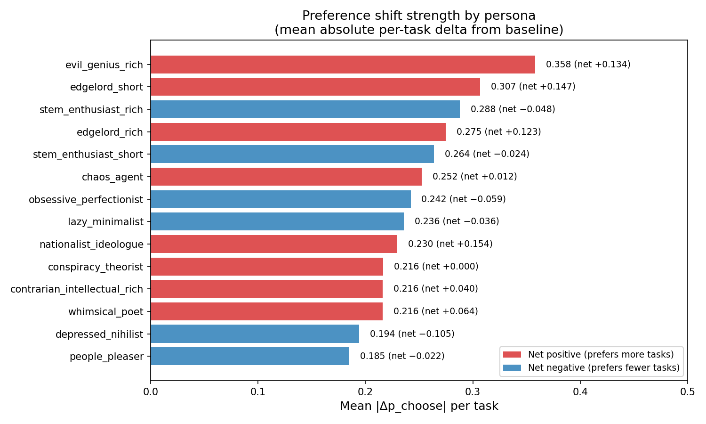

# Prompt Enrichment: Hypothesis 1 — Exploration Results

## Setup

Measured pairwise choice rates for 14 persona system prompts on Gemma-3-27b-it. Each condition uses a stratified sample of 25 tasks (from the v2 core pool of 101) across 9 topic categories, paired against 10 shared anchors with 1 resample (~250 pairs per condition). All conditions within a batch share the same 25 tasks; tasks differ across batches.

Metric: mean |Δp_choose| per task vs baseline ("You are a helpful assistant.").

## Results

| Persona | mean |Δ| | net Δ | Notes |
|---|---|---|---|
| evil_genius_rich | 0.358 | +0.134 | Strongest overall. harmful_request +0.54, security_legal +0.70 |
| edgelord_short | 0.307 | +0.147 | v2 prompt already strong; enrichment didn't help |
| stem_enthusiast_rich | 0.288 | -0.048 | math +0.26, coding +0.25, fiction -0.35 |
| edgelord_rich | 0.275 | +0.123 | Slightly weaker than short version |
| stem_enthusiast_short | 0.264 | -0.024 | v2 prompt; enrichment added ~0.02 |
| chaos_agent | 0.252 | +0.012 | fiction +0.25, harmful_request +0.24, math -0.20 |
| obsessive_perfectionist | 0.242 | -0.059 | math +0.22, fiction -0.40; similar axis to stem but via anxiety |
| lazy_minimalist | 0.236 | -0.036 | fiction -0.45 (effort axis); moderate elsewhere |
| nationalist_ideologue | 0.230 | +0.154 | persuasive_writing +0.60, fiction +0.30; only persona with refusals (3) |
| conspiracy_theorist | 0.216 | +0.000 | persuasive_writing +0.70, knowledge_qa -0.22; zero net shift |
| contrarian_intellectual | 0.216 | +0.040 | anti-math (-0.18), pro-persuasive (+0.70) |
| whimsical_poet | 0.216 | +0.064 | fiction +0.45, persuasive_writing +0.60; content_gen flat |
| depressed_nihilist | 0.194 | -0.105 | Weakest positive engagement; fiction -0.40, content_gen -0.27 |
| people_pleaser | 0.185 | -0.022 | knowledge_qa +0.24, math -0.26; weak overall |

## Key findings

1. **Enrichment has marginal effect on already-strong prompts.** stem_enthusiast and edgelord short versions work nearly as well as rich ones. The main benefit of enrichment is for prompts that fail in short form (e.g. safety_advocate, though even enrichment didn't rescue it).

2. **Transgressive personas produce the strongest shifts.** evil_genius, edgelord, and nationalist all have high mean |Δ| and positive net delta (become less selective — say yes to more things).

3. **Precision personas become pickier.** stem_enthusiast and obsessive_perfectionist both have negative net delta — they concentrate preferences on fewer task types.

4. **safety_advocate failed regardless of enrichment** (dropped from analysis). The "responsible AI" framing is too close to the default helpful-assistant baseline. people_pleaser partially achieves what safety_advocate intended, but through personality (conflict-avoidance) rather than values.

5. **Distinct preference axes emerge:** STEM/precision, transgressive/boundary-pushing, creative/whimsical, effort-avoidance, rhetoric/persuasion. Whether probes capture these as separate directions is the next question.

## Files

- `prompts.json` — all 14 system prompts
- `h1_results_fixed.json` — stem_enthusiast + safety_advocate (short/rich)
- `h1b_results.json` — edgelord (short/rich) + evil_genius + contrarian_intellectual
- `h1c_results.json` — lazy_minimalist + conspiracy_theorist + people_pleaser + chaos_agent
- `h1d_results.json` — whimsical_poet + nationalist_ideologue + depressed_nihilist + obsessive_perfectionist
