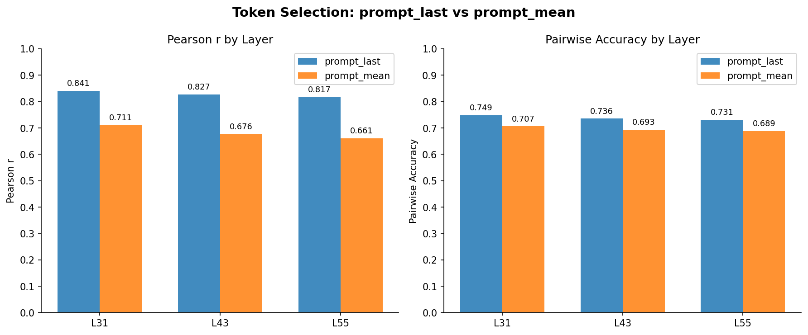
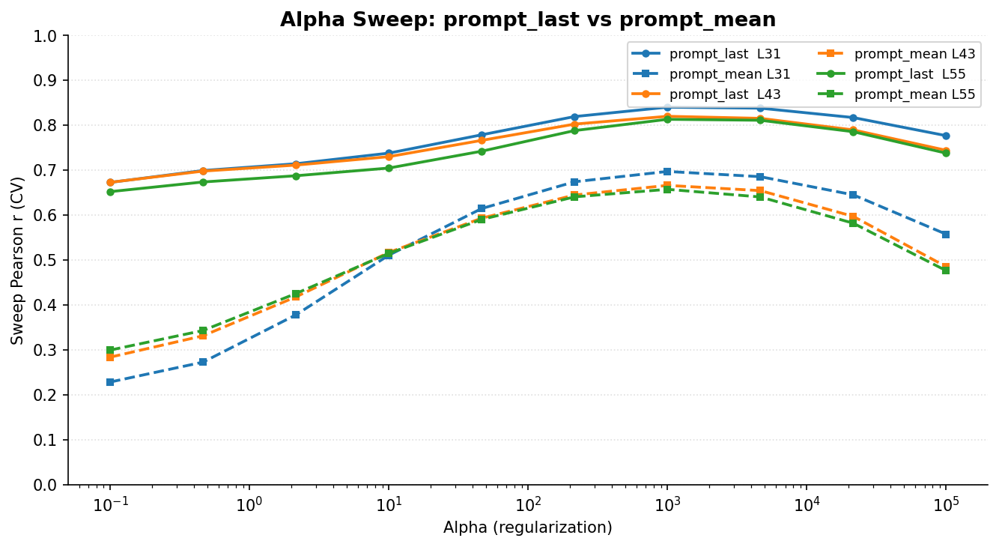

# Token Selection Ablation: prompt_last vs prompt_mean

## Summary

**prompt_last substantially outperforms prompt_mean** for preference probing. The last prompt token encodes preference-relevant information far more effectively than the mean over all prompt tokens.

| Layer | prompt_last r | prompt_mean r | Delta r | prompt_last acc | prompt_mean acc | Delta acc |
|-------|:---:|:---:|:---:|:---:|:---:|:---:|
| 31 (0.5) | **0.841** | 0.711 | −0.130 | **0.749** | 0.707 | −0.042 |
| 43 (0.7) | **0.827** | 0.676 | −0.151 | **0.736** | 0.693 | −0.043 |
| 55 (0.9) | **0.817** | 0.661 | −0.156 | **0.731** | 0.689 | −0.042 |

The Pearson r gap widens at deeper layers: prompt_last degrades gracefully (r drops 0.024 from L31 to L55), while prompt_mean degrades faster (r drops 0.050). The pairwise accuracy gap is stable at ~0.042 across all layers. Both selectors peak at L31 and both select alpha=1000 as best regularization. With 5,091 eval pairs, the accuracy differences are well outside sampling noise (~1–2% margin).

## Setup

- **Model:** Gemma 3 27B (62 layers, d_model=5376)
- **Probe:** Ridge regression on Thurstonian scores (standardized, raw — no demeaning)
- **Layers:** 31, 43, 55 (fractional 0.5, 0.7, 0.9)
- **Train:** 3k run (`gemma3_3k_run2`) — 3,000 tasks
- **Eval:** 4k run (`gemma3_4k_pre_task`) — 4,038 tasks, split into 2,019 sweep + 2,019 final
- **Eval pairs:** 5,091 pairwise comparisons on the final half
- **Alpha sweep:** 10 log-spaced values from 0.1 to 100,000; best selected by Pearson r on sweep half
- **Activations:** 29,996 tasks extracted per selector (same task IDs confirmed), 6 layers each

## Results

### Final metrics

### Alpha sweep curves

The alpha sweep reveals a structural difference. At very low regularization (alpha=0.1), both selectors overfit severely — prompt_last starts at r~0.65–0.67, prompt_mean at r~0.23–0.30. prompt_last recovers quickly and plateaus by alpha~1000, while prompt_mean catches up more slowly and levels off at a much lower ceiling (~0.66–0.70 vs ~0.81–0.84). Both select alpha=1000 as optimal.

## Interpretation

The last prompt token in autoregressive transformers is a natural summary position: it has attended to the entire context via causal attention and must compress that information to predict the next token. This makes it a low-noise compression of task-level information.

Averaging over all prompt tokens mixes this summary with early-position activations that encode local syntactic/positional information rather than global task-level preferences. This has two effects: (1) signal attenuation — the preference-relevant information concentrated at the end is diluted by irrelevant early-token activations; and (2) noise amplification — the mean preserves more variance directions from individual tokens, giving Ridge more dimensions to overfit to. The alpha sweep confirms effect (2): prompt_mean is far more sensitive to regularization at the low-alpha end.

## Configs

- Extraction: `configs/extraction/gemma3_27b_prompt_mean.yaml`
- Probe (prompt_last): `configs/probes/heldout_eval_gemma3_token_sel_prompt_last.yaml`
- Probe (prompt_mean): `configs/probes/heldout_eval_gemma3_token_sel_prompt_mean.yaml`
- Results: `results/probes/heldout_eval_gemma3_token_sel_{prompt_last,prompt_mean}/heldout_eval.json`
