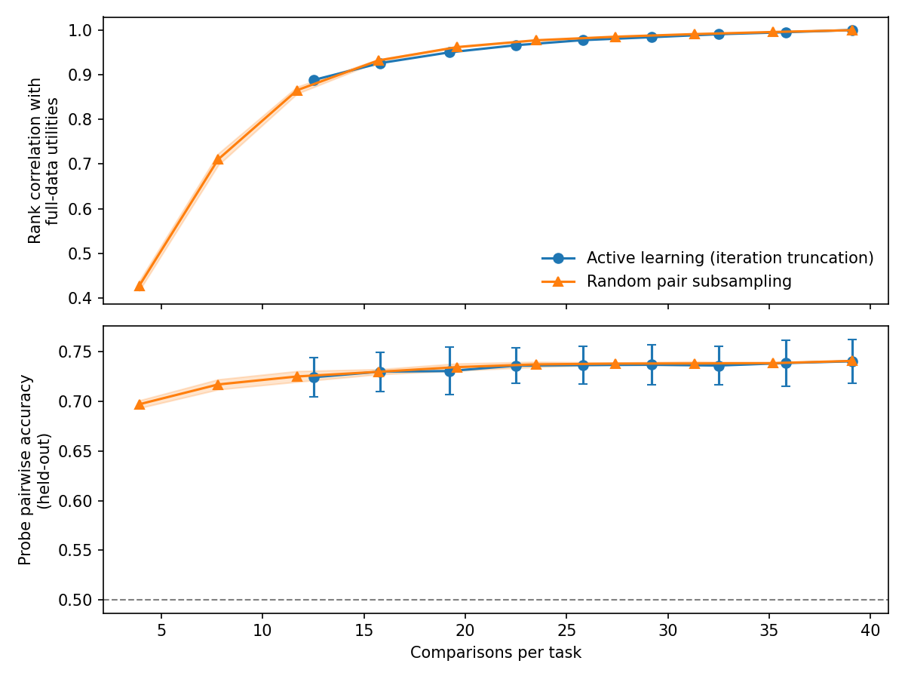

# Active Learning Calibration — Report

## Background

We have a 3K-task preference measurement run (117K pairwise comparisons across 9 active learning iterations). Each iteration fits a Thurstonian utility model, selects the most informative pairs to compare next, and collects new measurements. We subsampled this data to determine how many comparisons per task the upcoming 10K run needs.

Two metrics track quality at each budget level:

- **Utility rank correlation**: Spearman correlation between subsampled Thurstonian utilities and full-data utilities (all 9 iterations, 39 comparisons/task). Measures how well the preference ranking has converged.
- **Held-out probe pairwise accuracy**: A Ridge probe trained on Thurstonian scores predicts which of two held-out tasks the model prefers (5-fold task-level CV). Chance is 50%. This is the downstream metric we care about.

## Key Findings

1. **Probe pairwise accuracy plateaus early.** 72.4% at 12.5 comparisons/task, 74.0% at 39 comparisons/task (chance = 50%). The ceiling is the probe's representational capacity, not label quality.

2. **Utility stability requires more data but converges by ~20 comparisons/task.** Rank correlation reaches 0.95 at 19 comparisons/task and 0.99 at 33 comparisons/task.

3. **Active learning improves utility estimation but not probe accuracy.** At ~13 comparisons/task, active learning achieves rank correlation 0.89 vs 0.86 for random sampling. Probe pairwise accuracy is indistinguishable between the two.

4. **Recommendation for 10K run: 15-20 comparisons per task, 5 iterations.** Rank correlation >0.95, >95% of the probe accuracy ceiling. ~150K-200K comparisons total.

## Analysis 1: Iteration Truncation

Thurstonian utilities refit using only the first N iterations. Probe trained on the truncated utilities; pairwise accuracy evaluated on full pairwise data.

| Iterations | Comparisons per task | Rank correlation | Probe pairwise accuracy | Probe cross-validated R² |
|------|-----------|-----------|-------------|-------|
| 1 | 12.5 | 0.888 | 0.724 ± 0.020 | 0.640 |
| 2 | 15.8 | 0.926 | 0.730 ± 0.020 | 0.707 |
| 3 | 19.2 | 0.950 | 0.730 ± 0.024 | 0.753 |
| 4 | 22.5 | 0.966 | 0.736 ± 0.018 | 0.788 |
| 5 | 25.8 | 0.977 | 0.736 ± 0.019 | 0.807 |
| 6 | 29.2 | 0.984 | 0.737 ± 0.020 | 0.826 |
| 7 | 32.5 | 0.991 | 0.736 ± 0.019 | 0.844 |
| 8 | 35.8 | 0.995 | 0.738 ± 0.023 | 0.857 |
| 9 | 39.1 | 1.000 | 0.740 ± 0.022 | 0.864 |

Cross-validated R² keeps climbing because the Thurstonian labels themselves improve with more data, and the probe fits them better. But pairwise accuracy -- what the probe actually predicts about choice behavior -- plateaus after iteration 2.

The top panel shows rank correlation climbing steeply through iteration 3, then flattening. The bottom panel shows pairwise accuracy (blue) is essentially flat from iteration 1 onward, while cross-validated R² (orange) continues to rise -- confirming that better labels improve probe fit but not downstream prediction.

## Analysis 2: Random Pair Subsampling

Randomly subsample fractions of the 23,500 unique pairs (keeping all 5 measurements per selected pair), refit Thurstonian, train probe. Mean ± std over 5 random seeds.

| Fraction | Unique pairs | Comparisons per task | Rank correlation | Probe pairwise accuracy |
|----------|-------|-----------|-----------|-------------|
| 0.1 | 2,350 | 3.9 | 0.427 ± 0.011 | 0.697 ± 0.004 |
| 0.2 | 4,700 | 7.8 | 0.710 ± 0.014 | 0.717 ± 0.005 |
| 0.3 | 7,050 | 11.8 | 0.865 ± 0.008 | 0.725 ± 0.005 |
| 0.4 | 9,400 | 15.7 | 0.932 ± 0.002 | 0.730 ± 0.002 |
| 0.5 | 11,750 | 19.6 | 0.962 ± 0.001 | 0.735 ± 0.004 |
| 0.6 | 14,100 | 23.5 | 0.977 ± 0.001 | 0.737 ± 0.003 |
| 0.7 | 16,450 | 27.4 | 0.985 ± 0.001 | 0.738 ± 0.001 |
| 0.8 | 18,800 | 31.3 | 0.991 ± 0.000 | 0.738 ± 0.002 |
| 0.9 | 21,150 | 35.3 | 0.996 ± 0.000 | 0.738 ± 0.001 |
| 1.0 | 23,500 | 39.1 | 1.000 | 0.741 |

Same pattern as the iteration analysis. Rank correlation (top) follows a steep sigmoid with a knee around 15-20 comparisons/task. Probe pairwise accuracy (bottom) rises gently from 70% to 74%, with most of the gain in the first 10 comparisons/task. Shaded bands show tight standard errors across seeds.

## Active Learning vs Random Sampling

The comparison plot overlays active learning (blue, from Analysis 1) and random sampling (orange, from Analysis 2) on a shared comparisons-per-task axis. Top panel: active learning achieves slightly higher rank correlation at low budgets (the blue curve leads the orange one below 20 comparisons/task). Bottom panel: pairwise accuracy curves are indistinguishable -- they overlap completely within error bars.

- **Active learning buys better utility estimates, not better probes.** At 13 comparisons/task, rank correlation is 0.89 (active) vs 0.86 (random), but pairwise accuracy is ~72.5% for both.
- **The ~74% pairwise accuracy ceiling is a probe limitation, not a label quality issue.** Beyond rank correlation ~0.93 (random sampling at ~16 comparisons/task), better Thurstonian fits yield no downstream improvement.
- **Implication for the 10K run:** active learning is still worth using for utility estimation quality, but there is no need to chase high comparison budgets for probe accuracy.

## Analysis 3: p/q Threshold Sensitivity

Skipped per spec fallback. The active learning pair selection function enumerates all unsampled pairs (up to 4.5M for 3,000 tasks), making simulation infeasible. The default thresholds (p=0.3, q=0.3) were sufficient for convergence in the 3K run, and the main finding -- probe accuracy is insensitive to utility quality -- makes threshold tuning low-priority.

## Recommendation for 10K Run

| Parameter | Value | Rationale |
|-----------|-------|-----------|
| Initial degree | 5 | Matches 3K run; gives ~25K initial pairs for 10K tasks |
| Pairs per iteration | 2,000 | Matches 3K run |
| Samples per pair | 3 | Reduced from 5: probe accuracy is insensitive to utility precision, so fewer repeated measurements per pair is acceptable |
| Max iterations | 5 | Rank correlation reaches 0.95 by iteration 3, 0.98 by iteration 5 |
| Convergence threshold | 0.99 | Same as 3K run |
| p threshold | 0.3 | Default; sufficient for 3K run convergence |
| q threshold | 0.3 | Default; sufficient for 3K run convergence |

**Estimated budget**: 25K initial pairs + 4 iterations of 2K pairs = 33K unique pairs. At 3 samples per pair: ~99K comparisons (vs 117K for the 3K run with 5 samples per pair).

**Caveat**: The 10K run has 3.3x more tasks with the same number of active learning pairs per iteration, so each task will have fewer comparisons on average. The initial d-regular phase (degree 5) alone gives 5 comparisons per task, which produces rank correlation ~0.89 in the 3K data. If the 10K task pool has similar preference structure, this should transfer. The `n_samples` reduction from 5 to 3 was not directly tested -- it is inferred from the insensitivity of probe accuracy to utility precision, but utility stability at 3 samples/pair may be lower than the curves here suggest.

## Method

- All analyses use layer 31 activations (highest historical cross-validated R²).
- Ridge probe with StandardScaler, 5-fold task-level CV, 10-point alpha sweep.
- Held-out pairwise accuracy: for each CV fold, evaluate on pairs where both tasks are in the held-out fold, using all available measurements.
- "Full-data utilities" = Thurstonian fit on the complete 3K run (23,500 pairs, 117K comparisons, 9 iterations).
- Iteration boundaries reconstructed from measurement order: iteration 1 = 7,500 pairs x 5 samples; subsequent iterations = 2,000 pairs x 5 samples each.
