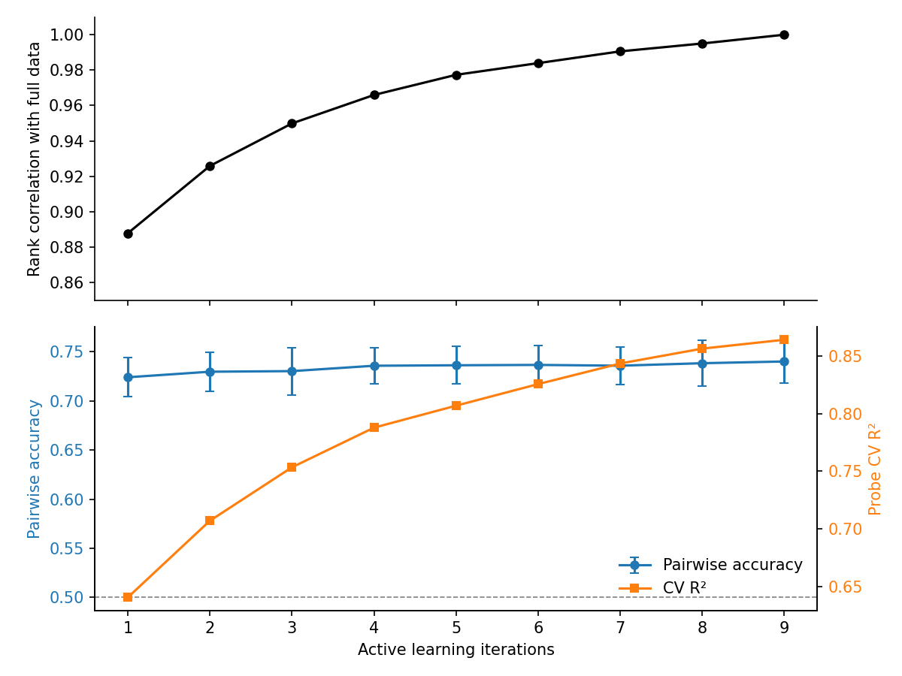
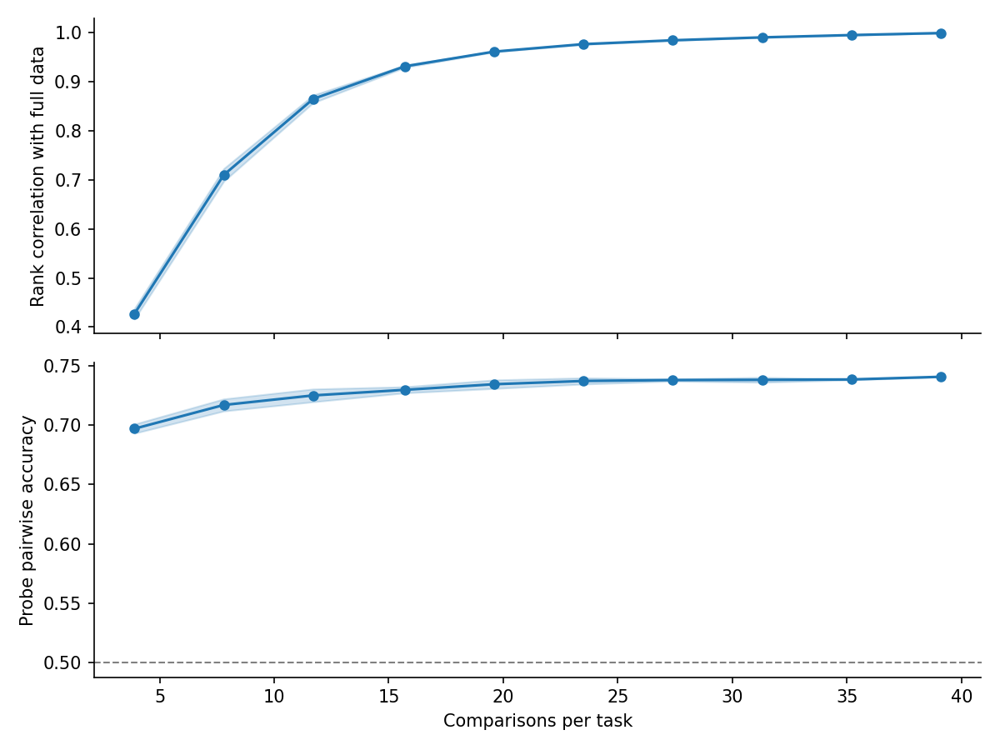

# Active Learning Calibration — Report

## Background

We have a 3K-task preference measurement run (117K pairwise comparisons across 9 active learning iterations). Each iteration fits a Thurstonian utility model, selects the most informative pairs to compare next, and collects new measurements. We subsampled this data to determine how many comparisons per task the upcoming 10K run needs.

Two metrics track quality at each budget level:

- **Utility rank correlation**: Spearman correlation between subsampled Thurstonian utilities and full-data utilities (all 9 iterations, 39 comparisons/task). Measures how well the preference ranking has converged.
- **Held-out probe pairwise accuracy**: A Ridge probe trained on Thurstonian scores predicts which of two held-out tasks the model prefers (5-fold task-level CV). Chance is 50%. This is the downstream metric we care about.

## Key Findings

1. **Probe pairwise accuracy shows strong diminishing returns.** 72.4% at 12.5 comparisons/task, 74.0% at 39 comparisons/task (chance = 50%). Tripling the comparison budget buys <2pp. Meanwhile, probe CV R² goes from 0.64 to 0.86 over the same range — the probe gets much better at fitting the utility *magnitudes*, but this doesn't translate to better *ordinal* predictions on held-out pairs.

2. **Utility stability requires more data but converges by ~20 comparisons/task.** Rank correlation reaches 0.95 at 19 comparisons/task and 0.99 at 33 comparisons/task.

3. **Subsampling pairs vs truncating iterations gives similar probe accuracy at matched budgets.** Both analyses converge to the same pairwise accuracy ceiling despite different subsampling strategies.

4. **Reducing samples per pair from 5 to 3 is safe.** 89% of pairs are unanimous (5-0). Even k=1 sample per pair gives 0.995 rank correlation with full-data utilities; k=3 gives 0.998.

5. **Recommendation for 10K run: 15-20 comparisons per task, 5 iterations, 3 samples per pair.** Rank correlation >0.95, >95% of the probe accuracy ceiling. ~99K comparisons total.

## Analysis 1: Iteration Truncation

Thurstonian utilities refit using only the first N iterations. Probe trained on the truncated utilities; pairwise accuracy evaluated on full pairwise data.

| Iterations | Comparisons per task | Rank correlation | Probe pairwise accuracy | Probe cross-validated R² |
|------|-----------|-----------|-------------|-------|
| 1 | 12.5 | 0.888 | 0.724 ± 0.020 | 0.640 |
| 2 | 15.8 | 0.926 | 0.730 ± 0.020 | 0.707 |
| 3 | 19.2 | 0.950 | 0.730 ± 0.024 | 0.753 |
| 4 | 22.5 | 0.966 | 0.736 ± 0.018 | 0.788 |
| 5 | 25.8 | 0.977 | 0.736 ± 0.019 | 0.807 |
| 6 | 29.2 | 0.984 | 0.737 ± 0.020 | 0.826 |
| 7 | 32.5 | 0.991 | 0.736 ± 0.019 | 0.844 |
| 8 | 35.8 | 0.995 | 0.738 ± 0.023 | 0.857 |
| 9 | 39.1 | 1.000 | 0.740 ± 0.022 | 0.864 |

Probe CV R² keeps climbing (0.64 → 0.86) — the probe gets much better at predicting the Thurstonian scores as they improve with more data. But pairwise accuracy — which only cares about the sign of score differences, not magnitudes — shows strong diminishing returns after iteration 2. The R² gains likely reflect better fitting of utility magnitudes that don't change which task the probe ranks higher.

The top panel shows rank correlation climbing steeply through iteration 3, then flattening. The bottom panel shows pairwise accuracy (blue) with strong diminishing returns from iteration 1 onward, while CV R² (orange) continues to rise — the probe fits the improving labels better, but this cardinal improvement doesn't translate to ordinal prediction gains.

## Analysis 2: Pair Subsampling

Subsample fractions of the 23,500 unique pairs (keeping all 5 measurements per selected pair), refit Thurstonian, train probe. Mean ± std over 5 random seeds.

**Important caveat**: These 23,500 pairs were generated by the active learning algorithm, which biases toward uncertain (close-utility) pairs and balances task degrees. Subsampling from this pool is *not* equivalent to random pair selection from the full C(3000,2) space. The rank correlation numbers here are likely optimistic relative to truly random pair selection, since active-learning-selected pairs carry more information per comparison.

| Fraction | Unique pairs | Comparisons per task | Rank correlation | Probe pairwise accuracy |
|----------|-------|-----------|-----------|-------------|
| 0.1 | 2,350 | 3.9 | 0.427 ± 0.011 | 0.697 ± 0.004 |
| 0.2 | 4,700 | 7.8 | 0.710 ± 0.014 | 0.717 ± 0.005 |
| 0.3 | 7,050 | 11.8 | 0.865 ± 0.008 | 0.725 ± 0.005 |
| 0.4 | 9,400 | 15.7 | 0.932 ± 0.002 | 0.730 ± 0.002 |
| 0.5 | 11,750 | 19.6 | 0.962 ± 0.001 | 0.735 ± 0.004 |
| 0.6 | 14,100 | 23.5 | 0.977 ± 0.001 | 0.737 ± 0.003 |
| 0.7 | 16,450 | 27.4 | 0.985 ± 0.001 | 0.738 ± 0.001 |
| 0.8 | 18,800 | 31.3 | 0.991 ± 0.000 | 0.738 ± 0.002 |
| 0.9 | 21,150 | 35.3 | 0.996 ± 0.000 | 0.738 ± 0.001 |
| 1.0 | 23,500 | 39.1 | 1.000 | 0.741 |

Same pattern as the iteration analysis. Rank correlation (top) follows a steep sigmoid with a knee around 15-20 comparisons/task. Probe pairwise accuracy (bottom) rises gently from 70% to 74%, with most of the gain in the first 10 comparisons/task. Shaded bands show tight standard errors across seeds. Note that because the pair pool is active-learning-biased, the rank correlation curve here is likely optimistic relative to what truly random pair selection would achieve.

## Analysis 3: p/q Threshold Sensitivity

Skipped per spec fallback. The active learning pair selection function enumerates all unsampled pairs (up to 4.5M for 3,000 tasks), making simulation infeasible. The default thresholds (p=0.3, q=0.3) were sufficient for convergence in the 3K run.

## Analysis 4: Samples Per Pair

Each pair in the 3K run was measured 5 times. Can we reduce this?

**Per-pair win rate distribution** — most pairs are decisive:

| Win rate | Count | % of pairs |
|----------|-------|------------|
| 5-0 (unanimous) | 20,967 | 89.2% |
| 4-1 | 1,289 | 5.5% |
| 3-2 (close) | 1,228 | 5.2% |

89% of pairs give the same outcome all 5 times. Only 5.2% are close calls.

**Majority vote stability** — subsampling k of 5 measurements per pair, how often does the k-sample majority agree with the 5-sample majority? (100 random seeds, 23,440 pairs with exactly 5 samples.)

| Samples (k) | Agreement with k=5 majority |
|-------------|----------------------------|
| 1 | 96.8% ± 0.1% |
| 2 | 96.8% ± 0.1% |
| 3 | 98.4% ± 0.1% |

The ~3% disagreement ceiling at k=1 comes from the 5.2% of close (3-2) pairs where even the 5-sample majority is noisy.

**Thurstonian rank stability** — refit Thurstonian utilities using k samples per pair instead of 5, measure rank correlation with full-data utilities (10 random seeds):

| Samples (k) | Rank correlation with full-data |
|-------------|-------------------------------|
| 1 | 0.9949 ± 0.0001 |
| 2 | 0.9974 ± 0.0001 |
| 3 | 0.9984 ± 0.0001 |
| 5 | 0.9995 |

Even k=1 gives 0.995 rank correlation. Going from 1→5 samples buys 0.005 — the 89% of unanimous pairs are fully determined by a single sample.

**Caveat**: This analysis uses the 3K run's active-learning-selected pairs, which are biased toward uncertain pairs. In a new 10K run with different tasks, the fraction of close pairs could be higher if the task pool has more similarly-preferred items.

## Recommendation for 10K Run

| Parameter | Value | Rationale |
|-----------|-------|-----------|
| Initial degree | 5 | Matches 3K run; gives ~25K initial pairs for 10K tasks |
| Pairs per iteration | 2,000 | Matches 3K run |
| Samples per pair | 3 | Reduced from 5: 89% of pairs are unanimous at k=5, k=3 gives 0.998 rank correlation with full-data utilities (Analysis 4) |
| Max iterations | 5 | Rank correlation reaches 0.95 by iteration 3, 0.98 by iteration 5 |
| Convergence threshold | 0.99 | Same as 3K run |
| p threshold | 0.3 | Default; sufficient for 3K run convergence |
| q threshold | 0.3 | Default; sufficient for 3K run convergence |

**Estimated budget**: 25K initial pairs + 4 iterations of 2K pairs = 33K unique pairs. At 3 samples per pair: ~99K comparisons (vs 117K for the 3K run with 5 samples per pair).

**Caveat**: The 10K run has 3.3x more tasks with the same number of active learning pairs per iteration, so each task will have fewer comparisons on average. The initial d-regular phase (degree 5) alone gives 5 comparisons per task, which produces rank correlation ~0.89 in the 3K data. If the 10K task pool has similar preference structure, this should transfer.

## Method

- All analyses use layer 31 activations (highest historical cross-validated R²).
- Ridge probe with StandardScaler, 5-fold task-level CV, 10-point alpha sweep.
- Held-out pairwise accuracy: for each CV fold, evaluate on pairs where both tasks are in the held-out fold, using all available measurements.
- "Full-data utilities" = Thurstonian fit on the complete 3K run (23,500 pairs, 117K comparisons, 9 iterations).
- Iteration boundaries reconstructed from measurement order: iteration 1 = 7,500 pairs x 5 samples; subsequent iterations = 2,000 pairs x 5 samples each.
