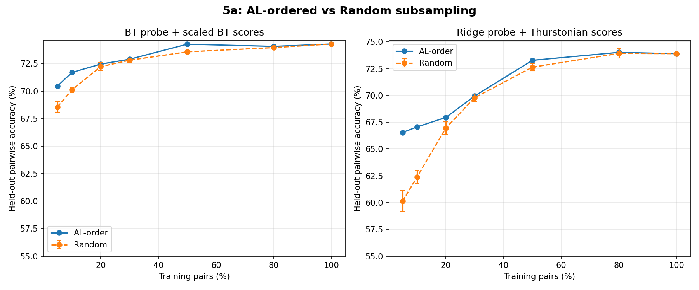
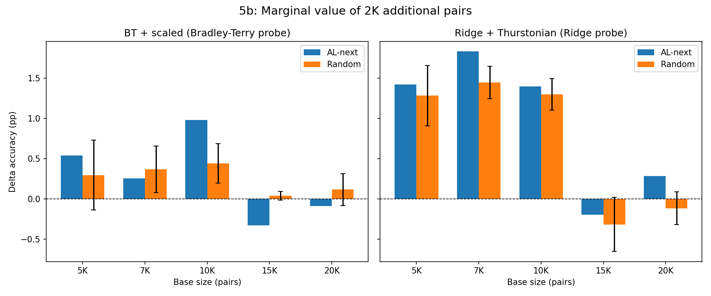

# Experiment 5: Random vs AL Pair Selection — Is It Only at the Margin?

## Summary

Thurstonian AL provides real value early — the d-regular initialization gives **+1.9pp BT / +6.4pp Ridge over random** at 5% of data — but the advantage largely closes by 30% of data. At the margin (15K+ base pairs), adding 2K AL-selected pairs is neutral-to-negative, while random pairs are similarly neutral. This explains Experiment 4's finding (random > BT-AL) without indicting the original AL strategy: AL was valuable when the probe was data-starved, but marginal AL pairs become counterproductive once the probe is well-trained.

## Setup

Same as Experiments 1–4: Gemma-3-27B layer 31 activations, 3,000 tasks, 23,500 unique pairs, 117K measurements over 9 AL iterations. BT+StandardScaler (λ=0.193) and Ridge+Thurstonian (α=1374). 5-fold task-level CV, seed=42.

**Iteration reconstruction:** Pairs assigned to iterations by first-measurement index in the measurements JSON. Iteration 0: 7,500 pairs (d-regular, degree 5); iterations 1–8: 2,000 pairs each. Boundaries verified by clear gaps in measurement indices between iterations.

## Experiment 5a: AL-ordered vs Random Subsampling

For each fraction f, compare taking the first f × 23,500 pairs in AL order vs a random subsample of the same size. Random condition: 3 seeds.

| Fraction | N pairs | AL BT | Rand BT | Δ BT | AL Ridge | Rand Ridge | Δ Ridge |
|----------|---------|-------|---------|------|----------|------------|---------|
| 0.05 | 1,175 | **70.5%** | 68.6% | +1.9 | **66.6%** | 60.1% | +6.4 |
| 0.10 | 2,350 | **71.7%** | 70.1% | +1.6 | **67.1%** | 62.4% | +4.7 |
| 0.20 | 4,700 | **72.5%** | 72.2% | +0.2 | **67.9%** | 67.0% | +1.0 |
| 0.30 | 7,050 | 72.9% | 72.8% | +0.1 | 70.0% | 69.8% | +0.2 |
| 0.50 | 11,750 | **74.3%** | 73.6% | +0.7 | **73.3%** | 72.6% | +0.6 |
| 0.80 | 18,800 | 74.1% | 74.0% | +0.1 | 74.0% | 73.9% | +0.1 |
| 1.00 | 23,500 | 74.3% | 74.3% | 0.0 | 73.9% | 73.9% | 0.0 |



**Key patterns:**

- **AL helps early, especially Ridge.** At 5%, the d-regular initialization gives Ridge a massive 6.4pp advantage — random subsamples at this size have poor task coverage, producing noisy Thurstonian estimates. BT is more robust (only 1.9pp gap) since it doesn't need per-task score estimates.
- **The gap largely closes by 30%.** By 7,050 pairs, both conditions are within 0.2pp for both probes. There's a non-monotonic blip at 50% where the gap reopens to +0.7pp BT / +0.6pp Ridge — possibly due to which specific AL iterations fall near that boundary — but at 80% the gap is back to ~0.1pp.
- **No crossing.** Random never surpasses AL-order, unlike what we might expect from Experiment 4. This is because 5a includes the d-regular initialization in the AL-order condition — the AL advantage comes from the structured init, not from later uncertainty-selected batches.

## Experiment 5b: Marginal Value at Different Base Sizes

Take the first K pairs (AL-ordered) as base, add 2,000 pairs from either the next AL batch or random remaining pairs. 3 random seeds for random condition.

| Base K | Base BT | +AL BT | +Rand BT | ΔAL | ΔRand | Base Ridge | +AL Ridge | +Rand Ridge | ΔAL | ΔRand |
|--------|---------|--------|----------|-----|-------|------------|-----------|-------------|-----|-------|
| 5,000 | 72.4% | 73.0% | 72.7% | +0.5 | +0.3 | 68.5% | 69.9% | 69.8% | +1.4 | +1.3 |
| 7,500 | 73.1% | 73.4% | 73.5% | +0.3 | +0.4 | 70.1% | 71.9% | 71.5% | +1.8 | +1.5 |
| 10,000 | 73.4% | **74.4%** | 73.8% | +1.0 | +0.4 | 71.8% | 73.2% | 73.1% | +1.4 | +1.3 |
| 15,000 | 74.0% | 73.7% | 74.0% | **-0.3** | +0.0 | 73.8% | 73.6% | 73.5% | -0.2 | -0.3 |
| 20,000 | 73.9% | 73.8% | 74.0% | -0.1 | +0.1 | 74.1% | 74.3% | 73.9% | +0.3 | -0.1 |



**Key patterns:**

- **AL and random provide similar marginal value at small bases** (K=5,000–7,500). Both add ~0.3–0.5pp BT and ~1.3–1.8pp Ridge. The Thurstonian AL strategy used in the original data collection is comparable to random here.
- **AL has a brief advantage at K=10,000.** AL-next adds 1.0pp BT vs 0.4pp for random — the largest gap in the experiment. This may be the "sweet spot" where the probe is accurate enough that targeted pairs help but not so accurate that marginal pairs are pure noise.
- **At K=15,000+, both are marginal/counterproductive.** AL-next hurts BT by 0.3pp at K=15,000, matching Experiment 4's finding. Random is roughly neutral. The probe is saturating — more data doesn't help much regardless of selection strategy.
- **Diminishing returns dominate.** The probe goes from 72.4% at 5K pairs to 74.3% at 23.5K — only 1.9pp over 18.5K additional pairs. Most of the useful signal is in the first ~10K pairs.

## Limitations

- **No cross-seed variance for AL-order.** The AL-order condition is deterministic, so all 3 "seeds" produce identical results. Reported deltas have uncertainty only from the random condition's cross-seed variance. Cross-fold standard deviations are not reported (consistent with prior experiments in this series).
- **Simulation, not live experiment.** Both 5a and 5b subsample from the 23.5K pairs that were actually measured. Random pairs in 5b are drawn from the measured pool (later AL iterations), not from the full universe of unmeasured pairs. This is an inherent limitation of the retrospective design — we can only simulate selection from pairs we have measurements for.
- **AL-order condition includes all data collection design choices.** The "AL" condition bundles the d-regular initialization with Thurstonian uncertainty selection. Conclusion 2 disentangles these, but the experiment doesn't test d-regular init vs random init directly.

## Conclusions

1. **The original Thurstonian AL strategy was valuable early.** The d-regular initialization provides structured task coverage that significantly outperforms random sampling, especially for Ridge (+6.4pp at 5% of data). This validates the original data collection design.

2. **The AL advantage comes from the initialization, not from uncertainty selection.** By 30% of data (~7,050 pairs, roughly the d-regular init size), random catches up completely. The subsequent uncertainty-selected batches add similar marginal value to random.

3. **Experiment 4's result is explained by saturation, not a flaw in AL.** After 23.5K pairs, the probe is near its ceiling — adding 2K more pairs (by any method) barely helps. BT uncertainty selection is slightly worse because it targets the noisiest pairs, but random is barely positive either.

4. **Practical implication:** For preference probe training, invest in a good initialization (d-regular or similar structured coverage) and collect ~10–15K pairs. Beyond that, diminishing returns dominate regardless of selection strategy.

## Reproduction

```bash
python scripts/bt_scaling/experiment5_random_vs_al.py
```

Results saved in `experiments/probe_science/bt_scaling/experiment5_results.json`.
