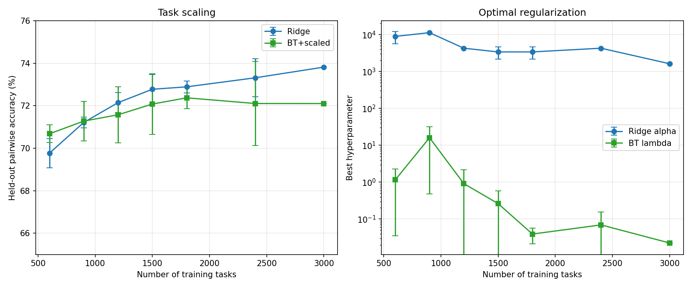

# Experiment 6: Task Scaling — Does More Tasks Help?

## Summary

**Yes — the probe is task-starved.** Ridge accuracy climbs steadily from 69.8% at 600 tasks to 73.8% at 3,000 tasks with no sign of plateauing. With 5,376 features and only 3,000 tasks, we're in a heavily overparameterized regime. The Experiment 3/5 scaling curves (which varied pairs, not tasks) showed a plateau because more pairs only improve Thurstonian score quality — the number of regression training points was always fixed at ~2,400. More tasks directly adds training points for Ridge, which is where the bottleneck is.

Separately, properly sweeping regularization at each data size confirms the fixed-HP concern: optimal Ridge alpha drops from ~9,000–11,000 at 600 tasks to ~1,600 at 3,000 tasks.

## Setup

Same data as Experiments 1–5: Gemma-3-27B layer 31 activations (5,376 features), 3,000 tasks, 23,500 unique pairs, 117K measurements.

For each task fraction: sample N tasks, keep all measurements between them, fit Thurstonian + Ridge and BT+scaled. **Evaluate on all remaining tasks** (not CV within the subsample). At fraction 1.0: 5-fold CV since no held-out tasks remain.

**Regularization swept at every fraction:** Ridge alpha via 3-fold CV on R², BT lambda via 80/20 pair split on validation accuracy.

3 random seeds per fraction.

## Results

| Fraction | N tasks | N train pairs | Ridge | BT+scaled | Best α | Best λ |
|----------|---------|---------------|-------|-----------|--------|--------|
| 0.2 | 600 | ~955 | 69.8 ± 0.7% | 70.7 ± 0.4% | 8,953 | 1.15 |
| 0.3 | 900 | ~2,090 | 71.2 ± 0.3% | 71.3 ± 0.9% | 11,288 | 16.0 |
| 0.4 | 1,200 | ~3,760 | 72.2 ± 0.5% | 71.6 ± 1.3% | 4,281 | 0.91 |
| 0.5 | 1,500 | ~5,870 | 72.8 ± 0.7% | 72.1 ± 1.4% | 3,395 | 0.26 |
| 0.6 | 1,800 | ~8,500 | 72.9 ± 0.3% | 72.4 ± 0.5% | 3,395 | 0.04 |
| 0.8 | 2,400 | ~15,030 | 73.3 ± 0.9% | 72.1 ± 2.0% | 4,281 | 0.07 |
| 1.0 | 3,000 | ~15,020/fold | 73.8 ± 0.9% | 72.1 ± 1.9% | 1,624 | 0.02 |



## Key findings

- **Ridge scales clearly with tasks.** +4.0pp from 600→3,000 tasks, with the curve still climbing. At 3,000 tasks with 5,376 features, we're still in an overparameterized regime (tasks/features = 0.56). This suggests collecting preferences on more tasks would directly improve probe accuracy.

- **The pair-scaling plateau (Experiments 3/5) was about Thurstonian convergence, not probe saturation.** More pairs refine the same ~2,400 Thurstonian scores. More tasks adds new training points. The bottleneck was always on the task axis.

- **Optimal alpha decreases with more tasks** — from ~9,000–11,000 at 600 tasks to ~1,600 at 3,000. This confirms the fixed-HP concern in Experiments 3/5: using α=1,374 everywhere underestimated small-data performance and may have caused the apparent pair-scaling plateau.

- **BT results are noisy.** BT lambda jumps from 0.001 to 37 across seeds/fractions. The 80/20 pair-split validation is too unstable for reliable HP selection, especially at low pair counts. BT accuracy plateaus around 72% and actually shows higher variance at larger fractions. A more robust sweep method (e.g., k-fold over pairs) would be needed to get reliable BT scaling curves.

## Limitations

- **Cannot extrapolate beyond 3,000 tasks** — we only have measurements for 3,000 tasks. The curve suggests more tasks would help but we can't test this without new data.
- **BT sweep instability** — the 80/20 pair split for BT lambda selection produces high variance, making BT results less reliable than Ridge. The BT scaling curve should not be interpreted as evidence that BT doesn't benefit from more tasks.
- **Pairs and tasks are confounded at small fractions** — at 600 tasks we only have ~955 pairs between them, so the BT probe is also pair-starved. The Ridge probe compensates by using Thurstonian scores (which aggregate all measurements per task), but BT sees only the raw pair data.

## Reproduction

```bash
python scripts/bt_scaling/experiment6_task_scaling.py
```

Results saved in `experiments/probe_science/bt_scaling/experiment6_results.json`.
