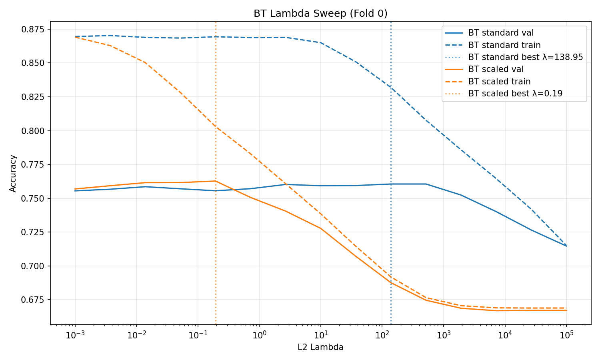
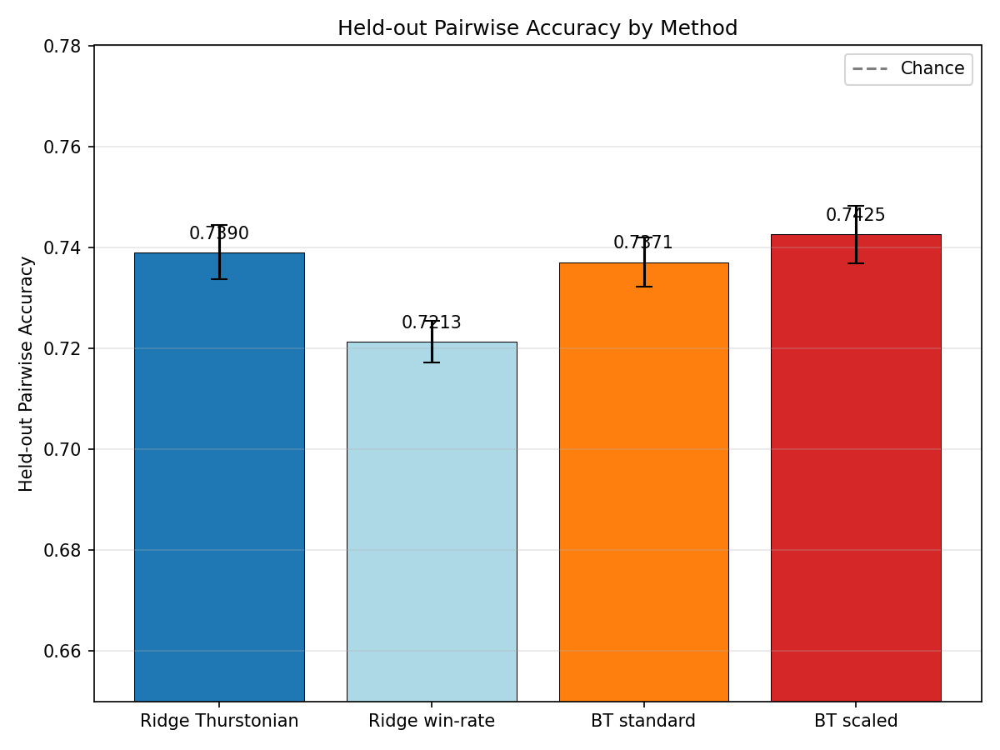
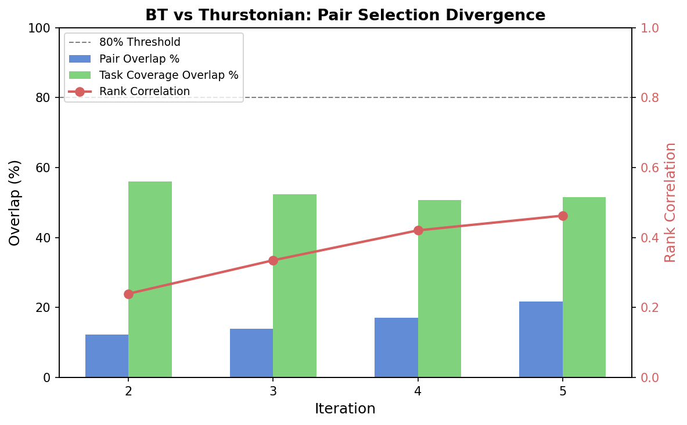
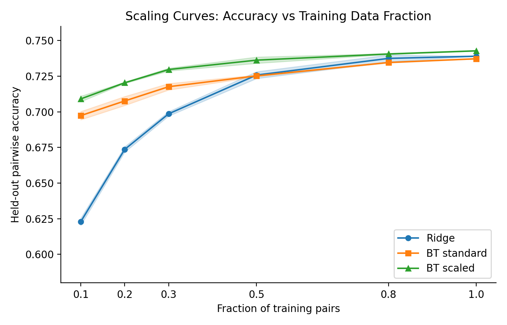

# Bradley-Terry vs Ridge Probes: Regularization, Pair Selection, and Scaling

## Summary

The previously reported 3pp Ridge advantage over Bradley-Terry (BT) was a **preprocessing artifact**. Ridge standardizes activations internally; BT was run on raw activations with a poorly tuned regularization strength. After adding StandardScaler to BT and sweeping its L2 penalty properly, BT matches Ridge at full data (74.2% vs 73.9% held-out pairwise accuracy, within error bars). BT's real advantage is in the low-data regime: at 10% of training pairs, BT leads Ridge by **8.6pp** (70.9% vs 62.3%), because BT fits pairwise comparisons directly while Ridge requires a noisy intermediate step. A pair selection oracle confirms BT would choose very different pairs than the current active learning strategy (12--22% overlap), motivating a live BT active learning experiment.

## Background

We train linear probes to predict pairwise preferences from model activations. Two approaches:

| Method | Training pipeline |
|--------|------------------|
| **Ridge** | Aggregate pairwise votes into a per-task Thurstonian score (a denoised utility estimate), then regress activations onto scores with Ridge regression. Predict pairs by comparing predicted scores. |
| **Bradley-Terry (BT)** | Fit a logistic model directly on pairwise comparisons: P(A > B) = sigma(w . (act_A - act_B)), with L2 penalty on w. No intermediate aggregation. |

Ridge requires enough comparisons per task to get stable Thurstonian scores. BT uses each comparison directly, so it should degrade more gracefully with sparse data.

## Setup

- **Model**: Gemma-3-27B, layer 31 activations at the last prompt token
- **Data**: 3,000 tasks, 23,500 unique pairs, 117K comparisons (5 repeats per pair), collected over 9 active learning iterations
- **Evaluation**: 5-fold CV over tasks. A test pair requires both tasks in the held-out fold (~900 pairs/fold). All numbers are mean +/- std across folds. Chance = 50%.
- **Hyperparameter selection**: Internal validation on fold 0, then fixed for folds 1--4

## Experiment 1: Regularization Audit

Swept regularization for four probe variants at full data:

| Variant | What it does | Held-out pairwise accuracy | Best hyperparameter |
|---------|-------------|---------------------------|-------------------|
| BT + StandardScaler | BT on z-scored activations | **74.2 +/- 1.1%** | L2 lambda = 0.19 |
| Ridge + Thurstonian scores | Standard Ridge pipeline | 73.9 +/- 1.1% | alpha = 1,374 |
| BT (raw activations) | BT without preprocessing | 73.7 +/- 1.0% | L2 lambda = 139 |
| Ridge + win-rates | Ridge on simple win fractions instead of Thurstonian scores | 72.1 +/- 0.8% | alpha = 9,237 |

The lambda sweep (Figure 1) shows train and validation accuracy as a function of BT's L2 penalty. BT with StandardScaler (orange) peaks at a much lower lambda (0.19) than BT on raw activations (blue, lambda = 139). The raw-activation BT needs heavy regularization to compensate for features with large magnitudes dominating the logistic predictor. With StandardScaler, all features contribute equally and less regularization is needed.





**Takeaways:**

- **StandardScaler closes the BT--Ridge gap.** BT on raw activations (73.7%) trails Ridge (73.9%); BT with StandardScaler (74.2%) matches or slightly leads it. The difference at the top is within error bars.
- **The original BT result (71.9%) used a fixed lambda=10.** Proper sweeping alone improves BT by 1.8pp (to 73.7%), and adding StandardScaler adds another 0.5pp.
- **Thurstonian scores are better regression targets than raw win-rates.** Ridge + win-rates (72.1%) underperforms Ridge + Thurstonian (73.9%) by 1.8pp, confirming the Thurstonian denoising step matters for Ridge.

## Experiment 2: Pair Selection Oracle

Would BT-guided active learning choose different pairs than the Thurstonian strategy that was actually used? To answer this without new API calls, we replayed active learning iterations 2--5:

1. Train a BT probe on all pairs available up to iteration N
2. Score every candidate pair by **BT uncertainty**: |w . (act_A - act_B)| -- pairs where the probe is least certain get the lowest score
3. Select the top 2,000 most uncertain pairs (the batch BT would request next)
4. Compare against the 2,000 pairs that Thurstonian active learning actually selected (based on closeness of Thurstonian score estimates)

Three metrics capture how much the two strategies diverge:

| Metric | Definition |
|--------|-----------|
| Pair overlap | Fraction of the 2,000 selected pairs that both methods chose |
| Rank correlation | Spearman correlation between BT uncertainty ranking and Thurstonian ambiguity ranking over all candidate pairs |
| Task coverage overlap | Fraction of tasks appearing in both methods' selected batches |

| AL iteration | Pair overlap | Rank correlation | Task coverage overlap |
|--------------|-------------|-----------------|----------------------|
| 2 | 12.3% | 0.24 | 56.0% |
| 3 | 14.0% | 0.34 | 52.3% |
| 4 | 17.1% | 0.42 | 50.8% |
| 5 | 21.8% | 0.46 | 51.6% |

Figure 3 shows pair overlap (blue bars), task coverage overlap (green bars), and rank correlation (red line) across iterations. The dashed line marks the 80% pair overlap threshold above which a live experiment would add little value.



**Takeaways:**

- **BT and Thurstonian select very different pairs** (12--22% overlap, far below the 80% threshold).
- **They also focus on different tasks** (~50% task coverage overlap means half the tasks in each batch are unique to one method).
- **Overlap grows with data** (12% to 22%) but stays low -- the methods don't converge even after 5 iterations.
- **Rank correlation is positive but weak** (0.24--0.46), confirming the two uncertainty criteria capture genuinely different information.

## Experiment 3: Scaling Curves

How does each method perform as a function of training data? We subsampled training pairs at several fractions, keeping hyperparameters fixed from Experiment 1. Each point: 3 random seeds x 5 folds.

| Fraction of training pairs | Ridge + Thurstonian | BT (raw) | BT + StandardScaler |
|---------------------------|-------------------|----------|-------------------|
| 10% | 62.3 +/- 0.4% | 69.7 +/- 0.5% | **70.9 +/- 0.3%** |
| 20% | 67.4 +/- 0.3% | 70.8 +/- 0.5% | **72.0 +/- 0.1%** |
| 30% | 69.9 +/- 0.3% | 71.8 +/- 0.4% | **73.0 +/- 0.2%** |
| 50% | 72.6 +/- 0.4% | 72.5 +/- 0.1% | **73.6 +/- 0.4%** |
| 80% | 73.7 +/- 0.4% | 73.5 +/- 0.1% | **74.1 +/- 0.1%** |
| 100% | 73.9% | 73.7% | **74.3%** |

Figure 4 shows the scaling curves. BT + StandardScaler (green) leads at every fraction. The key pattern: Ridge (blue) starts far behind at 10% and catches up by 100%, while BT methods maintain a flatter curve.



**Takeaways:**

- **BT + StandardScaler leads at every data fraction**, from +8.6pp at 10% to +0.4pp at 100%.
- **Ridge's bottleneck is Thurstonian estimation.** With few pairs per task, the per-task Thurstonian scores are noisy, degrading the regression target. BT bypasses this by fitting comparisons directly.
- **BT on raw activations crosses Ridge at ~50% data.** Below that, BT's direct fitting advantage dominates; above it, Ridge's implicit standardization gives it an edge over unstandardized BT.
- **BT has lower variance across seeds**, especially BT on raw activations, suggesting more stable optimization.

## Conclusions

- **The original Ridge vs BT comparison was confounded.** Two issues: (1) no feature standardization for BT, (2) fixed lambda=10 vs properly swept. After fixing both, the 3pp Ridge advantage becomes a slight (within-error-bar) BT advantage.
- **BT is the better method in the low-data regime** (+8.6pp at 10% of pairs), because it avoids the noisy Thurstonian intermediate step.
- **A live BT active learning experiment is justified.** BT would select very different pairs (12--22% overlap) and performs better with less data -- BT-guided active learning could be substantially more sample-efficient.

## Reproduction

```bash
python scripts/bt_scaling/experiment1_regularization.py
python scripts/bt_scaling/experiment2_oracle.py
python scripts/bt_scaling/experiment3_scaling.py
```

Results saved in `experiments/probe_science/bt_scaling/`.
