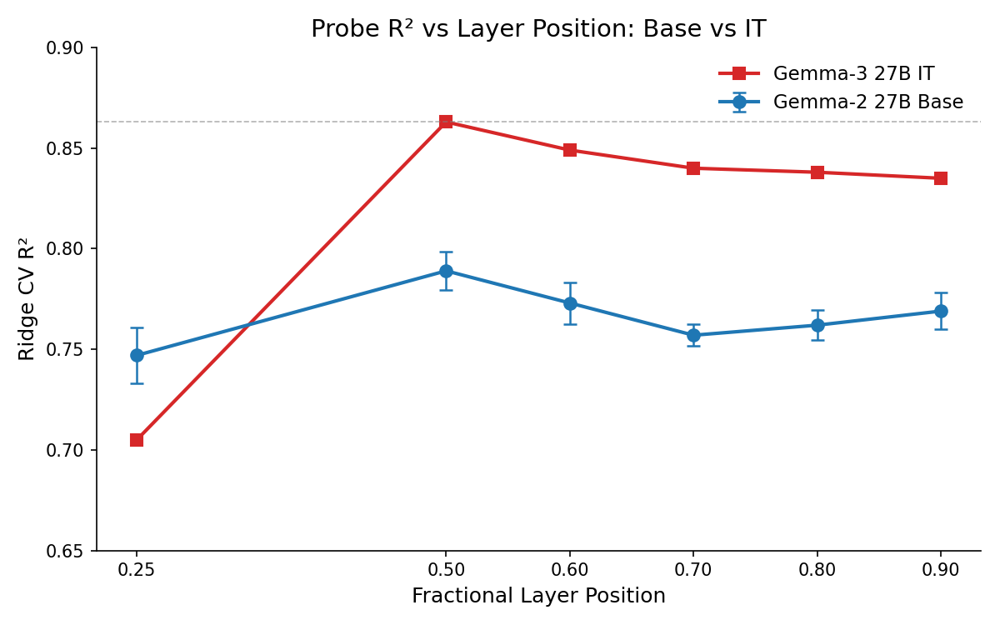
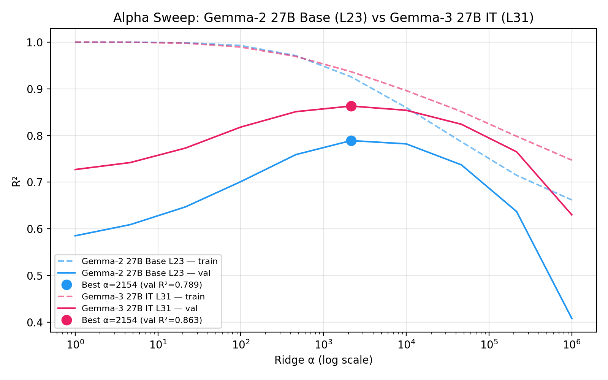

# Probing Gemma-2 27B Base Activations for Preferences

**Goal**: Train standard linear probes on Gemma-2 27B base (`google/gemma-2-27b`) activations to predict preferences, and compare to Gemma-3 27B IT. If the base model's activations predict preferences nearly as well as the IT model's, evaluative structure is already present in pretraining.

**Result**: Gemma-2 27B base achieves R² = 0.789 at its best layer (L23, 0.5 depth), ~7pp below Gemma-3 27B IT (R² = 0.863 at L31, also 0.5 depth). **Important caveat**: this is cross-model probing — predicting Gemma-3's preferences from Gemma-2's representations — so the R² primarily reflects shared content structure between the two models, not evaluative representations. Indeed, the 0.789 is only marginally above the strongest content-only baseline (Gemma-2 9B: 0.76), consistent with content-driven preference variance.

## Setup

- **GPU**: H100 80GB
- **Model**: `google/gemma-2-27b` (base, NOT IT), 46 layers, hidden_dim=4608, loaded in bf16 (~54.5GB)
- **Activations**: prompt_last token, layers at fractional depths [0.25, 0.5, 0.6, 0.7, 0.8, 0.9] → [L11, L23, L27, L32, L36, L41]
- **Tasks**: 30,000 extracted from wildchat, alpaca, math, bailbench (stress_test data was unavailable on pod)
- **Preference data**: Thurstonian scores from the Gemma-3 3k experiment (same scores used in all probe experiments)
- **Sample overlap**: 2264 of 3000 preference tasks had matching activations (736 missing: 600 stress_test + 136 sampling mismatch)

## Results

### Layer-by-layer comparison

| Layer (frac) | Gemma-2 Base R² (n=2264) | Gemma-3 IT R² (n=3000) | Diff |
|--------------|--------------------------|------------------------|------|
| 0.25         | 0.747                    | 0.705                  | +0.042 |
| 0.50         | **0.789**                | **0.863**              | -0.074 |
| 0.60         | 0.773                    | 0.849                  | -0.076 |
| 0.70         | 0.757                    | 0.840                  | -0.083 |
| 0.80         | 0.762                    | 0.838                  | -0.076 |
| 0.90         | 0.769                    | 0.835                  | -0.066 |

### Key observations

1. **Base model captures most of the signal — but likely content-driven.** R² = 0.789 is only marginally above the strongest content-only baseline (Gemma-2 9B: 0.76 from the parent experiment, ST: 0.62). The base model's preference-predictive structure likely reflects content-driven variance rather than evaluative representations (see Interpretation).

2. **IT model adds ~7pp.** The IT model consistently outperforms by 7-8pp at matched fractional depths (0.5-0.9). This gap is confounded by architecture differences, sample size, and cross-model probing, but its magnitude aligns with the content-orthogonal residual signal (~20-27% retained).

3. **Both peak at 0.5 depth.** Both models show peak performance at the middle layer (L23 for G2, L31 for G3), consistent with mid-network being where preference-relevant structure is strongest.

4. **Base model is flatter across layers.** The IT model shows a clear peak at 0.5 then gradual decline. The base model's profile is flatter (0.747-0.789 range vs 0.705-0.863), suggesting the preference signal is more distributed in the base model.

The base model outperforms at 0.25 (0.747 vs 0.705) but this is uninterpretable due to the architecture confound — L11 of 46 and L15 of 62 represent different computational stages.

### Alpha sweep comparison (best layers)

At their best layers, both models achieve peak CV R² at α = 2154 (5 of 6 base model layers also peak here; L11 peaks at α = 10000). The IT model shows consistently higher validation R² across all alphas.

The train-test gap is larger for the base model (0.137 vs 0.074 at best alpha), consistent with higher dimensionality (4608 vs 3584) relative to sample size — the base model's representations are harder to probe without overfitting.

## Caveats

1. **Different sample sizes.** The base model was probed on 2264 tasks vs 3000 for the IT baseline (736 missing: 600 stress_test tasks unavailable on pod + 136 from seed-based sampling differences across the 30k task pool). Fewer samples generally yields lower R², so the sample size difference works in the direction of inflating the apparent IT advantage. A controlled rerun on identical task subsets would be needed for a precise estimate.

2. **Different architectures.** Gemma-2 27B (46 layers, 4608 hidden) vs Gemma-3 27B IT (62 layers, 3584 hidden). The models differ not just in IT vs base but in architecture, pretraining data, and generation. We cannot cleanly attribute the R² gap to instruction tuning alone.

3. **Cross-model probing.** We're predicting Gemma-3's preferences from Gemma-2's representations. The probe has to bridge two models' representational spaces. If both models happened to represent task content similarly, the probe picks up content-driven preference variance. But model-specific evaluative representations in Gemma-3 would not be captured by Gemma-2's activations at all — so the base R² of 0.789 likely reflects shared content-driven preference variance, not evaluative structure per se.

## Interpretation

The high base-model R² (0.789) is consistent with the content-orthogonal findings from the parent experiment: sentence-transformer content embeddings alone predict R² = 0.62 of preferences, and a stronger encoder (Gemma-2 9B) gets R² = 0.76. The Gemma-2 27B base model's R² = 0.789 is only marginally above the strongest content baseline — it captures the same content-driven variance, perhaps with a small increment from pretraining-acquired task structure.

The ~7pp gap (0.789 → 0.863) aligns with the content-orthogonal residual signal (~20-27% retained after removing content). This suggests the IT model's advantage comes from evaluative representations that go beyond content — precisely the signal that content-orthogonal probing isolates.

## Gaps

- **Bradley-Terry probes** were attempted but L-BFGS-B optimization on 4608-dimensional weight vectors was too slow (~7+ hours per layer). PCA dimensionality reduction (e.g., to 512 dims) before BT would make this feasible. Only ridge results are reported.
- **Controlled sample comparison**: The Gemma-3 IT baseline used 3000 tasks vs 2264 here. Retraining IT probes on the same 2264 tasks (requires Gemma-3 activations on the pod) would remove this confound.

## Next steps

The most informative follow-up would be **content-orthogonal probing on the base model activations**. The standard probe R² of 0.789 is only marginally above content-only baselines, suggesting it's largely content-driven. If the base model's content-orthogonal R² drops to near zero while the IT model's is 0.24, that would be strong evidence that the IT model has evaluative representations beyond content that the base model lacks.

## Technical notes

- Model loading OOM'd at batch_size=32 until `PYTORCH_CUDA_ALLOC_CONF=expandable_segments:True` was set
- Batch size reduced from 32 to 8 to avoid frequent OOM retries during extraction
- Extraction completed in ~25 min for 30,000 tasks (resumed from 12,000 checkpoint)
