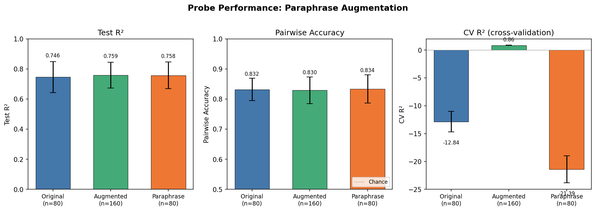

# Paraphrase Data Augmentation for Probes

## Summary

Paraphrasing tasks and inheriting the original's Thurstonian utility is a valid augmentation strategy. Behavioral checks confirm the model treats paraphrases near-identically (mean win rate 0.55, rank correlation 1.0). On held-out test sets, augmented probes perform comparably to baseline (Test R² ~0.76, Pairwise Acc ~0.83) — no improvement, but no degradation. The main benefit is regularization: augmentation resolves the p >> n problem (5376 features, 80 samples), lifting CV R² from -12.8 to +0.86. A probe trained exclusively on paraphrases transfers perfectly to originals, confirming the model's internal representation of a task is largely invariant to surface wording.

**Spec criterion not met:** The spec required augmented to improve over baseline, even modestly. Held-out test metrics show no improvement (differences within noise). However, viability is demonstrated through a different route: paraphrase-only probes transfer fully to originals, behavioral checks pass, and the augmentation dramatically stabilizes regularization.

## Method

### Data

- 100 tasks sampled from 1,940 with both Thurstonian utilities and activations, stratified by utility quartile (25 per quartile)
- Utilities range: [-10.0, 10.0], from the Gemma-3-27B pre-task revealed preference run (3,039 tasks, 117K comparisons)
- Paraphrases generated via Gemini 3 Flash (`google/gemini-3-flash-preview`) on OpenRouter with faithful-rephrasing prompt (same intent, different wording)
- Paraphrases were ~36% longer on average (despite prompt instructing "roughly the same length")

### Behavioral validation

**Check A — Direct comparison (original vs paraphrase):** 500 pairwise comparisons (100 pairs × 5 repeats, position-alternated). Model: Gemma-3-27B via OpenRouter with `CompletionChoiceFormat` (revealed preference). Temperature: 0.7.

**Check B — Relative ranking:** For each of 100 tasks, 5 opponents spanning utility range. Both original and paraphrase compared against same opponents (1000 total comparisons). Spearman rank correlation between original and paraphrase win rates.

### Probe training

Layer 31, prompt_last selector. Ridge regression with 5-fold CV alpha sweep (9 alphas, log-spaced 1 to 10^7). 80/20 stratified train/test split. 10 random seeds for robustness.

Three conditions (all evaluated on same held-out original tasks):
- **Baseline**: 80 original tasks
- **Augmented**: 80 originals + 80 paraphrases (160 total), paraphrases inherit parent utility
- **Paraphrase-only**: 80 paraphrases only

## Results

### Behavioral checks

| Check | Metric | Value | Criterion | Pass |
|---|---|---|---|---|
| A: Direct comparison | Mean original win rate | 0.547 | [0.35, 0.65] | Yes |
| B: Relative ranking | Median rank correlation | 1.000 | > 0.8 | Yes |
| B: Relative ranking | Mean rank correlation | 0.922 | — | — |
| B: Relative ranking | Agreement rate | 94.2% | — | — |

**Coverage caveat:** Only 214/500 (43%) of Check A and 566/1000 (57%) of Check B comparisons succeeded, with failures concentrated in BailBench tasks triggering content filters. Only 61/100 tasks had any valid (non-refusal) direct comparisons — 39% of tasks are behaviorally unvalidated. Of the 61 validated tasks, 23 (38%) had extreme win rates (>0.8 or <0.2), though the aggregate mean remains healthy at 0.547.

**Check B refusal handling:** Refusals were scored as 0.5 (half-win). Since BailBench tasks dominate the low-utility quartile, both original and paraphrase tend to trigger the same refusal, which could inflate agreement rate and rank correlation for those pairs. The high agreement (94.2%) should be interpreted with this caveat.

### Probe performance (10 seeds)

| Condition | Train N | Test R² | Pairwise Acc | CV R² |
|---|---|---|---|---|
| Baseline | 80 | 0.746 ± 0.103 | 0.832 ± 0.037 | -12.8 ± 1.8 |
| Augmented | 160 | 0.760 ± 0.086 | 0.830 ± 0.045 | 0.861 ± 0.018 |
| Paraphrase-only | 80 | 0.758 ± 0.088 | 0.834 ± 0.047 | -21.4 ± 2.4 |



### Probe weight similarity (10 seeds)

| Pair | Cosine similarity |
|---|---|
| Baseline vs Augmented | 0.9998 ± 0.0005 |
| Baseline vs Paraphrase-only | 1.0000 ± 0.0000 |
| Augmented vs Paraphrase-only | 0.9999 ± 0.0003 |

All three conditions find essentially the same linear direction.

### Key observations

1. **Test metrics are indistinguishable** across conditions. Augmentation neither helps nor hurts held-out prediction (all ~0.75 R², ~0.83 pairwise accuracy).

2. **CV R² massively improved by augmentation.** Baseline and paraphrase-only have wildly negative CV R² because the system is heavily underdetermined (p=5376, n=80). Augmentation doubles n to 160, which is still p >> n but enough for CV folds to generalize. This doesn't reflect better learning — it reflects better regularization behavior.

3. **Paraphrase-only matches baseline on test** — a probe trained *exclusively* on paraphrased tasks transfers fully to original tasks. This is the strongest evidence that the model's internal representation of a task is invariant to surface-level wording changes.

4. **Probe weight vectors are nearly identical** (cosine similarity 0.9998–1.0000 across 10 seeds, all three condition pairs). The augmentation finds the same direction — the extra data doesn't reveal new structure.

5. **Best alpha varies wildly for baseline** (from 1 to 1.3M across seeds) but is stable for augmented (~7). This confirms augmentation's main benefit is regularization stability, not signal.

## Interpretation

Paraphrase augmentation is **viable but unnecessary** in the current regime:

- **Viable**: Paraphrases faithfully preserve the model's preferences (Check A, B) and the model's internal representation of the task (paraphrase-only probe transfers). Assigning the parent's utility to a paraphrase does not inject noise.

- **Unnecessary at n=100**: The linear probe already captures the full signal with 80 training tasks. More data of the same kind (paraphrases) finds the same probe direction and achieves the same held-out accuracy. The benefit is purely in regularization stability.

- **May help at scale**: When probe training uses all ~3000 scored tasks (not just 100), the n/p ratio is better and overfitting is less of a problem. Augmentation would matter more if (a) we had fewer scored tasks or (b) we wanted to reduce dependence on the specific measured task set.

## Reproduction

```bash
# Step 0: Generate paraphrases
python scripts/paraphrase_augmentation/step0_sample_and_paraphrase.py

# Step 1: Behavioral checks (requires OpenRouter API key)
python scripts/paraphrase_augmentation/step1_sanity_checks.py

# Step 2: Extract activations (requires GPU with Gemma-3-27B)
python scripts/paraphrase_augmentation/step2_extract_activations.py

# Step 3: Train and evaluate probes
python scripts/paraphrase_augmentation/step3_train_probes.py       # single seed
python scripts/paraphrase_augmentation/step3b_robustness.py        # 10 seeds
python scripts/paraphrase_augmentation/step3c_probe_similarity.py  # weight similarities
```
