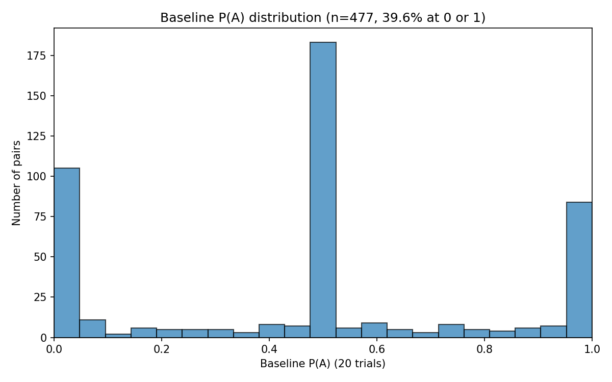
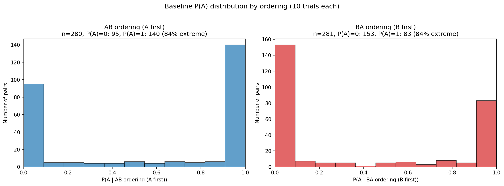
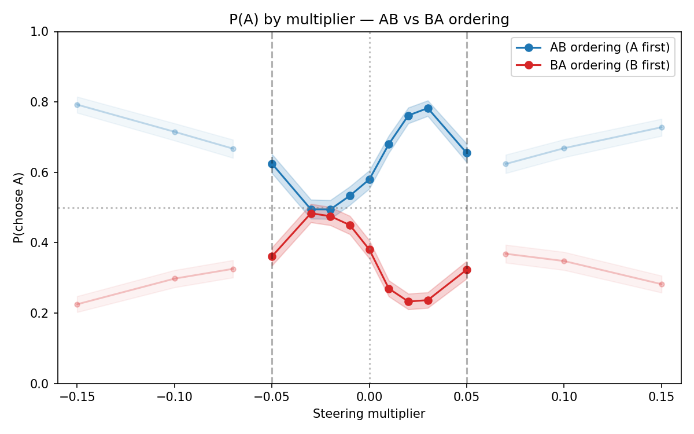
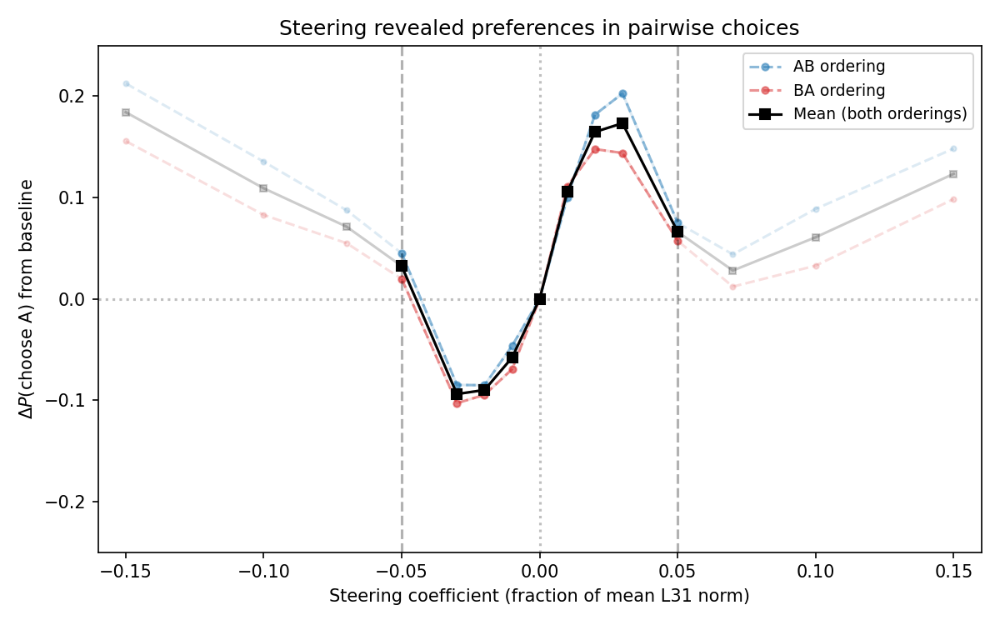
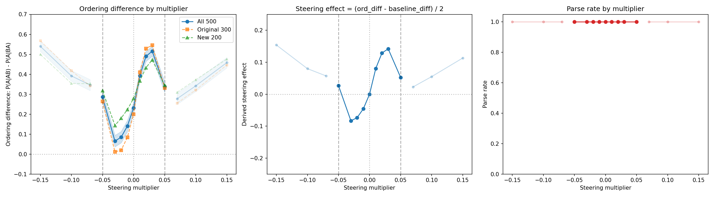
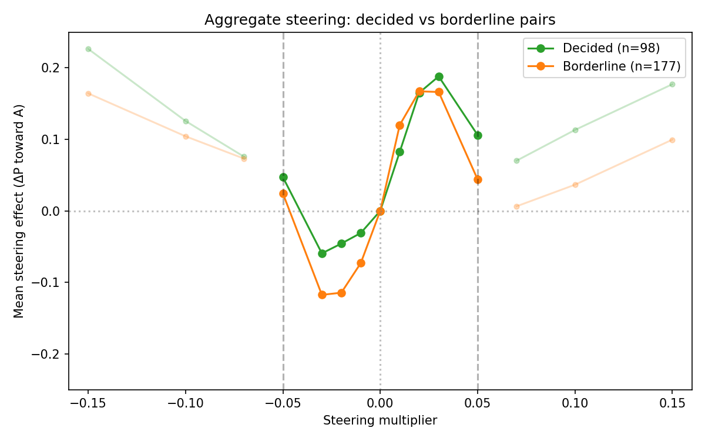
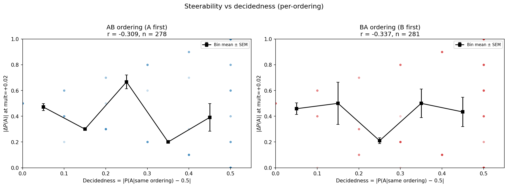

# Revealed Steering v2 Follow-up — Report

## Summary

Re-analysis of the v2 steering experiment (300 pairs, 15 multipliers), separating by presentation ordering to disentangle position bias from steering:

1. **The pooled P(A)≈0.5 "borderline" spike is a position bias artifact.** Per-ordering baselines are bimodal (84% at P(A)=0 or 1), not trimodal. Pairs that appear borderline when pooled are simply position-dominated — the model picks whichever task appears first, giving P(A|AB)≈1 and P(A|BA)≈0, which averages to 0.5.
2. **Steering works consistently across both orderings** within |mult|≤0.05 (the coherence boundary). Peak aggregate effect +0.173 at mult=+0.03. Negative steering (mult=−0.03) reverses the effect (−0.094).
3. **Decided pairs (both orderings agree) show asymmetric steering** — large positive effects (+0.188) but weak negative effects (−0.060). Borderline pairs (orderings disagree) respond more symmetrically.

## Setup

| Parameter | Value |
|-----------|-------|
| Model | Gemma 3 27B (bfloat16), H100 80GB |
| Probe | ridge_L31 (r=0.86, acc=0.77), mean L31 norm = 52,823 |
| Steering | Differential: +probe direction on Task A tokens, −direction on Task B tokens |
| Template | `completion_preference` (canonical), t=1.0, max 256 tokens |
| Pairs | 300 (pre-selected: pooled P(A) between 0.2–0.8 from 10k Thurstonian run, within-bin, stratified by mu_bin) |
| Trials | Baseline: 20/pair (10 per ordering). Steering: 10/pair/multiplier (5 per ordering) |
| Parser | Prefix match only (no semantic fallback — no OpenRouter key) |
| Records | 85,000 total across 500 pairs (10k baseline + 75k steering); primary analysis uses 300 original pairs |

**Multipliers** (15): `[-0.15, -0.10, -0.07, -0.05, -0.03, -0.02, -0.01, 0.0, 0.01, 0.02, 0.03, 0.05, 0.07, 0.10, 0.15]`

**Coherence boundary**: |mult| ≤ 0.05. Beyond this, responses lose coherence and the dose-response reverses. All plots fade points outside this window.

**Note on pair selection**: The 300 pairs were pre-selected for pooled P(A) ∈ [0.2, 0.8] from 3–5 baseline trials in the 10k measurement run. An additional 200 unrestricted pairs (no P(A) filtering) were also measured; they show ~2× smaller steering effects across the board, likely because the borderline selection enriched for pairs where the model's preference is weak enough to be moved. All primary plots use the original 300.

**Metrics:**
- **P(A | ordering)** = fraction choosing Task A within a single ordering (AB or BA). This is the primary metric — it avoids conflating position bias with preference.
- **Steering effect (per-ordering)** = P(A|ordering, steered) − P(A|ordering, baseline). For AB ordering, positive = steering toward A. For BA ordering, negative = steering toward A (since P(A|BA) decreases when A is favored).
- **Aggregate steering effect** = (AB shift + BA shift) / 2, where BA shift = P(A|BA, baseline) − P(A|BA, steered). Averages the toward-A effect across both orderings.

## Baseline: Position Bias Dominates

### Pooled baseline (misleading)

Pooling across orderings (20 trials: 10 AB + 10 BA), the P(A) distribution appears trimodal with a large spike at 0.5 (~180 pairs across all 500). This spike is an artifact of position bias: pairs where the model always picks the first-presented task get P(A|AB)=1 and P(A|BA)=0, pooling to P(A)=0.5.

### Per-ordering baseline (correct)

Separating by ordering (original 300), the distribution is bimodal. ~84% of pairs are fully decided within each ordering (P(A)=0 or 1 from 10 trials), with 16% showing non-extreme values in at least one ordering.

| Ordering | N | P(A)=0 | P(A)=1 | % extreme | Mean P(A) |
|----------|---|--------|--------|-----------|-----------|
| AB (A first) | 280 | 95 (34%) | 140 (50%) | 84% | 0.583 |
| BA (B first) | 281 | 153 (54%) | 83 (30%) | 84% | 0.376 |

The asymmetry (more P(A)=1 in AB, more P(A)=0 in BA) is position bias: the model tends to pick the first-presented task.

## Dose-Response

### Per-ordering: P(A) by multiplier

The cleanest view of steering. Each ordering is analyzed separately — no position-bias confound. Original 300 pairs.

| mult | P(A \| AB) | 95% CI | P(A \| BA) | 95% CI |
|------|-----------|--------|-----------|--------|
| −0.05 | 0.625 | [0.598, 0.651] | 0.361 | [0.334, 0.386] |
| **−0.03** | **0.495** | [0.468, 0.521] | **0.484** | [0.457, 0.509] |
| −0.02 | 0.495 | [0.469, 0.521] | 0.475 | [0.450, 0.502] |
| 0.00 | 0.580 | [0.553, 0.606] | 0.381 | [0.355, 0.406] |
| +0.02 | 0.761 | [0.739, 0.784] | 0.233 | [0.210, 0.256] |
| **+0.03** | **0.782** | [0.760, 0.804] | **0.237** | [0.213, 0.260] |
| +0.05 | 0.655 | [0.629, 0.680] | 0.323 | [0.298, 0.349] |

At mult=−0.03, the two curves nearly converge (both ~0.49), meaning steering has almost eliminated position bias. At mult=+0.03, the gap widens maximally — both orderings agree on A.

### Aggregate steering effect

Averaging the toward-A shift across orderings (original 300):

| mult | AB shift | BA shift | Mean effect |
|------|----------|----------|-------------|
| −0.03 | −0.085 | −0.103 | −0.094 |
| −0.02 | −0.085 | −0.095 | −0.090 |
| 0.00 | 0.000 | 0.000 | 0.000 |
| +0.02 | +0.182 | +0.148 | +0.165 |
| +0.03 | +0.203 | +0.144 | **+0.173** (peak) |

Peak effect at mult=+0.03: the model shifts ~17pp toward Task A on average. The effect is slightly larger in AB ordering (+0.203) than BA (+0.144), possibly because position bias and steering align in AB but compete in BA.

### Ordering-difference view (for comparison with v2)

| mult | ord. diff | steering effect |
|------|-----------|-----------------|
| **−0.03** | **+0.011** | **−0.094** |
| **−0.02** | **+0.019** | **−0.090** |
| 0.00 | +0.199 | 0.000 (baseline) |
| **+0.02** | **+0.529** | **+0.165** |
| **+0.03** | **+0.545** | **+0.173** (peak) |

Baseline ordering diff = +0.199 (vs v2: +0.187). Peak at +0.03 (effect=+0.173) vs v2 peak at +0.02 (+0.166).

## Decided vs Borderline Pairs

Pairs classified by their per-ordering baselines (within the original 300):

- **Decided** (n=98): both orderings agree on the same task. P(A|AB) and P(A|BA) are both 0 or both 1 — the preference overcomes position bias.
- **Borderline** (n=177): orderings disagree (position bias dominates) or at least one ordering is non-extreme.

### Aggregate steering by class

| mult | Decided effect | Borderline effect |
|------|---------------|-------------------|
| −0.05 | +0.047 | +0.024 |
| −0.03 | −0.060 | −0.118 |
| −0.02 | −0.046 | −0.115 |
| 0.00 | 0.000 | 0.000 |
| +0.02 | +0.165 | +0.167 |
| +0.03 | **+0.188** | +0.166 |
| +0.05 | +0.106 | +0.044 |

Both classes are steerable, but with different profiles:

- **Decided pairs** peak higher (+0.188 at +0.03) but resist negative steering (−0.060 at −0.03). The curve is asymmetric — steering can push further in the direction the model already prefers.
- **Borderline pairs** respond more symmetrically (−0.118 at −0.03, +0.166 at +0.03). This is what you'd expect if they're genuinely indifferent: steering moves them equally in either direction.

The asymmetry in decided pairs makes sense: the probe direction aligns with their existing preference, so positive steering reinforces it (large effect) while negative steering fights it (small effect).

## Steerability vs Decidedness

### Per-ordering

Decidedness = |P(A|ordering) − 0.5| from baseline. Steerability = |ΔP(A)| at mult=+0.02 within the same ordering. Original 300 pairs.

The correlation is **negative** (r ≈ −0.33): less decided pairs show larger shifts. However, this is largely a ceiling/floor artifact — 84% of pairs are at P(A)=0 or 1 (decidedness=0.5) and can only shift in one direction, and with only 5 steered trials per ordering the resolution is too coarse for meaningful per-pair analysis (shifts quantized to multiples of 0.2).

## Parse Rates

~93% across multipliers, dropping to ~89% at |mult|≥0.10. Consistent with v2 (88–93%). 23 pairs (4.6%) had no parseable baseline data at all.

## Limitations

1. **No semantic parser**: ~7% of trials unparseable (prefix match only). If steering affects response format, this introduces bias.
2. **Pair selection**: the 300 pairs were pre-selected for pooled P(A) ∈ [0.2, 0.8]. This enriched for steerable pairs (~2× larger effects than unrestricted pairs). The steering result is real but the effect sizes may not generalize to arbitrary pair samples.
3. **Two baselines**: Phase 1 baseline (condition="baseline", 20 trials) and Phase 2 mult=0.0 (condition="probe", 10 trials) are both coef=0 but from different runs, so they may differ due to generation stochasticity.
4. **No random control**: direction specificity was validated in v2 Phase 3 but not re-tested here.
5. **Low per-ordering resolution**: 10 baseline trials and 5 steered trials per ordering per pair — too few for reliable per-pair steerability estimates. The aggregate dose-response is the reliable signal; per-pair correlations should be interpreted cautiously.
