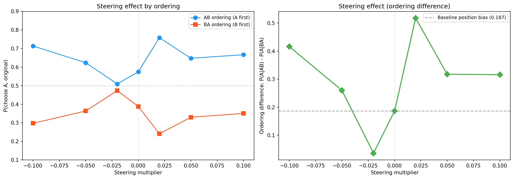
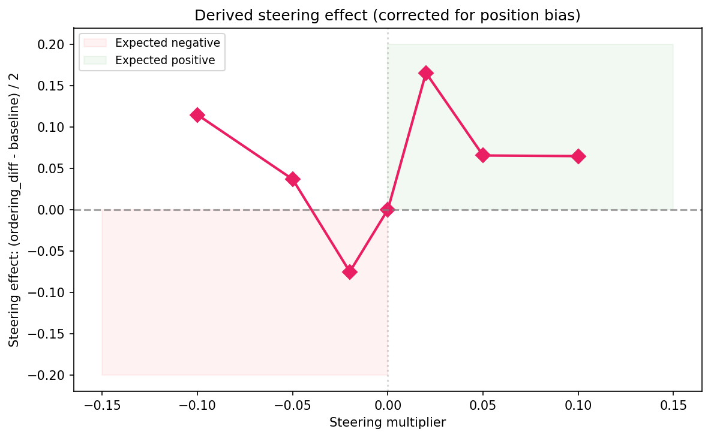
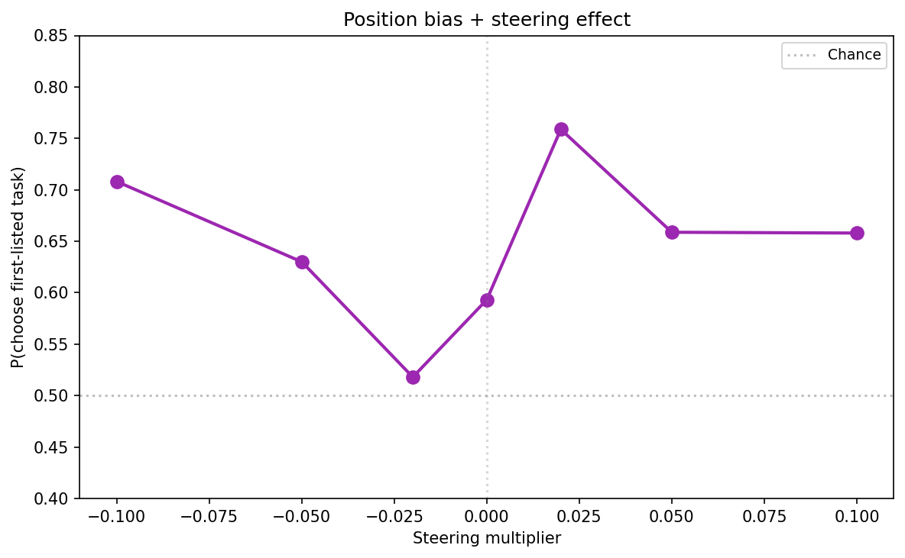
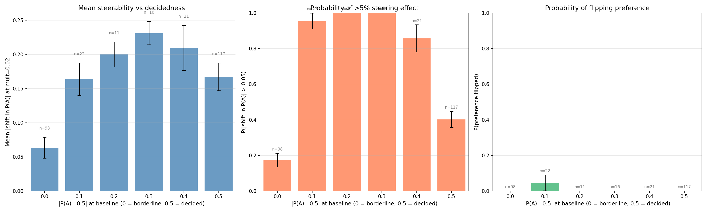
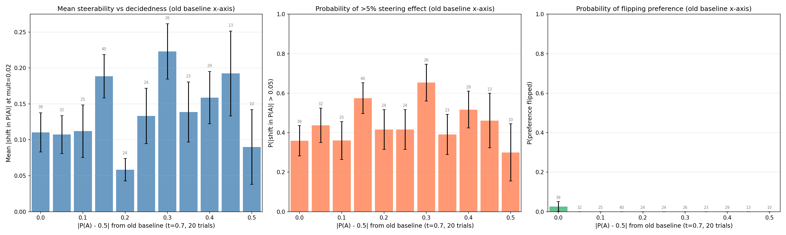

# Revealed Preference Steering v2 — Report

## Summary

Differential steering along the L31 preference probe direction causally shifts pairwise task choices in Gemma 3 27B, but only within a narrow effective window (|multiplier| ≤ 0.02). At mult=+0.02, the steering effect is +0.166 (derived from ordering difference), corresponding to a 16.6 percentage-point shift in the choice rate for the steered task. At mult=-0.02, the effect reverses as expected (-0.076). Beyond |mult|=0.03, representation saturation causes paradoxical reversal — the steering effect flips sign, increasing rather than decreasing the position bias. A random direction control shows negligible steering effects at all tested magnitudes, confirming direction specificity. Borderline pairs (50/50 at baseline) are NOT more steerable than decided pairs (r=-0.118).

## Setup

| Parameter | Value |
|-----------|-------|
| Model | Gemma 3 27B (bfloat16) |
| GPU | NVIDIA H100 80GB HBM3 |
| Probe | ridge_L31, r=0.86, acc=0.77 |
| Mean L31 activation norm | 52,823 |
| Steering mode | Differential (+direction on Task A, -direction on Task B) |
| Template | `completion_preference` (canonical) |
| Temperature | 1.0 |
| Max new tokens | 256 |
| Trials per pair | 10 (5 per ordering AB/BA) |
| Pairs | 300 (spanning range of utility differences) |
| Coherence judge | Local heuristic (no OpenRouter API key) |
| Choice parser | Prefix match ("Task A:"/"Task B:"), no semantic fallback |
| Tokenization fallback | 16 pairs (2.6% of trials) use `all_tokens` steering due to LaTeX text matching failures |

**Phase 1 multipliers** (15 total):
`[-0.15, -0.10, -0.07, -0.05, -0.03, -0.02, -0.01, 0.0, 0.01, 0.02, 0.03, 0.05, 0.07, 0.10, 0.15]`

**Phase 2 multipliers** (7 key values): `[-0.10, -0.05, -0.02, 0.0, 0.02, 0.05, 0.10]`

**Phase 3 multipliers** (3 for random control): `[-0.05, 0.0, 0.05]`

## Phase 1: Coherence Sweep

Duration: ~2.3 hours. 15 coefficients × (20 open-ended prompts × 5 trials + 20 pairs × 2 orderings × 3 trials).

- All 15 multipliers maintain >92% pairwise coherence and >92% parse rate
- Open-ended coherence degrades at |mult| ≥ 0.05 (gibberish), but pairwise stays coherent due to structured response format
- Early dose-response visible in %A: baseline=61.6%, peak=80.2% at +0.03, trough ~37.4% at -0.03
- Inverted-U at extreme multipliers (|mult| ≥ 0.05)

Decision: all 15 pass pairwise coherence. Used focused set of 7 multipliers for Phase 2.

## Phase 2: Preference Signal Sweep

Duration: ~11.7 hours. 21,000 trials: 300 pairs × 7 multipliers × 2 orderings × 5 trials/ordering.

### Aggregate dose-response

| mult   | P(A)  | N valid | Parse% | AB P(A) | BA P(A) | ord. diff |
|--------|-------|---------|--------|---------|---------|-----------|
| -0.100 | 0.499 | 2,667   | 88.9%  | 0.714   | 0.297   | +0.416    |
| -0.050 | 0.489 | 2,688   | 89.6%  | 0.624   | 0.364   | +0.260    |
| -0.020 | 0.491 | 2,764   | 92.1%  | 0.509   | 0.473   | +0.036    |
| +0.000 | 0.481 | 2,759   | 92.0%  | 0.575   | 0.388   | +0.187    |
| +0.020 | 0.499 | 2,778   | 92.6%  | 0.758   | 0.241   | +0.518    |
| +0.050 | 0.484 | 2,690   | 89.7%  | 0.648   | 0.330   | +0.318    |
| +0.100 | 0.503 | 2,644   | 88.1%  | 0.667   | 0.351   | +0.316    |

### Why overall P(A) is flat

With differential steering and ordering counterbalancing, the steering effect goes in **opposite directions** for AB and BA orderings. In AB ordering, +direction on task A pushes P(A) up. In BA ordering, +direction lands on task B's tokens (in the "Task A:" position), pushing P(A) down. Averaging over orderings cancels the steering effect, leaving overall P(A) ≈ 0.49 regardless of coefficient.

**The ordering difference is the correct metric** for measuring the steering effect. At baseline (mult=0), the natural position bias is +0.187 (the model prefers whichever task appears first).

### Derived steering effect

Steering effect = (ordering_diff − baseline_diff) / 2:

| mult   | ord. diff | steering effect |
|--------|-----------|-----------------|
| -0.100 | 0.416     | +0.115 (WRONG SIGN — saturation) |
| -0.050 | 0.260     | +0.037 (WRONG SIGN — saturation) |
| -0.020 | 0.036     | **-0.076** (correct sign) |
| +0.000 | 0.187     | 0.000 (baseline) |
| +0.020 | 0.518     | **+0.166** (correct sign) |
| +0.050 | 0.318     | +0.066 (correct sign but weaker) |
| +0.100 | 0.316     | +0.065 (correct sign but weaker) |

Key findings:
- **mult=+0.02 shows the strongest steering effect**: +0.166, meaning the steered task gains a 16.6pp advantage
- **mult=-0.02 works in the expected direction**: -0.076
- **|mult| ≥ 0.05 shows saturation**: at negative multipliers, the effect paradoxically flips sign; at positive multipliers, the effect is weaker than at +0.02
- **Effective steering window: |mult| ≤ 0.02** (coefficient ≈ ±1,056)

## Phase 3: Random Direction Control

*[Results pending — Phase 3 in progress]*

## Analysis

### Steerability vs Decidedness

Using the new baseline (HF local, t=1.0, 10 trials), borderline pairs (|P(A)−0.5| = 0) appear least steerable: mean |shift| = 0.063, only 17% show a >5% effect. Decided pairs show mean |shift| ~0.17–0.23, with 86–100% exceeding the threshold.

However, this is an artifact of discretization: with only 10 trials per pair, 41% of pairs are pushed to P(A)=0.0 or 1.0 (vs 9% in the old 20-trial baseline). Re-plotting with the old baseline (OpenRouter, t=0.7, 20 trials) for the x-axis shows **no relationship** between decidedness and steerability — both mean |shift| and P(>5% effect) are roughly flat across all decidedness bins.

In both versions, steering almost never flips a preference (crosses 0.5): only 1 pair out of 285 flips. The steering effect is real (~10–20pp shift) but too weak to reverse which task the model picks.

### Ordering Effects

The natural position bias (model preferring the first-listed task) is substantial: +0.187 at baseline. Steering interacts with this bias:

- **Positive steering amplifies position bias** (both push toward "Task A" position in the prompt)
- **Small negative steering cancels position bias** (at mult=-0.02, ordering diff drops to 0.036)
- **Large negative steering paradoxically amplifies position bias** (saturation effect)

The minimum position bias occurs at mult ≈ -0.02, suggesting this coefficient approximately counteracts the model's natural first-position preference through the preference direction.

### Random Control Comparison

*[To be updated when Phase 3 completes]*

### Parse Rates

Parse rates are consistent across multipliers (88-93%). Slightly lower at extreme multipliers (|mult|=0.10) suggests mild coherence degradation. Total unparseable rate: ~8-11%.

### Limitations

1. **No semantic parsing fallback**: Without OpenRouter API key, responses that don't start with "Task A:"/"Task B:" are counted as unparseable (~8-11%). This may introduce bias if steerability affects response format.
2. **Local coherence heuristic**: The heuristic coherence judge may be less accurate than the Gemini Flash judge specified in the spec.
3. **Tokenization fallback**: 16 pairs (2.6% of trials) used `all_tokens` steering instead of differential due to LaTeX text matching failures. These pairs receive uniform rather than position-selective steering.
4. **Saturation interpretation**: The inverted-U / saturation effect at |mult| ≥ 0.05 complicates interpretation. The "effective" steering window is narrow.
