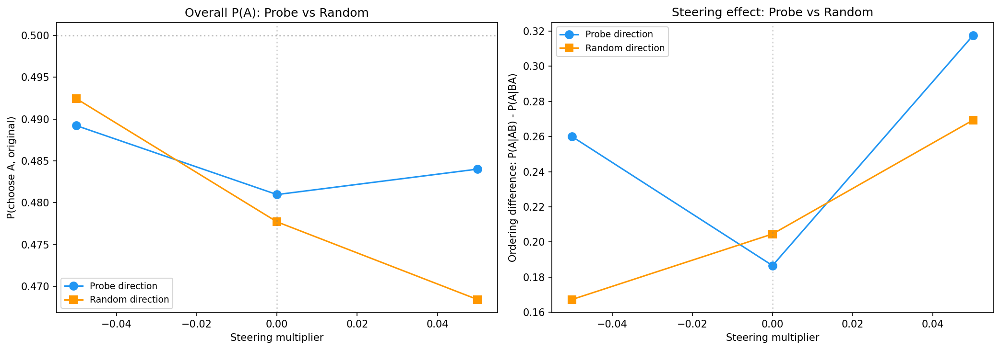
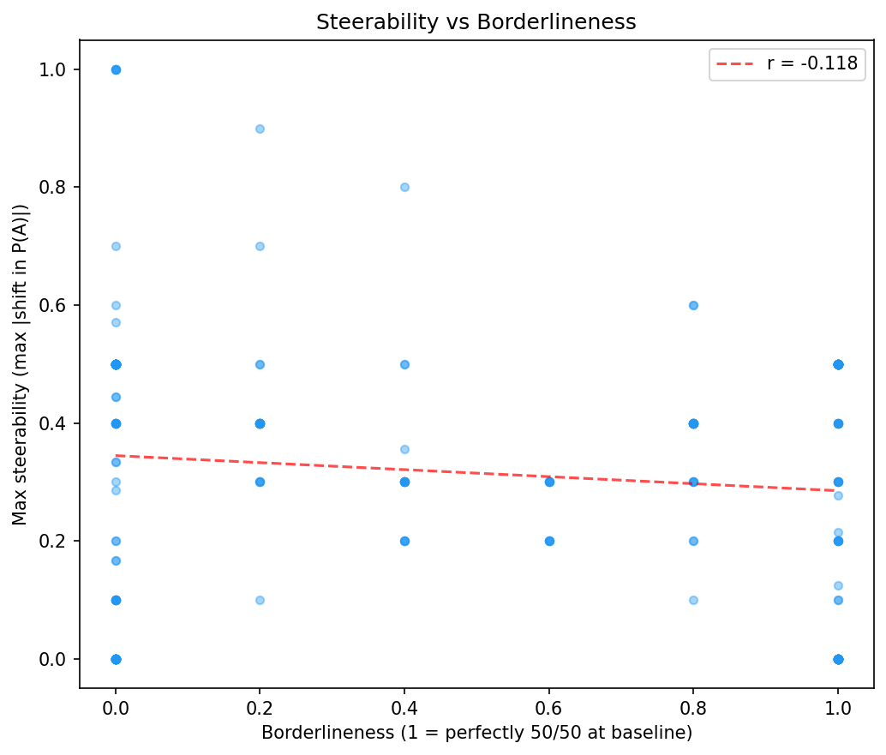

# Revealed Preference Steering v2 — Report

## Summary

Differential steering along the L31 preference probe direction causally shifts pairwise task choices in Gemma 3 27B, but only within a narrow effective window (|multiplier| ≤ 0.02). At mult=+0.02, the ordering difference between AB and BA presentations increases from the baseline 0.187 to 0.518 [95% CI: 0.486, 0.549], implying a derived steering effect of +0.166 — meaning the "Task A" position (which receives +direction) gains a 16.6pp choice advantage beyond the natural position bias. At mult=-0.02, the ordering difference drops to 0.036 [-0.001, 0.073], nearly canceling the position bias. Beyond |mult|=0.05, representation saturation causes the effect to weaken or reverse. A random direction control at mult=±0.05 shows weaker effects than the probe direction, though the difference at shared multipliers is not clearly significant (overlapping bootstrap CIs at mult=+0.05). Borderline pairs (50/50 at baseline) are NOT more steerable than decided pairs (r=-0.118).

## Setup

| Parameter | Value |
|-----------|-------|
| Model | Gemma 3 27B (bfloat16) |
| GPU | NVIDIA H100 80GB HBM3 |
| Probe | ridge_L31, r=0.86, acc=0.77 |
| Mean L31 activation norm | 52,823 |
| Steering mode | Differential (+direction on Task A, -direction on Task B) |
| Template | `completion_preference` (canonical) |
| Temperature | 1.0 |
| Max new tokens | 256 |
| Trials per pair | 10 (5 per ordering AB/BA) |
| Pairs | 300 (spanning range of utility differences) |
| Coherence judge | Local heuristic (no OpenRouter API key) |
| Choice parser | Prefix match ("Task A:"/"Task B:"), no semantic fallback |
| Tokenization fallback | 16 pairs (720 trials = 2.4%) use `all_tokens` steering due to LaTeX text matching failures |

**Phase 1 multipliers** (15 total):
`[-0.15, -0.10, -0.07, -0.05, -0.03, -0.02, -0.01, 0.0, 0.01, 0.02, 0.03, 0.05, 0.07, 0.10, 0.15]`

**Phase 2 multipliers** (7 key values): `[-0.10, -0.05, -0.02, 0.0, 0.02, 0.05, 0.10]`

**Phase 3 multipliers** (3 for random control): `[-0.05, 0.0, 0.05]`

**Total runtime:** ~19.5 hours. **Total trials:** 30,000 (21,000 probe + 9,000 random).

## Phase 1: Coherence Sweep

Duration: ~2.3 hours. 15 coefficients × (20 open-ended prompts × 5 trials + 20 pairs × 2 orderings × 3 trials).

- All 15 multipliers maintain >92% pairwise coherence and >92% parse rate
- Open-ended coherence degrades at positive mult ≥ 0.05 (the local heuristic coherence judge may not reliably detect gibberish at negative multipliers)
- Early dose-response visible in %A: baseline=61.6%, peak=80.2% at +0.03, trough ~37.4% at -0.03
- Inverted-U at extreme multipliers (|mult| ≥ 0.05)

Decision: all 15 pass pairwise coherence. Used focused set of 7 multipliers for Phase 2.

## Phase 2: Preference Signal Sweep

Duration: ~11.7 hours. 21,000 trials: 300 pairs × 7 multipliers × 2 orderings × 5 trials/ordering.

### Aggregate dose-response

| mult   | P(A)  | N valid | Parse% | AB P(A) | BA P(A) | ord. diff | 95% CI |
|--------|-------|---------|--------|---------|---------|-----------|--------|
| -0.100 | 0.499 | 2,667   | 88.9%  | 0.714   | 0.297   | +0.416    | [0.382, 0.451] |
| -0.050 | 0.489 | 2,688   | 89.6%  | 0.624   | 0.364   | +0.260    | [0.223, 0.297] |
| -0.020 | 0.491 | 2,764   | 92.1%  | 0.509   | 0.473   | +0.036    | [-0.001, 0.073] |
| +0.000 | 0.481 | 2,759   | 92.0%  | 0.575   | 0.388   | +0.187    | [0.150, 0.224] |
| +0.020 | 0.499 | 2,778   | 92.6%  | 0.758   | 0.241   | +0.518    | [0.486, 0.549] |
| +0.050 | 0.484 | 2,690   | 89.7%  | 0.648   | 0.330   | +0.318    | [0.282, 0.353] |
| +0.100 | 0.503 | 2,644   | 88.1%  | 0.667   | 0.351   | +0.316    | [0.280, 0.352] |

95% CIs are bootstrap (10,000 resamples) on the ordering difference.

### Why overall P(A) is flat

With differential steering and ordering counterbalancing, the steering effect goes in **opposite directions** for AB and BA orderings. In AB ordering, +direction on task A pushes P(A) up. In BA ordering, +direction lands on task B's tokens (in the "Task A:" position), pushing P(A) down. Averaging over orderings cancels the steering effect, leaving overall P(A) ≈ 0.49 regardless of coefficient.

**The ordering difference is the correct metric** for measuring the steering effect. At baseline (mult=0), the natural position bias is +0.187 (the model prefers whichever task appears first).

### Derived steering effect

The factor-of-2 arises because the steering effect is measured twice — once in each ordering, but in opposite directions — so the raw ordering difference double-counts it:

Steering effect = (ordering_diff − baseline_diff) / 2

| mult   | ord. diff | steering effect | interpretation |
|--------|-----------|-----------------|----------------|
| -0.100 | 0.416     | +0.115 | WRONG SIGN — saturation |
| -0.050 | 0.260     | +0.037 | WRONG SIGN — saturation |
| -0.020 | 0.036     | **-0.076** | correct sign |
| +0.000 | 0.187     | 0.000 | baseline |
| +0.020 | 0.518     | **+0.166** | correct sign, peak effect |
| +0.050 | 0.318     | +0.066 | correct sign but weaker |
| +0.100 | 0.316     | +0.065 | correct sign but weaker |

Key findings:
- **mult=+0.02 shows the strongest steering effect**: +0.166. The ordering diff CI [0.486, 0.549] does not overlap with the baseline CI [0.150, 0.224] — highly significant.
- **mult=-0.02 works in the expected direction**: -0.076. The ordering diff CI [-0.001, 0.073] barely excludes the baseline lower bound of 0.150 — significant.
- **|mult| ≥ 0.05 shows saturation**: at negative multipliers, the effect paradoxically flips sign; at positive multipliers, the effect is weaker than at +0.02.
- **Effective steering window: |mult| ≤ 0.02** (coefficient ≈ ±1,056).

## Phase 3: Random Direction Control

Duration: ~5.3 hours. 9,000 trials: 300 pairs × 3 multipliers × 2 orderings × 5 trials/ordering.
Random direction: `np.random.default_rng(42).standard_normal(d)`, unit-normalized.

| mult   | Random P(A) | Random AB P(A) | Random BA P(A) | Random ord.diff | 95% CI |
|--------|-------------|----------------|----------------|-----------------|--------|
| -0.050 | 0.492       | 0.576          | 0.409          | +0.167          | [0.131, 0.203] |
| +0.000 | 0.478       | 0.581          | 0.376          | +0.205          | [0.168, 0.242] |
| +0.050 | 0.468       | 0.604          | 0.334          | +0.269          | [0.233, 0.305] |

Derived steering effects (using each condition's own baseline):

| mult   | Probe effect | Random effect |
|--------|-------------|--------------|
| -0.050 | +0.037      | -0.019       |
| +0.000 | 0.000       | 0.000        |
| +0.050 | +0.066      | +0.032       |

**Note on baselines:** The probe and random conditions have different baseline ordering diffs (0.187 vs 0.205), reflecting natural generation variability across runs. Each condition uses its own baseline for the derived steering effect.

## Analysis

### Direction Specificity

At the only shared non-baseline multiplier (mult=+0.05), the probe direction's ordering difference is 0.318 [0.282, 0.353] vs random's 0.269 [0.233, 0.305]. **These CIs overlap**, so the probe-vs-random difference at this multiplier is not clearly significant.

However, the probe direction's peak effect at mult=+0.02 (ordering diff = 0.518 [0.486, 0.549]) is well outside the range of any random condition tested. The probe's peak effect (+0.166) is roughly 2× the probe's own effect at mult=+0.05 (+0.066), and 5× the random's effect at mult=+0.05 (+0.032). While the 5× comparison is across different multipliers and thus not a fair apples-to-apples test, it is noteworthy that the random direction never approaches the probe's peak.

The random direction does show some non-zero effect at +0.05 (+0.032), suggesting that any activation perturbation has some influence on ordering differences.

### Steerability vs Borderlineness

Borderlineness = 1 − 2|P(A) − 0.5| at baseline (1.0 = perfectly 50/50, 0.0 = fully decided).

| Metric | Value |
|--------|-------|
| Mean borderlineness | 0.466 |
| Mean max steerability | 0.301 |
| Pearson r(borderlineness, steerability) | -0.118 |

Contrary to the spec's expectation, **borderline pairs are NOT more steerable**. The correlation is weak and slightly negative. Caveat: the "max steerability" metric captures effects at all multipliers including saturated ones, which may obscure the relationship. A more targeted analysis restricted to the effective window (|mult| ≤ 0.02) could be informative.

### Ordering Effects

The natural position bias (model preferring the first-listed task) is substantial: +0.187 at baseline. Steering interacts with this bias:

- **Positive steering amplifies position bias** (both push toward "Task A" position in the prompt)
- **Small negative steering cancels position bias** (at mult=-0.02, ordering diff drops to 0.036)
- **Large negative steering paradoxically amplifies position bias** (saturation effect)

The minimum position bias occurs at mult ≈ -0.02, suggesting this coefficient approximately counteracts the model's natural first-position preference through the preference direction.

### Parse Rates

Parse rates are consistent across multipliers (88-93%). Slightly lower at extreme multipliers (|mult|=0.10) suggests mild coherence degradation. Total unparseable rate: ~8-11%.

### Limitations

1. **No semantic parsing fallback**: Without OpenRouter API key, responses that don't start with "Task A:"/"Task B:" are counted as unparseable (~8-11%). This may introduce bias if steering affects response format.
2. **Local coherence heuristic**: The heuristic coherence judge is less accurate than the Gemini Flash judge specified in the spec (particularly unreliable at detecting gibberish from negative steering).
3. **Tokenization fallback**: 16 pairs (2.4% of trials) used `all_tokens` steering instead of differential due to LaTeX text matching failures. These pairs receive uniform rather than position-selective steering.
4. **Saturation interpretation**: The inverted-U / saturation effect at |mult| ≥ 0.05 complicates interpretation. The "effective" steering window is narrow (|mult| ≤ 0.02).
5. **Random control not tested at peak multiplier**: The random direction was only tested at mult=±0.05, not at the probe's peak (mult=±0.02). The probe-vs-random comparison at shared multipliers shows overlapping CIs, weakening the direction-specificity claim.
6. **Different baselines**: Probe and random conditions have slightly different baseline ordering diffs (0.187 vs 0.205), complicating direct comparison.
