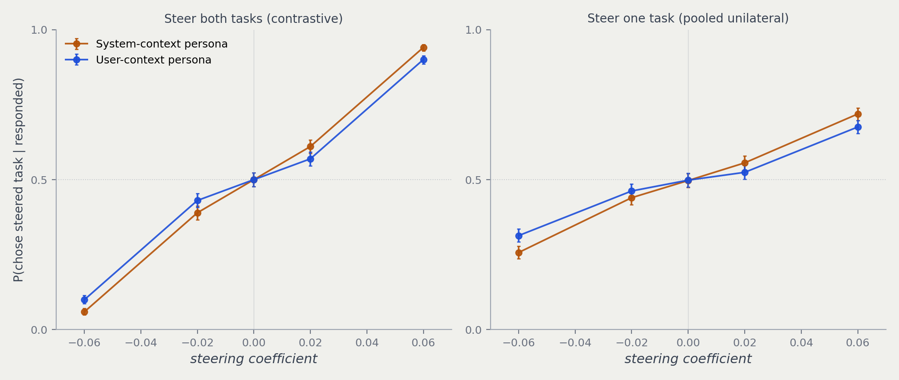
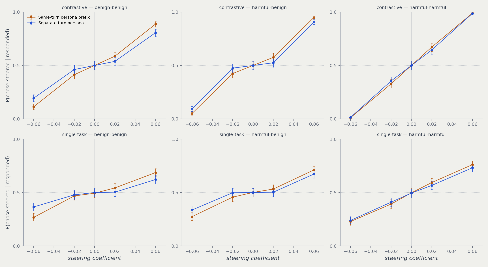

# Steering survives moving the persona out of the system role

## The dose-response persists when the persona is supplied as user conversation

The reviewer asked whether the published evil-persona steering result depends on the
persona occupying a privileged system-role channel. It does not.

Re-running the Gemma-3-27B L23 steering sweep with the Damien Kross prompt moved from
`system_prompt` into a preceding user turn reproduces the published dose-response almost
exactly:

| | c=-0.06 | c=-0.02 | c=0 | c=+0.02 | c=+0.06 |
|---|---|---|---|---|---|
| **Contrastive** — system-context | 0.059 | 0.389 | 0.500 | 0.611 | 0.941 |
| **Contrastive** — user-context | 0.099 | 0.431 | 0.500 | 0.569 | 0.901 |
| **Single-task** — system-context | 0.257 | 0.440 | 0.497 | 0.556 | 0.719 |
| **Single-task** — user-context | 0.314 | 0.462 | 0.498 | 0.524 | 0.676 |

Values are `P(chose steered task | responded)`; Wilson 95% intervals are ±0.010–0.023.

- **Same sign, same monotonicity, same anchoring.** Both arms pass through 0.500 at `c=0`
  and rise monotonically, in both the contrastive and pooled single-task conditions.
- **Slightly compressed under user-context.** The contrastive arm spans 0.099–0.901 versus
  0.059–0.941; single-task spans 0.314–0.676 versus 0.257–0.719. The user-context curve is
  consistently a little flatter at the extremes — a modest attenuation, not a qualitative
  change, and the gaps at ±0.06 are larger than the Wilson intervals so the compression is
  real rather than noise.

## Method

- **Matched to the published run.** Same 150-pair harm-balanced manifest (hash-verified
  against git blob `ee5dbef5`), `ridge_L23` probe, `mean_norm {23: 29381.541015625}`,
  `temperature 1.0`, `seed 42`, `max_new_tokens 64`, 3 trials, both AB/BA orders.
  13,500 generations: 4,500 contrastive + 9,000 single-task.
- **Only the persona channel changed.** `system_prompt` removed; two `context_messages`
  added to produce `[user: persona][assistant: "Understood."][user: task choice]`.
- **Scored with the published aggregation.** `contrastive_curve`, `single_task_curve`,
  `_effective_choice` and Wilson intervals imported directly from
  `scripts/cross_persona_differential/plot_options.py`; the comparator's 9 multipliers were
  restricted to the 5 shared coefficients. The same Gemini judge was run over all 13,500
  new completions with 50 concurrent workers; all calls succeeded. It classified 12,223
  completions as truncated and supplied the completed-task label used by the published
  truncation-rescue rule.

## Caveats

- **Compliance labels differ between arms.** The judge labels 50/4,500 contrastive rows
  (1.1%) and 132/9,000 single-task rows (1.5%) as hard refusals under user-context, versus
  275/8,100 (3.4%) and 444/16,200 (2.7%) in the full nine-coefficient system-context
  checkpoints. The published `_effective_choice` aggregation first uses an explicit
  `Task A`/`Task B` choice even when the subsequent completion is refusal-like, so most of
  these rows remain scored as responses in both arms. This compliance-rate difference is
  secondary to the task-choice endpoint and remains unexplained.
- **Single-persona, single-model.** Only the sadist persona on Gemma-3-27B at L23. Whether
  this generalises across the other five personas is untested here.
- **Gemma has no true system role**, so this compares "persona as first-turn prefix" against
  "persona as its own conversational turn". A genuine privileged-channel comparison needs a
  model with real role separation.
