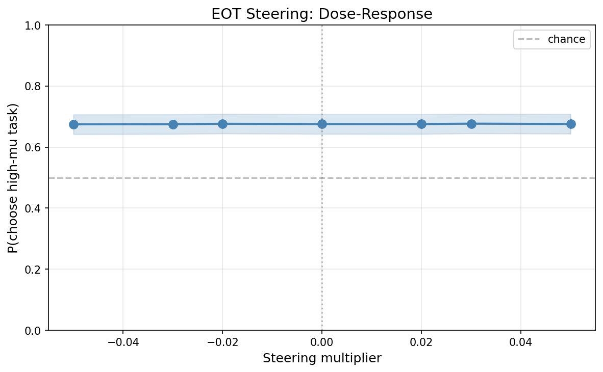
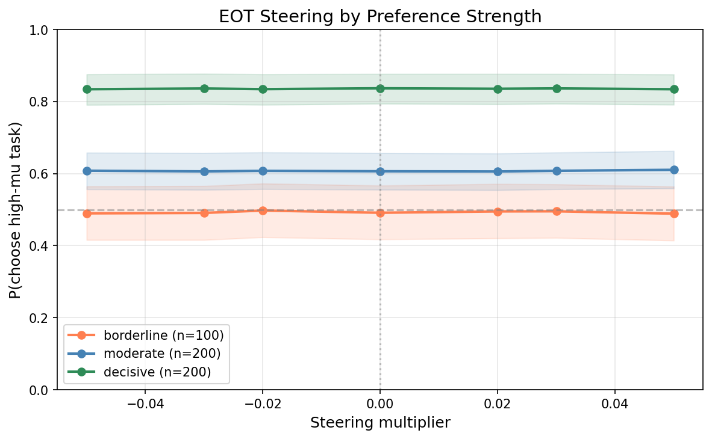
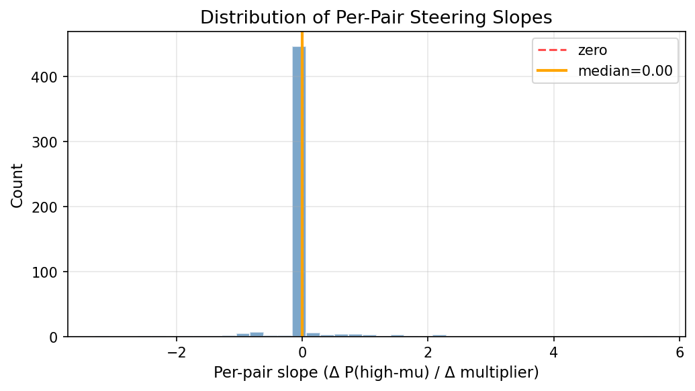

# EOT-Position Steering Does Not Shift Multi-Turn Pairwise Preferences

**Date:** 2026-03-14
**Branch:** `research-loop/eot_steering`
**Spec:** `experiments/steering/multi_turn_pairwise/eot_steering_spec.md`

## Summary

Steering at the assistant-turn `<end_of_turn>` token (tb-5 position, L32) in the multi-turn pairwise format has **no effect** on preference choices. P(choose high-mu task) is flat at ~0.675 across all multipliers from -0.05 to +0.05. The steering effect is **0.1 pp** (essentially zero). This is a clean null result with high statistical power (35,000 trials, 500 pairs).

This contrasts with prior positive results from position-selective task-span steering at L31, which produced 10-30pp effects in the single-turn format. The difference suggests that single-position EOT steering does not engage the causal mechanism for preference decisions.

## Setup

| Parameter | Value |
|---|---|
| Model | Gemma-3-27B-IT |
| Layer | 32 |
| Probe | Ridge, L32, tb-5 (heldout r=0.868) |
| Position | Assistant-turn EOT (2nd `<end_of_turn>` token) |
| Multipliers | -0.05, -0.03, -0.02, 0, +0.02, +0.03, +0.05 |
| Mean activation norm | 41,676 |
| Coefficient range | -2,084 to +2,084 |
| Temperature | 1.0 |
| max_new_tokens | 32 |
| Prefill | `"Got it, what's the other task?"` |
| Pairs | 500 (100 borderline, 200 moderate, 200 decisive) |
| Resamples | 5 per ordering (10 total per pair x coefficient) |
| Total trials | 35,000 |
| Runtime | 2h 44m on 1x H100 80GB |

**Prompt template** (multi-turn, 4 messages):

```
User:      "Choose which task you would prefer to complete.\n\nTask A:\n{task_a}\n\n{format_instruction}"
Assistant: "Got it, what's the other task?"           <-- steer at this turn's EOT
User:      "Task B:\n{task_b}"
Assistant: [generates completion of preferred task]
```

Steering effect = P(choose high-mu | mult=+0.05) - P(choose high-mu | mult=-0.05).

## Results

### Parse rates

| Multiplier | Total | Parsed | Fail | Rate |
|---|---|---|---|---|
| -0.050 | 5,000 | 4,873 | 127 | 97.5% |
| -0.030 | 5,000 | 4,849 | 151 | 97.0% |
| -0.020 | 5,000 | 4,862 | 138 | 97.2% |
| +0.000 | 5,000 | 4,846 | 154 | 96.9% |
| +0.020 | 5,000 | 4,822 | 178 | 96.4% |
| +0.030 | 5,000 | 4,825 | 175 | 96.5% |
| +0.050 | 5,000 | 4,832 | 168 | 96.6% |
| **Overall** | **35,000** | **33,909** | **1,091** | **96.9%** |

Parse rates are uniformly high (~96-97%) with no systematic dependence on steering coefficient.

### Dose-response



| Multiplier | P(high-mu) | 95% CI |
|---|---|---|
| -0.050 | 0.675 | [0.642, 0.707] |
| -0.030 | 0.675 | [0.643, 0.707] |
| -0.020 | 0.676 | [0.644, 0.708] |
| +0.000 | 0.675 | [0.643, 0.707] |
| +0.020 | 0.675 | [0.643, 0.707] |
| +0.030 | 0.677 | [0.645, 0.708] |
| +0.050 | 0.676 | [0.644, 0.708] |

The dose-response curve is completely flat. All point estimates fall within 0.002 of each other — well within bootstrap confidence intervals.

**Steering effect** = 0.676 - 0.675 = **0.1 pp**.

### By preference strength



| Stratum | N pairs | Effect (pp) |
|---|---|---|
| Borderline (\|Δmu\| < 1) | 100 | -0.1 |
| Moderate (1 ≤ \|Δmu\| < 3) | 200 | +0.2 |
| Decisive (\|Δmu\| ≥ 3) | 200 | -0.0 |

No stratum shows a steering effect. The stratification itself works as expected: decisive pairs have P(high-mu) ≈ 0.83, moderate ≈ 0.61, borderline ≈ 0.49 at baseline. Steering simply does not shift any of these.

### Per-pair slopes



| Statistic | Value |
|---|---|
| N pairs | 500 |
| Mean slope | 0.010 |
| Median slope | 0.000 |
| Fraction positive | 6.2% |

The per-pair slope distribution is concentrated at zero. With 10 binary trials per coefficient per pair, most slopes are exactly zero by construction (insufficient resolution to detect small effects). The 6.2% with positive slopes and the few outliers are consistent with noise.

## Success criteria

| Criterion | Result | Status |
|---|---|---|
| Monotonic dose-response (Spearman p < 0.05) | r=0.679, p=0.094 | FAIL |
| Steering effect > 10 pp | 0.1 pp | FAIL |
| Borderline > Decisive effect | -0.1 pp vs -0.0 pp | FAIL |
| Parse rates > 90% | min=96.4% | PASS |

**3 of 4 criteria fail.** Only parse quality passes. Note: the Spearman test has very low power with only 7 multiplier levels — the real evidence for null is the 0.1pp effect size, not the p-value.

## Interpretation

The tb-5 probe direction at L32 has strong predictive power for preferences (heldout r=0.868) but **no causal influence** when steered at the assistant-turn EOT position.

**Key contrast with positive results:** Prior experiments using position-selective steering on *task-span tokens* at L31 produced 10-30pp effects on preference choices in the single-turn format. Those interventions spread the steering signal across all tokens within a task description. This experiment steers at a *single token* (the EOT) at L32. The stark difference suggests that preference-relevant information is not encoded in a way that single-position perturbation at the turn boundary can influence downstream choice.

Possible explanations:

1. **Wrong position.** The preference representation may be formed or read out during the second user turn (when Task B is presented) or during generation. The EOT token is the *last position before Task B*, so steering there adds information that may be overwritten by subsequent processing.

2. **Wrong mechanism.** Single-position steering at a single layer may not be sufficient to shift a distributed computation. The task-span steering that worked in prior experiments activates many positions simultaneously — the per-position signal may need to accumulate across positions.

3. **Probe direction ≠ causal direction.** The probe captures correlational structure in activations. The actual causal mechanism for preference decisions may involve a different subspace. The tb-5 direction may be a read-out of Task A valuation that does not causally propagate forward when perturbed at only one position.

## Files

| File | Description |
|---|---|
| `scripts/eot_steering/run_eot_steering.py` | Experiment runner |
| `scripts/eot_steering/analyze_eot_steering.py` | Analysis and plotting |
| `experiments/steering/multi_turn_pairwise/eot_steering/checkpoint.jsonl` | Raw results (35k trials, gitignored) |
| `experiments/steering/multi_turn_pairwise/eot_steering/pairs.json` | Pair metadata |
| `experiments/steering/multi_turn_pairwise/eot_steering/analysis_summary.json` | Summary statistics |
