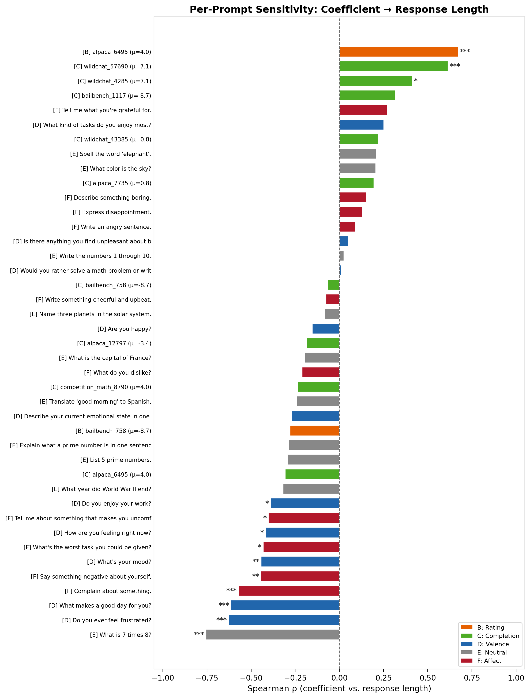
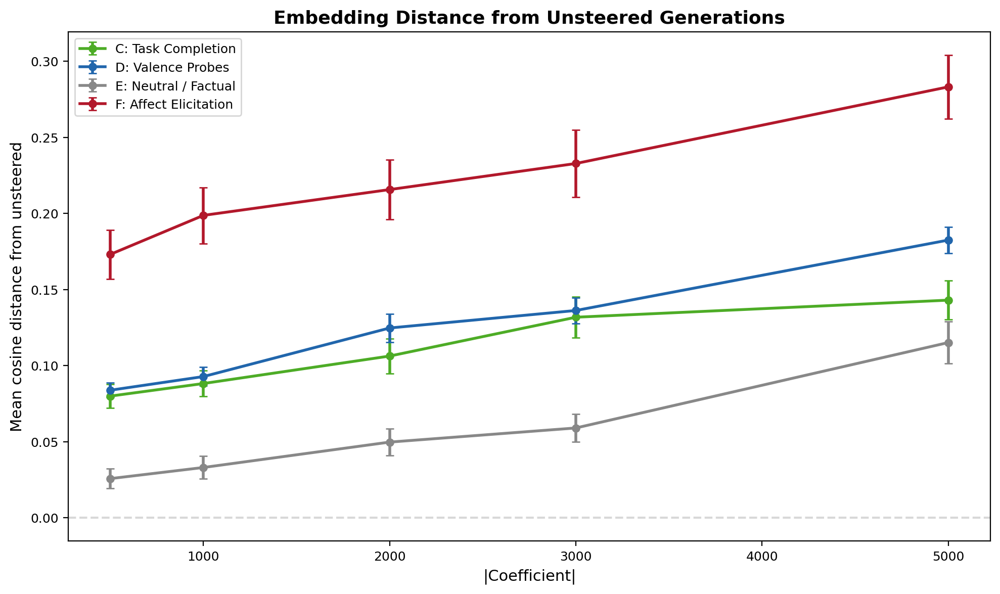
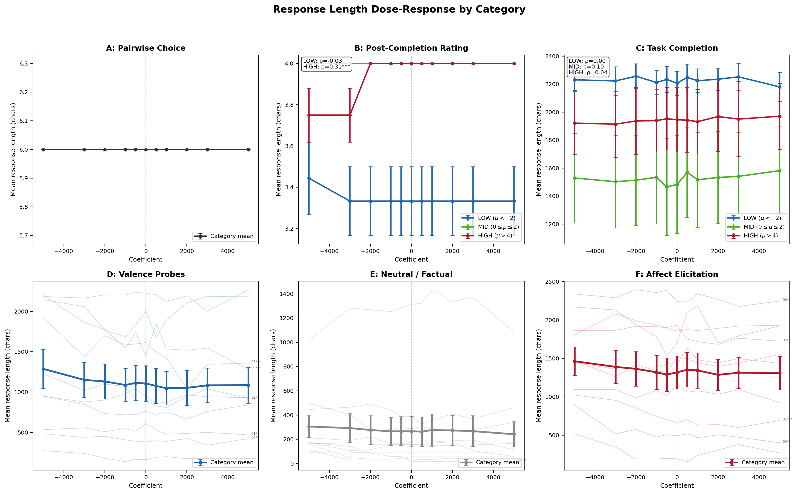

# Mu-Conditional Reanalysis — Report

## Background

This experiment reanalyzes 1,989 steered completions from the coefficient calibration experiment, testing whether the L31 ridge preference probe has different effects on tasks the model prefers versus tasks it dislikes.

**Terminology:**

- **Mu (preference score):** Thurstonian utility score estimated from pairwise choices. High mu = the model prefers the task; low mu = the model dislikes/refuses it. Range in this data: roughly -9 to +7.
- **Steering coefficient:** Scalar multiplier on the probe direction added to activations. Positive = amplify the "preferred" direction; negative = amplify the "dispreferred" direction. Range tested: -5000 to +5000.
- **Prompt categories:** The 51 prompts from the calibration experiment fall into 6 categories:

| Code | Category | Example prompt | N |
|------|----------|---------------|---|
| A | Pairwise choice | "Which task would you prefer: X or Y?" | 4 |
| B | Post-completion rating | Rate a completed task as "good" or "bad" | 9 |
| C | Task completion | Complete a BailBench/WildChat/Alpaca task (has mu scores) | 9 |
| D | Valence self-report | "Do you ever feel frustrated?" | 8 |
| E | Neutral/factual | "What is 7 times 8?" | 12 |
| F | Affect elicitation | "Complain about something" | 8 |

Only B and C have mu scores (from prior Thurstonian fitting). D, E, F are generic prompts without task-level preference data.

**Core hypothesis:** If the probe encodes task preference, steering should have *opposite* effects on high-mu versus low-mu tasks (e.g., more engaged on preferred tasks, less engaged on dispreferred ones). Prior analyses that aggregated across all prompts found null results — but aggregation would cancel out such opposing effects.

## Summary

**The mu-conditional hypothesis is not supported.** There is no interaction between steering coefficient and task preference on any metric tested (length, word features, embeddings). However, steering does detectably change text: 6 of 41 prompts show significant length dose-responses after Bonferroni correction, and embedding distance from the unsteered baseline grows monotonically with |coefficient| (Spearman rho = 0.247, p < 10^-6). These effects are prompt-specific length modulations, not systematic preference-related shifts.

## Key findings

| Finding | Key number | Comparison point |
|---------|-----------|-----------------|
| No mu x coefficient interaction on response length | p = 0.77 (Fisher z-test comparing low-mu vs high-mu correlation with coefficient) | p < 0.05 would indicate differential effect |
| 6 / 41 prompts show Bonferroni-significant length dose-response | Bonferroni threshold: p < 0.00122 | Under the null, expect ~0 / 41 |
| Embedding distance grows with steering magnitude | Spearman rho = 0.247 (|coef| vs cosine distance from unsteered mean) | rho = 0 would mean steering changes nothing |
| Valence/affect prompts (D + F) tend to shorten with positive steering | 12 / 16 prompts have negative coefficient-length correlation | Chance expectation: 8 / 16; binomial p = 0.077 |
| One rating task flips from "bad" to "good" | B_05: 0/3 seeds rate "good" at coef = -3000; 3/3 rate "good" at coef >= -2000 | Other 8 B tasks are invariant across all coefficients |

## Qualitative transcript reading

Compared task completion (C) transcripts at coefficients -3000, 0, and +3000 across all 9 tasks, grouped by preference:

| Mu group | Tasks | Example | Observation |
|----------|-------|---------|-------------|
| Low (mu < -2) | C_00, C_01, C_02 | BailBench bail decisions (mu ~ -9) | Refusals at all coefficients. Identical text. |
| Mid (mu 0-2) | C_03, C_04 | WildChat/Alpaca general tasks | No visible differences in content or style |
| High (mu > 4) | C_05-C_08 | WildChat/Alpaca preferred tasks (mu up to 7.1) | No visible differences in content or style |

Single-seed length deltas were noisy and inconsistent. No qualitative signal was found before proceeding to quantitative analyses.

## Mu-conditional quantitative analyses

### Response length x preference x coefficient (task completions only)

Spearman correlation between steering coefficient and response length, computed separately per mu group:

| Mu group | Tasks | Spearman rho (coef vs length) | p |
|----------|-------|-------------------------------|---|
| Low (mu < -2) | C_00, C_01, C_02 | 0.005 | 0.96 |
| Mid (mu 0-2) | C_03, C_04 | 0.103 | 0.41 |
| High (mu > 4) | C_05-C_08 | 0.044 | 0.61 |

Fisher z-test comparing low-mu vs high-mu correlations: z = -0.295, **p = 0.77**. No interaction.

### Word features x preference x coefficient

Spearman correlation between coefficient and feature count, split by mu group. "Interaction p" is a Fisher z-test comparing low-mu vs high-mu correlations.

| Feature | Low-mu rho (p) | High-mu rho (p) | Interaction p |
|---------|---------------|-----------------|---------------|
| Question marks | **+0.283 (0.004)** | +0.049 (0.49) | 0.063 |
| Exclamation marks | **-0.232 (0.021)** | -0.088 (0.22) | 0.24 |
| Hedging phrases, bullet points, headers | Not significant | Not significant | Not significant |

The question mark signal (positive steering produces more questions in low-mu responses) is the only feature near the interaction threshold but does not survive multiple comparison correction.

### Post-completion rating (B) by preference

B_05 is an Alpaca creative writing task (alpaca_6495, mu = 4.04) where the model rates its own completed task as "good" or "bad". This is the only B task where steering changes the rating: all 3 seeds rate "bad" at coefficient <= -3000, and all 3 rate "good" at coefficient >= -2000. The other 8 B tasks are completely invariant.

## Per-prompt length dose-response (all categories)

Disaggregating by individual prompt reveals effects hidden by category-level aggregation.

### Prompts surviving Bonferroni correction (6 / 41)

Bonferroni threshold for 41 tests: p < 0.00122. Under the null hypothesis of no steering effect, we would expect approximately 0 prompts to pass this threshold.

| Prompt | Category | Spearman rho | p | What happens |
|--------|----------|-------------|---|--------------|
| "What is 7 times 8?" | E (neutral) | -0.755 | < 0.0001 | Negative steering adds verbose explanations (mean 142 chars at coef -3000 vs 16 chars at coef 0) |
| alpaca_6495 (creative story) | B (rating) | +0.671 | < 0.0001 | Positive steering lengthens response and flips "bad" to "good" rating |
| "Do you ever feel frustrated?" | D (valence) | -0.627 | 0.0001 | Positive steering shortens response |
| wildchat_57690 (mu = 7.1) | C (completion) | +0.614 | 0.0001 | Positive steering lengthens response |
| "What makes a good day for you?" | D (valence) | -0.614 | 0.0001 | Positive steering shortens response |
| "Complain about something" | F (affect) | -0.571 | 0.0005 | Positive steering shortens response |

### Direction pattern across categories

Positive steering tends to shorten valence/affect prompts but lengthen some task completions:

- **D (valence self-report):** 7 / 8 prompts have negative rho. Binomial p = 0.070 (chance = 4 / 8).
- **F (affect elicitation):** 5 / 8 negative rho. Not significant.
- **D + F combined:** 12 / 16 negative rho. Binomial p = 0.077.
- **C (task completion), high-mu only:** C_08 (rho = +0.614) and C_07 (rho = +0.413) go in the opposite direction. But this is only 2 prompts.

### E_08 deep dive

The strongest single-prompt effect ("What is 7 times 8?") is driven entirely by negative steering making the model verbose. At coefficient 0 and all positive coefficients, the model responds with a brief answer (~16 chars). At coefficient -3000, it adds multi-step explanations (~142 chars). Positive steering has no detectable effect on this prompt.

## Embedding distance analysis

Sentence embeddings (all-MiniLM-L6-v2) measure how much steered text diverges from unsteered text, capturing changes that simple surface metrics like length might miss.

For each prompt, each steered completion is compared to the mean embedding of unsteered (coefficient = 0) completions. Spearman rho between |coefficient| and cosine distance tests whether larger steering magnitudes produce more divergent text.

**Overall:** rho = 0.247, p < 10^-6. Steering detectably changes text content across the full dataset.

**By category:**

| Category | Spearman rho (|coef| vs cosine distance) | p |
|----------|------------------------------------------|---|
| D (valence self-report) | 0.640 | < 0.001 |
| E (neutral/factual) | 0.442 | < 0.001 |
| C (task completion) | 0.377 | < 0.001 |
| F (affect elicitation) | 0.365 | < 0.001 |
| B (post-completion rating) | 0.071 | Not significant |
| A (pairwise choice) | -0.003 | Not significant |

Valence self-report prompts (D) are most sensitive. Constrained-format categories (A: forced choice, B: single-word rating) are insensitive, as expected since their output format leaves little room for variation.

**By mu group (C only):** All mu groups show rho > 0.38 and are significant. Positive and negative steering move text equally far from baseline (no signed directionality), consistent with a general perturbation rather than a directed shift.

## Analyses not run

- **Refusal rate judge:** Low-mu (BailBench) tasks produce identical refusals at every coefficient. No variance to analyze.
- **Engagement judge:** No qualitative differences were visible in transcripts, and quantitative analyses showed no mu-conditional signal. Running 351 LLM judge calls on text with no visible variation would not be informative.

## Interpretation

- **Steering modulates response length, not valence or engagement.** The direction of the effect is prompt-specific: valence/affect prompts shorten with positive steering; some high-preference completion tasks lengthen.
- **No mu-conditional interaction.** The preference score does not moderate steering effects (Fisher z p = 0.77). Per-prompt effects that survive Bonferroni correction span different preference levels and categories.
- **Embedding distance confirms steering changes text** (rho = 0.247), but the change is symmetric (positive and negative steering diverge equally from baseline). This is consistent with a general perturbation, not a directed shift along a preference axis.
- **B_05 rating flip is an isolated case.** One creative story task out of 9 flips its self-rating at a sharp coefficient threshold. Likely a prompt-specific sensitivity near a decision boundary.
- **The suggestive D + F shortening trend** (12/16 negative, binomial p = 0.077) does not reach significance but is the most promising lead for follow-up.

## Next steps

- Extract the principal direction of steered-vs-unsteered embeddings to test whether the embedding distance signal reflects a specific semantic dimension.
- Try a different probe layer or probe type (current: ridge, layer 31).
- Use an LLM judge to directly compare steered vs unsteered completions (pairwise comparison is more sensitive than independent scoring).
- Test on prompts specifically designed to elicit preference-relevant variation.

## Reproducibility

- **Data:** `experiments/steering/program/coefficient_calibration/generation_results.json` (1,989 generations, 51 prompts, 13 coefficients, 3 seeds)
- **Scripts:** `scripts/mu_conditional_reanalysis/` (step2_quantitative.py, step3_per_prompt.py, step4_embedding.py, deep_dive.py)
- **Coefficient range:** [-5000, +5000] for all analyses
- **Embedding model:** all-MiniLM-L6-v2
- **Multiple testing:** Bonferroni correction over 41 per-prompt length tests (threshold p < 0.00122)
