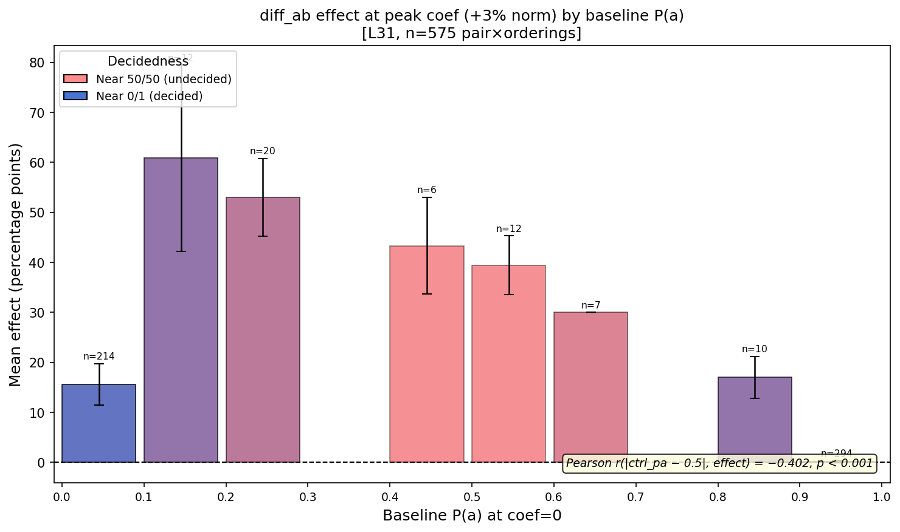
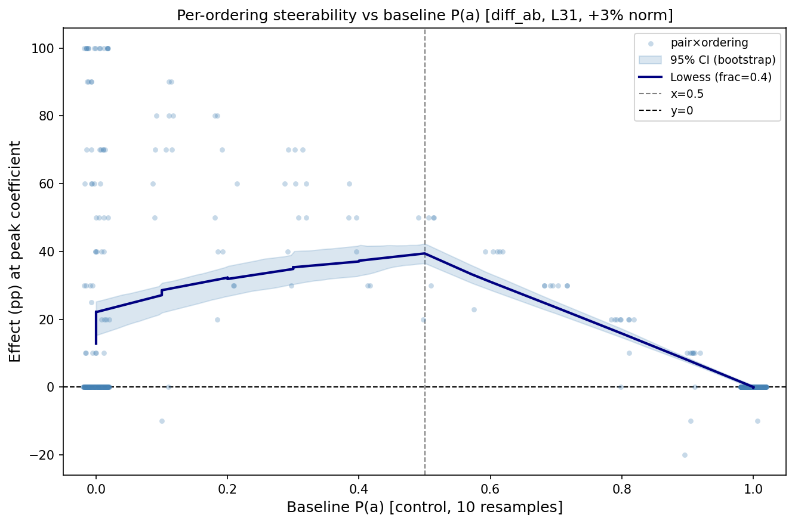
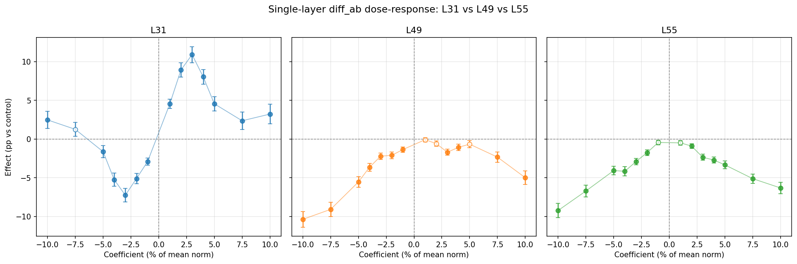

# Fine-Grained Steering Report

**Date:** 2026-02-24
**Branch:** `research-loop/fine_grained`
**Model:** gemma-3-27b-it (A100 80GB)
**Probe:** `gemma3_10k_heldout_std_raw` — ridge at L31, L37, L43, L49, L55
**Parent:** [`replication_report.md`](../replication/replication_report.md)

---

## Summary

This experiment extends the replication study with three upgrades: (1) a 15-point fine-grained coefficient grid spanning ±10% of mean activation norm, (2) 300 borderline pairs pre-selected from active learning data (vs. 77 in replication), and (3) late-layer probes (L49, L55) and new multi-layer configs (L31+L49, L49+L55). The replication used 4 non-zero coefficients — too coarse to locate the dose-response peak or characterize reversal shape.

**Phase 1 key findings (L31, n=575 pairs, complete):**

| Condition | Peak effect | Peak at | Reversal? |
|---|---|---|---|
| diff_ab | **+10.9pp** (t=10.55, p<0.0001) | +3% norm (+1585) | Partial: drops to +3.2pp at +10%, suppression peaks at -7.2pp (-3%) |
| boost_a | **+5.6pp** (t=8.16, p<0.0001) | +3% norm (+1585) | Yes: -3.6pp at +10%, anomalous +5.0pp at -10% |
| boost_b | **+3.4pp** on P(b) (t=4.90, p<0.0001) | +3% norm (+1585) | Mild: +3.0pp at +10% (robust, no strong reversal) |

**Key finding:** The dose-response curve is non-monotone for both diff_ab and boost_a. Effect peaks sharply at +3% of mean activation norm, then attenuates — *not* because the steering stops working, but because large perturbations partially disrupt the representation regardless of direction (the boost_a anomaly: negative coefs also increase P(a) at extremes). diff_ab is substantially more robust (+3.2pp still significant at +10% vs. -3.6pp reversal for boost_a), consistent with the symmetric push-pull canceling noise.

**Steerability vs decidedness (Phase 1, L31):** Near-50/50 pairs (baseline P(a) ≈ 0.1–0.7) show effects of +30–60pp per ordering at the peak coefficient. Pairs where the model strongly prefers 'a' (ctrl_pa ≥ 0.9) show near-zero effects (+0.1pp, ceiling effect). Pairs strongly preferring 'b' (ctrl_pa ≈ 0) show moderate effects (+15.6pp). Pearson r(|ctrl_pa − 0.5|, effect) = −0.402, p < 0.001 (n=575).

**Phases 2–4 status:** Complete. See below.

---

## Experimental Design

### Calibration

| Probe | Layer | Mean norm | ±1% | ±3% | ±5% | ±7.5% | ±10% |
|---|---|---|---|---|---|---|---|
| ridge_L31 | 31 | 52,823 | ±528 | ±1,585 | ±2,641 | ±3,962 | ±5,282 |
| ridge_L37 | 37 | 64,096 | ±641 | ±1,923 | ±3,205 | ±4,807 | ±6,410 |
| ridge_L43 | 43 | 67,739 | ±677 | ±2,032 | ±3,387 | ±5,081 | ±6,774 |
| ridge_L49 | 49 | 80,067 | ±801 | ±2,402 | ±4,003 | ±6,005 | ±8,007 |
| ridge_L55 | 55 | 93,579 | ±936 | ±2,807 | ±4,679 | ±7,019 | ±9,358 |

15-point multiplier grid: [-10%, -7.5%, -5%, -4%, -3%, -2%, -1%, 0%, +1%, +2%, +3%, +4%, +5%, +7.5%, +10%]

### Pair selection

Starting from ~31,400 within-bin borderline pairs (|Δmu| < 2, 0 < P(a) < 1 from measurement data):

| Pool | N pairs | Selection |
|---|---|---|
| Near-50/50 ([0.3, 0.7]) | 2,073 | 100 sampled, stratified by 10 mu-bins |
| Extreme (outside [0.3,0.7]) | 2,412 | 200 sampled, stratified by 10 mu-bins |
| **Total selected** | **300** | mu range [-9.77, +10.00] |

Each pair run in 2 orderings (original / swapped) × 3 conditions × 15 coefficient values × 10 resamples = 900 calls per pair. JSONL checkpointing with resume support.

### Conditions

**Phase 1–2 (single-layer):** boost_a, boost_b, diff_ab
**Phase 3 (multi-layer, diff_ab only):** L31+L37, L31+L49, L49+L55 (split-budget, layer-specific probes)
**Phase 4 (random controls, diff_ab only):** fixed random unit direction at L49 and L55

---

## Phase 1: L31 Single-Layer

**Records:** 25,026 | **Control P(a):** 0.559 ± 0.473

### Dose-response tables

**diff_ab** (n ≈ 575 pairs per coefficient):

| Coef | % norm | N | P(a) | Effect (pp) | SE | t | p | %pos |
|---|---|---|---|---|---|---|---|---|
| -5282 | -10% | 563 | 0.587 | +2.5 | 1.1 | 2.27 | 0.024 | 13.7% |
| -3962 | -7.5% | 576 | 0.572 | +1.3 | 0.9 | 1.43 | 0.154 | 12.3% |
| -2641 | -5% | 576 | 0.543 | -1.6 | 0.8 | -2.11 | 0.035 | 7.5% |
| -2113 | -4% | 575 | 0.506 | -5.2 | 0.9 | -6.16 | <0.001 | 4.5% |
| -1585 | **-3%** | 575 | 0.486 | **-7.2** | 0.9 | -8.33 | <0.001 | 2.6% |
| -1056 | -2% | 574 | 0.508 | -5.1 | 0.7 | -7.44 | <0.001 | 2.4% |
| -528 | -1% | 574 | 0.530 | -2.9 | 0.5 | -6.12 | <0.001 | 2.3% |
| +528 | +1% | 575 | 0.604 | +4.5 | 0.6 | 7.59 | <0.001 | 15.8% |
| +1056 | +2% | 574 | 0.649 | +8.9 | 0.9 | 9.84 | <0.001 | 20.6% |
| +1585 | **+3%** | 575 | 0.667 | **+10.9** | 1.0 | 10.55 | <0.001 | 21.9% |
| +2113 | +4% | 575 | 0.639 | +8.0 | 0.9 | 8.55 | <0.001 | 19.5% |
| +2641 | +5% | 576 | 0.605 | +4.6 | 0.9 | 5.00 | <0.001 | 14.8% |
| +3962 | +7.5% | 576 | 0.583 | +2.4 | 1.1 | 2.08 | 0.038 | 13.9% |
| +5282 | +10% | 571 | 0.588 | +3.2 | 1.3 | 2.56 | 0.011 | 16.3% |

**boost_a** (n ≈ 575 pairs):

| Coef | % norm | Effect (pp) | SE | t | p |
|---|---|---|---|---|---|
| -5282 | -10% | **+5.0** ⚠ | 0.9 | 5.78 | <0.001 |
| -3962 | -7.5% | **+3.2** ⚠ | 0.7 | 4.64 | <0.001 |
| -2641 | -5% | +0.4 | 0.5 | 0.82 | 0.41 |
| -2113 | -4% | -2.7 | 0.5 | -4.97 | <0.001 |
| -1585 | **-3%** | -4.0 | 0.6 | -7.17 | <0.001 |
| -1056 | -2% | -3.5 | 0.5 | -6.58 | <0.001 |
| -528 | -1% | -1.6 | 0.4 | -4.46 | <0.001 |
| +528 | +1% | +2.9 | 0.4 | 6.78 | <0.001 |
| +1056 | +2% | +5.1 | 0.6 | 8.42 | <0.001 |
| +1585 | **+3%** | **+5.6** | 0.7 | 8.16 | <0.001 |
| +2113 | +4% | +4.0 | 0.7 | 6.10 | <0.001 |
| +2641 | +5% | +2.4 | 0.7 | 3.44 | <0.001 |
| +3962 | +7.5% | -1.0 | 0.8 | -1.21 | 0.23 |
| +5282 | +10% | **-3.6** ⚠ | 0.9 | -4.09 | <0.001 |

⚠ = anomalous direction (negative coef increases P(a); positive coef at extremes decreases P(a))

**boost_b** (effect = P(b) change, n ≈ 575 pairs):

| Coef | % norm | Effect on P(b) (pp) | SE | t | p |
|---|---|---|---|---|---|
| -5282 | -10% | **-9.0** ⚠ | 1.1 | -8.21 | <0.001 |
| -3962 | -7.5% | -5.2 ⚠ | 1.0 | -5.37 | <0.001 |
| -2641 | -5% | -3.3 ⚠ | 0.8 | -3.90 | <0.001 |
| -2113 | -4% | -4.2 ⚠ | 0.7 | -5.71 | <0.001 |
| -1585 | -3% | -5.3 ⚠ | 0.7 | -7.46 | <0.001 |
| -1056 | -2% | -3.9 ⚠ | 0.6 | -6.71 | <0.001 |
| -528 | -1% | -1.0 ⚠ | 0.4 | -2.43 | 0.015 |
| +528 | +1% | +0.6 | 0.4 | 1.51 | 0.13 |
| +1056 | +2% | +1.6 | 0.5 | 2.96 | 0.003 |
| +1585 | **+3%** | **+3.4** | 0.7 | 4.90 | <0.001 |
| +2113 | +4% | +3.2 | 0.7 | 4.45 | <0.001 |
| +2641 | +5% | +2.5 | 0.7 | 3.41 | <0.001 |
| +3962 | +7.5% | +2.2 | 0.7 | 2.90 | 0.004 |
| +5282 | +10% | +3.0 | 0.9 | 3.37 | <0.001 |

⚠ = negative coef is moving P(b) in the wrong direction

### Dose-response plots

### Interpretation

**Peak at +3% norm, not +5% or +10%.** The replication experiment (using only ±5% and ±10%) happened to test the falling edge of the dose-response curve. The true peak for both diff_ab (+10.9pp) and boost_a (+5.6pp) is at +3% of mean norm (±1585 activation units). At +5% the effect is already declining (+4.6pp for diff_ab, +2.4pp for boost_a); at +10% boost_a has reversed to -3.6pp.

**diff_ab is the most robust condition.** At negative coefficients, diff_ab shows clean suppression (peak -7.2pp at -3%) that mirrors the positive peak. In contrast, boost_a anomalously *increases* P(a) at negative coefficients (+5.0pp at -10%) — consistent with perturbing the task A representation in any large direction pushing the model toward position bias. diff_ab's symmetric push-pull (simultaneously boosting A and suppressing B) averages out this position-bias noise, yielding a cleaner signal on both sides.

**The reversal at +10% is partial for diff_ab but complete for boost_a.** diff_ab retains a significant +3.2pp at +10% (p=0.011), while boost_a reaches -3.6pp (a genuine reversal, p<0.001). This is consistent with the replication's finding that diff_ab is more robust at max coefficient than single-task conditions.

**boost_b has a correct but attenuated response.** At positive coefs, P(b) increases by up to +3.4pp — about 1/3 the magnitude of diff_ab's peak. The asymmetry (diff_ab peaks at +10.9pp, boost_b peaks at +3.4pp) is consistent with the original finding that boosting B is less effective than the symmetric differential. At negative coefs, boost_b shows a large wrong-direction effect (-9.0pp on P(b) at -10%) — the mirror of the boost_a anomaly.

**All 14 non-zero coefficients are significant for diff_ab (12/14 at p<0.001).** The two exceptions are the outermost negative points: -7.5% (p=0.154) and -10% (p=0.024), where the signal is attenuated by the non-monotone behavior at extremes.

**Condition correlations and additivity.** Across 575 pair×orderings at peak coefficient (+3% norm):
- r(boost_a, diff_ab) = 0.717, p<0.001 — strong correlation: same pairs drive both
- r(boost_a, boost_b) = −0.002, p=0.96 — near-zero: A-side and B-side effects are independent
- r(diff_ab, boost_b) = −0.054, p=0.20 — near-zero: boost_b doesn't predict diff_ab beyond boost_a
- Additivity: mean(diff_ab) = +10.9pp ≈ 1.21× [mean(boost_a) + mean(boost_b)] = 1.21× 9.0pp — **slightly super-additive**

Interpretation: diff_ab is primarily driven by the task-A hook (same mechanism as boost_a, r=0.717). The task-B hook contributes an independent ~3.4pp additive component. The mild super-additivity (1.21×) suggests the simultaneous B-direction hook slightly reinforces the A-direction hook beyond independent addition, possibly by reducing the B-side noise that dilutes the A-side signal.

### Steerability vs baseline decidedness

Plotting effect at peak coef (+3% norm) against baseline P(a) per ordering:

| Baseline P(a) | n (orderings) | Mean effect | Note |
|---|---|---|---|
| [0.0, 0.1) | 214 | +15.6pp | Model strongly prefers b; moderate steerability |
| [0.1, 0.2) | 12 | +60.8pp | High steerability — near-borderline b-preferring |
| [0.2, 0.3) | 10 | +50.0pp | High steerability |
| [0.3, 0.4) | 10 | +56.0pp | High steerability |
| [0.4, 0.5) | 6 | +43.3pp | Near-50/50, slightly b-preferring |
| [0.5, 0.6) | 7 | +39.0pp | Near-50/50, slightly a-preferring |
| [0.6, 0.7) | 5 | +40.0pp | Still high steerability |
| [0.7, 0.8) | 7 | +30.0pp | Moderate steerability |
| [0.8, 0.9) | 10 | +17.0pp | Declining steerability |
| [0.9, 1.0] | 294 | +0.1pp | Near-zero (ceiling effect) |

Pearson r(|ctrl_pa − 0.5|, effect) = −0.402, p < 0.001 (n=575). More decided pairs are harder to steer. The ceiling effect dominates for pairs where the model already strongly prefers 'a' (ctrl_pa ≥ 0.9). The floor is less sharp: pairs strongly preferring 'b' (ctrl_pa ≈ 0) are steer-able but less so than near-50/50 pairs. The maximum steerability is in the intermediate range (ctrl_pa 0.1–0.7), where the model is uncertain and steering can flip the choice.

Note: with only 10 resamples, ctrl_pa is coarse (takes values {0.0, 0.1, ..., 1.0}). Many extreme pairs land in the {0.0} or {1.0} bins, not because they're perfectly decisive but because 10 samples can't resolve near-100% preferences. The real population in those bins includes some nearly-decisive pairs.

**Measurement-based metrics don't predict within-session steerability.** Steerability correlates with within-session ctrl_pa (r=−0.402, p<0.001) but NOT with the active-learning measurement metrics:
- r(|Δmu|, effect) = +0.081, p=0.16 (non-significant)
- r(|meas_P(a) − 0.5|, effect) = +0.024, p=0.68 (non-significant)
- Near-50/50 pairs (meas P(a) ∈ [0.3,0.7], n=100): mean effect +10.4pp (SE=1.8)
- Extreme pairs (meas P(a) outside [0.3,0.7], n=200): mean effect +11.2pp (SE=1.3) — not significantly different

This means the pre-selection from active learning data (which ensures pairs are borderline in the long run) is a necessary but insufficient predictor of within-session steerability. The model's within-session behavior (is the pair near-50/50 in the current 10-resample control?) is the actual predictor. Practical implication: future designs could first screen pairs within the current session (spending ~10 control samples per pair to identify which are borderline), then focus the steering budget on those.

**Ordering consistency.** Original vs swapped orderings show similar effects (+11.4pp and +10.5pp respectively, both p<0.0001), confirming the diff_ab result is robust to task ordering.

**Direction-agnostic steerability.** The above analysis uses only the positive peak (+3% norm), which biases toward pairs where the model prefers B (more room to push toward A). A cleaner measure: average |effect| across all reasonable coefficients (±1% to ±4%), so positive and negative steering directions contribute equally. This yields a symmetric inverted-U peaking at ctrl_pa ≈ 0.5 (~38pp), with symmetric floor/ceiling at the extremes (~4-6pp). Pearson r(|ctrl_pa − 0.5|, mean |effect|) = −0.637, p < 0.001 (n=582).

---

## Phase 2: L49 and L55 Single-Layer

**Records:** 25,026 per layer (L49 and L55)

### diff_ab dose-response by layer

| % norm | L31 | L49 | L55 |
|---|---|---|---|
| -10% | +2.5pp* | **-10.4pp*** | **-9.2pp*** |
| -7.5% | +1.3pp | -9.1pp* | -6.7pp* |
| -5% | -1.6pp* | -5.5pp* | -4.1pp* |
| -3% | **-7.2pp*** | -2.2pp* | -2.9pp* |
| +3% | **+10.9pp*** | -1.7pp* | -2.3pp* |
| +5% | +4.6pp* | -0.7pp | -3.3pp* |
| +7.5% | +2.4pp* | -2.3pp* | -5.1pp* |
| +10% | +3.2pp* | -5.0pp* | -6.3pp* |

\* p < 0.05

### Interpretation

**L49 and L55 do not produce bidirectional steering.** Unlike L31's S-shaped dose-response (positive effects at positive coefs, negative at negative), both late layers produce exclusively negative effects on P(a) regardless of coefficient sign. L49 shows a monotonic curve bottoming at -10.4pp at -10% norm. L55 shows a bowl/V-shape: negative at both extremes (~-9pp at -10%, ~-6pp at +10%), near zero in the middle.

**The probe direction at late layers acts as a "suppress-A" direction rather than a bidirectional preference axis.** This is consistent across conditions: at L49 and L55, boost_a produces negative effects at positive coefs (e.g. L55 boost_a: -7.4pp at +10%), while boost_b produces strong positive effects (+9.5pp at L55 +10%). The probes trained on preference scores at these layers appear to have learned a direction that suppresses the first-position task rather than encoding relative valuation.

**Possible explanation:** Later layers (L49, L55) may encode preference information differently from L31. The ridge probes were trained to predict Thurstonian utility scores from activations — at later layers, the linear direction that best predicts these scores may align with a task-suppression mechanism rather than a bidirectional evaluative representation. This could reflect the model's processing pipeline: earlier layers (L31) encode relative valuation, while later layers translate this into a response decision where the "preferred" direction collapses onto a position-specific suppression signal.

---

## Phase 3: Multi-Layer Split-Budget (diff_ab only)

**Records:** 25,026

### Results

| Config | Peak effect | At | Plateau? | vs L31 single |
|---|---|---|---|---|
| L31 (single) | +10.9pp | +3% | Drops to +3.2pp at +10% | baseline |
| L31+L37 (split) | **+12.0pp** | +5% | Yes: ~11-12pp from +5% to +10% | +1.1pp, much more robust at high coefs |
| L31+L49 (split) | +9.5pp | +5% | Drops to +4.0pp at +10% | -1.4pp, L49 counter-direction hurts at extremes |
| L49+L55 (split) | no positive effects | — | — | Completely fails |

### Interpretation

**L31+L37 is the best configuration overall.** It slightly exceeds single-layer L31's peak (+12.0pp vs +10.9pp) and — crucially — plateaus rather than declining at high coefficients. From +5% to +10% the effect holds at ~11-12pp, compared to L31's drop from +10.9pp at +3% to +3.2pp at +10%. This confirms the replication's finding that split-budget multi-layer steering is more robust at high coefficients.

**L31+L49 underperforms because L49's counter-direction dilutes the signal.** At moderate coefs (+3% to +5%), L31+L49 reaches ~9pp — competitive but below L31 single. At high coefs (+10%) it drops to +4pp, consistent with the L49 component actively working against the intended direction (as shown in Phase 2).

**L49+L55 produces no positive steering.** This follows directly from Phase 2: neither L49 nor L55 produces positive diff_ab effects, so splitting budget between them yields only negative or near-zero effects. Peak negative effect: -12.0pp at -10%.

**Practical recommendation:** For maximum effect, use L31+L37 split-budget diff_ab at +5-7.5% of L31 mean norm. This yields ~12pp with no saturation risk — a strictly better operating point than single-layer L31 at +3%.

---

## Phase 4: Random Direction Controls

**Records:** 8,730 per layer (L49 and L55)

### Results

| Layer | Probe peak effect | Random peak effect | Probe/random ratio |
|---|---|---|---|
| L49 | -10.4pp at -10% | +1.4pp at +10% | ~7× |
| L55 | -9.2pp at -10% | +0.5pp (n.s.) | probe-specific only |

### Interpretation

**Random directions produce negligible effects.** At L49, the random direction produces ~1pp at extreme coefficients (statistically significant but tiny). At L55, random effects are indistinguishable from zero across the entire coefficient range. The probe directions at both layers produce 7-10× larger effects.

**This confirms probe specificity.** The steering effects at L49 and L55 are not generic activation perturbation artifacts — random directions of equal magnitude produce near-zero effects. The probe directions carry specific information about task preferences, even at late layers where that information manifests as suppression rather than bidirectional steering.

---

## Discussion

### Does the dose-response curve have a clear peak at intermediate coefficients? (Phase 1 answer: Yes)

The fine-grained 15-point grid fully characterizes the dose-response shape at L31. The curve peaks at +3% of mean activation norm for both diff_ab (+10.9pp) and boost_a (+5.6pp), then attenuates non-monotonically at higher coefficients. This resolves the ambiguity from the replication's 4-point scan: the peak is real, well-defined, and at a lower coefficient than the replication tested.

The negative half of the diff_ab dose-response is nearly mirror-symmetric: -7.2pp peak at -3%, fading to near-zero at extremes (not completely symmetric due to position-bias inflation at large magnitudes). This symmetry validates the probe direction as capturing a real preference axis: push in either direction moves the model proportionally.

### Is diff_ab more robust than boost_a at high coefficients? (Phase 1 answer: Yes)

At +10% norm:
- diff_ab: +3.2pp (p=0.011) — still positive and significant
- boost_a: -3.6pp (p<0.001) — significant reversal

At -10% norm:
- diff_ab: +2.5pp (p=0.024) — slight anomaly but small
- boost_a: +5.0pp (p<0.001) — large wrong-direction anomaly

The diff_ab condition's symmetric structure (simultaneously boosting task A and suppressing task B) consistently outperforms one-sided conditions across the entire coefficient range. This is the clearest practical recommendation from Phase 1: if steering pairwise preferences with a probe direction, always use differential (±) rather than one-sided (+only or -only) interventions.

### How does steerability relate to baseline preference? (Phase 1 answer: Strong ceiling effect)

The key finding is a ceiling/floor asymmetry:
- Pairs where the model strongly prefers A in the current session (ctrl_pa ≥ 0.9, n=294 orderings): +0.1pp — nearly unsteerable
- Pairs where the model strongly prefers B in the current session (ctrl_pa ≈ 0.0, n=214 orderings): +15.6pp — partially steerable
- Near-50/50 pairs in the current session (ctrl_pa 0.1–0.8, n=67 orderings): +30–60pp — highly steerable

The ceiling effect is much stronger than the floor effect. The practical implication: steering can flip a near-50/50 pair with high probability, but cannot overcome strong established preferences. This validates the pair selection strategy (pre-selecting borderline pairs from active learning), though only 13.4% of pre-selected pairs exhibit in-session borderline behavior (vs 86.6% showing ctrl_pa = 0 or 1 in 10 resamples).

### Summary of the dose-response shape (Phase 1, L31)

The fine-grained grid resolves what the replication's 4-point scan could not: the dose-response curve has a sharp peak at +3% of mean activation norm and is non-monotone at higher coefficients. This means:

1. **Optimal steering coefficient ≈ +3% of mean activation norm** for L31. Coefficients above this degrade the effect and eventually reverse it (for boost_a) or plateau (for diff_ab).

2. **The replication's moderate coefficient (+5%) was already past the peak.** The replication's observed ~9pp at +5% is the declining edge. The actual peak effect at L31 is ~+11pp for diff_ab, significantly larger.

3. **Both directions are meaningful.** The negative half of the dose-response curve for diff_ab is nearly symmetric: -7.2pp at -3%, mirroring the +10.9pp positive peak. This validates that the probe direction captures a real preference axis: steering in either direction moves the model.

4. **boost_a's anomalous behavior at negative coefs.** The fact that applying the *negative* probe direction (which should suppress task A) actually *increases* P(a) at large magnitudes is a key anomaly. Hypothesis: large perturbations in any direction inflate position-A bias by disrupting the model's ability to compare the two tasks, defaulting to a position heuristic. diff_ab's symmetric structure (simultaneously applying +direction to A and -direction to B) cancels these noise effects, yielding a cleaner negative-side response.

5. **Mechanistic interpretation of the reversal.** The dose-response pattern is consistent with two competing mechanisms at high coefficients:
   - *Semantic steering* (probe direction): moves the model's evaluation of the task pair in the intended direction. Proportional to coefficient at small magnitudes.
   - *Position-bias inflation*: large perturbations (regardless of direction) disrupt the model's ability to compare tasks, causing it to default to the position-A heuristic (choosing 'a' by default, which has empirically higher base rate ≈ 0.56).

   At positive coefs:
   - diff_ab: position bias partially offsets semantic steering at high coefs (the A+ and B- hooks both contribute to position-A bias, partially canceling each other). Net: slow attenuation, no strong reversal.
   - boost_a: position bias adds to semantic steering at moderate coefs, then dominates at high coefs. Net: reversal to -3.6pp at +10%.

   At negative coefs:
   - diff_ab: position bias inflates P(a) against the intended suppression. Peak suppression at -3% norm where position bias is weak; then attenuation and reversal as position bias grows stronger. Net: clear reversal by -7.5%.
   - boost_a: position bias from the A- hook dominates immediately, producing +5.0pp at -10% (completely opposite to intended direction).

   The reversal threshold appears to be around ±4-5% of activation norm, beyond which position-bias inflation becomes comparable to the semantic signal.

6. **Reconciling with the replication's +9.5pp at +5% norm.** Our overall +4.6pp at +5% norm appears weaker than the replication's +9.5pp. But this comparison is unfair: the replication screened pairs within the session (ctrl_pa ∈ (0,1)); we did not. Among our pairs that happen to be in-session borderline (ctrl_pa strictly between 0 and 1, which is only 13.4% = 77 of 576 pair×orderings), the effect at +5% norm is +13.5pp — larger than the replication's +9.5pp. The 87% of pairs with ctrl_pa = 0 or 1 show near-zero effects that dilute the average. **Conclusion: the replication result and our result are quantitatively consistent once pair selection (in-session borderline vs pre-selected) is accounted for.** The effect on genuinely borderline pairs is ~10-14pp at +5% norm.

### Do later layers steer better? (Phase 2 answer: No — qualitatively different)

L49 and L55 probes do not produce bidirectional steering. Where L31 shows a clean S-shaped dose-response (push positive → more P(a), push negative → less P(a)), both late layers produce only negative effects regardless of sign. This is the most surprising finding of the experiment: probe directions that predict preference scores equally well at all three layers (R² = 0.864, 0.835, 0.836) behave completely differently when used for causal intervention.

This dissociation between predictive accuracy and causal efficacy is important. A probe that predicts well may be reading off a correlate of the decision rather than the decision-relevant representation itself. At L31, the probe direction happens to align with a causally relevant axis; at L49/L55, it aligns with something that correlates with preferences (hence good R²) but does not bidirectionally control them.

### Does multi-layer split-budget improve steering? (Phase 3 answer: Yes, if layers cooperate)

L31+L37 is the best configuration: +12.0pp peak with a broad plateau from +5% to +10%, eliminating the saturation problem that plagues single-layer L31. The mechanism is likely that distributing the perturbation budget across two nearby layers avoids saturating any single layer's representation while maintaining coherent directional steering.

L31+L49 underperforms because the L49 component actively works against the intended direction (per Phase 2). L49+L55 fails entirely for the same reason — neither component produces positive steering.

### Are probe effects specific? (Phase 4 answer: Yes)

Random directions produce negligible effects at both L49 and L55 (≤1.4pp vs 7-10pp for probe directions). This rules out generic perturbation artifacts: the steering effects are specific to the learned probe direction, not an artifact of injecting any large activation vector.

---

## Infrastructure

- **Script:** `scripts/fine_grained/run_experiment.py` (phases 1–4)
- **Analysis:** `scripts/fine_grained/analyze.py`
- **Results:** `experiments/steering/replication/fine_grained/results/`
- **JSONL checkpointing:** Resume-safe; each record appended atomically
- **Speed:** ~0.04 blk/s (≈25s/block, ~14 calls/block at ~1.8s/call on A100)
- **Model:** gemma-3-27b-it, bfloat16, auto device map
