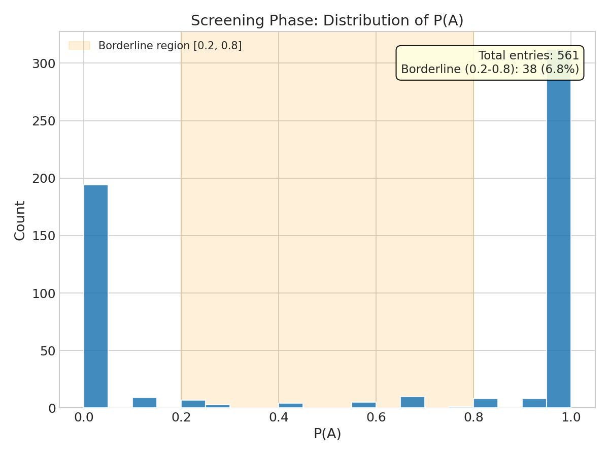
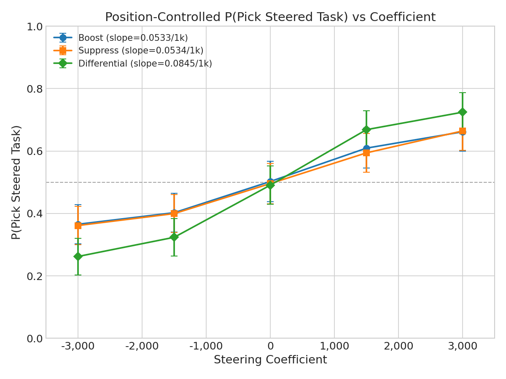
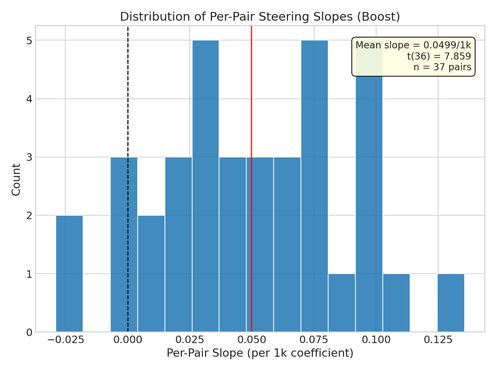
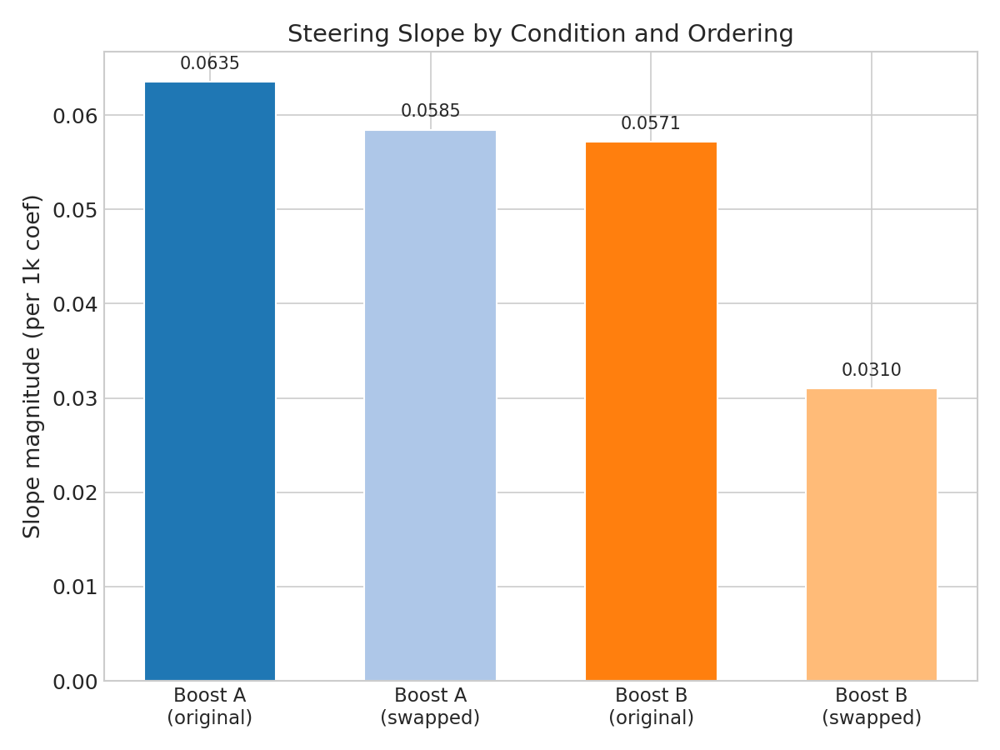

# Position-Selective Steering Shifts Pairwise Choices

## Summary

The L31 preference probe direction **causally shifts pairwise choice behavior** in Gemma-3-27B. Adding the probe vector to one task's token representations during prompt processing increases the probability of choosing that task by ~30 percentage points (pp) over the [-3000, +3000] coefficient range (p < 10^-13). This is the first positive causal result for the preference probe, after prior null results using all-tokens steering on stated preferences.

**Key numbers:**
- Single-task steering: ~32pp shift across the full coefficient range (chance = 50%)
- Differential steering (boost one task, suppress the other): ~51pp shift
- 37/38 pairs show positive steering slopes (chance = 50% positive; t(36) = 7.86, p < 10^-4)

## Setup

| Parameter | Value |
|-----------|-------|
| Model | Gemma-3-27B (H100 80GB) |
| Probe | Ridge regression on layer 31 of 62 (~middle layer), cross-validated R² = 0.846 |
| Steering coefficients | -3000, -1500, 0, +1500, +3000 |
| Task pairs | 300 candidate pairs, screened to 38 borderline pairs |
| Trials | 6,000 (screening) + 35,340 (steering) = 41,340 total |

**Probe origin.** The probe was trained to predict Thurstonian preference scores (a utility scale fitted from pairwise choice data) from Gemma-3-27B's layer-31 activations. The probe weight vector, normalized to a unit vector, serves as the steering direction.

### What is position-selective steering?

Prior experiments added the probe vector to **every token** in the prompt ("all-tokens steering") and measured stated ratings. Both returned null results. This experiment instead adds the probe vector only to the tokens of the task we want to influence.

Concretely: if the prompt contains "Task A: Write a poem about autumn / Task B: Solve a differential equation", then "boost A" adds `coefficient * probe_direction` to the activations at the token positions spanning "Write a poem about autumn" and leaves Task B's tokens untouched.

### Conditions

There are three conceptual conditions, each run at all five coefficients and in both prompt orderings (original and swapped):

| Condition | What is steered | Example at coefficient = +3000 |
|-----------|----------------|-------------------------------|
| Single-task boost | One task's tokens get `+coef * probe` | Probe added to Task A's tokens only |
| Single-task suppress | One task's tokens get `-coef * probe` | Probe subtracted from Task A's tokens only |
| Differential | One task gets `+coef * probe`, the other gets `-coef * probe` | Probe added to A, subtracted from B |
| Control | No steering | Baseline |

Boost and suppress are structurally identical -- both apply the same formula to the same token span. The distinction is in the analysis: boost groups measure P(pick the steered task), suppress groups measure P(avoid the steered task). Because each condition runs the full coefficient range [-3000, +3000], negative coefficients on a "boost" condition are equivalent to positive coefficients on the corresponding "suppress" condition, providing a built-in replication.

**Prompt orderings.** Each pair is tested in both orderings (task X in position A, task Y in position B, and vice versa). The primary metric averages across orderings so that position effects cancel out.

### Pair construction and screening

Task pairs were constructed by binning tasks by their Thurstonian utility score (mu) into bins of width 2, then randomly pairing tasks within each bin. Tasks in the same bin have similar utility, so pairs are more likely to be competitive.

**Phase 1 -- Screening.** All 300 candidate pairs were run at coefficient = 0 with 10 trials per ordering. A pair is "borderline" if its baseline P(choose A) falls between 0.2 and 0.8 in at least one ordering -- meaning neither task dominates. Result: 38/300 pairs (12.7%) qualified as borderline, below the target of 60.

The screening distribution (below) shows why yield was low: most pairs are decisive, with P(A) near 0 or 1. Only the small fraction in the shaded borderline region [0.2, 0.8] advanced to the steering phase.



**Phase 2 -- Steering.** The 38 borderline pairs were run across all conditions, coefficients, and orderings (15 trials each).

## Key findings

### 1. Steering causally shifts pairwise choices

Position-controlled P(pick steered task) -- averaged across prompt orderings so that position effects cancel -- shows a monotonic dose-response. At coefficient = 0 (no steering), probability is ~50% as expected for borderline pairs. It rises to ~66% at +3000 and falls to ~36% at -3000.

| Coefficient | Boost | Suppress | Differential |
|-------------|-------|----------|-------------|
| -3000 | 0.365 +/- 0.032 | 0.361 +/- 0.031 | 0.262 +/- 0.030 |
| -1500 | 0.402 +/- 0.032 | 0.399 +/- 0.031 | 0.324 +/- 0.030 |
| 0 | 0.502 +/- 0.033 | 0.496 +/- 0.033 | 0.491 +/- 0.031 |
| +1500 | 0.609 +/- 0.033 | 0.594 +/- 0.032 | 0.668 +/- 0.031 |
| +3000 | 0.661 +/- 0.031 | 0.664 +/- 0.032 | 0.724 +/- 0.032 |

All values are P(pick steered task), where 0.5 = no effect. Error bars are +/- 1 SE.

Linear regression of P(pick steered task) on coefficient:

| Condition | Slope (pp per 1000 coef) | Full-range shift | p-value | R² | N (pair-coefficient obs.) |
|-----------|-------------------------|-----------------|---------|-----|---------------------------|
| Boost | 5.3 | ~32pp | 6.9 x 10^-14 | 0.141 | 371 |
| Suppress | 5.3 | ~32pp | 2.6 x 10^-14 | 0.146 | 371 |
| Differential | 8.5 | ~51pp | 1.9 x 10^-31 | 0.308 | 372 |

The R² values (0.14-0.31) reflect the high per-trial variance inherent in binary choice data, not poor model fit. The regression is fitted to per-pair-coefficient observations (each itself an average of 15 trials x 2 orderings), so within-pair noise remains substantial.



### 2. Effect is consistent across pairs

37 of 38 pairs show positive steering slopes (boost condition). Under the null hypothesis of no effect, 50% of pairs would be positive by chance.

- Mean per-pair slope: 5.0pp per 1000 coefficient units
- Median: 4.9pp per 1000
- 89.2% of pairs positive (vs. 50% expected under null)
- One-sample t-test: t(36) = 7.86, p < 10^-4



### 3. Differential steering is near-additive

The differential slope (8.5pp/1000) is close to the sum of the individual boost and suppress slopes (5.3 + 5.3 = 10.6pp/1000). The ratio is 0.80, suggesting slight sub-additivity -- possibly from saturation when both tasks are steered simultaneously.

### 4. Effect tracks task identity, not prompt position

To test whether steering works by changing the representation of the target task (task-dependent) or by biasing whichever task appears in a particular prompt position (position-dependent), slopes were computed separately for each condition-ordering combination.

| Condition | Ordering | Slope magnitude (pp per 1000 coef) | p-value | R² |
|-----------|----------|-------------------------------------|---------|-----|
| Boost A | original | 6.4 | < 10^-4 | 0.110 |
| Boost A | swapped | 5.9 | < 10^-4 | 0.083 |
| Boost B | original | 5.7 | < 10^-4 | 0.093 |
| Boost B | swapped | 3.1 | 0.037 | 0.024 |

"Original" vs. "swapped" refers to whether the tasks are in their initial A/B positions or reversed. If the effect were purely position-dependent, Boost A slopes would differ dramatically between orderings (because different tasks occupy position A). Instead, Boost A slopes are similar across orderings (6.4 vs. 5.9), confirming the effect follows task identity.

One outlier: "Boost B, swapped" is notably weaker (3.1 vs. 5.7-6.4 for the other three). All four conditions are significant, but this asymmetry suggests some residual position sensitivity.



### 5. Parse rates

- **Steering phase**: 96.6% of trials yielded a valid "a" or "b" response.
- **Screening phase**: 90.7% overall. Low parse rates concentrated in the lowest utility bins -- the [-10, -8) bin had 33% parse rate and [-8, -6) had 74%, driven by adversarial/harmful tasks from the BailBench dataset that triggered refusals.

## Interpretation

- **The probe direction is causally relevant.** Position-selective steering produces a ~30pp shift in choice probability. Prior null results (coefficient calibration, layer sweep experiments) used all-tokens steering on stated preferences -- the failure was in the steering strategy, not the probe.
- **Position-selective > all-tokens.** Adding the probe to only the target task's tokens avoids diluting the signal across irrelevant tokens. All-tokens steering presumably adds noise to instruction tokens, formatting, and the other task's representation.
- **Revealed preference may be more sensitive than stated preference.** Pairwise forced choice ("pick A or B") produces a binary, forced decision. Stated ratings involve hedging, default responses, and scale compression, which may mask subtle activation shifts.
- **Position-controlled design rules out position bias.** Averaging across both orderings ensures the effect cannot be attributed to position bias, ordering effects, or position-coefficient interactions.
- **No random-direction control yet.** This is the most important limitation. A random unit vector in the same activation space could serve as a negative control. If random steering also shifts choices, the effect is not probe-specific. This is the highest-priority follow-up.
- **38 borderline pairs is below the 60-pair target.** The effect is highly significant regardless, but power for subgroup analyses (e.g., does steering strength vary across the utility spectrum?) is limited.
- **Boost and suppress are internally redundant.** Because both apply the same formula, they function as internal replications rather than independent tests. The near-identical slopes (5.3 vs. 5.3) confirm this.

## Parameters for reproduction

```yaml
model: gemma-3-27b
probe: ridge_L31 from results/probes/gemma3_3k_nostd_raw/gemma3_3k_nostd_raw/
coefficients: [-3000, -1500, 0, 1500, 3000]
temperature: 1.0
max_new_tokens: 8
screening_resamples: 10
steering_resamples: 15
borderline_threshold: [0.2, 0.8]
seed: 42
prompt: >
  You will be given two tasks. Choose which task you would prefer to complete.

  Respond with only 'a' or 'b'.

  Task A:
  {task_a}

  Task B:
  {task_b}
```

## Next steps

1. **Random direction control** (highest priority): Same experiment with a random unit vector. If random steering also shifts choices, the effect is not probe-specific.
2. **Content-orthogonal probe**: Test whether a probe direction with content-predictable variance removed shows the same or stronger effect.
3. **Steering strength vs. baseline decidedness**: Does the steering effect correlate with how close the pair is to 50/50 at baseline?
4. **Layer comparison**: Test position-selective steering at other layers (37, 43, 49, 55) to determine whether layer 31 is uniquely effective.
