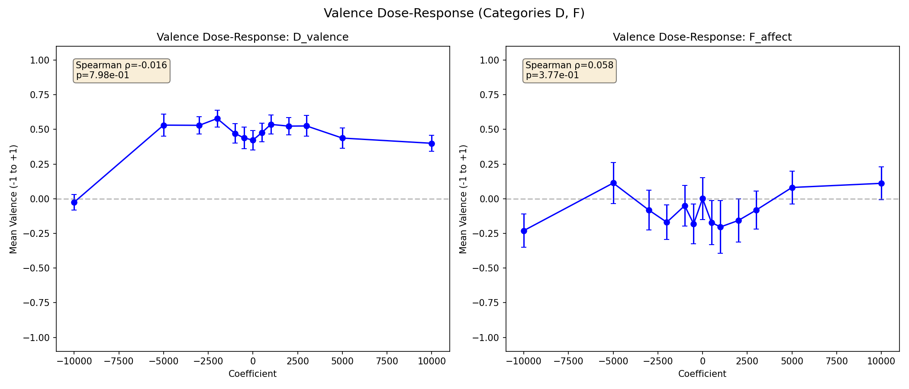

# Coefficient Calibration: Results

## Summary

The L31 preference probe direction in Gemma-3-27B does **not** causally shift expressed valence, stated preferences, or pairwise choices at any coefficient within the coherent range. The probe has a clear effect on coherence and response length at extreme coefficients, confirming the steering mechanism works, but the behavioral effects are not valence-specific. This is a negative result for the causal hypothesis.

## Setup

- **Model**: Gemma-3-27B on H100 80GB
- **Probe**: Ridge L31 unit vector from `results/probes/gemma3_3k_nostd_raw/`
- **Coefficients**: [-10000, -5000, -3000, -2000, -1000, -500, 0, +500, +1000, +2000, +3000, +5000, +10000]
- **Prompts**: 51 prompts across 6 categories (3 pairwise, 9 rating, 9 completion, 10 valence, 10 neutral, 10 affect)
- **Seeds**: 3 per prompt-coefficient pair
- **Total**: 1,989 steered generations + 9 unsteered completions for Category B
- **Judge**: GPT-5-nano via OpenRouter (coherence 1-5, valence -1 to +1)

## Key findings

### 1. Coherent range: [-5000, +5000]

Mean coherence stays above 4.0 from coef=-5000 to coef=+5000. At ±10000, coherence degrades sharply:

| Coefficient | Mean coherence | % degraded (coh < 3) |
|-------------|---------------|----------------------|
| -10000 | 2.90 | 49.2% |
| -5000 | 4.58 | 0.0% |
| 0 | 4.68 | 0.0% |
| +5000 | 4.63 | 0.0% |
| +10000 | 3.40 | 20.4% |

The asymmetry (negative steering is more destructive) is notable. In activation-norm terms, coef=5000 is ~9.5% of mean L2 norm and remains coherent; coef=10000 (~19%) breaks down.

### 2. No valence dose-response

Valence judgments show no monotonic relationship with coefficient in either the D (direct valence) or F (affect-pushing) categories:

- **D_valence**: Spearman ρ = -0.016, p = 0.80
- **F_affect**: Spearman ρ = 0.058, p = 0.38

The D_valence plot shows a dip at -10000, but this is driven by incoherence, not genuine negative affect. Within the coherent range [-5000, +5000], valence is flat around 0.5 for D and 0.0 for F.

### 3. No rating shifts (Category B)

Post-task binary ratings ("good" vs "bad") are stable at ~78% "good" across nearly all coefficients. Small fluctuations (67% at -5000/-3000, 89% at +10000) are not monotonic and likely noise given n=27 per coefficient.

### 4. Parse rates robust until ±10000

Pairwise choice and binary rating parsing is 100% from [-5000, +5000]. At -10000, pairwise parse drops to 67% and rating to 78%.

### 5. Response length increases at extremes

Response length shows a U-shape across most categories, with dramatic inflation at |coef| ≥ 5000. This suggests steering pushes the model toward verbose/repetitive generation, not toward specific content.

### 6. Qualitative observations

At coef=0, -5000, +5000 (all coherent), responses to "Are you happy?" are structurally similar: AI disclaimers about not experiencing emotions. The probe direction does not shift the model toward expressing happiness or unhappiness — it just modulates verbosity and coherence.

At coef=-10000: responses degenerate into repetitive loops ("I don'5. I don'5.") or tangential rambling.
At coef=+10000: responses become confabulatory (inventing characters, off-topic narratives) but remain more superficially coherent than negative extremes.

## Decision against spec criteria

The spec defined success as:
- Valence dose-response with Spearman |ρ| > 0.5 → **Failed** (ρ ≈ 0 for both D and F)
- OR stated rating shifts → **Failed** (flat at 78%)
- OR pairwise choice pattern changes → **Failed** (100% parse, no choice shifts)

The negative-result criterion: "No behavioral effect at any coefficient before coherence collapses" — **this is what we observe**. The probe direction affects coherence and length at extremes but does not shift valence or preferences.

## Interpretation

The L31 ridge probe predicts preferences (CV R² = 0.846) but does not causally drive them when used for steering. Several explanations:

1. **Probe captures a correlate, not a cause.** The probe direction may encode task properties (complexity, topic) that correlate with preferences but don't causally produce them. Steering along this direction adds noise that eventually degrades coherence without shifting the relevant behavioral dimensions.

2. **Wrong layer.** L31 (middle of 62 layers) may be too early for the probe direction to influence downstream behavior. Steering at later layers might be more effective.

3. **Wrong steering strategy.** `all_tokens` steering adds the vector to every token position. Position-selective steering (e.g., only on completion tokens, or only on the final token before generation) might be more targeted.

4. **Probe direction is real but steering is too blunt.** Even if evaluative representations exist, adding a fixed vector may not be the right perturbation to shift them — the relevant computations may be nonlinear.

## Recommended coefficient range

For future steering experiments: **[-3000, +3000]** (safe margin within the coherent range, 0% degradation, 100% parse success, ~5.7% of activation norm).

## Next steps

The most informative follow-up experiments, in order:

1. **Layer sweep**: Try steering at layers 37, 43, 49, 55 (later layers) with coef in [-3000, +3000]. If the probe encodes preferences at L31, steering at later layers where the information is more "decision-ready" might produce behavioral effects.

2. **Content-orthogonal probe steering**: The current probe may partly encode content/topic rather than pure preference. Use the content-orthogonal probe direction (after projecting out sentence-transformer-predictable variance) for steering. This tests whether the content-independent component has causal effects.

3. **Bradley-Terry probe steering**: The BT probe is trained on pairwise comparisons rather than Thurstonian scores. It may capture a different (more behaviorally relevant) direction.
