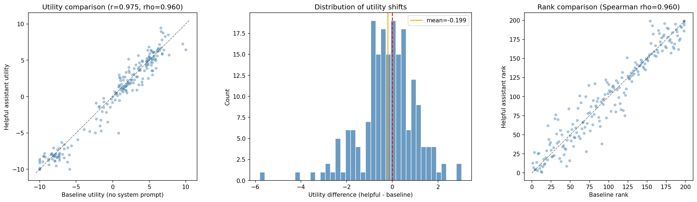
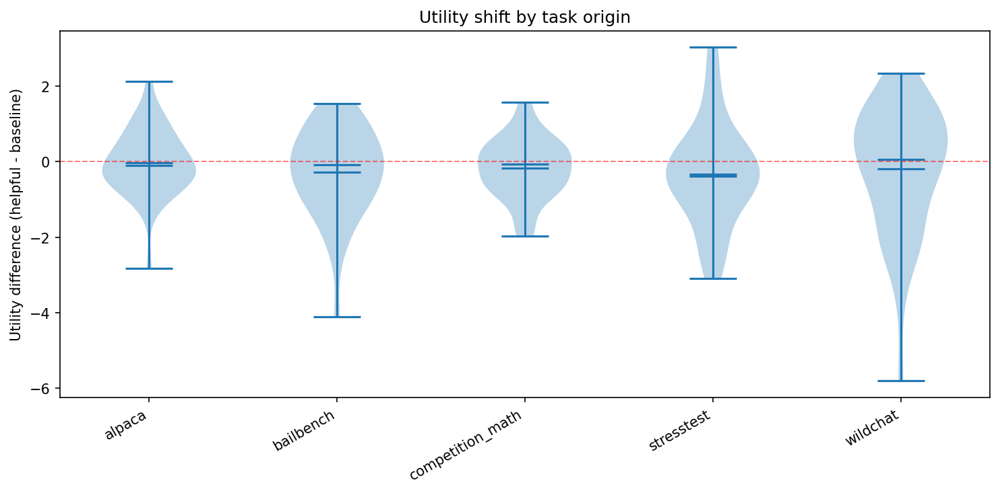

# System Prompt Ablation: Effect of "You are a helpful assistant." on Pre-Task Revealed Preferences

## Summary

- Adding "You are a helpful assistant." to the prompt has **minimal effect** on the preference utility vector: Pearson r = 0.975, Spearman rho = 0.960, cosine similarity = 0.974.
- The rank ordering is highly preserved overall, though there is meaningful noise at the extremes (top-10 overlap only 50%).
- Small systematic negative shift (mean = -0.20 on ~[-10, 10] scale), but no compression of the utility distribution (std 5.49 vs 5.31).
- Bailbench tasks show the weakest correlation (r = 0.60), suggesting system prompt framing may affect how the model handles ethically charged content.

## Setup

- **Model:** gemma-3-27b (via OpenRouter)
- **Task pool:** 200 tasks, stratified across wildchat, alpaca, math, bailbench, stress_test (40 each), task_sampling_seed=99
- **Measurement:** Pre-task active learning with pairwise revealed preferences (choose and complete one of two tasks)
- **Conditions:**
  - **Baseline:** No system prompt — template starts directly with "You will be given two tasks..."
  - **Helpful:** "You are a helpful assistant." prepended to the user message (Gemma doesn't support system role, so prepended to user turn)
- **AL parameters:** initial_degree=5, batch_size=500, max_iterations=15, convergence_threshold=0.995, n_samples=5
- **Temperature:** 0.7

## Results

### Global Correlation

| Metric | Value |
|--------|-------|
| Pearson r | 0.975 |
| Spearman rho | 0.960 |
| Cosine similarity | 0.974 |
| Mean utility shift (helpful - baseline) | -0.199 |
| Std of utility shift | 1.218 |
| Max |shift| | 5.80 |
| Baseline comparisons | 14,286 |
| Helpful comparisons | 16,691 |
| Baseline mu std | 5.31 |
| Helpful mu std | 5.49 |
| Baseline pair agreement | 0.970 |
| Helpful pair agreement | 0.967 |

Both Thurstonian fits converged. The utility vectors are highly correlated — the system prompt does not substantially change the preference ordering.



Left: scatter of per-task utilities (tight around diagonal). Center: distribution of differences (centered near zero with slight negative mean). Right: rank comparison (strong agreement).

### Rank Overlap at Top/Bottom

| Set | Overlap |
|-----|---------|
| Top-10 | 5/10 (50%) |
| Top-20 | 16/20 (80%) |
| Top-50 | 42/50 (84%) |
| Bottom-10 | 6/10 (60%) |
| Bottom-20 | 11/20 (55%) |
| Bottom-50 | 49/50 (98%) |

The top-10 and bottom-10/20 show more disagreement. This is expected: at the extremes, small utility shifts can swap ranks. The bottom-50 overlap of 98% suggests the least-preferred tasks (mostly bailbench/stress_test) are very robust to the system prompt.

### Breakdown by Task Origin

| Origin | n | r | Mean diff | Std |
|--------|---|---|-----------|-----|
| alpaca | 40 | 0.922 | -0.024 | 0.861 |
| bailbench | 40 | 0.604 | -0.279 | 1.166 |
| competition_math | 40 | 0.903 | -0.180 | 0.795 |
| stresstest | 40 | 0.966 | -0.326 | 1.347 |
| wildchat | 40 | 0.846 | -0.187 | 1.678 |



Bailbench stands out with the lowest within-origin correlation (r = 0.604). These are ethically sensitive tasks (harm, abuse, illegal activity) — the "helpful assistant" framing likely shifts how the model resolves the tension between completing a task and refusing. This is consistent with the system prompt primarily affecting safety-adjacent behavior.

Stress test tasks show the highest correlation (r = 0.966) despite the largest mean shift (-0.33), suggesting the system prompt shifts the utility of value-laden tasks uniformly rather than reordering them.

### Biggest Movers

**Largest positive shifts** (system prompt makes task more preferred):
- `stresstest_14_680_value1`: +3.03
- `stresstest_15_189_neutral`: +2.88
- `wildchat_34610`: +2.34

**Largest negative shifts** (system prompt makes task less preferred):
- `wildchat_24075`: -5.80
- `bailbench_1071`: -4.11
- `wildchat_14461`: -3.55

The largest outlier (`wildchat_24075`, shift of -5.80) deserves investigation — this may be a task where the system prompt triggers a refusal or completion-style change that shifts revealed preference.

## Interpretation

The system prompt has a negligible effect on the overall preference structure. Pearson r = 0.975 means ~95% of variance in utility is shared between conditions. For probe training purposes, a probe trained on either condition's utilities should transfer well to the other.

There is a small negative level shift (mean -0.20) but no compression — the helpful condition's utility variance is actually marginally larger (std 5.49 vs 5.31). Pair agreement is nearly identical (0.967 vs 0.970), so the system prompt doesn't affect measurement noise.

The bailbench weakness (r = 0.60) is the most noteworthy finding — it suggests the system prompt affects the model's willingness to engage with ethically sensitive content, which can flip pairwise choices. This is relevant if probes are expected to generalize across different system prompt conditions.

## Caveats

- **n=200 tasks** — sufficient for correlation estimates but the top-k overlap metrics are noisy at small k.
- **Gemma doesn't support system role** — the "system prompt" was prepended to the user message, which is a weaker intervention than a true system-role message. On models with proper system role support, the effect could be larger.
- **Baseline ran second** due to a cache race condition (both conditions ran in parallel, second writer overwrote first). Baseline was rerun sequentially. Both conditions used the same task set (same seed) so this doesn't affect validity.
- AL convergence criteria were the same for both conditions, but they converged at different rates (baseline: 14K comparisons, helpful: 17K), suggesting slightly different noise profiles.

## Reproduction

```bash
# Run both conditions (sequentially to avoid cache race)
python -m src.measurement.runners.run configs/measurement/active_learning/sysprompt_ablation_baseline.yaml --max-concurrent 50
python -m src.measurement.runners.run configs/measurement/active_learning/sysprompt_ablation_helpful.yaml --max-concurrent 50

# Analysis
python -m scripts.sysprompt_ablation_analysis
```
