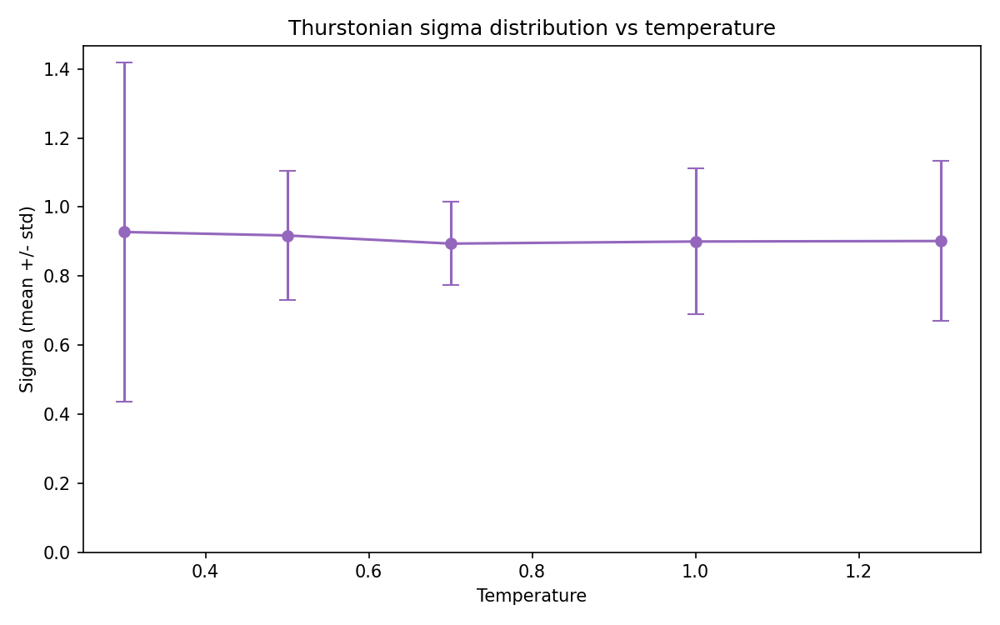

# Temperature Calibration — Gemma 3 27B

**Question:** Which generation temperature produces the most faithful preference measurements?

**Date:** 2026-02-20
**Model:** Gemma 3 27B via OpenRouter
**Branch:** research-loop/temperature_calibration

---

## Setup

- **Temperatures tested:** 0.3, 0.5, 0.7, 1.0, 1.3
- **Task set:** 500 tasks subsampled from 10K measured set (seed=42, stratified across origins)
- **Pair design:** d-regular graph (d=5, seed=42) via `pre_task_active_learning` with `max_iterations: 1` — same 1250 pairs at every temperature
- **Samples per pair:** 5
- **Total API calls:** ~31,250 (1250 pairs × 5 samples × 5 temperatures)

**Implementation note:** The measurement cache does not include temperature in its key. Each temperature run was made with a fresh cache to prevent contamination.

**Activations note:** Gemma 3 27B activations are not available locally (stored on RunPod). Probe R² was computed using Gemma 2 27B base activations as a proxy (same 30K task corpus; 100% overlap with 4K eval set; 40% overlap with 500 sweep tasks). This allows relative comparison between temperatures but the absolute R² values are not directly comparable to the target model.

---

## Results

### Summary Table

| Temperature | Consistency | Entropy | Thurstonian NLL | Sigma max | Probe R² (G2 proxy) |
|-------------|------------|---------|-----------------|-----------|---------------------|
| 0.3         | **0.9796** | 0.0473  | **780.7**       | **7.39**  | 0.339               |
| 0.5         | 0.9768     | 0.0494  | 943.1           | 2.84      | **0.347**           |
| **0.7**     | **0.9808** | **0.038** | 991.3         | **1.42**  | 0.310               |
| 1.0         | 0.9749     | 0.0529  | 807.8           | 4.47      | 0.337               |
| 1.3         | 0.9756     | 0.0526  | 1275.9          | 5.08      | 0.334               |

### Metrics vs Temperature

### Ranking Stability Heatmap

### Thurstonian Sigma Distribution

---

## Key Findings

### 1. Choice consistency is very high and non-monotone

All temperatures show >97% choice consistency — in almost every pair, 4 or 5 out of 5 samples agree. The relationship with temperature is not monotone: T=0.7 actually has the highest consistency (0.9808), not T=0.3 as one might expect.

This suggests that for pairwise preference tasks, Gemma 3 27B has strong preference signals that are robust to temperature in the 0.3–1.3 range.

### 2. Low temperature creates poorly-scaled utility estimates

T=0.3 has the best (lowest) NLL (780.7) but the worst sigma distribution (max σ = 7.39, vs 1.42 at T=0.7). These are not contradictory: near-deterministic choices (5/5 agreement) make Thurstonian fitting easy in terms of *direction* (A > B), leading to good NLL. But they give insufficient information to calibrate the *scale* of utility differences — the model cannot anchor how far apart two tasks are, only that one is preferred. This manifests as unconstrained sigma values (effectively infinite spread) for tasks at the tails of the utility distribution.

T=0.7 shows the most stable sigma distribution (mean=0.89, std=0.12, max=1.42), indicating well-constrained utility estimates. Sigma here is directly analogous to the precision of the utility estimate — tighter is better for downstream probe training.

### 3. Utility rankings are highly stable across temperatures

Spearman correlations between all temperature pairs range from 0.846 to 0.876. Temperature mainly affects the noise level (sigma) and scale, not the relative ordering of tasks. This is reassuring: there is a consistent underlying preference structure that all temperatures recover.

### 4. Probe R² signal is weak with proxy model

Using Gemma 2 27B base activations as a proxy (only 198 training tasks out of 500), probe R² ranges from 0.310 to 0.347 — a narrow spread. T=0.5 peaks (0.347) and T=0.7 is lowest (0.310). With only 198 training examples, this comparison has high variance and should not be over-interpreted without Gemma 3 27B activations.

### 5. High temperatures increase instability

T=1.3 has the worst NLL (1275.9) and second-worst max sigma (5.08), suggesting higher temperatures introduce noise without benefit. Note: API failure counts varied non-monotonically (T=0.7: 312 timeouts, T=1.3: 28 timeouts) — this reflects OpenRouter load during the runs (measurements were taken at different times of day), not a temperature effect on parse quality.

---

## Recommendation

**T=0.7 is the best choice**, and this analysis confirms the current default is well-calibrated:

1. **Tightest sigma distribution** (max=1.42 vs 7.39 at T=0.3) — best-constrained Thurstonian utility scale. Consistency and entropy are correlated signals pointing in the same direction: T=0.7 produces the most stable, well-calibrated preference signal.
2. **Good ranking stability** — Spearman correlations are uniformly high (0.846–0.876) across all temperature pairs; temperature does not affect the relative ordering of tasks.

T=0.3 achieves the best NLL but produces poorly-scaled utilities (extreme sigma) — the near-deterministic choices tell the model the direction of preferences but not their magnitude. T=1.3 has both poor NLL and poor sigma.

**Caveat on probe R²:** The spec identified probe R² as the primary metric, but Gemma 3 27B activations are unavailable locally. The proxy analysis (Gemma 2 27B, only 198 training tasks) shows T=0.5 marginally ahead (0.347 vs 0.310 at T=0.7). However, with only 198 training tasks this difference has high variance, and T=0.7's strong performance on sigma quality — which directly measures Thurstonian utility precision, the targets for probe training — provides a more stable signal. If Gemma 3 27B activations become available, the probe analysis should be re-run to confirm.

---

## Limitations

1. **Missing Gemma 3 27B activations:** The primary metric (probe R²) used a proxy model. The probe analysis with only ~198 training tasks has high variance. A definitive answer requires syncing activations from RunPod and re-running the probe training.

2. **Measurement completeness:** Some pairs received fewer than 5 samples due to API timeouts (~1-2% failure rate). This is consistent across temperatures.

3. **Cache key bug:** The measurement cache doesn't include temperature, requiring manual cache management between runs. Fixed for this experiment but worth noting as a pipeline limitation.

---

## Data

- Measurements: `results/experiments/temperature_sweep/temp_{03,05,07,10,13}/`
- Scripts: `scripts/temperature_sweep/analyze.py`
- Configs: `configs/measurement/temperature_sweep/`
