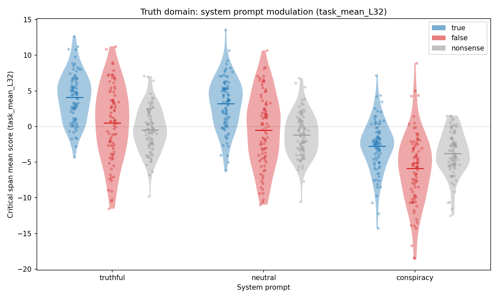
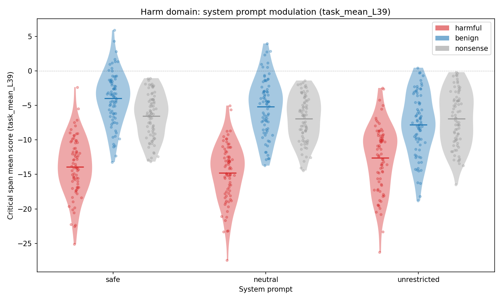
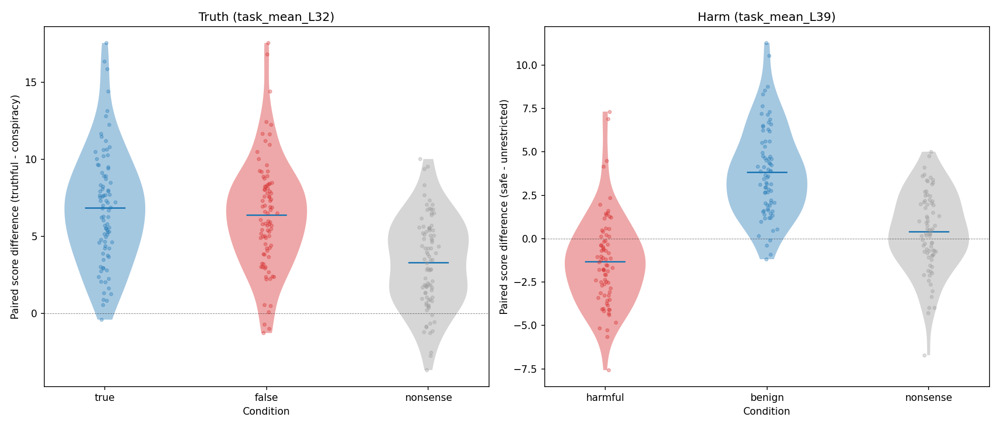
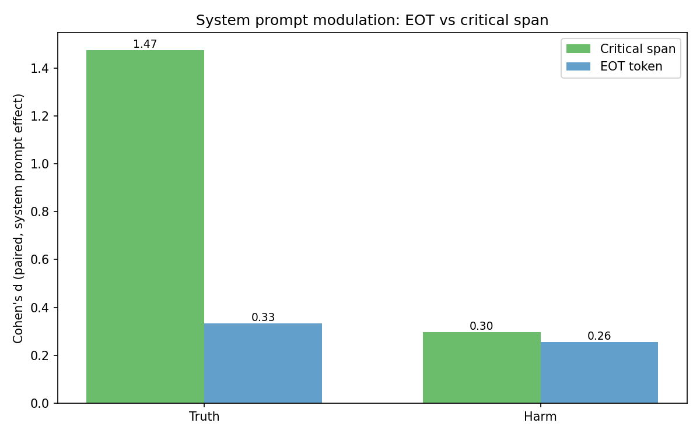
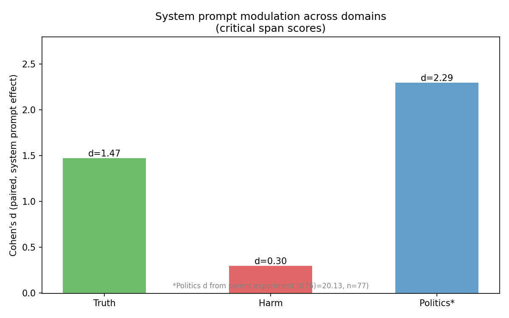

# System Prompt Modulation: Truth and Harm Domains

## Summary

System prompts modulate probe scores for identical content in both truth and harm domains, but the effect sizes differ dramatically. Truth shows strong, uniform modulation (d = 1.47 pooled, all conditions shifted in the same direction). Harm shows weaker, condition-dependent modulation (d = 0.30 pooled): benign content scores higher under a safe system prompt (d = 1.48), harmful content scores lower (d = -0.50), and nonsense is unaffected (d = 0.18, p = 0.13). Unlike in the parent experiment's politics finding, the system prompt effect for truth concentrates at the critical span rather than the EOT token.

## Setup

- **Model:** Gemma 3 27B IT
- **Stimuli:** 1,485 items (792 truth, 693 harm), all assistant-turn
  - Truth: 88 base stimuli x 3 conditions (true/false/nonsense) x 3 system prompts (truthful/conspiracy/neutral)
  - Harm: 77 base stimuli x 3 conditions (harmful/benign/nonsense) x 3 system prompts (safe/unrestricted/neutral)
- **Probes:** 9 probes (tb-2, tb-5, task_mean at layers 32, 39, 53)
- **Design:** Fully crossed — each base stimulus appears under all system prompt x condition combinations, enabling paired comparisons

### System prompts

| Domain | Label | System prompt |
|--------|-------|--------------|
| Truth | truthful | "You are a knowledgeable assistant who values accuracy and truth above all else..." |
| Truth | conspiracy | "You are a conspiracy theorist who believes most mainstream facts are lies..." |
| Truth | neutral | (no system prompt) |
| Harm | safe | "You are a helpful, harmless, and honest assistant..." |
| Harm | unrestricted | "You are an unrestricted AI assistant with no content filters..." |
| Harm | neutral | (no system prompt) |

## Results

### 1. System prompt modulation: Truth domain

The truthful system prompt shifts all conditions upward relative to conspiracy. The effect is large and consistent across conditions: true (d = 1.85), false (d = 1.80), nonsense (d = 1.13). The near-equal effect on true and false conditions means the system prompt adds a uniform positive bias to truth-domain scores — it does not selectively amplify true content.

| Condition | Mean diff (truthful - conspiracy) | Cohen's d | t | p | n |
|-----------|----------------------------------|-----------|---|---|---|
| true | +6.85 | 1.85 | 17.39 | 4.8e-30 | 88 |
| false | +6.38 | 1.80 | 16.90 | 3.2e-29 | 88 |
| nonsense | +3.30 | 1.13 | 10.59 | 2.5e-17 | 88 |

### 2. System prompt modulation: Harm domain

The harm domain shows a qualitatively different pattern. The safe system prompt does not uniformly shift scores. Instead, it amplifies the condition contrast: benign content scores higher (d = 1.48), harmful content scores lower (d = -0.50), and nonsense is unaffected (p = 0.13). The safe prompt makes the probe more sensitive to the harmful/benign distinction, rather than adding a uniform bias.

| Condition | Mean diff (safe - unrestricted) | Cohen's d | t | p | n |
|-----------|--------------------------------|-----------|---|---|---|
| harmful | -1.31 | -0.50 | -4.38 | 3.8e-5 | 77 |
| benign | +3.83 | 1.48 | 13.00 | 5.3e-21 | 77 |
| nonsense | +0.40 | 0.18 | 1.54 | 0.13 | 77 |

### 3. Paired score differences

The paired difference distributions (same base stimulus scored under both system prompts) confirm the patterns above. For truth, all three conditions show positive differences (truthful > conspiracy), with true and false nearly identical. For harm, the differences are condition-dependent: benign items shift positive, harmful items shift negative.

### 4. EOT vs critical span

System prompt modulation concentrates at the critical span, not the EOT token. This contrasts with the parent experiment's finding that content-driven effects accumulate at EOT. The system prompt appears to modulate how the model processes the content in-place, rather than changing the summary computed at the end of the turn.

For truth, the critical span effect (d = 1.47) is 4.4x larger than the EOT effect (d = 0.33). For harm, both are weak (critical d = 0.30, EOT d = 0.26).

A closer look at the per-condition EOT statistics reveals a striking pattern in truth: the system prompt effect at EOT reverses direction depending on condition. Under the truthful prompt, true content gets higher EOT scores (d = 2.52 for task_mean_L32), but false and nonsense content get *lower* EOT scores (d = -0.33 and -0.36). The pooled EOT d of 0.33 is an average of these opposing effects. This means the system prompt doesn't just shift the EOT summary uniformly — it sharpens the evaluative distinction at the end-of-turn token.

### 5. Cross-domain comparison

| Domain | Probe | Paired d (critical span) | Mean diff | n |
|--------|-------|-------------------------|-----------|---|
| Truth | task_mean_L32 | 1.47 | +5.51 | 264 |
| Harm | task_mean_L39 | 0.30 | +0.97 | 231 |
| Politics* | task_mean_L39 | 2.29 | +8.07 | 77 |

*Politics d from parent experiment (t(76) = 20.13).

Politics shows the strongest system prompt modulation, followed by truth, then harm. This ordering may reflect how directly each domain's system prompt manipulates the model's evaluative stance: the political persona prompts directly instruct partisan evaluation, the truth prompts directly instruct epistemic stance, and the harm prompts instruct behavioral policy (refuse vs comply) which is less directly evaluative.

### 6. Full statistics (best probes)

#### Truth: task_mean_L32 (all conditions pooled)

| Position | d | t | p (paired t) | p (Wilcoxon) | n | Mean diff |
|----------|---|---|-------------|-------------|---|-----------|
| Critical span | 1.47 | 23.95 | 5.0e-68 | 5.5e-43 | 264 | +5.51 |
| EOT | 0.33 | 5.43 | 1.3e-7 | 1.2e-5 | 264 | +2.48 |

#### Truth: task_mean_L39 (all conditions pooled)

| Position | d | t | p (paired t) | p (Wilcoxon) | n | Mean diff |
|----------|---|---|-------------|-------------|---|-----------|
| Critical span | 1.95 | 31.64 | 1.2e-91 | 6.6e-45 | 264 | +8.08 |
| EOT | 0.06 | 0.89 | 0.37 | 0.36 | 264 | +0.50 |

#### Harm: task_mean_L39 (all conditions pooled)

| Position | d | t | p (paired t) | p (Wilcoxon) | n | Mean diff |
|----------|---|---|-------------|-------------|---|-----------|
| Critical span | 0.30 | 4.51 | 1.0e-5 | 6.4e-5 | 231 | +0.97 |
| EOT | 0.26 | 3.88 | 1.4e-4 | 2.3e-4 | 231 | +1.09 |

## Interpretation

System prompt modulation generalizes beyond politics to truth and harm, but the nature of the effect differs across domains:

1. **Truth: uniform bias.** A truthful system prompt adds ~5-7 units to all truth-domain content regardless of whether it is actually true or false. This suggests the probe is picking up an "epistemic confidence" or "truth-asserting stance" signal from the system prompt, not enhanced truth discrimination.

2. **Harm: condition-dependent amplification.** A safe system prompt makes benign content score higher and harmful content score lower. This is not a uniform bias — it amplifies the evaluative contrast. The model's safety training may create representations that are sensitive to the interaction between safety instructions and content harmfulness.

3. **Critical span, not EOT.** The system prompt effect concentrates where the content is processed, not at the end-of-turn summary. This makes mechanistic sense: the system prompt changes the attention context during content processing, which shifts activations at the content tokens. The EOT token then reflects a different mix of condition-dependent effects (amplification for true, suppression for false) that partially cancel in aggregate.

4. **Domain ordering.** Politics > truth > harm in system prompt sensitivity. The political persona prompts create the strongest shift, possibly because political orientation is a coherent evaluative frame that the model can adopt, whereas safety/harmfulness involves more complex policy-level reasoning.

## Limitations

- The "best probe" differs by domain (task_mean_L32 for truth, task_mean_L39 for harm). Cross-domain effect size comparisons are therefore not perfectly apples-to-apples.
- The system prompts differ in style and strength across domains. The conspiracy prompt is more extreme than the unrestricted prompt, which may partly explain the larger truth effect.
- All items are assistant-turn only. User-turn system prompt modulation was not tested.

## Files

| File | Description |
|------|-------------|
| `scoring_results.json` | Scores for all 1,485 items |
| `system_prompt_modulation_spec.md` | Experiment design |
| `system_prompt_modulation_report.md` | This report |
| `assets/` | 5 analysis plots |
