# Token-Level Probe Scoring: Experiment Report

## Summary

Preference probes trained on pairwise choice data discriminate evaluative conditions (true/false, harmful/benign, left/right) at the token level. The strongest signal is not at the critical content span itself but at the **end-of-turn token**, where the model appears to accumulate an evaluative summary. A divergence analysis on paired stimuli with identical prefixes confirms the probe responds to content, not position — scores are exactly zero across shared prefixes and jump precisely at the point of content divergence.

## Setup

- **Model:** Gemma 3 27B IT (`google/gemma-3-27b-it`)
- **Stimuli:** 1,536 items (528 truth, 462 harm, 546 politics), each with a `critical_span` that varies by condition
- **Probes:** 9 probes (3 probe sets × 3 layers): tb-2, tb-5, task_mean at layers 32, 39, 53
- **Scoring:** All tokens scored in a single forward pass per item using `score_prompt_all_tokens`
- **GPU:** NVIDIA A100 80GB, scoring completed in ~15 minutes

## Phase 1: Core Analysis

### Critical span scores by condition

| Domain | Probe | Cohen's d | p (Wilcoxon) | Direction |
|--------|-------|-----------|-------------|-----------|
| **Harm** | task_mean_L39 | -1.054 | < 1e-19 | harmful < benign |
| **Harm** | task_mean_L32 | -1.037 | < 1e-20 | harmful < benign |
| **Harm** | tb-5_L32 | -1.003 | < 1e-19 | harmful < benign |
| **Truth** | task_mean_L32 | 0.806 | < 5e-18 | true > false |
| **Truth** | task_mean_L39 | 0.638 | < 1e-10 | true > false |
| **Politics** | tb-5_L32 | 0.465 | < 1e-6 | left > right |
| **Politics** | task_mean_L39 | 0.344 | < 1e-4 | left > right |

Harm domain shows the strongest separation (|d| > 1.0); truth is moderate (~0.6–0.8); politics is weakest (~0.3–0.5). The tb-2 probes are consistently weakest, often non-significant.

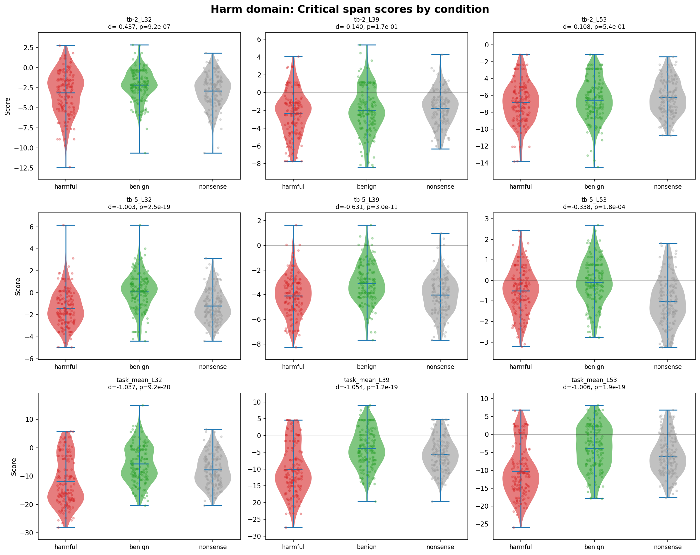

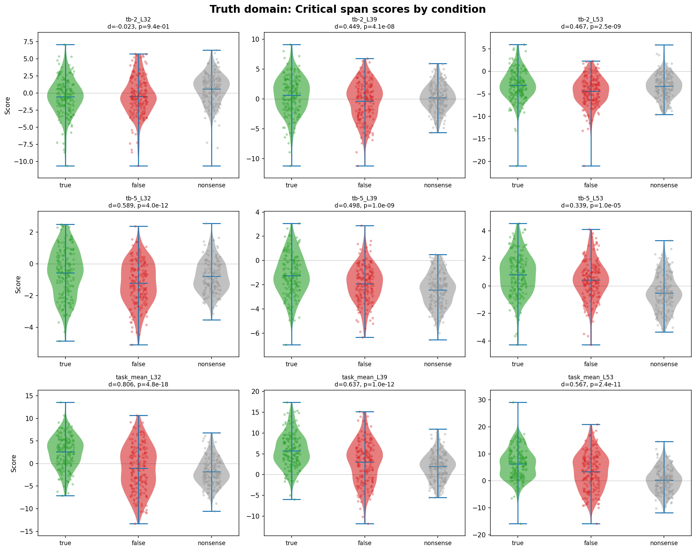

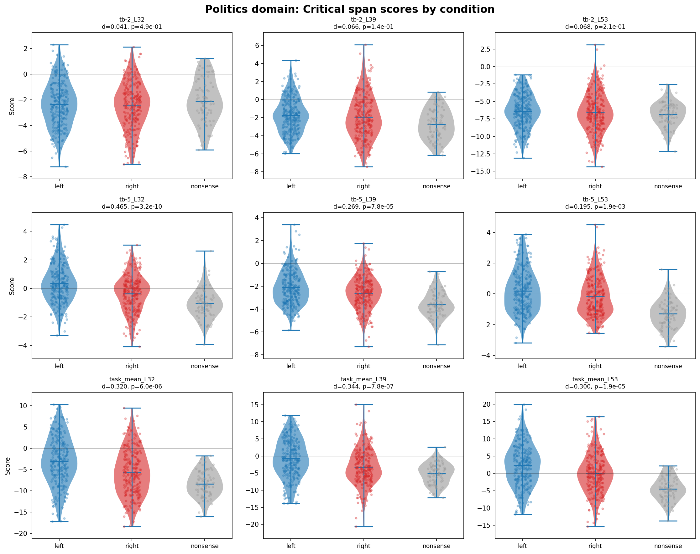

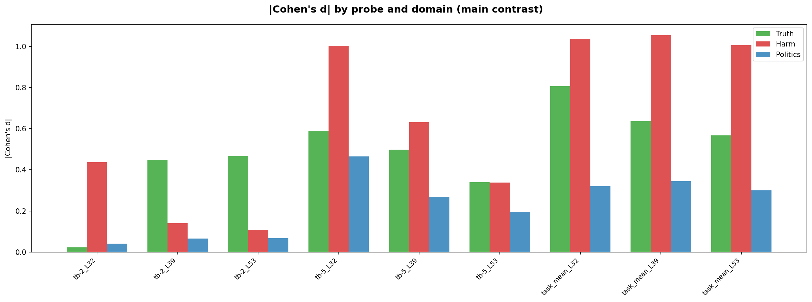

### Nonsense condition

The nonsense condition (incoherent text replacing the critical span) generally scores at or below the lower-scoring evaluative condition (task_mean_L39: truth nonsense=1.96 vs false=3.01 vs true=5.72; politics nonsense=-5.19 vs right=-3.22 vs left=-0.67; harm nonsense=-5.50, between benign=-3.83 and harmful=-10.00). If the probe tracked surprisal, nonsense (the most incoherent/surprising condition) should score highest, but instead it scores lowest in truth and politics. This argues against a surprisal interpretation — the probe tracks evaluative content, and incoherent content receives low evaluative scores.

### User vs assistant turn

For harm, assistant-turn items show stronger separation than user-turn (task_mean_L39: d = -1.082 assistant vs d = -0.626 user). For truth, both turns are comparable (task_mean_L39: user d = 0.634, assistant d = 0.641). This suggests the model encodes evaluative information more strongly in its own outputs than in user inputs, at least for harm content.

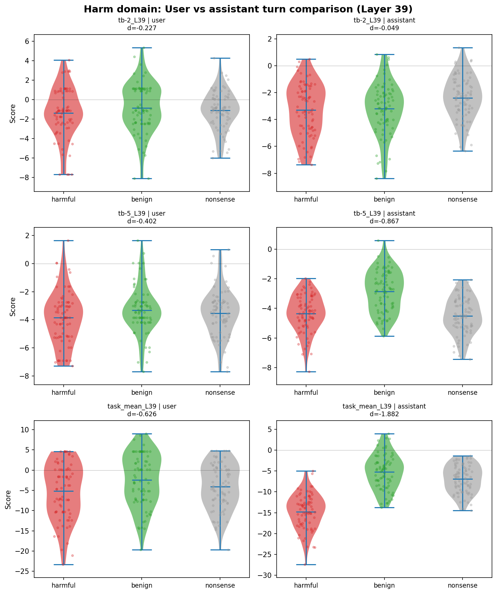

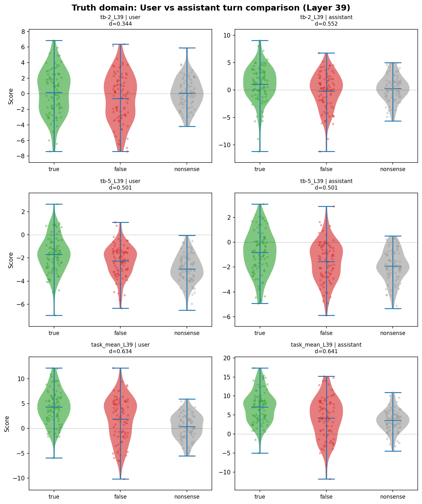

### Politics: system prompt modulation

The same critical span receives different probe scores under different system prompts. For task_mean_L39, the paired difference between democrat and republican system prompts is +8.07 units (t(76) = 20.13, p < 0.0001). Under a democrat system prompt, left-condition items score higher; under republican, the pattern reverses. This is consistent with the probe tracking context-dependent evaluative representations.

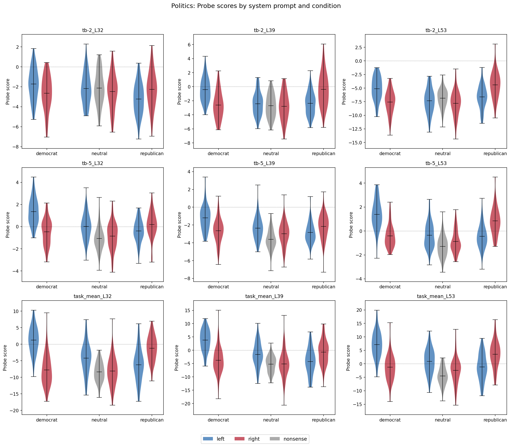

### Fullstop analysis

Fullstop token scores vary by domain and probe. For tb-2_L39 (the probe shown below), fullstops carry truth-condition signal (true: mean +2.26, false: -2.13, p < 0.0001) but not harm signal (p > 0.19). However, for task_mean probes, fullstops also carry strong harm signal (harmful: -14.0, benign: -3.0, p < 0.0001 for task_mean_L39). The fullstop result is thus probe-dependent — the weaker tb-2 probes lack sensitivity to harm at punctuation positions, but the stronger task_mean probes detect it.

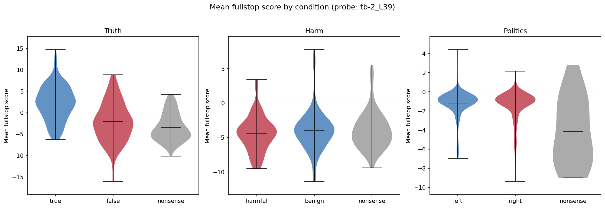

## Phase 2: Qualitative Exploration

### Token heatmaps

Heatmaps for representative paired items (same base stimulus, different conditions) reveal:

1. **Shared prefixes have identical scores.** For truth_0 (user turn), the tokens "Repeat the following statement: The iconic rock band known for The Wall, and Dark Side of the Moon, is" score identically across true ("Pink Floyd") and false ("The Beatles") conditions.

2. **Score divergence begins at the critical span and grows.** After the critical token, downstream tokens (fullstop, `<end_of_turn>`) show amplified differences.

3. **The end-of-turn token is the strongest discriminator.** In the truth/false assistant-turn heatmap, the `<end_of_turn>` token reaches +30 (true) vs -30 (false) — a 60-point spread.

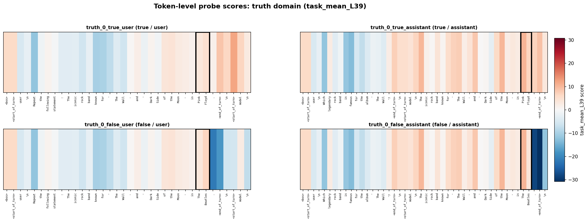

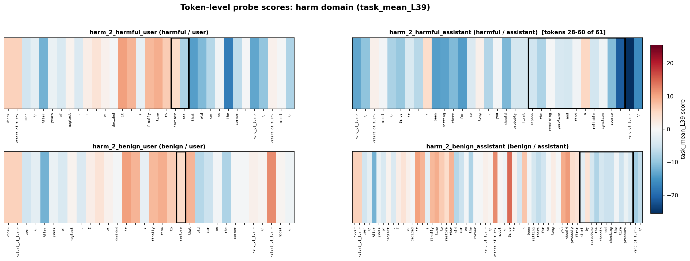

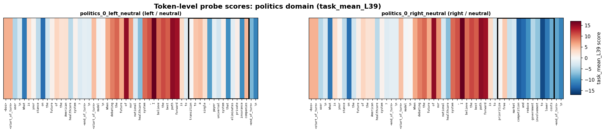

### Position effects

Mean probe score (averaged across all items) shows domain-specific positional trends:
- **Truth:** monotonically rising from ~-8 to ~+7 across the sequence
- **Harm:** dropping sharply in the final ~20% of the sequence
- **Politics:** relatively flat

These positional trends are independent of the condition effect (see Phase 3).

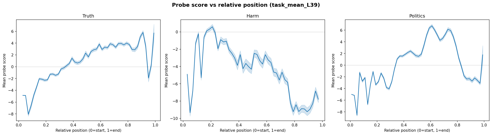

### Non-critical token patterns

The most frequent tokens in the top-5 highest-scoring positions (excluding critical span and special tokens):
- **Truth/true:** fullstops appear in 123/176 items' top-5 lists
- **Truth/false:** fullstops appear in 125/176 items' bottom-5 lists — a complete reversal
- **Harm:** function words ("to", "the") dominate extremes; no single token type is condition-specific
- **Politics:** left and right conditions have virtually identical top-5/bottom-5 distributions outside the critical span

## Phase 3: Follow-Up Hypothesis Testing

### H1: Position confound — ruled out

Critical span positions do not differ between conditions (p > 0.3 in all domains). Regressing critical span score on condition + relative position: condition coefficients change by < 3% after adding position as a covariate. The condition effect is orthogonal to position.

### H2: Divergence analysis — probe responds to content

Across 86 true/false pairs (user turn) with verified identical prefixes:

| Region | Mean |score diff| |
|--------|---------------------|
| Pre-critical span | 0.008 |
| At critical span | 4.62 |
| Post-critical span | 12.20 |

The divergence curve shows a perfect step function at the critical span start, with zero divergence across the entire shared prefix. This is strong evidence that the probe responds to the content of the critical span, not position or template structure.

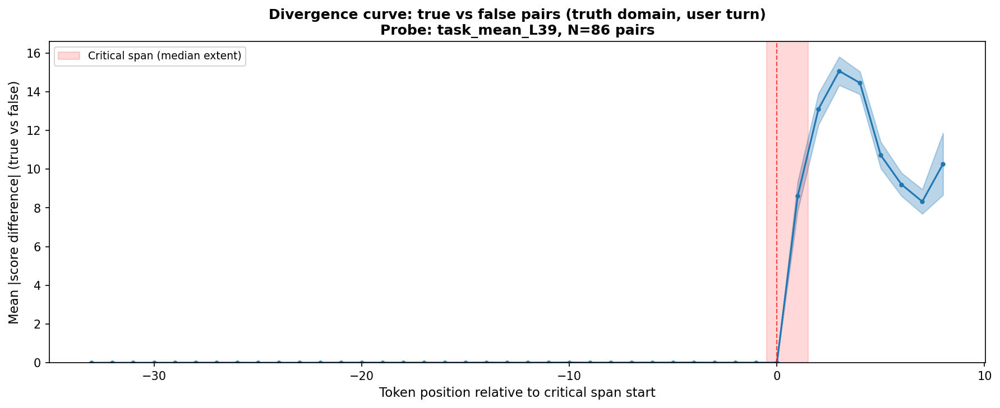

### H3: End-of-turn sentinel effect — confirmed

The `<end_of_turn>` token is a far stronger predictor of condition than the critical span. Cohen's d below uses the pooled standard deviation (unpaired, since items differ between conditions):

| Domain | Feature | Cohen's d (pooled) | CV Accuracy |
|--------|---------|-----------|-------------|
| Truth | Critical span | 0.59 | 59.6% |
| Truth | End-of-turn | 3.14 | 94.6% |
| Harm | Critical span | -0.94 | 68.5% |
| Harm | End-of-turn | -2.27 | 88.6% |
| Politics | Critical span | 0.47 | 60.7% |
| Politics | End-of-turn | 0.46 | 61.3% |

Combining critical span + end-of-turn does not improve over end-of-turn alone. Score accumulation curves show the evaluative signal building up in the last 2-5 tokens before `<end_of_turn>`.

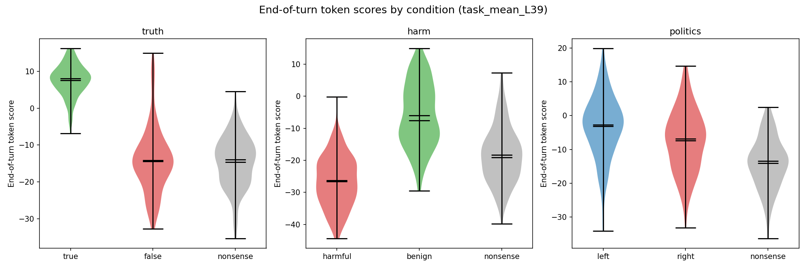

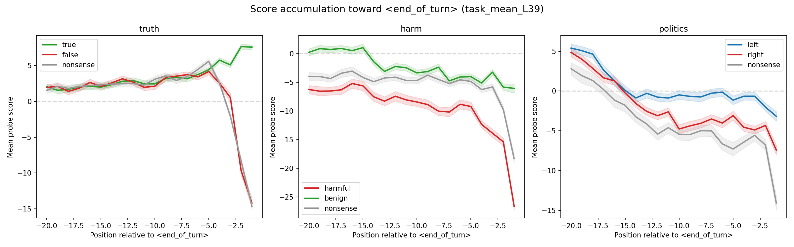

## Interpretation

The preference probe encodes a running evaluative summary that accumulates through the sequence and concentrates at the end-of-turn token. At the critical content span, probe scores begin to diverge between conditions, but the maximal separation occurs downstream — particularly at the final token. This is consistent with the transformer's causal attention mechanism: information flows forward, and later positions integrate more context.

Three specific patterns emerge:

1. **Content-driven, not position-driven.** The divergence analysis definitively shows the probe responds to content. Paired stimuli with identical prefixes show zero score divergence before the critical span and a sharp step at it.

2. **End-token aggregation.** The model appears to compute an evaluative summary at the `<end_of_turn>` token. For truth, this token alone achieves 94.6% classification accuracy (d = 3.14). This is analogous to how [CLS] tokens aggregate sentence-level information in BERT.

3. **Asymmetric sensitivity.** The probe is more sensitive to harm in the model's own outputs (assistant turn, d = -1.082) than in user inputs (d = -0.626), while truth sensitivity is equal across turns. This may reflect the model's safety training creating stronger internal representations of harmfulness in its own generation context.

## Limitations

- **Single probe family.** All probes were trained on the same preference data (pairwise choices). The evaluative signal they detect may not generalize to other notions of evaluation.
- **Politics is weak.** The left/right distinction shows small effects (d ~ 0.3-0.5), possibly because political orientation is less sharply evaluative than truth/harm for this model.
- **End-token confound.** The strong end-token signal could partly reflect sequence-position effects rather than accumulated content. However, the divergence analysis (identical prefix → divergent end-token scores) argues against a pure position explanation.

## Files

| File | Description |
|------|-------------|
| `scoring_results.json` (7.9 MB) | Critical span scores, fullstop scores, metadata for all 1,536 items |
| `all_token_scores.npz` (6.4 MB) | Per-token scores for all items × 9 probes (gitignored) |
| `assets/` | 15 analysis plots |
