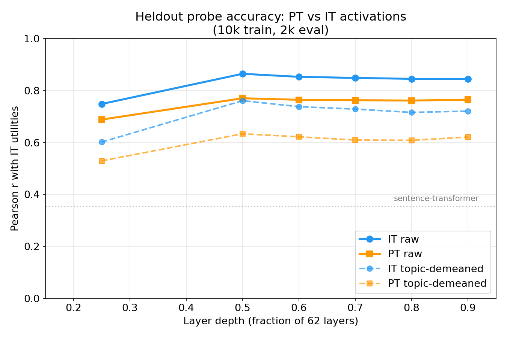
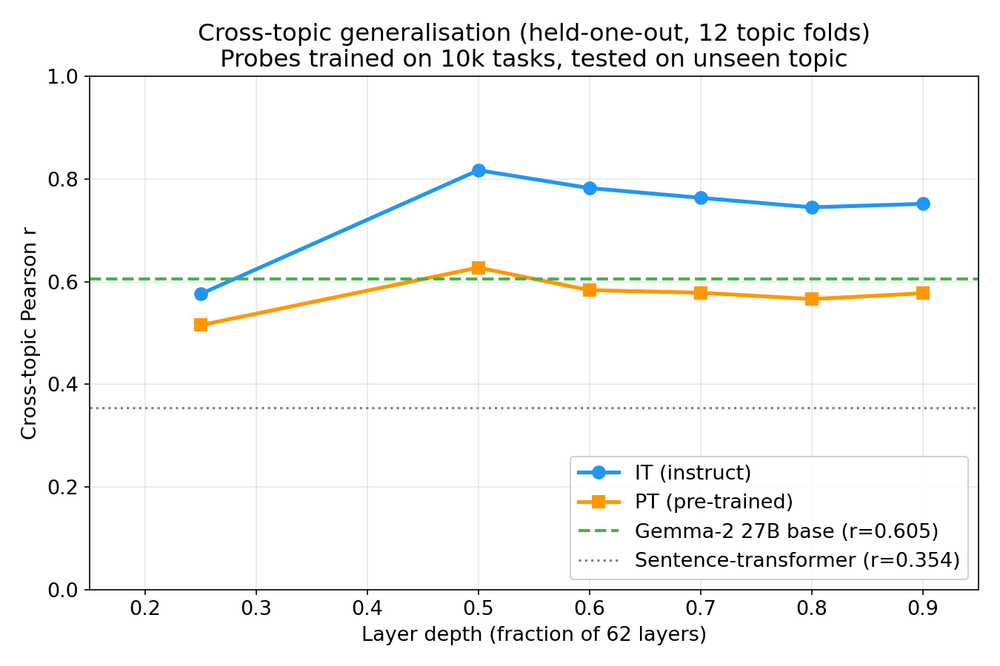
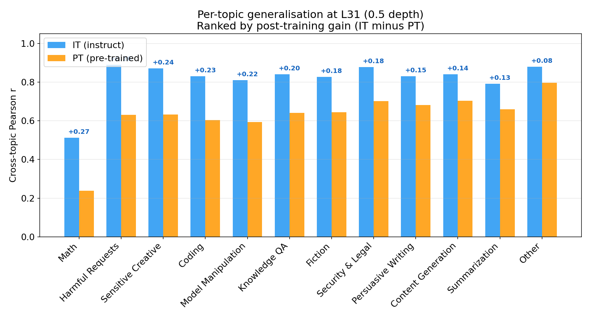
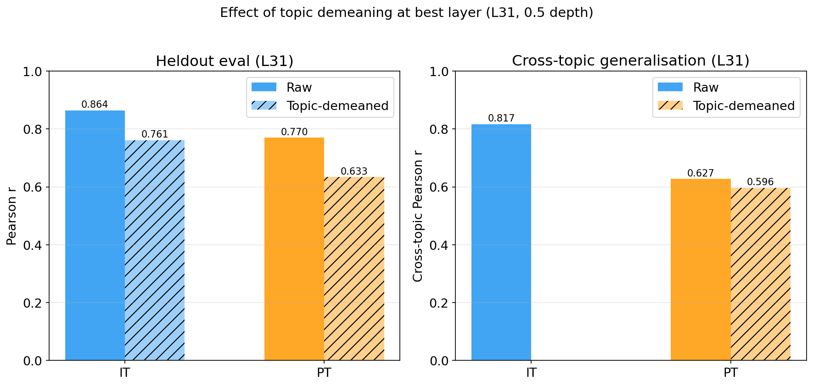

# Gemma 3 27B PT: Instruct-Utility Probes — Report

## Question

Does the pre-trained model already encode instruct-model preferences, or does that signal only emerge from post-training?

## Setup

Gemma-3 PT (pre-trained, no instruction tuning or RLHF) and Gemma-3 IT (instruct-tuned) share the same 62-layer architecture. We extract residual-stream activations from PT and train Ridge probes to predict IT preference scores — Thurstonian utilities estimated from ~330k pairwise task comparisons (e.g., "would you rather write a poem or solve an equation?"). Probes are trained on 10k tasks and evaluated on a separate 2k heldout set. Any signal in PT activations exists before preference optimisation.

## Main result

**PT activations predict IT preferences well** — almost as accurately as IT's own activations, and far above a content-only baseline.

At the best layer (L31, 0.5 depth):

| Activations | Heldout r | Notes |
|-------------|-----------|-------|
| Gemma-3 **IT** | **0.864** | Same model that generated the preferences |
| Gemma-3 **PT** | **0.770** | Pre-trained, no post-training |
| Sentence-transformer (384d) | 0.354 | Pure content baseline |

PT reaches 89% of IT's heldout accuracy. The signal is genuine — well above the content baseline (0.354), meaning the probe reads more than just "what the task is about."

## Cross-topic generalisation

The real test: can a probe trained on 11 topics predict preferences for a 12th unseen topic? This held-one-out (HOO) evaluation reveals whether the preference signal generalises or just memorises topic-level patterns.

At L31: IT cross-topic r = 0.817, PT cross-topic r = 0.627, Gemma-2 27B base = 0.605. PT's cross-topic signal is comparable to Gemma-2 base — both pre-trained models are in the same ballpark, suggesting this is a general property of pre-training rather than something specific to one model family.

### Per-topic breakdown

The PT–IT gap varies by topic. Post-training helps most where preferences depend on safety-relevant or nuanced distinctions:

Math is an outlier for both models (IT r = 0.51, PT r = 0.24) — math preference structure doesn't transfer well from other topics. For most topics, IT gains 0.13–0.26 over PT, with the largest gaps on harmful requests (+0.26), sensitive creative (+0.24), and coding (+0.23).

## What explains the PT–IT gap?

Topic categories explain 37.7% of raw utility variance (e.g., "math tasks are generally dispreferred"). Two evaluations tease apart whether the PT–IT gap comes from topic-level or within-topic signal.

**Topic demeaning** removes topic-level mean preferences so the probe must predict within-topic variance:
- IT: 0.864 → 0.761 (drop of 0.103)
- PT: 0.770 → 0.633 (drop of 0.137)

PT relies more heavily on topic-level signal. But even after demeaning, PT still carries substantial within-topic signal (0.633).

**Generalisation gap** (in-distribution vs cross-topic performance) shrinks dramatically after demeaning:
- PT raw: in-dist 0.810, cross-topic 0.627 → gap 0.183
- PT demeaned: in-dist 0.650, cross-topic 0.596 → gap 0.054

The topic-independent signal in PT generalises well. The weakness is topic-level structure that doesn't transfer to unseen topics.

## Layer profile

Performance is flat across layers 0.5–0.9 for PT, while IT peaks sharply at 0.5 depth:

| Depth | PT heldout r | IT heldout r | PT cross-topic r | IT cross-topic r |
|-------|-------------|-------------|-----------------|-----------------|
| 0.25 | 0.688 | 0.748 | 0.515 | 0.576 |
| **0.5** | **0.770** | **0.864** | **0.627** | **0.817** |
| 0.6 | 0.764 | 0.853 | 0.583 | 0.782 |
| 0.7 | 0.763 | 0.849 | 0.578 | 0.763 |
| 0.8 | 0.761 | 0.845 | 0.566 | 0.745 |
| 0.9 | 0.765 | 0.845 | 0.577 | 0.751 |

## Key findings

- **Pre-trained activations already encode preferences** — r = 0.770 heldout, well above the content baseline (0.354). Preference-relevant linear structure exists before post-training.
- **Post-training adds cross-topic signal** — IT cross-topic r = 0.817 vs PT 0.627. The gap persists after demeaning (IT 0.761 vs PT 0.633), so post-training creates genuinely new preference structure, not just sharper topic-level means.
- **PT generalises like Gemma-2 base** — cross-topic r 0.627 vs 0.605. Pre-trained models from different families are in the same ballpark.
- **Topic confound explains the PT generalisation gap** — after demeaning, the in-dist/cross-topic gap shrinks from 0.183 to 0.054. PT's topic-independent signal transfers well; the weakness is topic-level structure.
- **Math is a consistent outlier** — both PT (0.24) and IT (0.51) struggle to generalise to math from other topics, suggesting math preferences have distinctive structure.

## Method

- **Extraction**: 30,000 tasks from 5 sources (WildChat user requests, Alpaca instructions, MATH problems, BailBench harmful prompts, stress-test adversarial prompts). Residual stream at last prompt token, 6 layers at depths [0.25, 0.5, 0.6, 0.7, 0.8, 0.9]. ~75 min on A100 80GB.
- **Probes**: Ridge regression on standardised activations. 10k tasks for training, alpha swept over 10 log-spaced values [0.1, 100k], selected on 2k sweep set, evaluated on 2k final set. Cross-topic: leave-one-topic-out, 12 folds.
- **Baselines**: Gemma-3 IT activations (same pipeline), Gemma-2 27B base activations (0.5 depth = L23), sentence-transformer (all-MiniLM-L6-v2, 384d).
