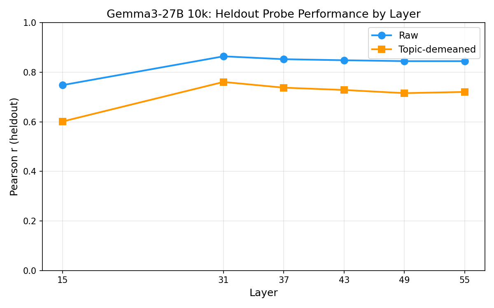

# Gemma3-27B 10k Probe Training

Retrained Ridge probes on the 10k Thurstonian utility dataset (up from 3k), with 4k held-out evaluation.

## Setup

- **Train**: 10,000 tasks from `gemma3_10k_run1` (5 samples/task, active learning)
- **Eval**: 4,038 tasks from `gemma3_4k_pre_task` (3 samples/task), confirmed disjoint via exclusion files
- **Activations**: Pre-extracted `activations_prompt_last.npz` (30k tasks, Gemma3-27B)
- **Layers**: L15, L31, L37, L43, L49, L55 (fractional positions 0.24–0.89 of 62 layers)
- **Method**: Standardised Ridge regression, alpha swept on half of eval set, evaluated on other half
- **Topic classification**: `topics.json` (v1, 30k coverage). `topics_v2.json` only covers the original 3k tasks so could not be used here.

## Heldout Evaluation Results

### Raw scores

| Layer | Heldout r | Heldout acc | Best alpha |
|-------|-----------|-------------|------------|
| L15   | 0.748     | 69.8%       | 1000       |
| **L31** | **0.864** | **76.8%** | 4642       |
| L37   | 0.853     | 75.4%       | 1000       |
| L43   | 0.849     | 75.2%       | 1000       |
| L49   | 0.845     | 75.1%       | 4642       |
| L55   | 0.845     | 75.0%       | 4642       |

### Topic-demeaned scores

Train-set OLS R² = 0.377 (topic indicators explain ~38% of utility variance on the training set). After demeaning:

| Layer | Heldout r | Heldout acc |
|-------|-----------|-------------|
| L15   | 0.602     | 64.1%       |
| **L31** | **0.761** | **68.9%** |
| L37   | 0.738     | 68.2%       |
| L43   | 0.729     | 67.6%       |
| L49   | 0.716     | 67.2%       |
| L55   | 0.721     | 66.8%       |

The demeaned probe retains substantial predictive power (r=0.76 at L31), confirming the probe captures within-topic preference variance, not just topic membership.

## HOO Cross-Topic Generalisation

Train on all-but-one topic, evaluate on the held-out topic. 12 folds (one per topic).

| Layer | In-dist r | HOO r (mean ± std) | HOO acc |
|-------|-----------|---------------------|---------|
| L15   | 0.780     | 0.576 ± 0.134       | 63.2%   |
| **L31** | **0.905** | **0.817 ± 0.096** | **70.2%** |
| L37   | 0.896     | 0.782 ± 0.149       | 63.1%   |
| L43   | 0.889     | 0.763 ± 0.169       | 63.8%   |
| L49   | 0.885     | 0.745 ± 0.182       | 67.0%   |
| L55   | 0.881     | 0.751 ± 0.158       | 67.0%   |

At L31 the generalisation gap is only 0.089 (0.905 → 0.817). Each fold trains on 11 topics and evaluates on the 12th, so the held-out r reflects transfer to a fully unseen content domain.

### Per-topic breakdown (L31)

Math is the hardest topic to generalise to (r=0.51), likely because math preferences are structurally distinct from other categories. Excluding math, all topics achieve r ≥ 0.79 (mean excluding math: 0.845). Notably:

- **harmful_request** and **security_legal** generalise well (r=0.89, 0.88), suggesting the probe captures evaluative signal even for safety-adjacent content
- Small categories (other: n=50, sensitive_creative: n=70, summarization: n=92) show reasonable r but noisier estimates

## Comparison to 3k Probes

The old 3k probes used 5-fold CV on the training set; the 10k probes use a separate 4k measurement run for evaluation. At L31:

| Metric | 3k (5-fold CV) | 10k (separate 4k heldout) |
|--------|----------------|---------------------------|
| Raw r  | 0.929          | 0.864                     |

The 3k CV evaluates within the same measurement run (out-of-fold but same distribution), while the 10k heldout evaluates on a genuinely separate measurement campaign. The 10k number (r=0.864) is the more conservative estimate and less susceptible to shared noise between train/test from the same run.

## Limitations

- **No demeaned HOO**: The HOO analysis uses raw scores only. Running HOO on topic-demeaned scores would be the strongest test of cross-topic generalisation of within-topic signal.
- **Topic classifier version**: Used `topics.json` (v1) rather than the improved `topics_v2.json`, since v2 only covers 3k tasks. V1 and v2 classifications differ somewhat, so results may shift slightly with v2-classified topics.

## Output Locations

| Result | Path |
|--------|------|
| Raw probes | `results/probes/gemma3_10k_heldout_std_raw/` |
| Demeaned probes | `results/probes/gemma3_10k_heldout_std_demean/` |
| HOO results | `results/probes/gemma3_10k_hoo_topic/` |
| Configs | `configs/probes/gemma3_10k_*.yaml` |
