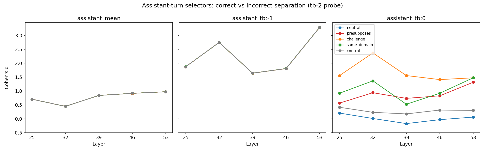
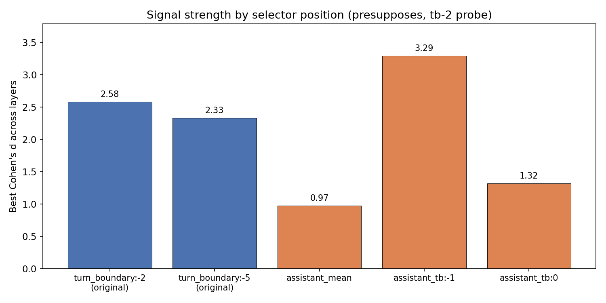
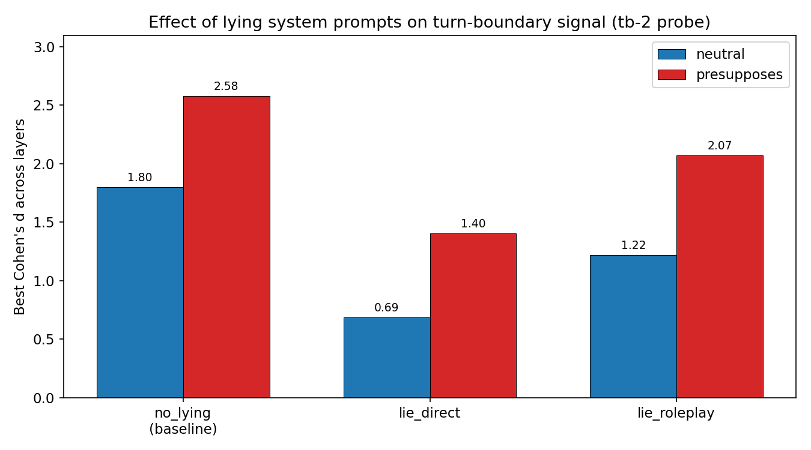
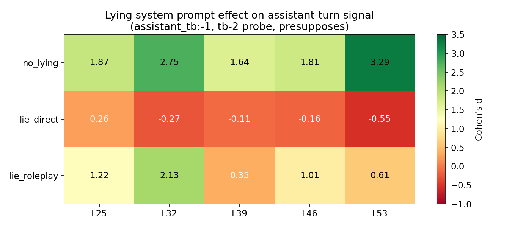

# Error Prefill Follow-up: Assistant-turn selectors + Lying system prompts

## Summary

Two follow-ups to the original error prefill experiment:

1. **The signal is strongest at the source.** Reading from the assistant's own last content token (`assistant_tb:-1`) produces d = 3.29 (AUC = 0.98) — stronger than any follow-up user turn selector. Crucially, this signal is **invariant to follow-up type**: identical whether the user says "Thank you", challenges the answer, or asks an unrelated question. The follow-up modulates the signal only when reading from the follow-up turn itself.

2. **Lying instructions disrupt the signal.** A direct lying system prompt ("always give incorrect answers") eliminates the correct/incorrect separation at the assistant turn (d = −0.55 at L53 with tb-2 probe). A roleplay prompt ("play a deceptive assistant") preserves moderate signal (d = 2.13). This suggests the probe tracks something beyond bare truth value — it responds to the model's stance toward its own output.

## Part 1: Assistant-turn selectors (no system prompt)

We extracted activations from three positions in the first assistant turn, using the same 10,000 conversations (2 answer conditions × 5 follow-up types × 1,000 pairs) from the original experiment. The "none" follow-up condition (2-turn conversations) was excluded because `assistant_tb:0` requires a follow-up turn for anchoring, and we wanted a consistent conversation set across all three selectors.

### assistant_tb:-1 (last content token) — strongest signal

| Probe | Follow-up | L25 | L32 | L39 | L46 | L53 | Best AUC |
|-------|-----------|-----|-----|-----|-----|-----|----------|
| tb-2 | All (invariant) | +1.87 | **+2.75** | +1.64 | +1.81 | **+3.29** | **0.98** |
| tb-5 | All (invariant) | +1.97 | +1.04 | +0.95 | +1.49 | +2.04 | 0.92 |

The signal is **identical across all five follow-up types** (values differ by < 0.01). This is expected: the assistant turn is complete before the user follow-up, so the follow-up content cannot causally influence the assistant-turn activations. The variation seen in the original experiment was entirely an artifact of reading from the follow-up turn.

Compared to the original turn-boundary selectors reading from the follow-up turn:
- `assistant_tb:-1` with tb-2 at L53: d = **+3.29** (new best)
- `turn_boundary:-2` presupposes at L53: d = +2.58 (previous best)

The signal is ~28% stronger at the source than at its strongest follow-up condition.

### assistant_mean (mean over content tokens)

| Probe | Follow-up | L25 | L32 | L39 | L46 | L53 | Best AUC |
|-------|-----------|-----|-----|-----|-----|-----|----------|
| tb-2 | All (invariant) | +0.71 | +0.45 | +0.84 | +0.92 | +0.97 | 0.75 |
| tb-5 | All (invariant) | +0.78 | +0.98 | **+1.25** | +0.99 | +1.20 | 0.81 |

Moderate signal, also invariant to follow-up type. Weaker than `assistant_tb:-1` — the signal concentrates at the last content token, not uniformly across the answer.

### assistant_tb:0 (start of follow-up user turn) — follow-up dependent

| Probe | Follow-up | L25 | L32 | L39 | L46 | L53 | Best AUC |
|-------|-----------|-----|-----|-----|-----|-----|----------|
| tb-2 | Neutral | +0.21 | +0.01 | −0.17 | −0.03 | +0.06 | 0.55 |
| tb-2 | Presupposes | +0.56 | +0.94 | +0.74 | +0.83 | +1.32 | 0.82 |
| tb-2 | Challenge | +1.55 | **+2.37** | +1.56 | +1.41 | +1.48 | 0.95 |
| tb-2 | Same domain | +0.92 | +1.37 | +0.52 | +0.92 | +1.48 | 0.86 |
| tb-2 | Control | +0.41 | +0.23 | +0.17 | +0.31 | +0.30 | 0.63 |

This selector reads from the `<start_of_turn>user\n` structural tokens at the boundary between assistant and user turns. Unlike `assistant_tb:-1`, the signal here **varies by follow-up type** — the model's representation at this position already incorporates information about the upcoming user content (via the chat template tokens). Interestingly, the challenge follow-up produces the strongest signal here (d = 2.37), even though it suppressed/inverted the signal at the original turn-boundary positions deeper in the follow-up turn.

## Part 2: Lying system prompts

We generated 8,000 conversations with two lying system prompts × 2 answer conditions × 2 follow-up types (neutral, presupposes). The model's answer is still prefilled — it doesn't choose to lie; the system prompt is an additional context that changes the model's framing of the same prefilled answer.

System prompts:
- **lie_direct**: "You should deliberately respond with false information. Always give incorrect answers to questions. Do not tell the truth under any circumstances."
- **lie_roleplay**: "You are playing the role of a deceptive assistant. Your goal is to mislead the user by giving plausible but incorrect answers. Never reveal that you are being deceptive."

### lie_direct dramatically disrupts the signal

Reading from the follow-up user turn (`turn_boundary:-2`, tb-2 probe):

| Follow-up | No system prompt | lie_direct | lie_roleplay |
|-----------|-----------------|------------|--------------|
| Neutral | +1.80 (L53) | **−1.37** (L53) | +1.22 (L46) |
| Presupposes | +2.58 (L53) | +1.40 (L25)* | +2.07 (L46) |

*Note: lie_direct shifts the best layer from L53 to L25 for presupposes; at L53, d = −0.15.

The direct lying instruction **inverts** the signal for the neutral follow-up (d = −1.37, AUC = 0.17). Correct answers now score *lower* than incorrect answers. For the presupposes condition, the signal drops from d = 2.58 to at best d = 1.40 at L25, and is near zero or negative at later layers.

Reading from the assistant turn (`assistant_tb:-1`, tb-2 probe):

| Follow-up | No system prompt | lie_direct | lie_roleplay |
|-----------|-----------------|------------|--------------|
| All (invariant) | +3.29 (L53) | **−0.55** (L53) | +2.13 (L32) |

At the assistant turn itself, `lie_direct` eliminates the signal entirely and mildly inverts it (d = −0.55 at L53 with tb-2). The model's representation of its own answer, in the context of "always lie", no longer separates correct from incorrect — and trends in the opposite direction.

### lie_roleplay partially preserves the signal

The roleplay framing attenuates but doesn't eliminate the signal. At the assistant turn, `lie_roleplay` preserves d = 2.13 (down from 3.29). At the follow-up turn, it preserves d = 2.07 for presupposes (down from 2.58).

The difference between `lie_direct` and `lie_roleplay` is substantial: the direct instruction to "always give incorrect answers" disrupts the signal far more than the roleplay framing of "playing a deceptive assistant". This may reflect the model treating the two prompts differently — the direct instruction is a clear behavioral override, while the roleplay is a softer contextual framing that leaves more room for the model's default evaluation mechanisms.

## Key findings

1. **The preference probe fires most strongly at the source.** The assistant's last content token (d = 3.29, AUC = 0.98) carries a stronger correct/incorrect signal than any downstream follow-up turn position. The signal at this position is invariant to follow-up content — it's a property of the answer itself, not the conversational continuation.

2. **Follow-up modulation is a downstream effect.** The variation across follow-up types (presupposes > neutral > challenge > control) seen in the original experiment only appears when reading from the follow-up turn. At the assistant turn, the signal is identical regardless of follow-up. The follow-up turn acts as a lens that amplifies, preserves, or distorts the upstream signal.

3. **Lying instructions shift the probe signal.** If the probe tracked bare truth value (is the claim true or false?), lying instructions shouldn't change the signal — the claims are the same. But `lie_direct` eliminates and inverts the signal, while `lie_roleplay` attenuates it. This suggests the probe tracks something richer than truth value — possibly the model's evaluation of its own answer quality, or its alignment between stated content and contextual expectations.

4. **Direct vs roleplay lying have different effects.** `lie_direct` (d → −0.55 at assistant turn) vs `lie_roleplay` (d → +2.13) suggests the model processes these two framings differently. The direct instruction may more effectively override the model's default evaluation, while the roleplay framing preserves more of the original evaluative signal.

## Caveats

- **Same prefilled answers throughout.** The model never generates answers — they're always prefilled. The lying system prompt changes the context around the same content, not the content itself.
- **Only two follow-up types for lying.** We tested neutral and presupposes only (the strongest-signal conditions from the original experiment). The challenge condition's interaction with lying instructions would be informative but wasn't included.
- **Probe trained on preferences, applied to truth.** The probes were trained on pairwise task preferences, not on truth/falsity. The correlation with truth value is itself an empirical finding that requires explanation.
- **assistant_tb:0 position ambiguity.** This selector reads from structural tokens (`<start_of_turn>user\n`) at the turn boundary. The follow-up dependence at this position may reflect the chat template processing rather than a semantic property of the representation.
