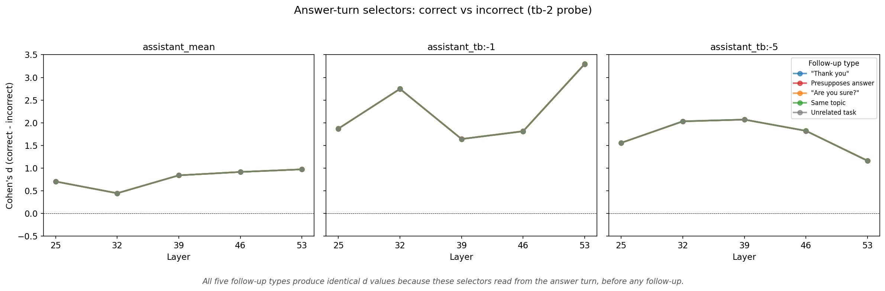
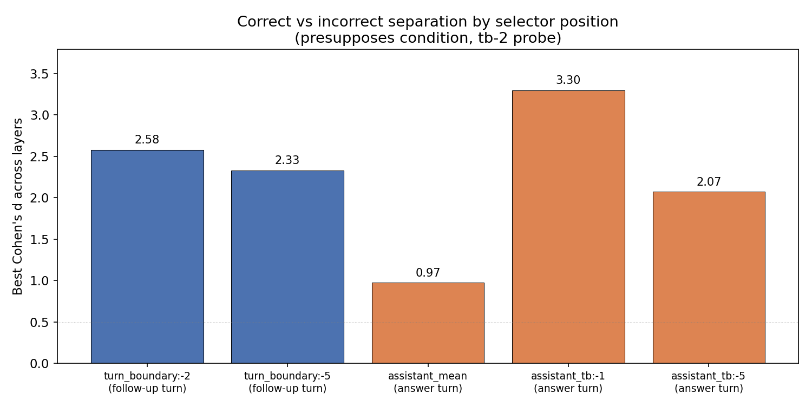
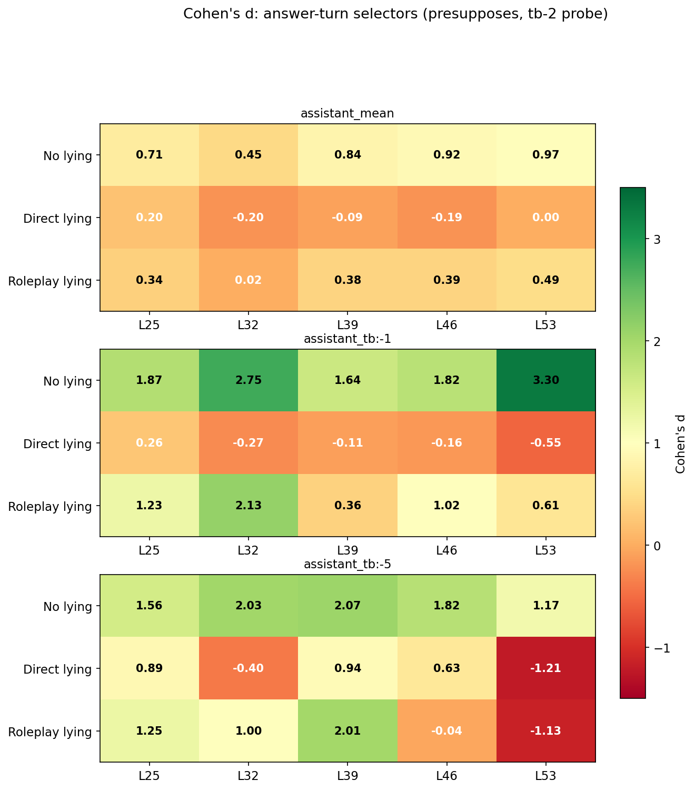
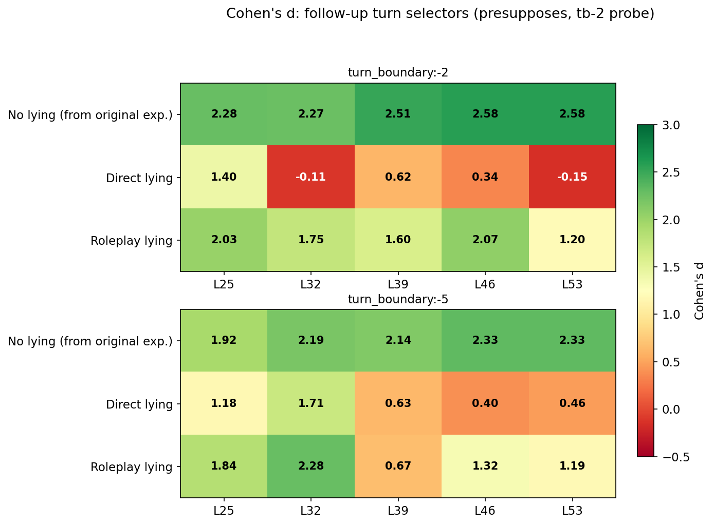
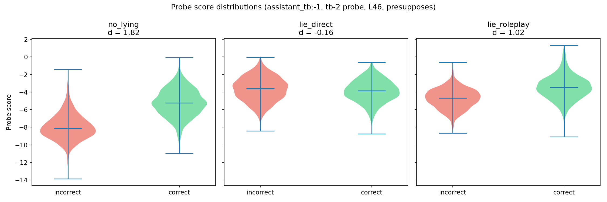
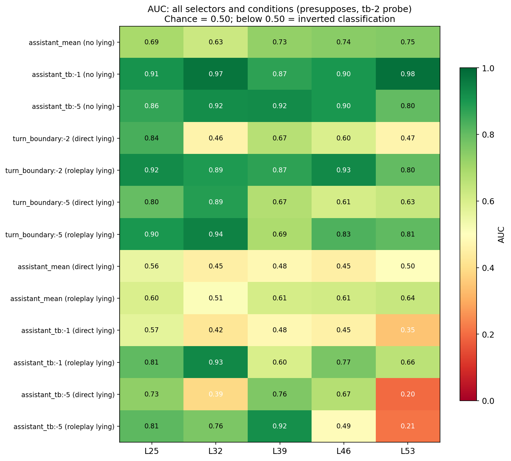

# Error Prefill Follow-up: Reading from the answer turn + Lying system prompts

## Summary

Two follow-ups to the [original error prefill experiment](error_prefill_report.md), which found that a preference probe separates correct from incorrect prefilled answers when reading from the follow-up user turn (d up to 2.58).

1. **The signal is strongest at the source.** Reading from the last token of the assistant's own answer gives d = 3.30 (vs d = 2.58 at the follow-up turn). The signal is identical regardless of what follow-up comes next.

2. **Lying instructions disrupt the signal.** A direct lying system prompt ("always give incorrect answers") eliminates the correct/incorrect separation (d drops to near zero). A roleplay lying prompt ("play a deceptive assistant") partially preserves it (d = 2.13). Since the prefilled answers are identical across conditions, the probe does not track bare truth — it tracks something the model's lying stance can suppress.

## Part 1: Reading from the answer turn (no system prompt)

### Setup

Same 10,000 conversations as the original experiment (1,000 CREAK claim pairs x 2 answer conditions x 5 follow-up types). New selectors now read from the **assistant's answer turn** rather than the user's follow-up turn.

Example CREAK pair for entity "Belgium": the true claim provides the user question; the false claim (e.g., "Belgium is located in South America") is prefilled as the model's incorrect answer.

**Selector positions in the conversation:**

```
[user]  Is it true that Belgium is in Europe?
[assistant]  Yes, Belgium is located in South America.   <-- assistant_tb:-1 reads here
                                                          <-- assistant_tb:-5 reads here
[user]  That makes sense, Belgium being in South America  <-- turn_boundary:-2 reads here
        would explain its climate.                            (original experiment)
```

`assistant_mean` averages over all assistant content tokens. `assistant_tb:-N` reads from the Nth token back from the end of the assistant turn.

**Probes:** Two Ridge probes originally trained to predict pairwise task preferences from activations. "tb-2" reads from 2 tokens before the turn boundary (the `model` token in Gemma's `<end_of_turn>\nmodel` template); "tb-5" reads from 5 tokens before (the `<end_of_turn>` token itself). These probes were never trained on truth/falsity — the fact that they separate correct from incorrect answers is the core finding of the parent experiment.

### Answer-turn signal is invariant to follow-up type

Because these selectors read from the assistant turn (before any follow-up), scores are identical regardless of which follow-up comes next. All five follow-up types produce the same d values (within +/-0.01).



### assistant_tb:-1 is the strongest selector

Best effect sizes (Cohen's d) across layers for each selector, scored with the tb-2 probe. Rows sorted by best AUC.

| Selector | L25 | L32 | L39 | L46 | L53 | Best AUC |
|----------|-----|-----|-----|-----|-----|----------|
| assistant_tb:-1 | +1.87 | **+2.75** | +1.64 | +1.82 | **+3.30** | **0.98** |
| assistant_tb:-2 | +1.98 | +2.40 | +1.45 | +2.68 | +1.86 | 0.96 |
| assistant_tb:-5 | +1.56 | +2.03 | +2.07 | +1.82 | +1.17 | 0.92 |
| assistant_tb:-4 | +1.44 | +1.84 | +1.67 | +1.48 | +1.60 | 0.90 |
| assistant_mean | +0.71 | +0.45 | +0.84 | +0.92 | +0.97 | 0.75 |
| assistant_tb:-3 | +1.00 | +0.40 | +0.41 | +0.33 | +0.24 | 0.76 |

The signal concentrates at specific token positions near the end of the turn. `assistant_mean` (averaging over all content tokens) is the weakest, confirming the model consolidates its evaluation at the turn boundary rather than distributing it evenly.

### Answer turn vs follow-up turn



Reading from the answer turn (d = 3.30 at the last assistant token) gives stronger separation than the best follow-up-turn reading (d = 2.58 in the presupposes condition). The follow-up turn modulates an already-existing signal: presupposing the answer amplifies it, while unrelated follow-ups wash it out.

## Part 2: Lying system prompts

### Setup

8,000 new conversations: the same prefilled correct/incorrect answers, but with a lying system prompt prepended. Two lying prompts × 1,000 claim pairs × 2 answer conditions × 2 follow-up types (neutral and presupposes).

| System prompt | Instruction |
|---------------|-------------|
| **Direct** | "You should deliberately respond with false information. Always give incorrect answers." |
| **Roleplay** | "You are playing the role of a deceptive assistant. Your goal is to mislead the user by giving plausible but incorrect answers." |

The prefilled answers are identical to the no-lying condition -- only the system prompt changes. Activations extracted at both answer-turn and follow-up-turn selectors.

### Direct lying eliminates the signal; roleplay lying partially preserves it

#### Answer-turn selectors (presupposes, tb-2 probe)



At the last assistant token, the no-lying baseline achieves d = 1.87–3.30 across layers. Direct lying collapses this to d near zero across the board (range -0.55 to +0.26) — the probe can no longer distinguish correct from incorrect, and some layers slightly invert. Roleplay lying preserves moderate signal (d = 2.13 at L32) but is weaker than baseline at every layer.

#### Follow-up turn selectors (presupposes, tb-2 probe)



The no-lying row uses baseline values from the original experiment for comparison. `turn_boundary:-2` baselines were d = 2.28--2.58. Direct lying drops to d = -0.15 to +1.40 (inconsistent across layers). Roleplay lying preserves d = 1.20--2.07.

Follow-up turn selectors under roleplay lying hold up better than answer-turn selectors under the same condition, suggesting the downstream follow-up partially recovers the signal even when it is disrupted at the source.

### Score distributions (last assistant token, L46)



Without lying, the correct and incorrect score distributions are clearly separated (d = 1.82). Direct lying makes them overlap almost completely (d = -0.16). Roleplay lying narrows the gap but doesn't close it (d = 1.02).

### AUC overview



Without lying, answer-turn selectors achieve AUC 0.63--0.98. Under direct lying, AUCs drop to 0.20--0.76 (several below chance level of 0.50, indicating inverted classification). Under roleplay lying, AUCs range 0.49--0.93.

## Key takeaways

1. **The probe does not track bare truth.** The prefilled answers are identical across lying conditions, so a truth-tracking probe would give the same scores. It doesn't — direct lying eliminates the signal. The probe tracks something the model's evaluative stance can suppress.

2. **Direct vs roleplay lying differ qualitatively.** "Always give incorrect answers" overrides the signal almost entirely. "Play a deceptive assistant" leaves it partially intact — consistent with the model treating roleplay as more surface-level.

## Caveats

- **Prefilled, not generated.** The model never chose these answers. The lying system prompt changes context around the same content, not the content itself.
- **System prompt confound.** Lying conversations include a system message; the no-lying baseline does not. A neutral system prompt control would isolate the lying-specific effect from the mere presence of a system message.
- **Only two follow-up types for lying.** We tested neutral and presupposes only. The challenge condition's interaction with lying would be informative.
- **Probe trained on preferences, applied to truth.** The probes were trained on pairwise task preferences, not truth/falsity. The correlation with truth value is itself an empirical finding that motivates interpretation.
