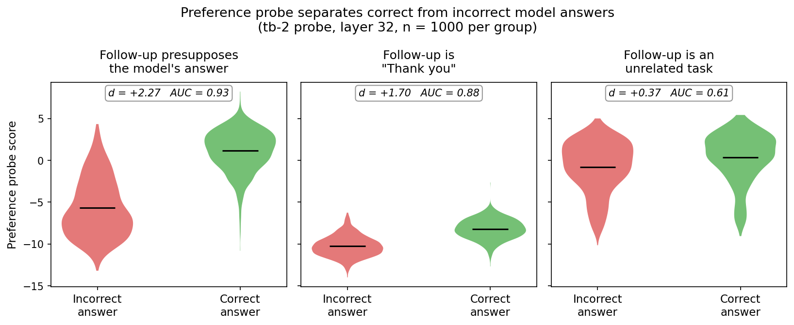
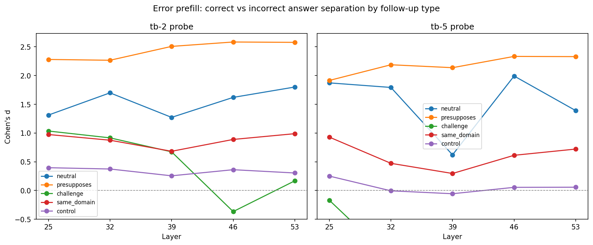
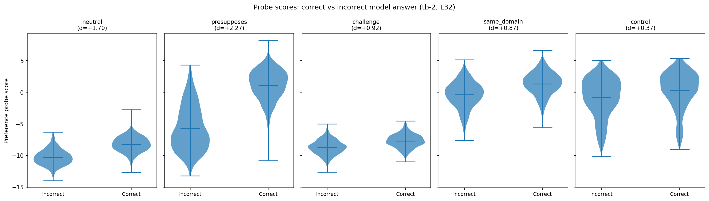
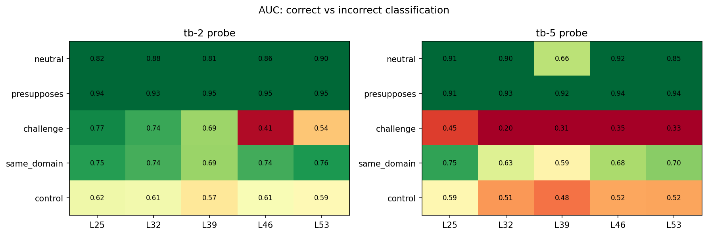

# Error Prefill: Does the preference direction respond to model errors?

## Summary

The preference probe direction — trained only on pairwise task choices — separates correct from incorrect prefilled model answers across follow-up turns. The signal is strongest when the follow-up presupposes the answer (d up to 2.58, AUC = 0.95), persists through neutral and same-domain follow-ups (d = 0.6–1.99), and is actively *inverted* by "Are you sure?" challenges on the tb-5 probe (d = −1.19). Unrelated control follow-ups wash out the signal almost entirely (d ≈ 0), confirming the effect is context-dependent rather than a residual artifact.

## Setup

**Claims:** 1,000 entity-paired CREAK claims. Each pair shares an entity (e.g., "Belgium") — one true, one false. The true claim's scaffolding provides the user question; the false claim serves as the incorrect model answer.

**Conversations:** 2 answer conditions × 5 follow-up types = 10 conversations per pair (10,000 total). The model answer is prefilled (not generated) — the model never chose to say it.

| Follow-up | User turn after model answer | Purpose |
|-----------|------------------------------|---------|
| Neutral | "Thank you." | Baseline — does the signal persist? |
| Presupposes | Generated per-claim: treats the answer as given | Does accepting the error amplify the signal? |
| Challenge | "Are you sure about that?" | Does questioning suppress the signal? |
| Same domain | Generated per-claim: related but uncommitted | Topical continuation without endorsement |
| Control | Unrelated Alpaca task | Does an unrelated topic wash out the signal? |

**Model:** Gemma 3 27B IT. Activations extracted at layers 25, 32, 39, 46, 53.

**Probes:** Same preference probes as previous experiment — Ridge regression on Thurstonian scores from pairwise task choices. Two selectors: tb-2 (`model` token) and tb-5 (`<end_of_turn>` token). In these multi-turn conversations, the selectors read from the end of the follow-up user turn (not the assistant answer turn).

**Note:** The "none" condition (no follow-up) was excluded — the turn-boundary selectors would read from before the assistant turn rather than after it, making the scores non-comparable.

## Results

### The preference direction separates correct from incorrect model answers

The probe distinguishes whether the preceding model answer was correct or incorrect, even though it reads activations from the user's follow-up turn — not the model's answer itself.

#### tb-2 probe (best overall)

| Follow-up | L25 | L32 | L39 | L46 | L53 | Best AUC |
|-----------|-----|-----|-----|-----|-----|----------|
| Presupposes | **+2.28** | **+2.27** | **+2.51** | **+2.58** | **+2.58** | **0.95** |
| Neutral | +1.31 | +1.70 | +1.27 | +1.62 | +1.80 | 0.90 |
| Same domain | +0.97 | +0.87 | +0.68 | +0.89 | +0.99 | 0.76 |
| Challenge | +1.03 | +0.92 | +0.67 | −0.37 | +0.17 | 0.77 |
| Control | +0.40 | +0.37 | +0.26 | +0.36 | +0.30 | 0.62 |

#### tb-5 probe

| Follow-up | L25 | L32 | L39 | L46 | L53 | Best AUC |
|-----------|-----|-----|-----|-----|-----|----------|
| Presupposes | +1.92 | +2.19 | +2.14 | **+2.33** | **+2.33** | **0.94** |
| Neutral | +1.87 | +1.79 | +0.62 | +1.99 | +1.39 | 0.92 |
| Same domain | +0.93 | +0.47 | +0.30 | +0.61 | +0.72 | 0.75 |
| Challenge | −0.17 | **−1.19** | −0.69 | −0.57 | −0.61 | 0.20 |
| Control | +0.25 | −0.01 | −0.06 | +0.05 | +0.06 | 0.59 |

### The signal degrades as the follow-up becomes less connected to the answer

At L32 with the tb-2 probe: when the follow-up presupposes the model's answer, the probe nearly separates correct from incorrect (d = 2.27, AUC = 0.93). A generic "Thank you" preserves most of the signal (d = 1.70, AUC = 0.88). An unrelated task washes it out (d = 0.37, AUC = 0.61).

### Follow-up type modulates the signal in interpretable ways

The five follow-up types produce a clear ordering that matches their semantic relationship to the error:

1. **Presupposes** (d = 2.3–2.6): Strongest signal. Treating the incorrect answer as given amplifies the correct/incorrect separation. The model's representation of the presupposing follow-up carries a strong trace of whether the presupposed content was true.

2. **Neutral** (d = 1.3–2.0): "Thank you" preserves most of the signal. A generic acknowledgment doesn't dilute the error trace much.

3. **Same domain** (d = 0.5–1.0): Moderate signal. A related question retains some information about whether the preceding answer was correct, but less than direct engagement with it.

4. **Challenge** (d = −1.2 to +1.0): The most interesting condition. On the tb-2 probe, "Are you sure?" partially preserves the signal at early layers but suppresses or inverts it at later layers (L46: d = −0.37). On the tb-5 probe, the challenge **inverts the sign** across all layers — incorrect answers now score *higher* than correct ones (L32: d = −1.19, AUC = 0.20). The model's representation of doubt reverses the valence of the preference direction.

5. **Control** (d ≈ 0): An unrelated follow-up task washes out the signal almost entirely (tb-5 at L32: d = −0.01, p = 0.89). This is the critical null control — it confirms the effect requires topical continuity with the model's answer.

### Score distributions

At L32 with the tb-2 probe: presupposing the answer nearly separates the distributions (d = 2.27). Even the neutral "Thank you" produces clear separation (d = 1.70). The control condition shows heavily overlapping distributions (d = 0.37).

### AUC heatmap

The tb-2 probe shows consistently high AUC for presupposes (0.93–0.95) and neutral (0.81–0.90) across all layers. The challenge condition on tb-5 has AUC *below* 0.5 (inverted classification), with the strongest inversion at L32 (AUC = 0.20).

## Key findings

1. **The preference direction encodes error status across conversation turns.** A probe trained on task preferences separates correct from incorrect prefilled model answers, reading from the *user's follow-up turn* — not the model's answer. The error signal propagates forward through the conversation.

2. **Presupposing the error amplifies the signal.** When the user's follow-up treats the (possibly incorrect) answer as established fact, the preference direction's separation increases by ~50% over the neutral baseline (d = 2.3–2.6 vs 1.3–2.0).

3. **Challenging the answer inverts the signal on tb-5.** "Are you sure?" doesn't just suppress the error signal — it flips it. On the tb-5 probe (`<end_of_turn>` token), incorrect answers score *higher* than correct ones after a challenge. This suggests the preference direction is tracking something like the model's anticipated evaluation of its own answer quality, which reverses when the user expresses doubt.

4. **The signal requires topical continuity.** An unrelated follow-up task eliminates the effect (d ≈ 0), ruling out a simple positional or formatting artifact.

## Caveats

- **Prefilled, not generated.** The model didn't choose to produce these answers. The error signal might differ for errors the model generates spontaneously vs ones forced into its context.
- **Selector position.** The turn-boundary selectors read from the end of the follow-up user turn. We don't yet have data on the assistant answer turn itself (the "none" condition was excluded for this reason). A follow-up extraction with a selector targeting the assistant turn boundary would complete the picture.
- **CREAK-specific.** False CREAK claims range from plausible ("Snow leopards are golden-brown") to absurd ("The Climate of India performs music on Sundays"). The effect size may partly reflect claim plausibility rather than pure truth/falsity.
- **Challenge inversion mechanism.** The sign flip on tb-5 is striking but the mechanism is unclear. It could reflect the model anticipating that it needs to correct itself, or it could be an artifact of how "Are you sure?" shifts the activation distribution.
