# Per-Token Follow-Up: Where in the follow-up turn does the truth signal live?

## Summary

The truth signal from the assistant response carries through the turn boundary into the follow-up span — but what happens next depends on the follow-up content. At the five shared turn-boundary tokens, all three follow-up types show identical separation, confirming the signal persists before the model has seen any follow-up content. Once user content begins, the types diverge: "Thank you." maintains high separation; "Are you sure about that?" collapses it within two tokens; and presupposing follow-ups dilute it across their longer span.

## Setup

**Context.** The [parent experiment](../error_prefill_report.md) showed that a preference probe direction -- trained on pairwise task choices, not truth -- separates correct from incorrect prefilled answers at the follow-up turn boundary (d up to 2.58, AUC = 0.95). That experiment scored a single token position per conversation. This experiment scores every token in the assistant response and follow-up span to see where the signal builds, persists, or breaks.

**Data.** 60 conversations from CREAK: 10 entity-paired claims (e.g., "Climate of India varies between seasons" vs "Climate of India performs music on Sundays"), each with correct and incorrect prefilled assistant answers, crossed with 3 follow-up types:
- **Neutral**: "Thank you." (2 words)
- **Presupposes**: Generated per-claim, treats the answer as true (e.g., "Given that India's climate changes throughout the year, how do these seasonal shifts impact the country's agricultural cycles?") (~18 words)
- **Challenge**: "Are you sure about that?" (5 words)

**Model.** Gemma 3 27B IT. Per-token activations extracted at layers 25, 32, 39, 46, 53 for the assistant response and the follow-up span (including the turn-boundary template tokens between them).

**Probes.** 10 pre-trained Ridge probes from the pairwise preference experiments: tb-2 and tb-5 probes at each of the 5 layers. Each token is scored by projecting its activation onto the probe direction.

## Probe selection

To select the best probes for visualization, we computed the mean absolute score difference between correct and incorrect tokens (averaged across all tokens and all 60 conversations) for each of the 10 probes. Both selected probes are tb-2 — the tb-2 family consistently gives higher per-token separation than tb-5 at every layer.

| Probe | Mean score separation |
|-------|----------------------|
| **tb-2 L53** | **4.97** (selected) |
| **tb-2 L46** | **4.91** (selected) |
| tb-2 L25 | 4.69 |
| tb-2 L32 | 4.44 |
| tb-2 L39 | 4.30 |
| tb-5 L25 | 3.10 |
| tb-5 L39 | 3.01 |
| tb-5 L32 | 2.79 |
| tb-5 L53 | 2.63 |
| tb-5 L46 | 2.54 |

## Results

### Turn-boundary tokens carry the signal identically across follow-up types

The follow-up span begins with five turn-template tokens that are identical regardless of what the user says next. These are the structural tokens between the assistant and user turns: `<end_of_turn>`, `\n`, `<start_of_turn>`, `user`, `\n`. At these positions, the three follow-up types produce virtually identical d values — the model hasn't seen any follow-up content yet.

| Token (after assistant content) | d (neutral) | d (presupposes) | d (challenge) |
|---------------------------------|-------------|-----------------|---------------|
| `<end_of_turn>` | 1.06 | 1.05 | 1.02 |
| `\n` | 2.24 | 2.22 | 2.14 |
| `<start_of_turn>` | 0.02 | 0.01 | 0.02 |
| `user` | 2.24 | 2.28 | 2.20 |
| `\n` | 3.63 | 3.68 | 3.66 |

The signal is high at `user` and the newline after it (d ≈ 2.2–3.7), drops to near zero at the `<start_of_turn>` token itself, and peaks again just before user content begins.

### Follow-up content modulates the signal

After the shared turn-boundary tokens, the three follow-up types diverge sharply:

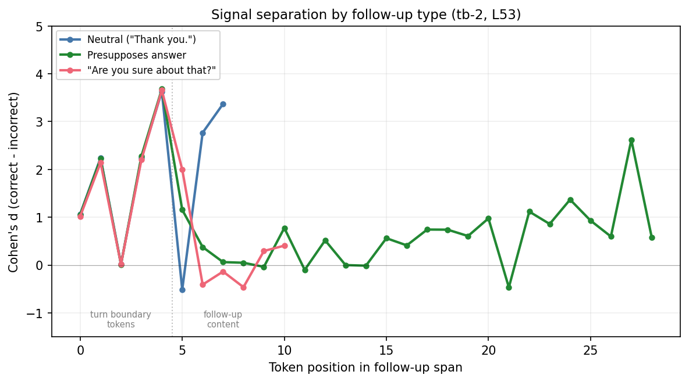

- **Neutral** ("Thank you."): The signal stays high through all three content tokens (d = 2.8 at "Thank", 3.4 at "."). A content-free acknowledgement preserves the signal.
- **Challenge** ("Are you sure about that?"): "Are" still shows d = 2.0, but "you" drops to d = -0.4 and "sure" to d = -0.1. The phrase "you sure" collapses the correct/incorrect separation. By the end of the challenge, d oscillates near zero.
- **Presupposes**: The signal disperses across the longer follow-up (~25 content tokens), with d oscillating between -0.5 and +2.6. No sustained high-d region, but occasional spikes at semantically loaded tokens.

### Score trajectories show where correct and incorrect diverge

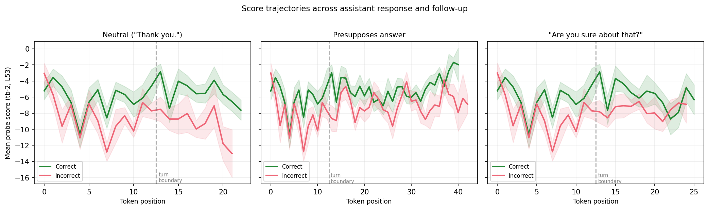

In all three panels, the correct/incorrect gap opens during the assistant response (positions 0--12). At the turn boundary (dashed line), the gap is preserved. In the neutral panel, the gap remains wide through the short follow-up. In the challenge panel, the lines converge after the turn boundary -- the model's representation of "Are you sure?" narrows the score difference. In the presupposes panel, both lines shift upward during the follow-up but maintain a modest gap.

### Per-token aggregates by region

Cohen's d for the mean probe score within each region (tb-2 L53, n = 10 per group):

| Follow-up type | Last assistant token | Mean over follow-up span |
|---------------|---------------------|--------------------------|
| Neutral | 0.83 | 4.10 |
| Presupposes | 0.83 | 1.56 |
| Challenge | 0.84 | 2.01 |

The last-assistant-token d is identical across follow-up types (0.83–0.84), as expected — the assistant response is the same and the follow-up hasn't been processed yet. These d values are lower than the d = 3.30 reported in the followup experiment at the same probe and position, likely because this subset is only 10 claims (high variance in the d estimate) and the last content token from the span selector may not correspond exactly to `assistant_tb:-1` (which counts from the turn-boundary template tokens). The follow-up span d varies by type, with neutral showing the strongest mean separation.

## Token-level visualizations

Each figure shows 6 rows: correct/incorrect x 3 follow-up types. Tokens are colored on a RdYlGn scale (red = negative, green = positive probe score). The blue dashed line marks the assistant/follow-up boundary. Each figure uses its own color scale, so absolute scores are not directly comparable across claims.

### Probe: tb-2_L53

#### Claim 1: Pickled cucumber

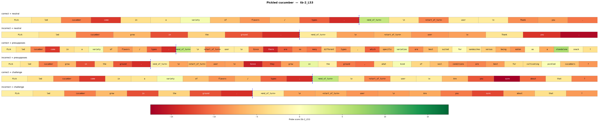

#### Claim 2: National Hockey League

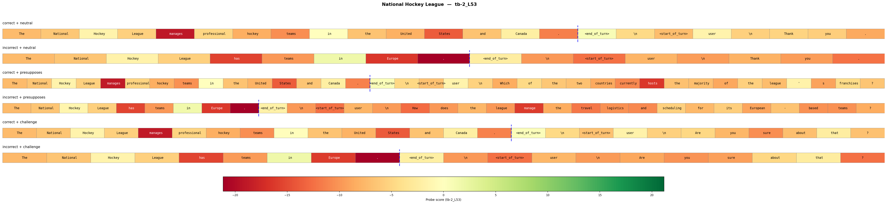

#### Claim 3: Climate of India

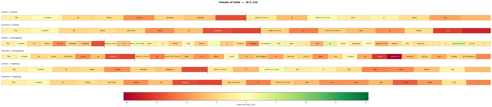

#### Claim 4: Eurovision Song Contest

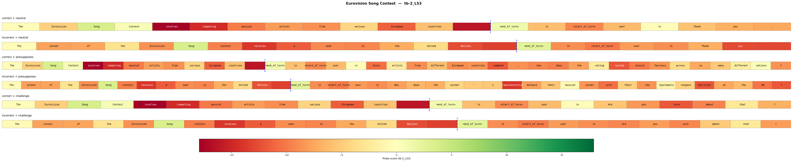

#### Claim 5: Black-tailed prairie dog

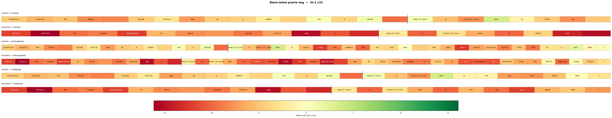

#### Claim 6: Cartoonist

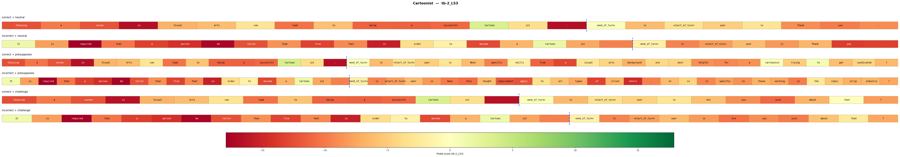

#### Claim 7: Zorro

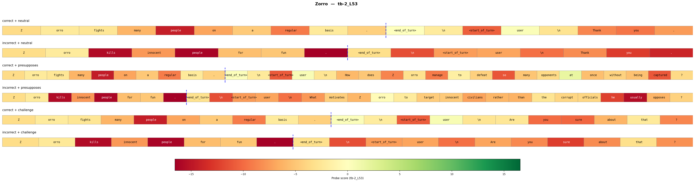

#### Claim 8: Pinky and the Brain

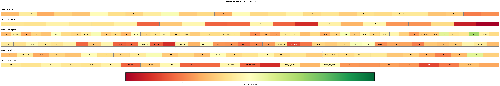

#### Claim 9: Snow leopard

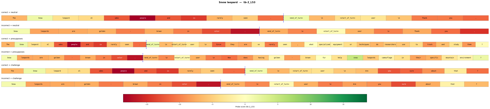

#### Claim 10: Existence of God

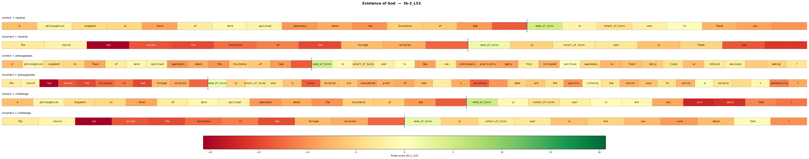

### Probe: tb-2_L46

#### Claim 1: Pickled cucumber

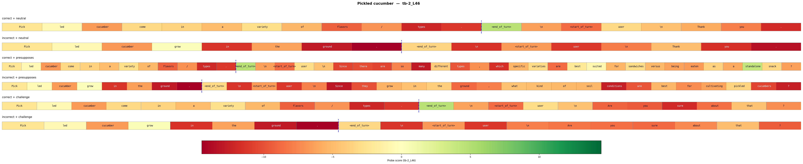

#### Claim 2: National Hockey League

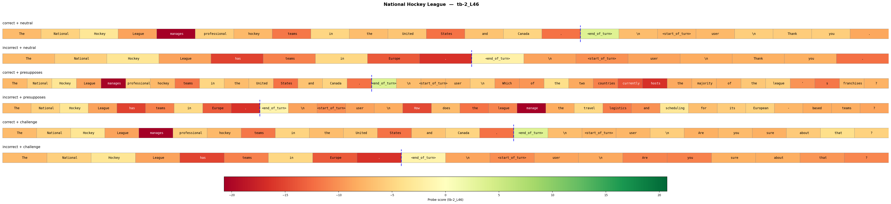

#### Claim 3: Climate of India

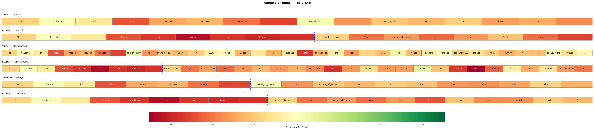

#### Claim 4: Eurovision Song Contest

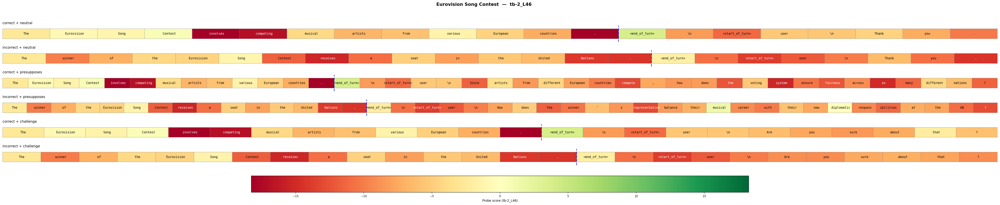

#### Claim 5: Black-tailed prairie dog

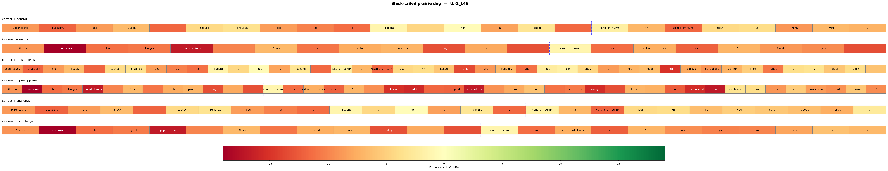

#### Claim 6: Cartoonist

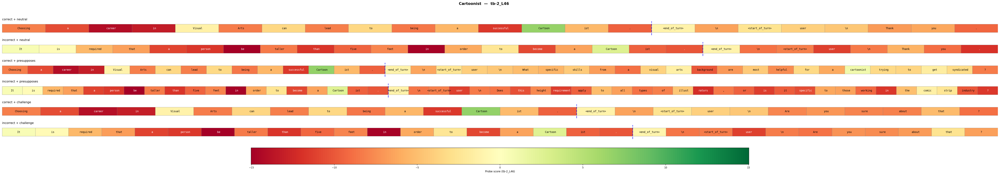

#### Claim 7: Zorro

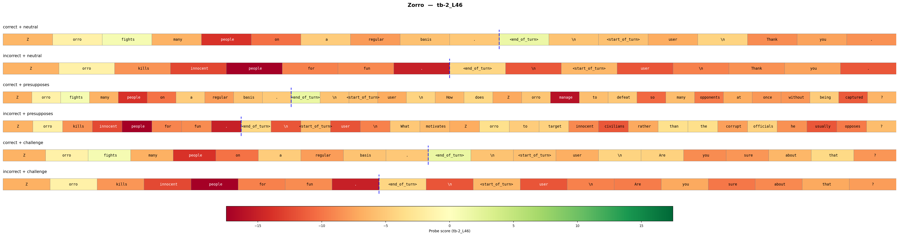

#### Claim 8: Pinky and the Brain

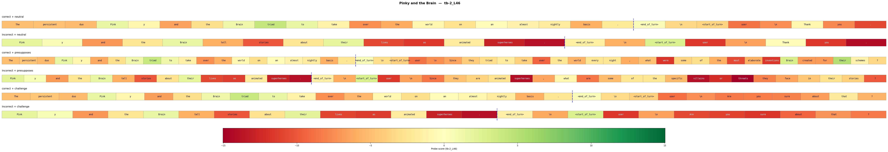

#### Claim 9: Snow leopard

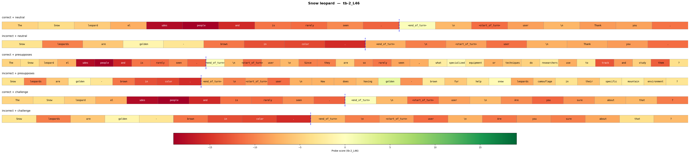

#### Claim 10: Existence of God

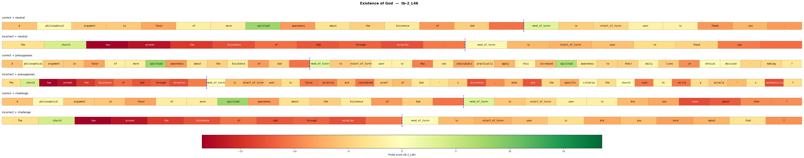

## Caveats

- **Small sample.** 10 claim pairs, so all Cohen's d values in the position-wise analysis are computed over n=10 per group.
- **Both selected probes are tb-2.** The tb-5 probe (trained at the `<end_of_turn>` position) was not selected because its per-token separation was lower. This means the per-token dynamics here reflect the tb-2 perspective only. The parent experiment's challenge inversion (d = -1.19 on tb-5 L32) may look different at the per-token level under that probe.
- **Presupposes follow-ups vary in length and content.** Unlike the fixed "Thank you." and "Are you sure about that?", presupposing follow-ups are generated per-claim, so the position-wise d is averaged over different sentences, making the oscillating pattern harder to interpret.
