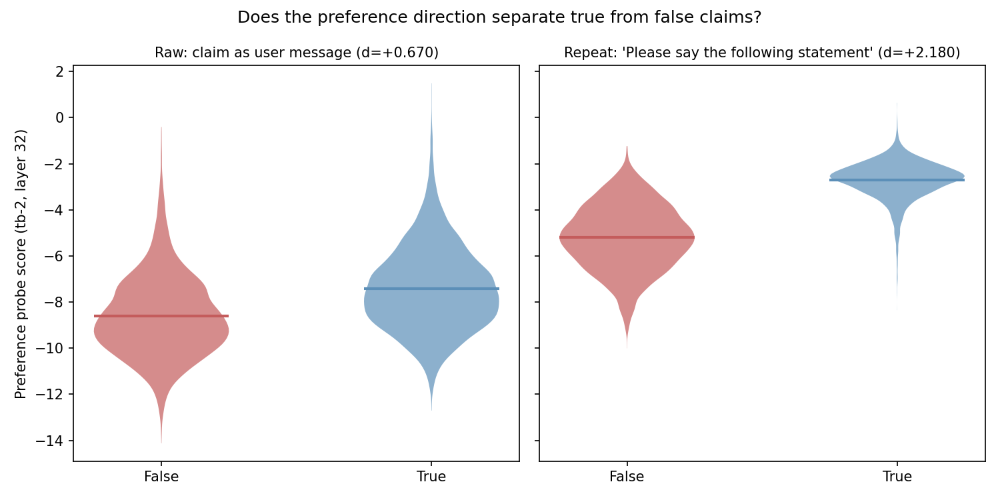
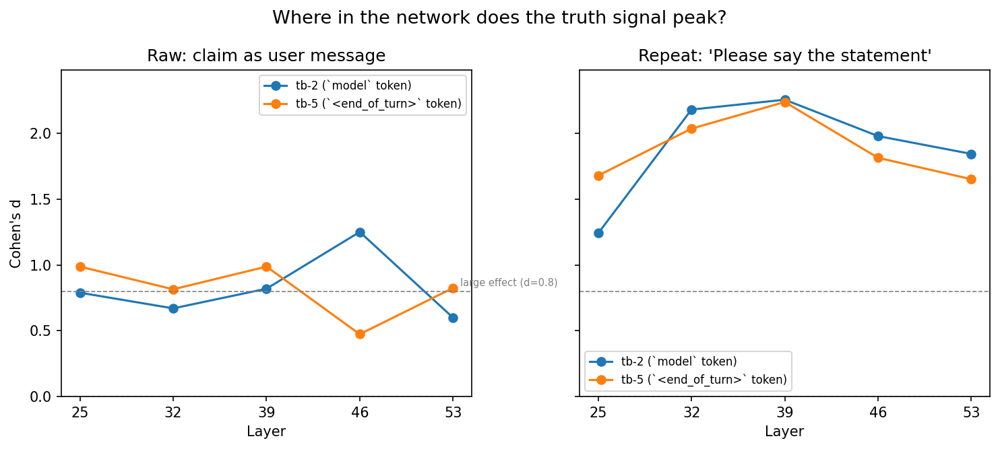

# Truth Probes Analysis: Does the preference direction separate true from false?

## Summary

Preference probes — trained only on pairwise task choices — strongly separate true from false factual claims. Cohen's d ranges from 0.47 to 2.26 across all 20 conditions, with 19 of 20 exceeding the "large effect" threshold (d > 0.8). The best condition (repeat framing, tb-2 probe, layer 39) achieves AUC = 0.94 at classifying truth from a probe never trained on truth labels.

## Setup

**Claims:** 9,395 CREAK statements — commonsense factual claims designed so false ones are linguistically plausible (not obviously wrong or ungrammatical):

| Label | Example |
|-------|---------|
| true | "Marlboro used iconic imagery to promote its brand." |
| false | "Only people named Floyd wearing pink are allowed to attend Pink Floyd concerts." |
| true | "The crack in the Liberty Bell sets it apart from other famous bells." |
| false | "Larry King served tea during his show." |

4,810 true, 4,585 false.

**Model:** Gemma 3 27B IT.

**Probes:** Two preference probes, each a Ridge regression trained on 10k pairwise task-choice Thurstonian scores. They differ in which token's activations they read:

| Probe | Token position | Original preference r (L32) |
|-------|---------------|---------------------------|
| tb-2 | `model` (2nd-to-last turn token) | 0.874 |
| tb-5 | `<end_of_turn>` (5th-to-last) | 0.868 |

**Layers:** 25, 32, 39, 46, 53 (out of 62 total).

**Framings:** Two ways of presenting the claim to the model:

| Framing | What the model sees |
|---------|-------------------|
| Raw | User message: `"Marlboro used iconic imagery to promote its brand."` |
| Repeat | User message: `"Please say the following statement: 'Marlboro used iconic imagery to promote its brand.'"` |

The repeat framing forces the model to commit to producing the statement, rather than passively processing it.

## Results

### Effect sizes: all positive, most large

Bold = **best preference layer** (L32) and **peak truth layer** per probe.

#### Raw framing

| Probe | Layer | Cohen's d | Mean score diff (true − false) |
|-------|-------|-----------|-------------------------------|
| tb-2 | 25 | +0.79 | +1.19 |
| tb-2 | **32** | +0.67 | +1.20 |
| tb-2 | 39 | +0.82 | +1.27 |
| tb-2 | **46** | **+1.25** | +2.00 |
| tb-2 | 53 | +0.60 | +0.91 |
| tb-5 | 25 | +0.99 | +1.68 |
| tb-5 | **32** | +0.81 | +1.22 |
| tb-5 | **39** | **+0.99** | +1.37 |
| tb-5 | 46 | +0.47 | +0.66 |
| tb-5 | 53 | +0.82 | +1.30 |

#### Repeat framing

| Probe | Layer | Cohen's d | Mean score diff (true − false) |
|-------|-------|-----------|-------------------------------|
| tb-2 | 25 | +1.24 | +1.89 |
| tb-2 | **32** | +2.18 | +2.48 |
| tb-2 | **39** | **+2.26** | +3.66 |
| tb-2 | 46 | +1.98 | +3.89 |
| tb-2 | 53 | +1.84 | +2.81 |
| tb-5 | 25 | +1.68 | +2.80 |
| tb-5 | **32** | +2.04 | +2.72 |
| tb-5 | **39** | **+2.24** | +3.02 |
| tb-5 | 46 | +1.81 | +2.15 |
| tb-5 | 53 | +1.65 | +2.02 |

Cohen's d benchmarks: 0.2 = small, 0.5 = medium, 0.8 = large. The weakest condition (tb-5 L46 raw, d = 0.47) is still a medium effect.

### Score distributions

Shown at the best *preference* layer (L32, where the probe best predicts task preferences), not the peak *truth* layer. Even at this non-optimal layer, the repeat framing nearly separates the distributions (d = 2.18).

### Truth signal peaks at different layers than preference signal

Preference prediction peaks at L32 for both probes. The truth signal peaks later — L46 (raw, tb-2) or L39 (repeat, both probes). The preference direction picks up truth as a correlated but distinct signal.

### Sanity checks

Permutation test (1000 label shuffles) and classification metrics. Chance AUC = 0.5, chance accuracy = 51.2%.

| Condition | AUC | Accuracy | Perm p | Observed / max permuted diff |
|-----------|-----|----------|--------|------------------------------|
| raw, tb-2, L32 | 0.69 | 63.6% | < 0.001 | 10x |
| raw, tb-2, L46 | 0.82 | 74.9% | < 0.001 | 15x |
| repeat, tb-2, L32 | 0.94 | 87.6% | < 0.001 | 21x |
| repeat, tb-2, L39 | 0.94 | 87.9% | < 0.001 | 19x |

Observed mean differences are 10–30x larger than the largest permutation difference.

## Framing comparison

The repeat framing amplifies the truth signal by 1.6–3.8x across conditions (median ~2.5x). Selected comparisons:

| Probe | Layer | Raw d | Repeat d | Amplification |
|-------|-------|-------|----------|---------------|
| tb-2 | 32 | 0.67 | 2.18 | 3.3x |
| tb-2 | 46 | 1.25 | 1.98 | 1.6x |
| tb-5 | 46 | 0.47 | 1.81 | 3.8x |
| tb-5 | 25 | 0.99 | 1.68 | 1.7x |

Asking the model to produce a statement (vs passively processing it) sharpens truth/false separation along the preference direction.

## Caveats

- **Correlational.** The preference direction wasn't trained on truth labels. The separation could reflect a shared evaluative dimension, or a confound. CREAK's design (false claims are linguistically plausible) partially mitigates fluency-based confounds, but doesn't rule them out.
- **Commonsense facts only.** CREAK contains clear-cut factual claims. May not generalize to ambiguous or contested statements.
- **Layer mismatch.** Truth peaks at L39–46, preferences at L32. The signals share a direction but aren't identical — the preference direction is not a pure truth detector.
